# 📊 YouTube '주식' 주제 분석 리포트

> 생성 2026-10-09 20:57 KST · 노트북 v2.1.0 · 실행ID `20261009_204204` · 지역 KR / 언어 ko  
> ⚠️ 연구·교육용 분석 결과입니다. **투자 조언이 아니며**, 통계는 상관관계일 뿐 인과관계를 보장하지 않습니다.

## 0. 한눈에 보기 (TL;DR)

- **분석 데이터**: 영상 1,151개 수집 → 성과 분석 431개 (업로드 2025-10-11 ~ 2026-09-21, 업로드 후 14일 이상 경과), 채널 622개, 검색 키워드 40개(9개 카테고리), 주제 무관 영상 177개 제외
- ⏭️ **이월된 키워드 16개**: 오늘 쿼터 예산을 넘어 다음 실행으로 넘김 → 내일 같은 설정으로 다시 실행하면 이미 받은 검색은 쿼터 0으로 재사용하고 나머지를 이어서 수집합니다
- **성공(아웃라이어) 기준**: 조회수 10,000회 이상 **그리고** 같은 채널 최근 영상 중앙값의 3배 이상 → 95개 (22.0%)
- 🗂️ **기회가 큰 소재(카테고리)**: 7. 교훈과 예방 (62점), 1. 실제 투자 실패·손실 사연 (61점), 6. 큰 하락과 공포 (61점)
- 🎯 **기회가 가장 큰 키워드**: `주식 자동매매 사기 사례`(68점), `주식 폭락 전재산 손실`(68점), `주식 투자자가 가장 후회하는 것`(68점), `50대 주식 투자 실패`(67점), `주식 물타기 실패 사례`(66점)
- 🎬 **포맷별 성공 비율**: 라이브 28.6% (배수 중앙값 9.86배, n=7) · 롱폼 21.9% (배수 중앙값 2.15배, n=260) · 쇼츠 22.0% (배수 중앙값 1.48배, n=164) → 추천: **롱폼** 중심
- ⏱️ **롱폼 추천 길이**: 8~12분, 20~30분 (성공 비율 상위 구간)
- 🏷️ **효과 있는 제목 요소**: 수익/욕망(급등·수익·부자) 2.05배, 금액·% 표기 1.66배, 괄호/대괄호 1.34배, 영문 대문자 단어 1.33배  /  역효과: 느낌표 0.61배, 해시태그 0.65배, 초보/방법(초보·기초·정리) 0.66배  (*=다중비교 보정 후 유의, q<0.05)
- 🌱 **작은 채널도 터지나?**: 소규모(<1만) 채널 영상의 성공 비율 15.9% vs 대형(≥10만) 19.1%. 성공한 소규모 채널의 업로드 빈도 중앙값: 주 2.7회
- 🕒 **업로드 타이밍(참고)**: 성공 비율 높은 요일 일, 토 / 시간대 06~08시, 12~14시 (KST)
- 💸 **API 쿼터 사용**: 8,533 / 예산 9,000 (일일 한도 10,000)

## 1. 🎬 추천 영상 아이디어 (데이터 기반)

제목 예시는 이번 데이터에서 효과가 확인된 제목 요소(수익/욕망(급등·수익·부자), 금액·% 표기, 괄호/대괄호, 숫자 포함; 데이터 기반 (lift≥1.1))를 조합한 **템플릿 예시**입니다. 그대로 쓰기보다 참고 영상의 실제 제목·썸네일·도입부(대본)를 함께 보고 다듬으세요.

### 1. `주식 자동매매 사기 사례` — 기회점수 **68**/100

- 근거: 검색 상위 20개 영상 일평균 조회수 중앙값 **544회**, 소규모 채널 진입 성공 비율 **5.0%**, 최근 90일 영상 비율 0.0%, 경쟁 채널 구독자 중앙값 2.6만명, 아웃라이어 배수 중앙값 4.26배, 성공 영상 6개
- 추천 포맷: **롱폼** · 롱폼이면 8~12분, 20~30분 · 검색 상위 중 쇼츠 비율 38.5%
- 제목 예시: 「주식 자동매매 사기 사례 현실적으로 수익 내는 방법」 / 「주식 자동매매 사기 사례 수수료 0.1% 차이가 만드는 결과」 / 「[주식 자동매매 사기 사례] 10분 만에 핵심 정리」
- 참고할 성공 영상:
  - [왕초보도 가능한! 내 조건검색식으로 자동매매를 해주는 프로그램을 하루 만에 만들어…](https://www.youtube.com/watch?v=_BAdI9THvYc) — 조회수 20.5만, 구독자 16.8만, 채널 평균의 17.2배, 롱폼
  - [자동매매, 혼자 만들다 대부분 여기서 멈춘다](https://www.youtube.com/watch?v=WI13naqAtPc) — 조회수 2.3만, 구독자 1.0만, 채널 평균의 12.0배, 롱폼
  - [주식 자동 매매 프로그램 조심해야 하는 이유](https://www.youtube.com/watch?v=1ET2AtpZbfA) — 조회수 1.3만, 구독자 7.4천, 채널 평균의 8.7배, 쇼츠

### 2. `주식 폭락 전재산 손실` — 기회점수 **68**/100

- 근거: 검색 상위 20개 영상 일평균 조회수 중앙값 **727회**, 소규모 채널 진입 성공 비율 **5.0%**, 최근 90일 영상 비율 33.3%, 경쟁 채널 구독자 중앙값 13.8만명, 아웃라이어 배수 중앙값 3.19배, 성공 영상 7개
- 추천 포맷: **쇼츠** · 검색 상위 중 쇼츠 비율 40.0%
- 제목 예시: 「주식 폭락 전재산 손실 수수료 0.1% 차이가 만드는 결과」 / 「[주식 폭락 전재산 손실] 10분 만에 핵심 정리」 / 「주식 폭락 전재산 손실 핵심 5가지만 기억하세요」
- 참고할 성공 영상:
  - [주식 투자 마이너스(-)되도 계속 갖고 있는 사람들의 결말](https://www.youtube.com/watch?v=M0fHTKInPNc) — 조회수 242만, 구독자 13.8만, 채널 평균의 76.9배, 쇼츠
  - [주식으로 돈 벌어도 결국 전재산을 잃는 이유, 실패 과정의 전형적인 패턴입니다](https://www.youtube.com/watch?v=RXft-lAkSqU) — 조회수 16.9만, 구독자 1.4만, 채널 평균의 53.4배, 롱폼
  - [역대급 주식 폭락에 SK하이닉스 손실 고백한 연예인 TOP7](https://www.youtube.com/watch?v=UQU-1yRyzCg) — 조회수 93.0만, 구독자 7.1천, 채널 평균의 29.7배, 쇼츠

### 3. `주식 투자자가 가장 후회하는 것` — 기회점수 **68**/100

- 근거: 검색 상위 20개 영상 일평균 조회수 중앙값 **1.3천회**, 소규모 채널 진입 성공 비율 **10.0%**, 최근 90일 영상 비율 5.9%, 경쟁 채널 구독자 중앙값 2.5만명, 아웃라이어 배수 중앙값 3.78배, 성공 영상 5개
- 추천 포맷: **쇼츠** · 검색 상위 중 쇼츠 비율 64.7%
- 제목 예시: 「[주식 투자자가 가장 후회하는 것] 10분 만에 핵심 정리」 / 「주식 투자자가 가장 후회하는 것 핵심 7가지만 기억하세요」 / 「주식 투자자가 가장 후회하는 것 현실적으로 수익 내는 방법」
- 참고할 성공 영상:
  - [주식 개미 투자자가 무조건 망하는 이유  358만 계좌 데이터 분석 결과](https://www.youtube.com/watch?v=-8adMPsAYkk) — 조회수 19.4만, 구독자 2.4만, 채널 평균의 34.8배, 롱폼
  - [어떤 투자는 '도박'이다? 주식 투자 때문에 인생이 무너진 사람들 \| 추적60분…](https://www.youtube.com/watch?v=7FrJ3wuJDaY) — 조회수 355만, 구독자 80.3만, 채널 평균의 32.6배, 롱폼
  - [개미가 주식으로 큰돈 못 버는 이유](https://www.youtube.com/watch?v=J0bSx02kr3c) — 조회수 128만, 구독자 18만, 채널 평균의 16.2배, 쇼츠

### 4. `50대 주식 투자 실패` — 기회점수 **67**/100

- 근거: 검색 상위 20개 영상 일평균 조회수 중앙값 **623회**, 소규모 채널 진입 성공 비율 **10.0%**, 최근 90일 영상 비율 17.6%, 경쟁 채널 구독자 중앙값 3.4만명, 아웃라이어 배수 중앙값 2.80배, 성공 영상 7개
- 추천 포맷: **롱폼** · 롱폼이면 8~12분, 20~30분 · 검색 상위 중 쇼츠 비율 5.9%
- 제목 예시: 「50대 주식 투자 실패 핵심 3가지만 기억하세요」 / 「50대 주식 투자 실패 현실적으로 수익 내는 방법」 / 「50대 주식 투자 실패 수수료 0.1% 차이가 만드는 결과」
- 참고할 성공 영상:
  - [주식으로 성공한 부자들의 어마어마한 핵심 노하우](https://www.youtube.com/watch?v=iacwbUHyqv4) — 조회수 540만, 구독자 13.8만, 채널 평균의 172.0배, 쇼츠
  - [주식 실패로 5억이 20만 원 되는 과정(1~5편 통합본)](https://www.youtube.com/watch?v=8_YxWzVTbro) — 조회수 52.1만, 구독자 5.7만, 채널 평균의 89.0배, 롱폼
  - [주식투자 실패한 사람들의 공통적인 특징](https://www.youtube.com/watch?v=sEzSDUgvY28) — 조회수 4.7만, 구독자 3.7천, 채널 평균의 76.4배, 롱폼

### 5. `주식 물타기 실패 사례` — 기회점수 **66**/100

- 근거: 검색 상위 20개 영상 일평균 조회수 중앙값 **910회**, 소규모 채널 진입 성공 비율 **5.0%**, 최근 90일 영상 비율 5.6%, 경쟁 채널 구독자 중앙값 12.2만명, 아웃라이어 배수 중앙값 5.78배, 성공 영상 6개
- 추천 포맷: **롱폼** · 롱폼이면 8~12분, 20~30분 · 검색 상위 중 쇼츠 비율 44.4%
- 제목 예시: 「주식 물타기 실패 사례 현실적으로 수익 내는 방법」 / 「주식 물타기 실패 사례 수수료 0.1% 차이가 만드는 결과」 / 「[주식 물타기 실패 사례] 10분 만에 핵심 정리」
- 참고할 성공 영상:
  - [50대 주식투자를 실패했다면 99%는 3가지 이유 때문입니다 \| 개미투자자가 상…](https://www.youtube.com/watch?v=SoM3W-Cxess) — 조회수 36.0만, 구독자 3.4만, 채널 평균의 58.3배, 롱폼
  - [투자로 1억 날리고 깨달은, 절대 하면 안 되는 3가지 행동 (투자 실패담)](https://www.youtube.com/watch?v=9ywcAN762pk) — 조회수 33.4만, 구독자 2.0만, 채널 평균의 23.8배, 롱폼
  - [주식으로 전재산 날리는 사람들이 공통적으로 하는 착각 4가지](https://www.youtube.com/watch?v=3fmFpSlxHIc) — 조회수 7.6만, 구독자 2.0만, 채널 평균의 5.8배, 롱폼

### 6. `주식으로 전재산 잃은 사연` — 기회점수 **66**/100

- 근거: 검색 상위 20개 영상 일평균 조회수 중앙값 **261회**, 소규모 채널 진입 성공 비율 **15.0%**, 최근 90일 영상 비율 22.2%, 경쟁 채널 구독자 중앙값 2.9만명, 아웃라이어 배수 중앙값 4.18배, 성공 영상 7개
- 추천 포맷: **롱폼** · 롱폼이면 8~12분, 20~30분 · 검색 상위 중 쇼츠 비율 22.2%
- 제목 예시: 「주식으로 전재산 잃은 사연 수수료 0.1% 차이가 만드는 결과」 / 「[주식으로 전재산 잃은 사연] 10분 만에 핵심 정리」 / 「주식으로 전재산 잃은 사연 핵심 7가지만 기억하세요」
- 참고할 성공 영상:
  - [오늘자 주식에 전재산 넣은 20대 상황.. 삼전닉스야.. 나 한강물 안 좋아해..…](https://www.youtube.com/watch?v=afhzHSMW0ac) — 조회수 2.4만, 구독자 7.1천, 채널 평균의 12.8배, 쇼츠
  - [［실제사연］ 주식으로 전재산 11억 잃고 빚 7억 진 63세 남자의 고백](https://www.youtube.com/watch?v=9TTgn41v558) — 조회수 3.3만, 구독자 1.1천, 채널 평균의 10.6배, 롱폼
  - [주식투자로 전재산을 잃고나서 벌어진 일](https://www.youtube.com/watch?v=4OMJRLxkVQo) — 조회수 5.6만, 구독자 998, 채널 평균의 -배, 롱폼

### 7. `은퇴 후 주식 투자 실패` — 기회점수 **65**/100

- 근거: 검색 상위 20개 영상 일평균 조회수 중앙값 **257회**, 소규모 채널 진입 성공 비율 **15.0%**, 최근 90일 영상 비율 15.8%, 경쟁 채널 구독자 중앙값 3.4만명, 아웃라이어 배수 중앙값 5.04배, 성공 영상 13개
- 추천 포맷: **롱폼** · 롱폼이면 8~12분, 20~30분 · 검색 상위 중 쇼츠 비율 10.5%
- 제목 예시: 「[은퇴 후 주식 투자 실패] 10분 만에 핵심 정리」 / 「은퇴 후 주식 투자 실패 핵심 3가지만 기억하세요」 / 「은퇴 후 주식 투자 실패 현실적으로 수익 내는 방법」
- 참고할 성공 영상:
  - [노후 자금 10년 묻어두려던 ETF, 결국 단타치다 망하는 치명적인 이유](https://www.youtube.com/watch?v=Z_ul2wo7NHs) — 조회수 23.3만, 구독자 5.6천, 채널 평균의 237.0배, 롱폼
  - [은행에 묵혀두면 평생 후회! 1억원 퇴직금으로 매달 70만원 받는 기적의 ETF …](https://www.youtube.com/watch?v=eUEv3wALmL8) — 조회수 26.5만, 구독자 1.2만, 채널 평균의 26.5배, 쇼츠
  - [［노후자금사연］ 주식 투자로 전재산 날려버린 남자의 눈물 고백  \| 사연라디오 …](https://www.youtube.com/watch?v=e6X2ZlQuMYo) — 조회수 1.8만, 구독자 8.0천, 채널 평균의 3.8배, 롱폼

### 8. `주가 폭락 실제 투자자 사연` — 기회점수 **65**/100

- 근거: 검색 상위 20개 영상 일평균 조회수 중앙값 **1.2천회**, 소규모 채널 진입 성공 비율 **10.0%**, 최근 90일 영상 비율 33.3%, 경쟁 채널 구독자 중앙값 19.9만명, 아웃라이어 배수 중앙값 5.22배, 성공 영상 9개
- 추천 포맷: **쇼츠** · 검색 상위 중 쇼츠 비율 44.4%
- 제목 예시: 「주가 폭락 실제 투자자 사연 핵심 5가지만 기억하세요」 / 「주가 폭락 실제 투자자 사연 현실적으로 수익 내는 방법」 / 「주가 폭락 실제 투자자 사연 수수료 0.1% 차이가 만드는 결과」
- 참고할 성공 영상:
  - ["지금 주가 폭락에 속지 마세요" 진짜 하락장은 이렇게 안 빠집니다!](https://www.youtube.com/watch?v=HRXxuXxzGfs) — 조회수 15.0만, 구독자 15.7만, 채널 평균의 11.1배, 쇼츠
  - [오늘 코스피 5.81% 폭락 근데 무너진 게 아니라고?](https://www.youtube.com/watch?v=r3r29IB2YYE) — 조회수 15.4만, 구독자 20만, 채널 평균의 5.6배, 쇼츠
  - ["주가 폭락할까 무서워요" 개미들에게 이광수가 날린 팩폭 (충격주의)](https://www.youtube.com/watch?v=Qanr7lyGORA) — 조회수 5.7만, 구독자 2.7천, 채널 평균의 5.2배, 쇼츠

### 🗓️ 첫 10개 영상 업로드 플랜 (제안)

| # | 형식 | 키워드 | 제목 예시 | 근거 |
|---|---|---|---|---|
| 1 | 롱폼 | 주식 자동매매 사기 사례 | 주식 자동매매 사기 사례 현실적으로 수익 내는 방법 | 기회점수 68 |
| 2 | 쇼츠 | 주식 자동매매 사기 사례 | 주식 자동매매 사기 사례 수수료 0.1% 차이가 만드는 결과 | 같은 키워드를 다른 포맷으로 재활용 (제작비↓, 검색·쇼츠 피드 동시 공략) |
| 3 | 쇼츠 | 주식 폭락 전재산 손실 | 주식 폭락 전재산 손실 수수료 0.1% 차이가 만드는 결과 | 기회점수 68 |
| 4 | 롱폼 | 주식 폭락 전재산 손실 | ［주식 폭락 전재산 손실］ 10분 만에 핵심 정리 | 같은 키워드를 다른 포맷으로 재활용 (제작비↓, 검색·쇼츠 피드 동시 공략) |
| 5 | 쇼츠 | 주식 투자자가 가장 후회하는 것 | ［주식 투자자가 가장 후회하는 것］ 10분 만에 핵심 정리 | 기회점수 68 |
| 6 | 롱폼 | 주식 투자자가 가장 후회하는 것 | 주식 투자자가 가장 후회하는 것 핵심 7가지만 기억하세요 | 같은 키워드를 다른 포맷으로 재활용 (제작비↓, 검색·쇼츠 피드 동시 공략) |
| 7 | 롱폼 | 50대 주식 투자 실패 | 50대 주식 투자 실패 핵심 3가지만 기억하세요 | 기회점수 67 |
| 8 | 쇼츠 | 50대 주식 투자 실패 | 50대 주식 투자 실패 현실적으로 수익 내는 방법 | 같은 키워드를 다른 포맷으로 재활용 (제작비↓, 검색·쇼츠 피드 동시 공략) |
| 9 | 롱폼 | 주식 물타기 실패 사례 | 주식 물타기 실패 사례 현실적으로 수익 내는 방법 | 기회점수 66 |
| 10 | 쇼츠 | 주식 물타기 실패 사례 | 주식 물타기 실패 사례 수수료 0.1% 차이가 만드는 결과 | 같은 키워드를 다른 포맷으로 재활용 (제작비↓, 검색·쇼츠 피드 동시 공략) |

### 🧩 하위 주제(제목 클러스터)별 기회

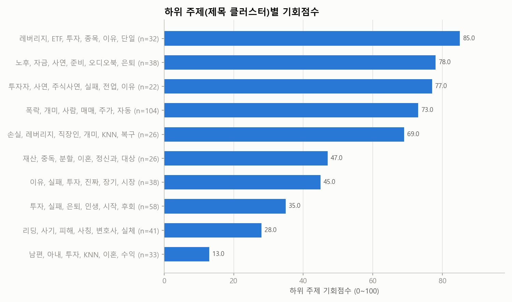

| 기회점수 | 핵심 단어 | 영상 수 | 배수 중앙값 | 성공 비율 | 소규모채널 성공 | 쇼츠 비율 | 예시 제목 |
|---|---|---|---|---|---|---|---|
| 85 | 레버리지, ETF, 투자, 종목, 이유, 단일 | 32 | 10.78 | 37.5% | 3.1% | 43.8% | 40초만에 ETF 투자 완벽정리  #etf투자 #etf #채권 #주식 # / 미국 ETF 30초만에 이해하기 / 노후 자금 주식에 올인했다간 큰일 납니다, 은퇴자 |
| 78 | 노후, 자금, 사연, 준비, 오디오북, 은퇴 | 38 | 3.97 | 39.5% | 15.8% | 13.2% | 노후자금 사연 주식투자로 280만 원에서 210억 만든 58세 전직 어부 / 노후 자금 10년 묻어두려던 ETF, 결국 단타치다 망하는 치명적인 이유 / "은퇴  |
| 77 | 투자자, 사연, 주식사연, 실패, 전업, 이유 | 22 | 2.97 | 27.3% | 9.1% | 18.2% | 개인 투자자의 무덤이 된 코스닥…수백만 투자자 폭발한 이유 / 주식 90%의 투자자가 실패하는 냉혹한 진실 / 주식 초보 투자자는 꼭 알아야 할 ‘손절의 법칙’ |
| 73 | 폭락, 개미, 사람, 매매, 주가, 자동 | 104 | 2.09 | 26.9% | 6.7% | 52.9% | "3억이 0원 됐다" 주식으로 망하는 사람들의 10가지 특징 / 맞벌이 부부의 월급날루틴 “빠르게 1억 모으기“ / 주식으로 성공한 부자들의 어마어마한 핵심 노하 |
| 69 | 손실, 레버리지, 직장인, 개미, KNN, 복구 | 26 | 2.04 | 26.9% | 3.8% | 30.8% | 99% 공감하는 주식 손실이 커질때 멘탈 변화 11단계 #경제 / 대출받아 주식 손실 복구하려다 4억 4천 날렸습니다..  / 📈주식 -50% 손실 복 |
| 47 | 재산, 중독, 분할, 이혼, 정신과, 대상 | 26 | 1.34 | 11.5% | 7.7% | 38.5% | 오늘자 주식에 전재산 넣은 20대 상황.. 삼전닉스야.. 나 한강물 안  / ［실제사연］ 주식으로 전재산 11억 잃고 빚 7억 진 63세 남자의 고백 / 2030 |
| 45 | 이유, 실패, 투자, 진짜, 장기, 시장 | 38 | 1.73 | 28.9% | 2.6% | 23.7% | 국내 주식시장이 카지노 투기판으로 변해버린 이유 #레버리지ETF #상장폐 / 50대 주식투자를 실패했다면 99%는 3가지 이유 때문입니다 \| 개미투자 / 주식으 |
| 35 | 투자, 실패, 은퇴, 인생, 시작, 후회 | 58 | 1.97 | 20.7% | 1.7% | 25.9% | 60대에 시작하는 주식 투자: 실패를 피하는 5가지 팁 / 주식 실패로 5억이 20만 원 되는 과정(1~5편 통합본) / 주식 투자 마이너스(-)되도 계속 갖고  |
| 28 | 리딩, 사기, 피해, 사칭, 변호사, 실체 | 41 | 1.74 | 2.4% | 2.4% | 34.1% | 공모주사기? 비상장주식 투자로 피해 당했다면 꼭 보세요! 유명인 사칭 사 / ❗ 부자언니 유수진 사기 ❗주식 리딩방 증권사 사칭 투자 사기 피해 대응 / 리딩방  |
| 13 | 남편, 아내, 투자, KNN, 이혼, 수익 | 33 | 0.94 | 0.0% | 0.0% | 51.5% | 주식 코인 도박 중독 남편 이혼 가능할까요? / 아내 몰래 주식투자로 퇴직금 날린 남편, 은퇴 2년 만에 예상 못한 반전 / 몰래 주식하다 빚더미 앉은 남편의 최 |

## 2. 🔑 키워드 기회 분석

기회점수 = 수요 25% + 자동완성 15% + 소규모채널 진입 20% + 아웃라이어 10% + 신선도 5% + 경쟁(역) 15% + 콘텐츠 공백 10% (키워드 간 백분위 기준). 수요·경쟁은 **주제 관련 영상만**으로 계산했고, 검색 상위 10개 중 절반 이상이 한 채널인 키워드(채널명 검색)는 제외했습니다. '관련 비율'이 낮다 = 사람들이 찾는데 맞는 영상이 적다(콘텐츠 공백).

### 🗂️ 카테고리(소재)별 기회

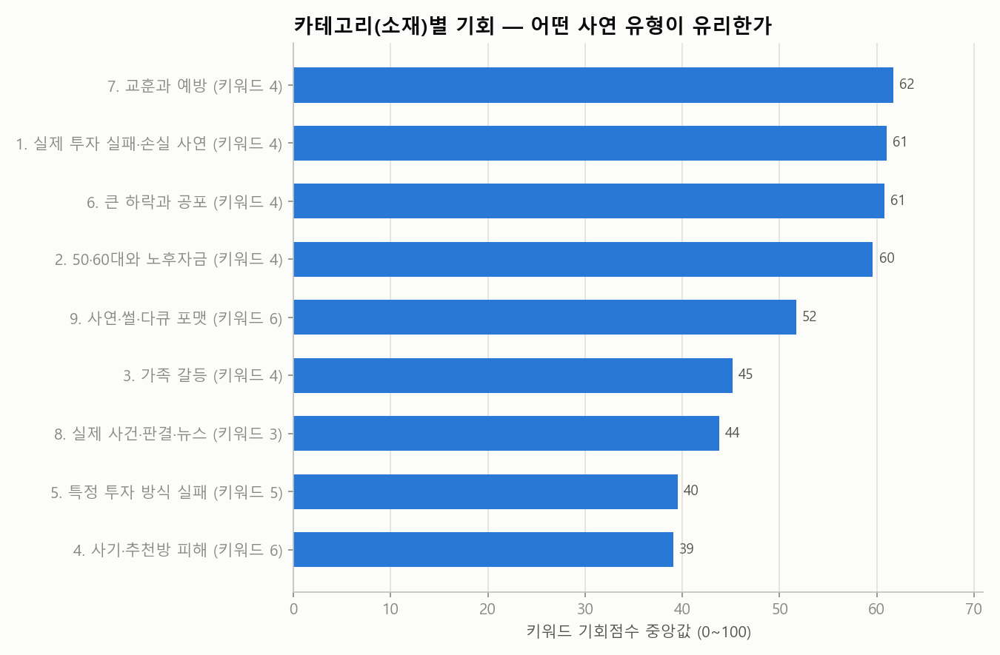

| 카테고리 | 키워드 수 | 기회(중앙) | 기회(최고) | 최고 키워드 | 검색수요 합 | 일평균 조회(중앙) | 소규모 진입 | 관련 비율 | 성공 영상 | 배수(중앙) |
|---|---|---|---|---|---|---|---|---|---|---|
| 7. 교훈과 예방 | 4 | 62 | 68 | 주식 투자자가 가장 후회하는 것 | 1.4 | 513 | 6.2% | 86.2% | 19 | 3.28 |
| 1. 실제 투자 실패·손실 사연 | 4 | 61 | 66 | 주식 물타기 실패 사례 | 1.9 | 256 | 7.5% | 91.2% | 10 | 5.05 |
| 6. 큰 하락과 공포 | 4 | 61 | 68 | 주식 폭락 전재산 손실 | 1.7 | 645 | 7.5% | 85.0% | 12 | 2.14 |
| 2. 50·60대와 노후자금 | 4 | 60 | 67 | 50대 주식 투자 실패 | 1.7 | 440 | 8.8% | 85.0% | 16 | 2.45 |
| 9. 사연·썰·다큐 포맷 | 6 | 52 | 62 | 주식으로 망한 사람 인터뷰 | 3.0 | 257 | 3.3% | 94.2% | 16 | 1.79 |
| 3. 가족 갈등 | 4 | 45 | 51 | 부부 주식 투자 갈등 | 1.4 | 92 | 2.5% | 75.0% | 2 | 1.08 |
| 8. 실제 사건·판결·뉴스 | 3 | 44 | 56 | 주식 투자 사기 실제 사건 | 1.4 | 5 | 8.3% | 81.7% | 0 | 1.02 |
| 5. 특정 투자 방식 실패 | 5 | 40 | 61 | 레버리지 투자 실패 사연 | 1.5 | 143 | 6.0% | 94.0% | 13 | 2.39 |
| 4. 사기·추천방 피해 | 6 | 39 | 68 | 주식 자동매매 사기 사례 | 2.5 | 180 | 9.2% | 91.7% | 7 | 1.82 |

### 🔑 키워드별 기회

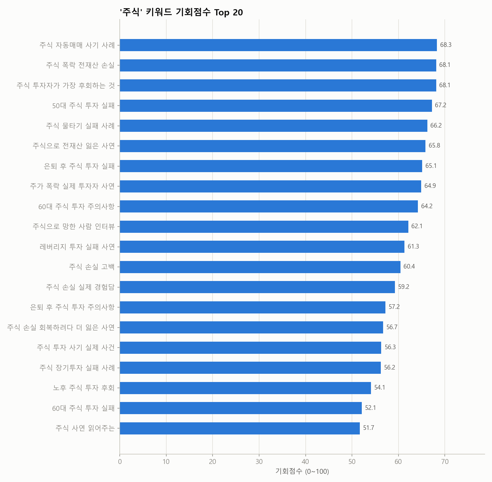
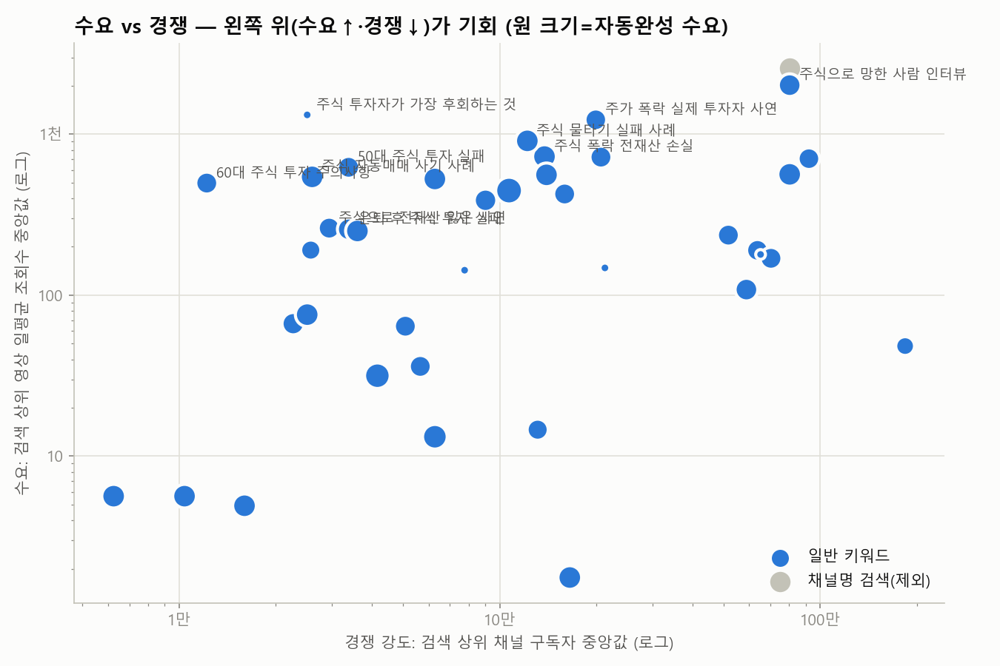

| 키워드 | 카테고리 | 기회점수 | 일평균 조회수(중앙) | 자동완성 | 소규모 진입 | 관련 비율 | 최신 비율 | 경쟁 구독자(중앙) | 배수(중앙) | 성공 수 | 추천 포맷 | 채널명검색 |
|---|---|---|---|---|---|---|---|---|---|---|---|---|
| 주식 자동매매 사기 사례 | 4. 사기·추천방 피해 | 68 | 544 | 0.50 | 5.0% | 65.0% | 0.0% | 2.6만 | 4.26 | 6 | 롱폼 |  |
| 주식 폭락 전재산 손실 | 6. 큰 하락과 공포 | 68 | 727 | 0.50 | 5.0% | 75.0% | 33.3% | 13.8만 | 3.19 | 7 | 쇼츠 |  |
| 주식 투자자가 가장 후회하는 것 | 7. 교훈과 예방 | 68 | 1.3천 | 0.00 | 10.0% | 85.0% | 5.9% | 2.5만 | 3.78 | 5 | 쇼츠 |  |
| 50대 주식 투자 실패 | 2. 50·60대와 노후자 | 67 | 623 | 0.41 | 10.0% | 85.0% | 17.6% | 3.4만 | 2.80 | 7 | 롱폼 |  |
| 주식 물타기 실패 사례 | 1. 실제 투자 실패·손실 | 66 | 910 | 0.50 | 5.0% | 90.0% | 5.6% | 12.2만 | 5.78 | 6 | 롱폼 |  |
| 주식으로 전재산 잃은 사연 | 1. 실제 투자 실패·손실 | 66 | 261 | 0.41 | 15.0% | 90.0% | 22.2% | 2.9만 | 4.18 | 7 | 롱폼 |  |
| 은퇴 후 주식 투자 실패 | 2. 50·60대와 노후자 | 65 | 257 | 0.44 | 15.0% | 95.0% | 15.8% | 3.4만 | 5.04 | 13 | 롱폼 |  |
| 주가 폭락 실제 투자자 사연 | 6. 큰 하락과 공포 | 65 | 1.2천 | 0.40 | 10.0% | 90.0% | 33.3% | 19.9만 | 5.22 | 9 | 쇼츠 |  |
| 60대 주식 투자 주의사항 | 7. 교훈과 예방 | 64 | 497 | 0.41 | 5.0% | 80.0% | 0.0% | 1.2만 | 7.42 | 4 | 쇼츠 |  |
| 주식으로 망한 사람 인터뷰 | 9. 사연·썰·다큐 포맷 | 62 | 2.0천 | 0.45 | 5.0% | 90.0% | 11.1% | 80.3만 | 16.25 | 12 | 롱폼 |  |
| 레버리지 투자 실패 사연 | 5. 특정 투자 방식 실패 | 61 | 560 | 0.50 | 5.0% | 95.0% | 42.1% | 14만 | 4.75 | 9 | 쇼츠 |  |
| 주식 손실 고백 | 9. 사연·썰·다큐 포맷 | 60 | 447 | 0.67 | 5.0% | 95.0% | 21.1% | 10.7만 | 3.45 | 8 | 쇼츠 |  |
| 주식 손실 실제 경험담 | 7. 교훈과 예방 | 59 | 528 | 0.50 | 5.0% | 100.0% | 10.0% | 6.3만 | 5.71 | 9 | 쇼츠 |  |
| 은퇴 후 주식 투자 주의사항 | 7. 교훈과 예방 | 57 | 389 | 0.44 | 5.0% | 80.0% | 12.5% | 9.0만 | 3.53 | 12 | 쇼츠 |  |
| 주식 손실 회복하려다 더 잃은 사연 | 6. 큰 하락과 공포 | 57 | 191 | 0.33 | 15.0% | 90.0% | 22.2% | 2.6만 | 1.86 | 3 | 롱폼 |  |
| 주식 투자 사기 실제 사건 | 8. 실제 사건·판결·뉴스 | 56 | 705 | 0.40 | 20.0% | 85.0% | 5.9% | 92.2만 | 1.70 | 1 | 롱폼 |  |
| 주식 장기투자 실패 사례 | 1. 실제 투자 실패·손실 | 56 | 251 | 0.50 | 5.0% | 90.0% | 5.6% | 3.6만 | 2.85 | 6 | 롱폼 |  |
| 노후 주식 투자 후회 | 2. 50·60대와 노후자 | 54 | 721 | 0.41 | 0.0% | 70.0% | 28.6% | 20.7만 | 4.15 | 9 | 쇼츠 |  |
| 60대 주식 투자 실패 | 2. 50·60대와 노후자 | 52 | 64 | 0.41 | 10.0% | 90.0% | 11.1% | 5.1만 | 4.70 | 6 | 롱폼 |  |
| 주식 사연 읽어주는 | 9. 사연·썰·다큐 포맷 | 52 | 67 | 0.43 | 5.0% | 95.0% | 10.5% | 2.3만 | 6.06 | 6 | 롱폼 |  |
| 주식 단톡방 사기 사례 | 4. 사기·추천방 피해 | 52 | 236 | 0.41 | 15.0% | 95.0% | 10.5% | 51.7만 | 3.92 | 0 | 롱폼 |  |
| 부부 주식 투자 갈등 | 3. 가족 갈등 | 51 | 426 | 0.41 | 5.0% | 80.0% | 31.2% | 15.9만 | 1.51 | 3 | 롱폼 |  |
| 주식 투자 후회 사연 | 1. 실제 투자 실패·손실 | 49 | 76 | 0.50 | 5.0% | 95.0% | 5.3% | 2.5만 | 2.30 | 5 | 롱폼 |  |
| 주식 중독 실제 사례 | 6. 큰 하락과 공포 | 48 | 564 | 0.50 | 0.0% | 85.0% | 11.8% | 80.3만 | 1.88 | 2 | 롱폼 |  |
| 주식 손실 숨긴 남편 | 3. 가족 갈등 | 46 | 6 | 0.50 | 0.0% | 75.0% | 26.7% | 6.2천 | 1.13 | 0 | 쇼츠 |  |
| 주식 손실 숨긴 아내 | 3. 가족 갈등 | 44 | 6 | 0.50 | 0.0% | 55.0% | 18.2% | 1.0만 | 0.83 | 0 | 쇼츠 |  |
| 주식 손실 이혼 판결 | 8. 실제 사건·판결·뉴스 | 44 | 5 | 0.50 | 5.0% | 90.0% | 5.6% | 1.6만 | 1.10 | 0 | 롱폼 |  |
| 미국 주식 투자 실패 사연 | 5. 특정 투자 방식 실패 | 40 | 32 | 0.60 | 0.0% | 100.0% | 20.0% | 4.2만 | 2.51 | 5 | 롱폼 |  |
| 테마주 투자 실패 사례 | 5. 특정 투자 방식 실패 | 40 | 143 | 0.00 | 0.0% | 80.0% | 12.5% | 7.8만 | 5.41 | 10 | 쇼츠 |  |
| 주식 전문가 사칭 피해 사례 | 4. 사기·추천방 피해 | 39 | 190 | 0.40 | 15.0% | 100.0% | 5.0% | 63.7만 | 1.44 | 3 | 롱폼 |  |
| 주식 리딩방 피해 사례 | 4. 사기·추천방 피해 | 39 | 170 | 0.41 | 10.0% | 100.0% | 5.0% | 70.2만 | 2.46 | 0 | 롱폼 |  |
| 주식 실패 사연 라디오 | 9. 사연·썰·다큐 포맷 | 37 | 36 | 0.41 | 5.0% | 100.0% | 20.0% | 5.7만 | 1.95 | 6 | 롱폼 |  |
| 작전주 피해 실제 사례 | 5. 특정 투자 방식 실패 | 37 | 148 | 0.00 | 20.0% | 95.0% | 0.0% | 21.3만 | 0.40 | 1 | 롱폼 |  |
| 상장폐지 주식 피해 사례 | 5. 특정 투자 방식 실패 | 35 | 15 | 0.38 | 5.0% | 100.0% | 10.0% | 13.1만 | 6.40 | 4 | 쇼츠 |  |
| 남편 몰래 주식 투자 사연 | 3. 가족 갈등 | 34 | 179 | 0.00 | 5.0% | 90.0% | 38.9% | 65.2만 | 0.92 | 0 | 롱폼 |  |
| 무료 주식 리딩방 사기 | 4. 사기·추천방 피해 | 34 | 108 | 0.45 | 5.0% | 100.0% | 5.0% | 58.9만 | 1.66 | 0 | 롱폼 |  |
| 주식 리딩방 법원 판결 | 8. 실제 사건·판결·뉴스 | 32 | 2 | 0.50 | 0.0% | 70.0% | 7.1% | 16.6만 | 0.95 | 0 | 롱폼 |  |
| 주식 망한 썰 | 9. 사연·썰·다큐 포맷 | 31 | 13 | 0.55 | 0.0% | 100.0% | 5.0% | 6.3만 | 1.06 | 2 | 쇼츠 |  |
| 고수익 주식 투자 사기 | 4. 사기·추천방 피해 | 28 | 48 | 0.28 | 5.0% | 90.0% | 5.6% | 184만 | 2.81 | 0 | 롱폼 |  |
| 주식 투자 실패 다큐멘터리 | 9. 사연·썰·다큐 포맷 | - | 2.6천 | 0.49 | 0.0% | 85.0% | 11.8% | 80.3만 | 3.39 | 7 | 롱폼 | 예 |

키워드별 검색 수요 (자동완성이 표현을 어디까지 알아보는지 — 1.0=전체 문구가 자동완성에 뜸, 0=앞 두 단어도 안 뜸)

| 순위 | 검색어 | 카테고리 | 수요 점수 | 자동완성이 알아본 부분 | 일치 제안 수 |
|---|---|---|---|---|---|
| 1 | 주식 손실 고백 | 9. 사연·썰·다큐 포맷 | 0.67 | 주식 손실 | 10 |
| 2 | 미국 주식 투자 실패 사연 | 5. 특정 투자 방식 실패 | 0.60 | 미국 주식 투자 | 10 |
| 3 | 주식 망한 썰 | 9. 사연·썰·다큐 포맷 | 0.55 | 주식 망한 썰 | 1 |
| 4 | 주식 폭락 전재산 손실 | 6. 큰 하락과 공포 | 0.50 | 주식 폭락 | 10 |
| 4 | 주식 자동매매 사기 사례 | 4. 사기·추천방 피해 | 0.50 | 주식 자동매매 | 10 |
| 4 | 주식 물타기 실패 사례 | 1. 실제 투자 실패·손실 사연 | 0.50 | 주식 물타기 | 10 |
| 4 | 주식 리딩방 법원 판결 | 8. 실제 사건·판결·뉴스 | 0.50 | 주식 리딩방 | 10 |
| 4 | 주식 손실 실제 경험담 | 7. 교훈과 예방 | 0.50 | 주식 손실 | 10 |
| 4 | 주식 장기투자 실패 사례 | 1. 실제 투자 실패·손실 사연 | 0.50 | 주식 장기투자 | 10 |
| 4 | 주식 손실 숨긴 남편 | 3. 가족 갈등 | 0.50 | 주식 손실 | 10 |
| 4 | 주식 손실 이혼 판결 | 8. 실제 사건·판결·뉴스 | 0.50 | 주식 손실 | 10 |
| 4 | 주식 손실 숨긴 아내 | 3. 가족 갈등 | 0.50 | 주식 손실 | 10 |
| 4 | 주식 중독 실제 사례 | 6. 큰 하락과 공포 | 0.50 | 주식 중독 | 10 |
| 4 | 레버리지 투자 실패 사연 | 5. 특정 투자 방식 실패 | 0.50 | 레버리지 투자 | 10 |
| 4 | 주식 투자 후회 사연 | 1. 실제 투자 실패·손실 사연 | 0.50 | 주식 투자 | 10 |
| 16 | 주식 투자 실패 다큐멘터리 | 9. 사연·썰·다큐 포맷 | 0.49 | 주식 투자 실패 | 3 |
| 17 | 주식으로 망한 사람 인터뷰 | 9. 사연·썰·다큐 포맷 | 0.45 | 주식으로 망한 사람 | 2 |
| 17 | 무료 주식 리딩방 사기 | 4. 사기·추천방 피해 | 0.45 | 무료 주식 리딩방 | 2 |
| 19 | 은퇴 후 주식 투자 실패 | 2. 50·60대와 노후자금 | 0.44 | 은퇴 후 주식 투자 | 1 |
| 19 | 은퇴 후 주식 투자 주의사항 | 7. 교훈과 예방 | 0.44 | 은퇴 후 주식 투자 | 1 |
| 21 | 주식 사연 읽어주는 | 9. 사연·썰·다큐 포맷 | 0.43 | 주식 사연 | 3 |
| 22 | 50대 주식 투자 실패 | 2. 50·60대와 노후자금 | 0.41 | 50대 주식 투자 | 1 |
| 22 | 인버스 투자 실패 사례 | 5. 특정 투자 방식 실패 | 0.41 | 인버스 투자 실패 | 1 |
| 22 | 60대 주식 투자 실패 | 2. 50·60대와 노후자금 | 0.41 | 60대 주식 투자 | 1 |
| 22 | 부부 주식 투자 갈등 | 3. 가족 갈등 | 0.41 | 부부 주식 투자 | 1 |
| 22 | 주식 리딩방 피해 사례 | 4. 사기·추천방 피해 | 0.41 | 주식 리딩방 피해 | 1 |
| 22 | 퇴직금 투자 실패 뉴스 | 8. 실제 사건·판결·뉴스 | 0.41 | 퇴직금 투자 실패 | 1 |
| 22 | 50대 주식 투자 주의사항 | 7. 교훈과 예방 | 0.41 | 50대 주식 투자 | 1 |
| 22 | 주식 깡통 계좌 사연 | 6. 큰 하락과 공포 | 0.41 | 주식 깡통 계좌 | 1 |
| 22 | 노후 주식 투자 후회 | 2. 50·60대와 노후자금 | 0.41 | 노후 주식 투자 | 1 |
| 22 | 60대 주식 투자 주의사항 | 7. 교훈과 예방 | 0.41 | 60대 주식 투자 | 1 |
| 22 | 주식 단톡방 사기 사례 | 4. 사기·추천방 피해 | 0.41 | 주식 단톡방 사기 | 1 |
| 22 | 주식 빚투 실패 사례 | 1. 실제 투자 실패·손실 사연 | 0.41 | 주식 빚투 실패 | 1 |
| 22 | 주식으로 전재산 잃은 사연 | 1. 실제 투자 실패·손실 사연 | 0.41 | 주식으로 전재산 잃은 | 1 |
| 22 | 주식 리딩방 사기 예방법 | 7. 교훈과 예방 | 0.41 | 주식 리딩방 사기 | 1 |
| 22 | 주식 실패 사연 라디오 | 9. 사연·썰·다큐 포맷 | 0.41 | 주식 실패 사연 | 1 |
| 37 | 주식 전문가 사칭 피해 사례 | 4. 사기·추천방 피해 | 0.40 | 주식 전문가 | 10 |
| 37 | 주식 투자 가족 파탄 사례 | 3. 가족 갈등 | 0.40 | 주식 투자 | 10 |
| 37 | 주식 신용거래 실패 사연 | 1. 실제 투자 실패·손실 사연 | 0.40 | 주식 신용거래 | 6 |
| 37 | 주가 폭락 실제 투자자 사연 | 6. 큰 하락과 공포 | 0.40 | 주가 폭락 | 10 |
| 37 | 주식 투자 사기 실제 사건 | 8. 실제 사건·판결·뉴스 | 0.40 | 주식 투자 | 10 |
| 37 | 가족 돈 주식으로 잃은 사례 | 3. 가족 갈등 | 0.40 | 가족 돈 | 10 |
| 43 | 주식 투자 실패 실제 사례 | 1. 실제 투자 실패·손실 사연 | 0.39 | 주식 투자 실패 | 3 |
| 44 | 상장폐지 주식 피해 사례 | 5. 특정 투자 방식 실패 | 0.38 | 상장폐지 주식 | 5 |
| 44 | 주식 몰빵 실패 사연 | 1. 실제 투자 실패·손실 사연 | 0.38 | 주식 몰빵 | 5 |
| 46 | 노후자금 투자 실수 | 7. 교훈과 예방 | 0.37 | 노후자금 투자 | 1 |
| 46 | 주식 폐인 일상 | 9. 사연·썰·다큐 포맷 | 0.37 | 주식 폐인 | 1 |
| 48 | 주식 손절 못해서 손실 본 사연 | 1. 실제 투자 실패·손실 사연 | 0.33 | 주식 손절 | 10 |
| 48 | 주식 손실 회복하려다 더 잃은 사연 | 6. 큰 하락과 공포 | 0.33 | 주식 손실 | 10 |
| 50 | 주식 유튜버 추천 손실 사례 | 4. 사기·추천방 피해 | 0.33 | 주식 유튜버 추천 | 1 |
| 50 | 주식 실패 후 재기 사연 | 9. 사연·썰·다큐 포맷 | 0.33 | 주식 실패 후 | 1 |
| 52 | 대출받아 주식 투자 실패 | 6. 큰 하락과 공포 | 0.33 | 대출받아 주식 | 3 |
| 52 | 노인 주식 리딩방 피해 | 4. 사기·추천방 피해 | 0.33 | 노인 주식 | 3 |
| 54 | 주식 투자금 반환 소송 | 8. 실제 사건·판결·뉴스 | 0.30 | 주식 투자금 | 2 |
| 54 | 부모 재산 주식으로 잃은 사연 | 3. 가족 갈등 | 0.30 | 부모 재산 | 5 |
| 56 | 퇴직금 주식투자 실제 사례 | 2. 50·60대와 노후자금 | 0.28 | 퇴직금 주식투자 | 1 |
| 56 | 급등주 투자 실패 사연 | 5. 특정 투자 방식 실패 | 0.28 | 급등주 투자 | 1 |
| 56 | 연금 주식투자 실패 사례 | 2. 50·60대와 노후자금 | 0.28 | 연금 주식투자 | 1 |
| 56 | 고수익 주식 투자 사기 | 4. 사기·추천방 피해 | 0.28 | 고수익 주식 | 1 |
| 56 | 시니어 주식 투자 실패 | 2. 50·60대와 노후자금 | 0.28 | 시니어 주식 | 1 |
| 56 | 투자 권유 손해배상 판결 | 8. 실제 사건·판결·뉴스 | 0.28 | 투자 권유 | 1 |
| 56 | 동전주 투자 실패 사례 | 5. 특정 투자 방식 실패 | 0.28 | 동전주 투자 | 1 |
| 56 | 개미 투자자 실패 다큐 | 9. 사연·썰·다큐 포맷 | 0.28 | 개미 투자자 | 1 |
| 64 | 주식 초보가 돈 잃는 이유 | 7. 교훈과 예방 | 0.22 | 주식 초보가 | 1 |
| 65 | 남편 몰래 주식 투자 사연 | 3. 가족 갈등 | 0.00 | - | 0 |
| 65 | 배우자 몰래 주식 판결 | 8. 실제 사건·판결·뉴스 | 0.00 | - | 0 |
| 65 | 아내 몰래 주식 투자 실패 | 3. 가족 갈등 | 0.00 | - | 0 |
| 65 | 노후자금 주식으로 잃은 사연 | 2. 50·60대와 노후자금 | 0.00 | - | 0 |
| 65 | 반대매매 실제 사례 | 6. 큰 하락과 공포 | 0.00 | - | 0 |
| 65 | 작전주 피해 실제 사례 | 5. 특정 투자 방식 실패 | 0.00 | - | 0 |
| 65 | 주식 투자자가 가장 후회하는 것 | 7. 교훈과 예방 | 0.00 | - | 0 |
| 65 | 하한가 투자 피해 사례 | 6. 큰 하락과 공포 | 0.00 | - | 0 |
| 65 | 미공개정보 주식 사건 | 8. 실제 사건·판결·뉴스 | 0.00 | - | 0 |
| 65 | 테마주 투자 실패 사례 | 5. 특정 투자 방식 실패 | 0.00 | - | 0 |
| 65 | 노후 파산 주식 투자 | 2. 50·60대와 노후자금 | 0.00 | - | 0 |
| 65 | 주식으로 이혼한 실제 사례 | 3. 가족 갈등 | 0.00 | - | 0 |
| 65 | 관리종목 투자 실패 | 5. 특정 투자 방식 실패 | 0.00 | - | 0 |
| 65 | 미등록 투자자문 피해 사례 | 4. 사기·추천방 피해 | 0.00 | - | 0 |
| 65 | 상장폐지 전재산 손실 | 6. 큰 하락과 공포 | 0.00 | - | 0 |
| 65 | 퇴직금 투자하면 안 되는 이유 | 7. 교훈과 예방 | 0.00 | - | 0 |
| 65 | 주가조작 피해자 실제 사례 | 8. 실제 사건·판결·뉴스 | 0.00 | - | 0 |
| 65 | 주식으로 퇴직금 잃은 사연 | 1. 실제 투자 실패·손실 사연 | 0.00 | - | 0 |
| 65 | 은퇴자 빚투 실제 사례 | 2. 50·60대와 노후자금 | 0.00 | - | 0 |
| 65 | 자녀 돈으로 주식 투자한 부모 | 3. 가족 갈등 | 0.00 | - | 0 |
| 65 | 퇴직금 리딩방 사기 | 4. 사기·추천방 피해 | 0.00 | - | 0 |
| 65 | 해외주식으로 돈 잃은 사례 | 5. 특정 투자 방식 실패 | 0.00 | - | 0 |
| 65 | 빚내서 주식한 사람의 결말 | 6. 큰 하락과 공포 | 0.00 | - | 0 |
| 65 | 주식 실패에서 얻은 교훈 | 7. 교훈과 예방 | 0.00 | - | 0 |
| 65 | 노후자금 투자사기 뉴스 | 8. 실제 사건·판결·뉴스 | 0.00 | - | 0 |
| 65 | 주식 실화 사연 | 9. 사연·썰·다큐 포맷 | 0.00 | - | 0 |

⏭️ 이번 실행에서 이월된 키워드 (다음 실행에서 수집)

`주식으로 이혼한 실제 사례`, `미등록 투자자문 피해 사례`, `관리종목 투자 실패`, `상장폐지 전재산 손실`, `퇴직금 투자하면 안 되는 이유`, `주가조작 피해자 실제 사례`, `개미 투자자 실패 다큐`, `주식으로 퇴직금 잃은 사연`, `은퇴자 빚투 실제 사례`, `자녀 돈으로 주식 투자한 부모`, `퇴직금 리딩방 사기`, `해외주식으로 돈 잃은 사례`, `빚내서 주식한 사람의 결말`, `주식 실패에서 얻은 교훈`, `노후자금 투자사기 뉴스`, `주식 실화 사연`

🎯 주제와 무관해서 제외한 영상 177개 (조회수 상위 15개 — 전체는 data/excluded_offtopic.csv)

| 영상 | 채널 | 조회수 | 검색 키워드 |
|---|---|---|---|
| [98% 폭락에 매수했더니…1시간 뒤 "손 떨려" 황당 사고 #shorts](https://www.youtube.com/watch?v=LhgDGV-N46c) | SBS 뉴스 | 1,396만 | 주가 폭락 실제 투자자 사연 |
| [허지웅이 항암치료를 하면서 느낀 점 #shorts #아는형님](https://www.youtube.com/watch?v=SayKkU0CmKs) | 1분예능모음zip | 621만 | 주식 손실 숨긴 남편 |
| [5분만에 전재산을 잃을 수 있는 비트코인](https://www.youtube.com/watch?v=Kv6dyA1u0bM) | 자두두 Jadoodoo | 594만 | 주식 폭락 전재산 손실 |
| [S&P500 딱 이만큼만 사두세요 "은퇴 후 평생 놀고먹을 수 있습니다" #김경록…](https://www.youtube.com/watch?v=irGYt5Ouhao) | 부티플 - 부의 배수를 높여라 | 572만 | 은퇴 후 주식 투자 주의사항 |
| [아들의 코인빚에 아버지가 향한곳](https://www.youtube.com/watch?v=V-Nlkc9YA34) | 마음온기 | 489만 | 60대 주식 투자 실패 |
| [노후에는 이렇게 살면 됩니다 #법륜스님 #법륜스님쇼츠 #법륜쇼츠 #즉문즉설 #정토…](https://www.youtube.com/watch?v=2hhHC44We8c) | 법륜스님의 즉문즉설 | 455만 | 60대 주식 투자 실패 |
| [대부분의 사람들이 부자 되기 힘든 이유#shorts  #부자되는법 #삼프로tv (…](https://www.youtube.com/watch?v=OUW-wvJ1LyM) | 월급쟁이부자들TV | 446만 | 주식 투자자가 가장 후회하는 것 |
| [금값이 폭락한 진짜 이유, 50초 안에 설명하기](https://www.youtube.com/watch?v=ZoWJDZy7U1Y) | 꽉TV | 423만 | 주가 폭락 실제 투자자 사연 |
| [사고 5년뒤 후회할아파트](https://www.youtube.com/watch?v=Y-ytRabMNEs) | 푸릉 | 423만 | 노후 주식 투자 후회 |
| [50대 이후 더 잘 풀리는 사람 공통점 4가지 #이호선](https://www.youtube.com/watch?v=hYV3cgNEBqA) | 부티플 - 부의 배수를 높여라 | 370만 | 50대 주식 투자 실패 |
| [삼성역 30대 직장인 현실 저축액](https://www.youtube.com/watch?v=utfw86RrMVE) | 싱글파이어 | 364만 | 부부 주식 투자 갈등 |
| [이런 사람과는 절대 결혼하면 안 됩니다 #shorts  #이혼 #결혼  (쇼츠 이…](https://www.youtube.com/watch?v=YU7Z05mQ6Cs) | 월급쟁이부자들TV | 358만 | 남편 몰래 주식 투자 사연 |
| [이런 집들은 피하세요](https://www.youtube.com/watch?v=eG1tc83rNBY) | 월급쟁이부자들TV | 357만 | 60대 주식 투자 주의사항 |
| [돈 때문에 세상이 무너졌다... 사기 당했거나 투자에 실패한 사람들의 이야기 \|…](https://www.youtube.com/watch?v=zI-qK78mKvE) | KBS 추적60분 | 340만 | 주가 폭락 실제 투자자 사연 |
| [목사님, 법륜스님의 설법을 듣고 놀란 이유](https://www.youtube.com/watch?v=Ry_90ZfrWQY) | The Life 지구촌교회 - 더라이프지구촌교회 | 313만 | 주식 손실 숨긴 남편 |

## 3. 🏷️ 제목 패턴 분석

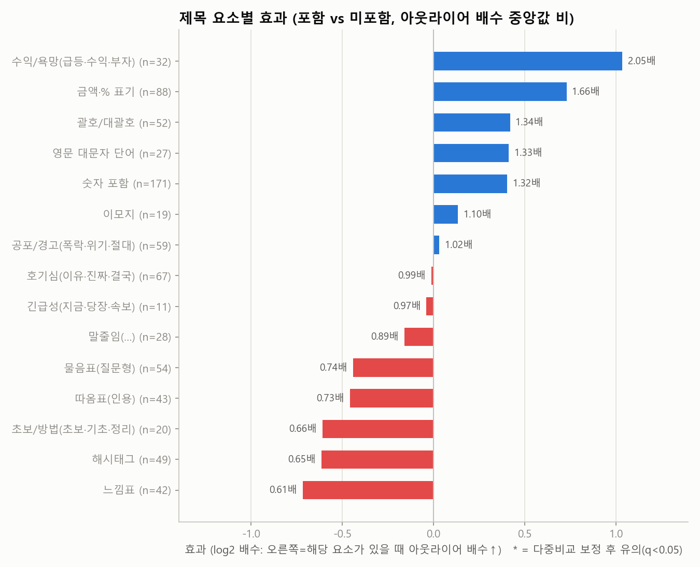
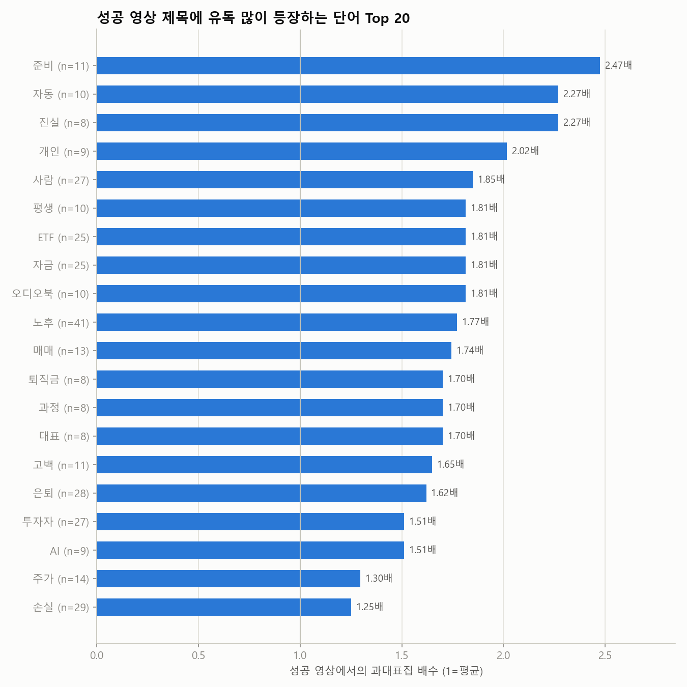
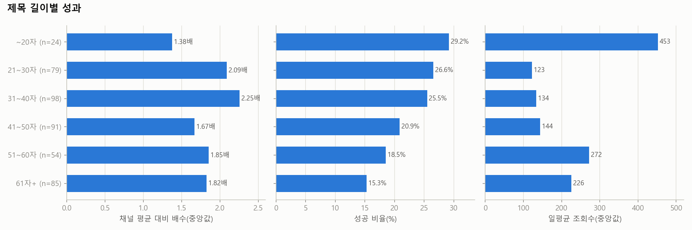

| 제목 요소 | 해당 영상 수 | 배수(있음) | 배수(없음) | 효과(배) | 성공률(있음) | 성공률(없음) | p값 | q값(보정) |
|---|---|---|---|---|---|---|---|---|
| 수익/욕망(급등·수익·부자) | 32 | 3.65 | 1.78 | 2.05 | 37.5% | 30.2% | 0.056 | 0.167 |
| 금액·% 표기 | 88 | 2.74 | 1.66 | 1.66 | 38.6% | 27.9% | 0.017 | 0.143 |
| 괄호/대괄호 | 52 | 2.34 | 1.75 | 1.34 | 36.5% | 29.8% | 0.384 | 0.721 |
| 영문 대문자 단어 | 27 | 2.44 | 1.83 | 1.33 | 44.4% | 29.6% | 0.641 | 0.808 |
| 숫자 포함 | 171 | 2.04 | 1.54 | 1.32 | 33.9% | 27.2% | 0.039 | 0.147 |
| 이모지 | 19 | 2.01 | 1.83 | 1.10 | 15.8% | 31.9% | 0.764 | 0.882 |
| 공포/경고(폭락·위기·절대) | 59 | 1.86 | 1.82 | 1.02 | 39.0% | 29.0% | 0.919 | 0.919 |
| 호기심(이유·진짜·결국) | 67 | 1.83 | 1.84 | 0.99 | 32.8% | 30.4% | 0.606 | 0.808 |
| 긴급성(지금·당장·속보) | 11 | 1.79 | 1.84 | 0.97 | 27.3% | 31.1% | 0.647 | 0.808 |
| 말줄임(…) | 28 | 1.65 | 1.84 | 0.89 | 25.0% | 31.5% | 0.875 | 0.919 |
| 물음표(질문형) | 54 | 1.48 | 2.01 | 0.74 | 20.4% | 33.2% | 0.026 | 0.143 |
| 따옴표(인용) | 43 | 1.41 | 1.94 | 0.73 | 37.2% | 29.9% | 0.509 | 0.808 |
| 초보/방법(초보·기초·정리) | 20 | 1.23 | 1.88 | 0.66 | 25.0% | 31.4% | 0.292 | 0.626 |
| 해시태그 | 49 | 1.33 | 2.04 | 0.65 | 22.4% | 32.6% | 0.087 | 0.217 |
| 느낌표 | 42 | 1.25 | 2.05 | 0.61 | 16.7% | 33.2% | 0.029 | 0.143 |

롱폼/쇼츠 따로 본 제목 요소 효과

| 구분 | 제목 요소 | 영상 수 | 효과(배) | 성공률(있음) | p값 |
|---|---|---|---|---|---|
| 롱폼 | 수익/욕망(급등·수익·부자) | 18 | 2.44 | 38.9% | 0.123 |
| 롱폼 | 영문 대문자 단어 | 16 | 1.57 | 50.0% | 0.687 |
| 롱폼 | 숫자 포함 | 114 | 1.44 | 35.1% | 0.077 |
| 롱폼 | 금액·% 표기 | 65 | 1.37 | 36.9% | 0.188 |
| 롱폼 | 괄호/대괄호 | 42 | 1.10 | 33.3% | 0.892 |
| 롱폼 | 해시태그 | 9 | 1.08 | 22.2% | 0.521 |
| 롱폼 | 말줄임(…) | 22 | 1.03 | 27.3% | 0.904 |
| 롱폼 | 이모지 | 12 | 1.02 | 16.7% | 0.491 |
| 롱폼 | 공포/경고(폭락·위기·절대) | 34 | 0.82 | 38.2% | 0.543 |
| 롱폼 | 호기심(이유·진짜·결국) | 50 | 0.74 | 24.0% | 0.388 |
| 롱폼 | 느낌표 | 18 | 0.64 | 22.2% | 0.205 |
| 롱폼 | 물음표(질문형) | 33 | 0.56 | 12.1% | 0.005 |
| 롱폼 | 따옴표(인용) | 26 | 0.52 | 30.8% | 0.232 |
| 롱폼 | 초보/방법(초보·기초·정리) | 14 | 0.49 | 14.3% | 0.048 |
| 쇼츠 | 호기심(이유·진짜·결국) | 17 | 6.01 | 58.8% | 0.051 |
| 쇼츠 | 괄호/대괄호 | 8 | 3.03 | 50.0% | 0.122 |
| 쇼츠 | 금액·% 표기 | 22 | 2.54 | 40.9% | 0.052 |
| 쇼츠 | 수익/욕망(급등·수익·부자) | 14 | 1.78 | 35.7% | 0.194 |
| 쇼츠 | 공포/경고(폭락·위기·절대) | 23 | 1.20 | 34.8% | 0.869 |
| 쇼츠 | 따옴표(인용) | 16 | 1.17 | 43.8% | 0.752 |
| 쇼츠 | 물음표(질문형) | 21 | 1.03 | 33.3% | 0.826 |
| 쇼츠 | 숫자 포함 | 55 | 1.01 | 29.1% | 0.517 |
| 쇼츠 | 영문 대문자 단어 | 11 | 0.94 | 36.4% | 0.808 |
| 쇼츠 | 해시태그 | 40 | 0.72 | 22.5% | 0.160 |
| 쇼츠 | 느낌표 | 24 | 0.70 | 12.5% | 0.091 |

**성공 영상 제목에 유독 많이 나오는 단어** (과대표집 배수 = 성공 영상 내 비중 ÷ 전체 비중)

| 단어 | 영상 수 | 성공 수 | 과대표집 | 배수(중앙) | 일평균 조회수 |
|---|---|---|---|---|---|
| 준비 | 11 | 6 | 2.47 | 12.77 | 159 |
| 자동 | 10 | 5 | 2.27 | 5.96 | 107 |
| 진실 | 8 | 4 | 2.27 | 4.14 | 211 |
| 개인 | 9 | 4 | 2.02 | 7.03 | 560 |
| 사람 | 27 | 11 | 1.85 | 4.62 | 272 |
| 평생 | 10 | 4 | 1.81 | 15.58 | 507 |
| ETF | 25 | 10 | 1.81 | 14.34 | 1.1천 |
| 자금 | 25 | 10 | 1.81 | 4.15 | 142 |
| 오디오북 | 10 | 4 | 1.81 | 2.90 | 50 |
| 노후 | 41 | 16 | 1.77 | 3.97 | 175 |
| 매매 | 13 | 5 | 1.74 | 4.07 | 61 |
| 퇴직금 | 8 | 3 | 1.70 | 23.80 | 38 |
| 과정 | 8 | 3 | 1.70 | 17.07 | 465 |
| 대표 | 8 | 3 | 1.70 | 4.14 | 1.2천 |
| 고백 | 11 | 4 | 1.65 | 3.80 | 52 |
| 은퇴 | 28 | 10 | 1.62 | 4.91 | 202 |
| 투자자 | 27 | 9 | 1.51 | 3.30 | 547 |
| AI | 9 | 3 | 1.51 | 2.39 | 559 |
| 주가 | 14 | 4 | 1.30 | 2.11 | 394 |
| 손실 | 29 | 8 | 1.25 | 2.04 | 555 |
| 이유 | 56 | 15 | 1.22 | 1.72 | 324 |
| 방송 | 12 | 3 | 1.13 | 3.78 | 2.5천 |
| SK | 8 | 2 | 1.13 | 3.21 | 501 |
| 폭락 | 20 | 5 | 1.13 | 1.86 | 685 |
| 코스피 | 12 | 3 | 1.13 | 1.51 | 690 |

## 4. 🎞️ 포맷 · 길이

> 쇼츠 조회수는 2025년 3월부터 '재생 시작/반복'마다 집계되어 롱폼 조회수와 직접 비교할 수 없습니다. 그래서 **같은 채널·같은 포맷 대비 배수(아웃라이어)** 와 성공 비율로 비교합니다.

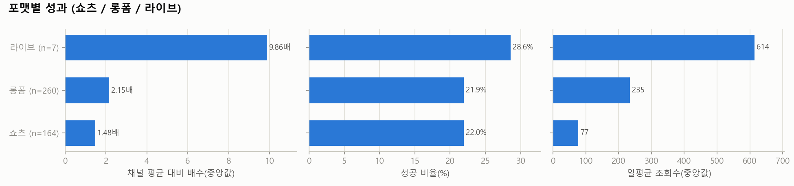
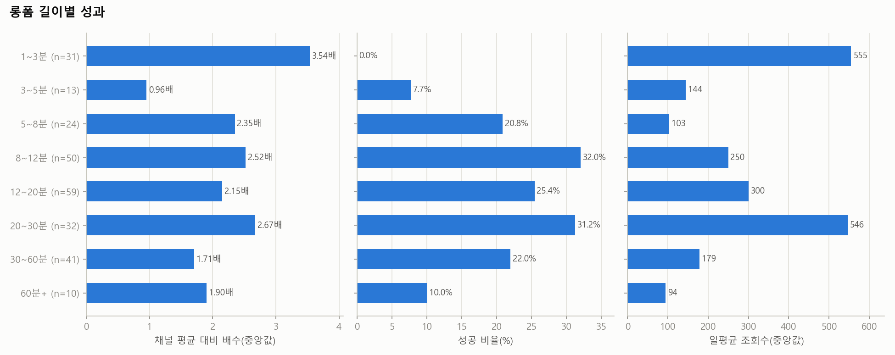

| 포맷 | 영상 수 | 조회수(중앙) | 일평균(중앙) | 배수(중앙) | 성공 비율 | 소규모채널 성공 |
|---|---|---|---|---|---|---|
| 라이브 | 7 | 6.1만 | 614 | 9.86 | 28.6% | 0.0% |
| 롱폼 | 260 | 3.0만 | 235 | 2.15 | 21.9% | 5.4% |
| 쇼츠 | 164 | 7.6천 | 77 | 1.48 | 22.0% | 4.9% |

| 롱폼 길이 | 영상 수 | 조회수(중앙) | 일평균(중앙) | 배수(중앙) | 성공 비율 | 소규모채널 성공 |
|---|---|---|---|---|---|---|
| 1~3분 | 31 | 3.8만 | 555 | 3.54 | 0.0% | 0.0% |
| 3~5분 | 13 | 1.5만 | 144 | 0.96 | 7.7% | 0.0% |
| 5~8분 | 24 | 1.1만 | 103 | 2.35 | 20.8% | 4.2% |
| 8~12분 | 50 | 2.5만 | 250 | 2.52 | 32.0% | 8.0% |
| 12~20분 | 59 | 6.2만 | 300 | 2.15 | 25.4% | 3.4% |
| 20~30분 | 32 | 7.9만 | 546 | 2.67 | 31.2% | 6.2% |
| 30~60분 | 41 | 3.0만 | 179 | 1.71 | 22.0% | 12.2% |
| 60분+ | 10 | 1.5만 | 94 | 1.90 | 10.0% | 0.0% |

## 5. 🕒 업로드 타이밍 (참고용 — 효과가 작고 혼란변수가 많음)

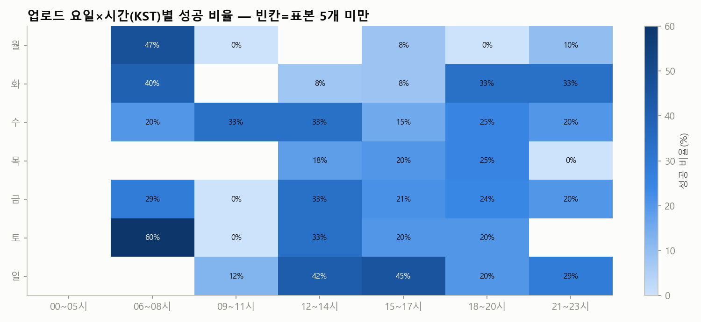

| 요일 | 영상 수 | 조회수(중앙) | 일평균(중앙) | 배수(중앙) | 성공 비율 | 소규모채널 성공 |
|---|---|---|---|---|---|---|
| 월 | 65 | 1.4만 | 72 | 1.51 | 15.4% | 6.2% |
| 화 | 55 | 3.0만 | 195 | 1.77 | 21.8% | 3.6% |
| 수 | 75 | 3.3만 | 323 | 1.41 | 22.7% | 5.3% |
| 목 | 59 | 7.7천 | 59 | 1.78 | 16.9% | 8.5% |
| 금 | 74 | 2.6만 | 302 | 2.07 | 24.3% | 1.4% |
| 토 | 48 | 3.5만 | 210 | 3.38 | 27.1% | 4.2% |
| 일 | 55 | 5.4만 | 344 | 2.62 | 27.3% | 7.3% |

| 시간대(KST) | 영상 수 | 조회수(중앙) | 일평균(중앙) | 배수(중앙) | 성공 비율 | 소규모채널 성공 |
|---|---|---|---|---|---|---|
| 00~05시 | 17 | 1.1만 | 75 | 2.51 | 17.6% | 5.9% |
| 06~08시 | 55 | 2.3만 | 179 | 3.23 | 34.5% | 9.1% |
| 09~11시 | 37 | 2.7천 | 32 | 1.33 | 10.8% | 5.4% |
| 12~14시 | 70 | 4.5만 | 466 | 2.11 | 25.7% | 4.3% |
| 15~17시 | 82 | 1.4만 | 109 | 1.78 | 19.5% | 4.9% |
| 18~20시 | 122 | 4.0만 | 336 | 2.03 | 22.1% | 5.7% |
| 21~23시 | 48 | 1.9만 | 180 | 1.64 | 16.7% | 0.0% |

## 6. 🌱 채널 규모별 분석 — 0명 채널에게 가장 중요한 부분

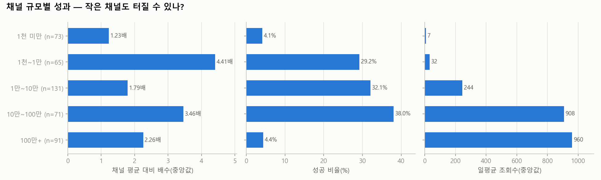
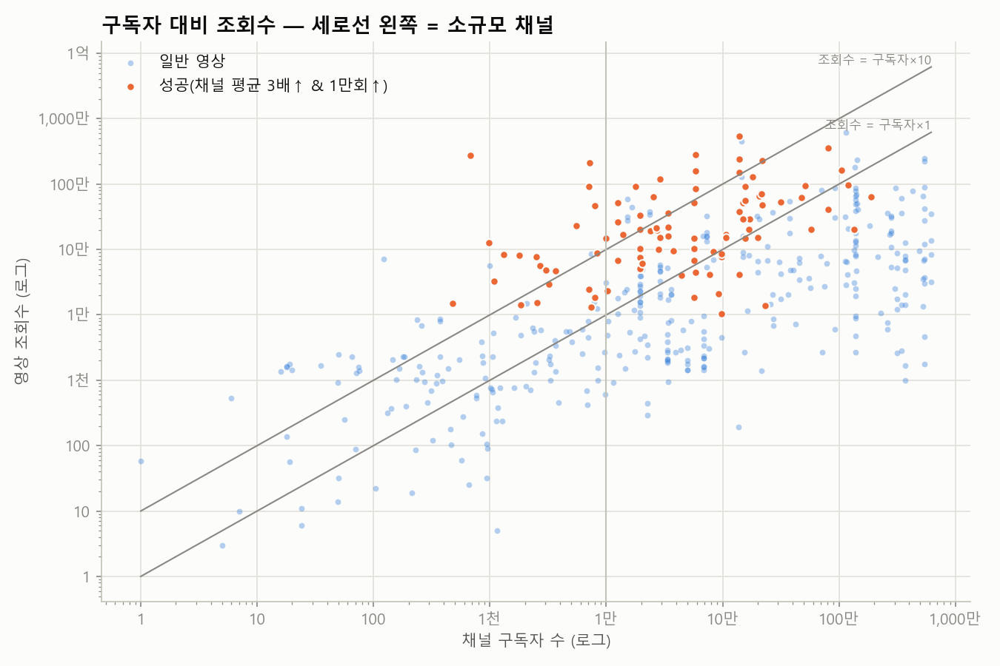

| 구독자 규모 | 영상 수 | 조회수(중앙) | 일평균(중앙) | 배수(중앙) | 성공 비율 | 소규모채널 성공 |
|---|---|---|---|---|---|---|
| 1천 미만 | 73 | 971 | 7 | 1.23 | 4.1% | 4.1% |
| 1천~1만 | 65 | 5.3천 | 32 | 4.41 | 29.2% | 29.2% |
| 1만~10만 | 131 | 2.3만 | 244 | 1.79 | 32.1% | 0.0% |
| 10만~100만 | 71 | 15.2만 | 908 | 3.46 | 38.0% | 0.0% |
| 100만+ | 91 | 9.5만 | 960 | 2.26 | 4.4% | 0.0% |

**개설 1년 이내 채널의 성공 영상** (0개) — 신생 채널이 실제로 터진 사례

_데이터 없음_

## 7. 🔥 최근 14일 이내 급상승 영상 (아직 성과 집계 전 — 트렌드 참고)

| 영상 | 채널 | 구독자 | 조회수 | 일평균 | 경과일 | 포맷 |
|---|---|---|---|---|---|---|
| [신종 투자리딩방 사기가 판을 치고 있습니다. 천하의 나쁜 놈들!](https://www.youtube.com/watch?v=vbDEHKhogXU) | 슈카월드 | 373만 | 102만 | 12.6만 | 8.1 | 롱폼 |
| [삼성전자 돈 축제 이젠 끝났다? 정말 솔직하게 말씀드립니다 ［이정윤 세무사］](https://www.youtube.com/watch?v=9O4uWelE14E) | 부읽남TV_내집마련부터건물주까지 | 184만 | 17.3만 | 2.7만 | 6.3 | 쇼츠 |
| [백수 남편 주식 계좌에 무려 5억?!💸 아내 몰래 돈 펑펑 쓰고 다닌 남편의 진짜…](https://www.youtube.com/watch?v=t03YNLj2do8) | 후루룩 | 10만 | 32.7만 | 2.6만 | 12.4 | 롱폼 |
| [연금계좌 안 하면 평생 후회하는 이유](https://www.youtube.com/watch?v=98Q_4_SzIAg) | 어른의금융수업 | 1.2만 | 18.4만 | 2.2만 | 8.3 | 쇼츠 |
| [개미들만 모르고 있어요, 삼성전자 하이닉스 이렇게 됩니다 ［이정윤 세무사］](https://www.youtube.com/watch?v=hUCljr2Pwhw) | 부읽남TV_내집마련부터건물주까지 | 184만 | 4.8만 | 1.5만 | 3.1 | 쇼츠 |
| [삼성전자, 하이닉스 2배 더 간다? "정말 솔직히 말씀드릴게요" ［이정윤 세무사］](https://www.youtube.com/watch?v=dpq9IdJYegA) | 부읽남TV_내집마련부터건물주까지 | 184만 | 7.7만 | 1.2만 | 6.2 | 쇼츠 |
| [SK하이닉스는 그래봐야 20배 100배 오른 주식은 따로 있습니다 ［이정윤 세무사…](https://www.youtube.com/watch?v=P_gKlakgV9M) | 부읽남TV_내집마련부터건물주까지 | 184만 | 6.6천 | 2.6천 | 2.5 | 쇼츠 |
| [지금 주식에 몰빵하지 마세요, 현금 쥐고 '이것을' 기다리세요 ［김경록 고문］](https://www.youtube.com/watch?v=Zr6AS7xjrcA) | 부읽남TV_내집마련부터건물주까지 | 184만 | 2.0만 | 2.5천 | 8.2 | 쇼츠 |
| [삼전닉스 내일도 급락할까? 돈버는 전략 180도 바뀔 겁니다 ［이정윤 세무사］](https://www.youtube.com/watch?v=qr2QEXu5GG8) | 부읽남TV_내집마련부터건물주까지 | 184만 | 1.5만 | 2.4천 | 6.3 | 쇼츠 |
| [지금 주식에 몰빵하지 마세요, 현금 쥐고 '이것을' 기다리세요 ［이정윤 세무사］](https://www.youtube.com/watch?v=jzMlcvKHrzc) | 부읽남TV_내집마련부터건물주까지 | 184만 | 7.3천 | 2.1천 | 3.4 | 쇼츠 |
| [수익률이 적어도 이미 오른 곳이 좋은 이유 ［망고쌤］](https://www.youtube.com/watch?v=cUxEI7DxBlQ) | 부읽남TV_내집마련부터건물주까지 | 184만 | 1.3만 | 1.8천 | 7.3 | 쇼츠 |
| [［우리기술］🔥삼성이 MMIS를 언급했다! 유튜브 최초 단독 입수한 일정! 이 흐름…](https://www.youtube.com/watch?v=1ybHKktiUrg) | 주식슈타인 | 4.3만 | 568 | 540 | 1.1 | 롱폼 |
| [1년동안 5백만원씩 주식 투자했더니..😱](https://www.youtube.com/watch?v=_iSKz5BlSAo) | 짠부부 | 8.0천 | 6.7천 | 497 | 13.4 | 쇼츠 |
| [주식투자 AI로 자동매매하면 어떻게 될까?](https://www.youtube.com/watch?v=lajY1g7os34) | 머니벌크업ㅣ주식PT | 1.6만 | 3.3천 | 300 | 11.0 | 쇼츠 |
| [주식 투자 실패하고 거북목 완치된 썰](https://www.youtube.com/watch?v=JJr-ulh5-nU) | 땅굴두더지 | 36 | 2.6천 | 236 | 11.2 | 쇼츠 |

## 8. 🏆 성공사례 — 대본 · 영상 · 썸네일

선정 기준: 종합점수(아웃라이어 40% + 조회수 35% + 구독자 대비 조회수 25%) 상위, 소규모 채널 ≥50%, 롱폼 ≥50%, 채널당 최대 1개. 각 폴더에 `transcript.txt`(대본), `transcript_timestamped.txt`, `video.mp4`, `thumbnail.jpg`, `metadata.json`, `comments.csv` 가 있습니다.

### 1. [공모주사기? 비상장주식 투자로 피해 당했다면 꼭 보세요! 유명인 사칭 사전청약 사기의 실체!](https://www.youtube.com/watch?v=s0HnYY8sK94)

- 채널 **검사출신변호사_법무법인 대환［TV］** (구독자 681) · 조회수 **274만** · 채널 평균의 **8,690.9배** · 쇼츠 00:35 · 업로드 2025-12-10 · 카테고리: 4. 사기·추천방 피해 · 검색어: `주식 전문가 사칭 피해 사례` · 선정: 소규모 채널 쿼터 (점수 99)
- 📁 [`success_cases/01_공모주사기_비상장주식_투자로_피해_당했다면_꼭_보세요_s0HnYY8sK94/`](success_cases/01_공모주사기_비상장주식_투자로_피해_당했다면_꼭_보세요_s0HnYY8sK94/) · 대본: youtube_transcript_api · 영상: original (0.9MB) · 말 속도 349.7자/분

  

- 🎣 **첫 5초 도입부**: "어떻게 내 돈이 다 사라졌어? 계좌가 막혔어."

### 2. [맞벌이 부부의 월급날루틴 “빠르게 1억 모으기“](https://www.youtube.com/watch?v=-vPbgWEJg_g)

- 채널 **재테콩** (구독자 7.2천) · 조회수 **210만** · 채널 평균의 **419.1배** · 쇼츠 00:30 · 업로드 2025-12-23 · 카테고리: 3. 가족 갈등 · 검색어: `부부 주식 투자 갈등` · 선정: 소규모 채널 쿼터 (점수 97)
- 📁 [`success_cases/02_맞벌이_부부의_월급날루틴_빠르게_1억_모으기_-vPbgWEJg_g/`](success_cases/02_맞벌이_부부의_월급날루틴_빠르게_1억_모으기_-vPbgWEJg_g/) · 대본: youtube_transcript_api · 영상: original (0.7MB) · 말 속도 364.0자/분

  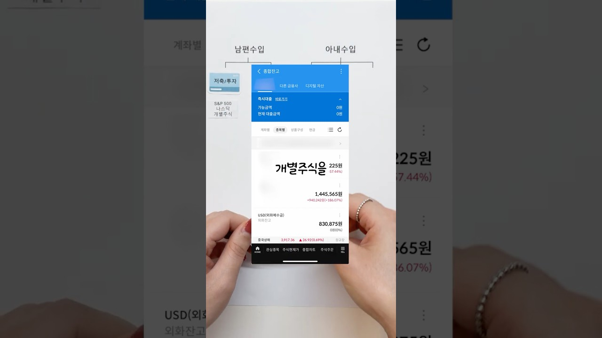

- 🎣 **첫 5초 도입부**: "맞벌리 부부 월급날 루틴 다섯 개 통장으로 나누어 관리해요. 첫째, 저축 투자. SP 500 나스닥 개별"

### 3. [주식으로 성공한 부자들의 어마어마한 핵심 노하우](https://www.youtube.com/watch?v=iacwbUHyqv4)

- 채널 **좋은미래만들기** (구독자 13.8만) · 조회수 **540만** · 채널 평균의 **172.0배** · 쇼츠 00:49 · 업로드 2025-10-29 · 카테고리: 1. 실제 투자 실패·손실 사연 · 검색어: `주식 장기투자 실패 사례` · 선정: 종합점수 상위 (점수 96)
- 📁 [`success_cases/03_주식으로_성공한_부자들의_어마어마한_핵심_노하우_iacwbUHyqv4/`](success_cases/03_주식으로_성공한_부자들의_어마어마한_핵심_노하우_iacwbUHyqv4/) · 대본: youtube_transcript_api · 영상: original (1.2MB) · 말 속도 416.3자/분

  

- 🎣 **첫 5초 도입부**: "어마어마한 성공을 거둔 사람들의 핵심적인 노화가 오늘 나온 거예요. 뭐냐면 예를 들어서 저희가 종목 많이"

### 4. [역대급 주식 폭락에 SK하이닉스 손실 고백한 연예인 TOP7](https://www.youtube.com/watch?v=UQU-1yRyzCg)

- 채널 **이슈방앗간** (구독자 7.1천) · 조회수 **93.0만** · 채널 평균의 **29.7배** · 쇼츠 01:19 · 업로드 2026-07-30 · 카테고리: 6. 큰 하락과 공포 · 검색어: `주식 폭락 전재산 손실` · 선정: 소규모 채널 쿼터 (점수 90)
- 📁 [`success_cases/04_역대급_주식_폭락에_SK하이닉스_손실_고백한_연예인_T_UQU-1yRyzCg/`](success_cases/04_역대급_주식_폭락에_SK하이닉스_손실_고백한_연예인_T_UQU-1yRyzCg/) · 대본: youtube_transcript_api · 영상: original (1.8MB) · 말 속도 403.3자/분

  

- 🎣 **첫 5초 도입부**: "역대급 주식 폭락에 SK 하이닉스 손실 고백한 연예인 탑 7 바로 알아봅시다. 7위는 셰프"

### 5. [노후 자금 10년 묻어두려던 ETF, 결국 단타치다 망하는 치명적인 이유](https://www.youtube.com/watch?v=Z_ul2wo7NHs)

- 채널 **부의 스케치** (구독자 5.6천) · 조회수 **23.3만** · 채널 평균의 **237.0배** · 롱폼 09:25 · 업로드 2026-03-06 · 카테고리: 2. 50·60대와 노후자금 · 검색어: `은퇴 후 주식 투자 실패` · 선정: 소규모 채널 쿼터 (점수 87)
- 📁 [`success_cases/05_노후_자금_10년_묻어두려던_ETF_결국_단타치다_망하_Z_ul2wo7NHs/`](success_cases/05_노후_자금_10년_묻어두려던_ETF_결국_단타치다_망하_Z_ul2wo7NHs/) · 대본: youtube_transcript_api · 영상: original (29.8MB) · 말 속도 359.2자/분

  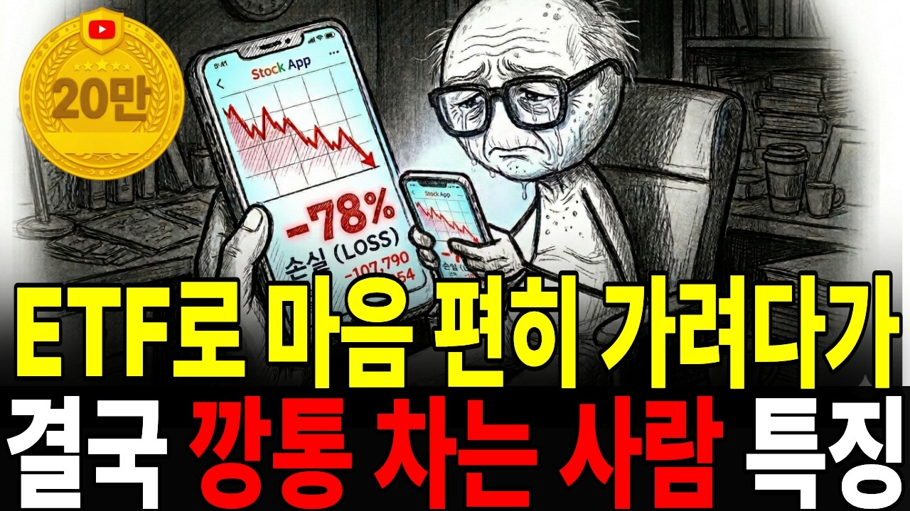

- 🎣 **첫 30초 도입부**: "투자의 세계에는 정말 기이하고도 슬픈 미스터리가 하나 있습니다. ［음악］ 이론적으로만 보면 S&P 500이나 나스닥 같은 지수 ETF로 돈을 잃는 건 거의 불가능에 가깝거든요. 워버핏조차 날고 기는 해지펀드 매니저들과의 내기에서이 단순한 지수 투자를 무기로 압승을 거뒀으니까요. 그런데 현실은 어떤 줄 아세요? 아이러니하게도 나는 안전하게 갈 거야라며 ETF를 매수한 분들의 계좌가 3년, 5년 뒤에 열어보면 엉망징창인 경우가 태반입니다. 통계를"

### 6. [어떤 투자는 '도박'이다? 주식 투자 때문에 인생이 무너진 사람들 \| 추적60분 KBS 방송](https://www.youtube.com/watch?v=7FrJ3wuJDaY)

- 채널 **KBS 추적60분** (구독자 80.3만) · 조회수 **355만** · 채널 평균의 **32.6배** · 롱폼 38:36 · 업로드 2026-08-02 · 카테고리: 1. 실제 투자 실패·손실 사연 · 검색어: `주식 투자 후회 사연` · 선정: 롱폼 쿼터 (점수 86)
- 📁 [`success_cases/06_어떤_투자는_도박_이다_주식_투자_때문에_인생이_무너진_7FrJ3wuJDaY/`](success_cases/06_어떤_투자는_도박_이다_주식_투자_때문에_인생이_무너진_7FrJ3wuJDaY/) · 대본: youtube_transcript_api · 영상: transcoded (47.2MB) · 말 속도 279.2자/분

  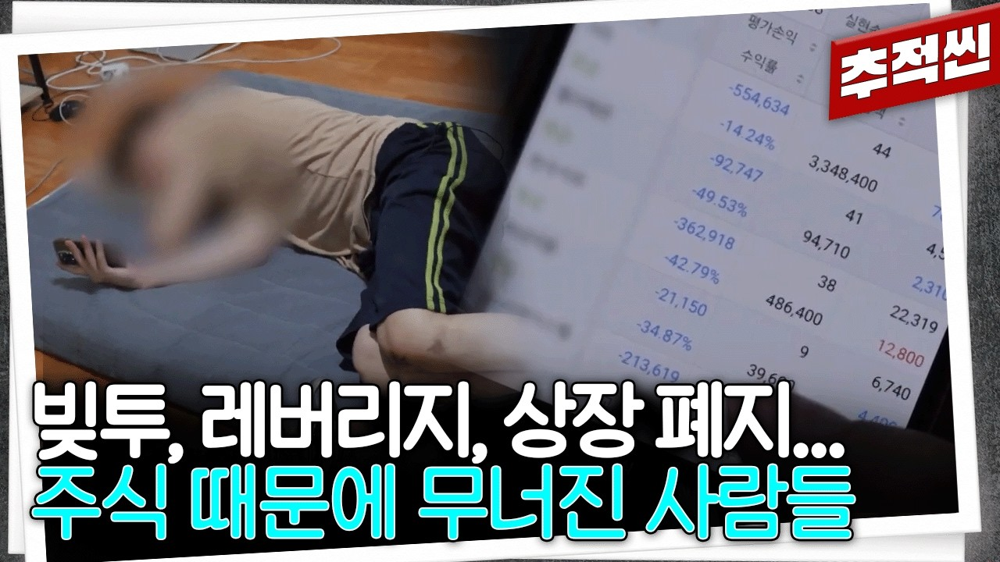

- 🎣 **첫 30초 도입부**: "31살의 취업 준비생 진우 씨. 하루 9시간 국비 지원 교육을 마치고 나면 곧장 배달일을 나섭니다. >> 이렇게 평일 저녁과 주말내 일하고 버는 돈은 한 달에 약 130만 원. 제가 전업이 아니기 때문에 단가가 높아지는 저녁마다 일을 해야 돼요. 그래서 두 치리를 해야 되는데 그렇게 매일매일 일하는게 육체적으로 조금 힘들긴 해요."

### 7. [주식 실패로 5억이 20만 원 되는 과정(1~5편 통합본)](https://www.youtube.com/watch?v=8_YxWzVTbro)

- 채널 **무한배터리** (구독자 5.7만) · 조회수 **52.1만** · 채널 평균의 **89.0배** · 롱폼 1:12:32 · 업로드 2026-08-08 · 카테고리: 5. 특정 투자 방식 실패 · 검색어: `테마주 투자 실패 사례` · 선정: 롱폼 쿼터 (점수 86)
- 📁 [`success_cases/07_주식_실패로_5억이_20만_원_되는_과정_1_5편_통합_8_YxWzVTbro/`](success_cases/07_주식_실패로_5억이_20만_원_되는_과정_1_5편_통합_8_YxWzVTbro/) · 대본: youtube_transcript_api · 영상: too_large (114.3MB) · 말 속도 320.0자/분

  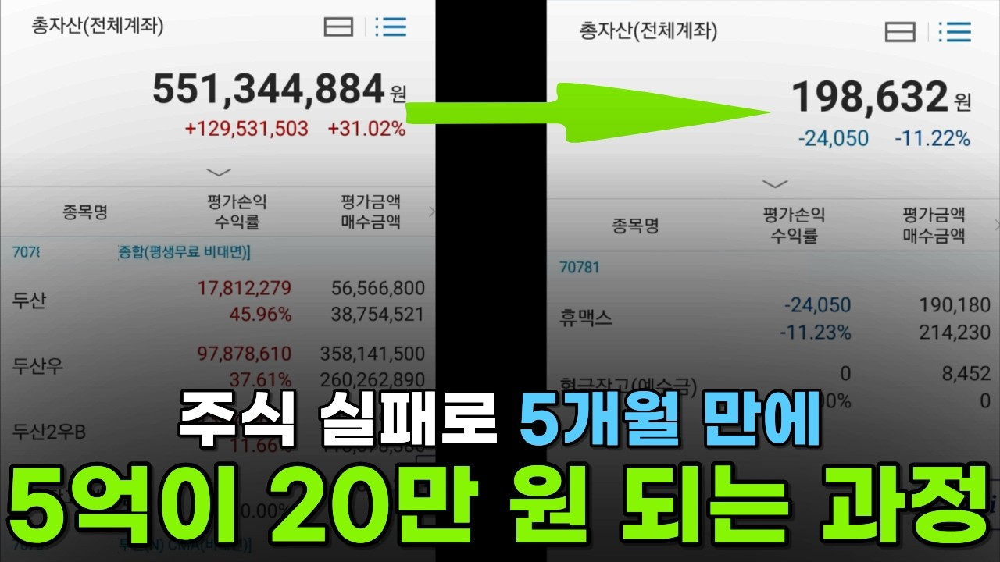

- 🎣 **첫 30초 도입부**: "［음악］ 안녕하세요. 무한 배터리입니다. 오늘은 평범한 39세 회사원이 주식"

### 8. [노후 자금 주식에 올인했다간 큰일 납니다, 은퇴자가 무조건 사서 묻어둬야 할 ETF 종목 \| 존리 \| ETF아는형](https://www.youtube.com/watch?v=e3EY2JJMgDw)

- 채널 **ETF 아는 형** (구독자 15.7만) · 조회수 **92.3만** · 채널 평균의 **46.9배** · 롱폼 19:14 · 업로드 2026-09-11 · 카테고리: 7. 교훈과 예방 · 검색어: `은퇴 후 주식 투자 주의사항` · 선정: 롱폼 쿼터 (점수 85)
- 📁 [`success_cases/08_노후_자금_주식에_올인했다간_큰일_납니다_은퇴자가_무조_e3EY2JJMgDw/`](success_cases/08_노후_자금_주식에_올인했다간_큰일_납니다_은퇴자가_무조_e3EY2JJMgDw/) · 대본: youtube_transcript_api · 영상: transcoded (45.7MB) · 말 속도 334.7자/분

  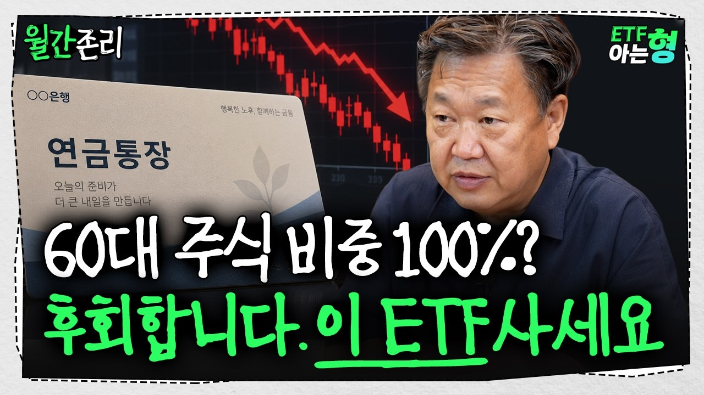

- 🎣 **첫 30초 도입부**: "많은 분들이 저한테 질문합니다. 한 번도 투자 안 해 봤는데 주세요. 아 내가 수 없이 얘기를 해도 똑같은 질문을 해요. 내가 만 원 주고 샀어요. 근데 12,000이 될 때도 있죠. 또 13,000원이 될 때도 있죠. 근데 만약에 10명에 보니까 많이 5만이 되면 어떻게 돼? 의미 없죠. 너무 장난치는 거 같잖아요. 그도가 뭐 하려? 적어도 내가 할 수 있는 가장 많이 많은 돈을 해야 남들이 보면 독할 정도로 해야돼. 근데 너무나 많은 분들이 그 ［음악］"

## 9. 💬 시청자 질문 (성공 영상 댓글에서 추출) — 다음 영상 주제 후보

질문 댓글에 많이 나오는 단어: `주식`(71), `투자`(57), `ETF`(32), `사람`(28), `생각`(27), `수익`(24), `계좌`(23), `정도`(18), `종목`(17), `배당`(15), `가능`(15), `손실`(14), `얘기`(13), `레버리지`(13), `미국`(13), `ISA`(12), `감사`(12), `매수`(12), `친구`(11), `상승`(11)

| 질문 댓글 | 좋아요 | 영상 |
|---|---|---|
| 3년동안 재탕 했으면 그만 할떄도 됐잖아?ㅋㅋㅋㅋㅋ | 2,917 | [어떤 투자는 '도박'이다? 주식 투자 때문에 …](https://www.youtube.com/watch?v=7FrJ3wuJDaY) |
| 용돈이 십만원…? ㅋㅋㅋㅋㅋ | 1,283 | [맞벌이 부부의 월급날루틴 “빠르게 1억 모으기…](https://www.youtube.com/watch?v=-vPbgWEJg_g) |
| 이게 뭐냐고요.. 주식시장 도박판 만들고 코스닥 나락가고. 언제 좋아질까 한숨만 나옴. | 746 | [개인 투자자의 무덤이 된 코스닥…수백만 투자자…](https://www.youtube.com/watch?v=-yOHXbtp0HA) |
| 아니 이렇게 좋은 친구가 있는데 왜 조언을 안들어? 와 그 조언 너무 듣고싶다 | 424 | [다들 진짜 안 합니다. 그냥 하는 사람이 성공…](https://www.youtube.com/watch?v=8d8lurBu7bU) |
| 출시 한 달 만에 투기판 논란으로 상장 폐지 요구가 빗발치는 레버리지 ETF! 여러분의 생각은? 🤔 | 360 | [국내 주식시장이 카지노 투기판으로 변해버린 이…](https://www.youtube.com/watch?v=AF4ZZmgkT1Y) |
| 해당 장면은 지난 21일 서울 여의도 국회의원회관에서 열린 '우리 주식시장, 이대로 괜찮은가? 롤러코스터 삼전닉스 레버리지 ETF'를 주제로 열린 정책토론회 자리에서 촬영된 영상입니다. 구독과 좋아요는 영상 제작에 큰 힘이 됩니다. 감사합니다. | 300 | [개인 투자자의 무덤이 된 코스닥…수백만 투자자…](https://www.youtube.com/watch?v=-yOHXbtp0HA) |
| 10만원을 터치하지않...?음? 그걸 터치하는건 양아치 아니오? | 296 | [맞벌이 부부의 월급날루틴 “빠르게 1억 모으기…](https://www.youtube.com/watch?v=-vPbgWEJg_g) |
| 누가 대출 받아서 주식하라고 누칼협? | 228 | [어떤 투자는 '도박'이다? 주식 투자 때문에 …](https://www.youtube.com/watch?v=7FrJ3wuJDaY) |
| 주식 사게 되면, 꼭 매일 자신이 갖고 있는 주식의 섹터흐름, 일봉, 분봉, 거래량을 체크해가며 대응해야 함... 대부분 주식 사면 그냥 주가만 확인 것만 하고. 애측만 한다. 얼마에 팔아야지.. 오르겠지??? 그러면 망함, 주식은 수익을 많이 얻기위 | 135 | [주식 초보 투자자는 꼭 알아야 할 ‘손절의 법…](https://www.youtube.com/watch?v=8m9Y3qJgcXo) |
| 이거 딱 내얘기네 나도 황현희 같은 아는 형이 한명있음 한 5년 전 코로나 시국에 그형이 딱 그맘때 월급쟁이하면서도 재산을 몇배로 불리던 시기였음 그형은 주식하는법, 자산 굴리는법 자기가 어떻게 투자하는지 등등 상세하게 다 알려줬음 나는 아 그렇구나~ | 135 | [다들 진짜 안 합니다. 그냥 하는 사람이 성공…](https://www.youtube.com/watch?v=8d8lurBu7bU) |
| 그걸 모르는 사람이 있냐? 지나고나서 보니까 그렇구나 하는거지 오른다고 보장해주면 떨어지는애 떨쳐내지 떨쳐내면 걔가 오르고 버티면 떨어지니까 문제인거지 | 103 | [주식으로 성공한 부자들의 어마어마한 핵심 노하…](https://www.youtube.com/watch?v=iacwbUHyqv4) |
| 💸맞벌이 부부의 월급날 루틴 📍저희는 아내 수입을 생활비로 사용하고, 남편 수입으로는 저축+투자, 고정비를 지출해요. 📍지출은 ‘5가지 통장’ 으로 나누어 생활하고 있는데요. 1️⃣ 저축/투자 저축과 투자를 위한 증권사 통장에 넣고 주식을 매수해요 2 | 94 | [맞벌이 부부의 월급날루틴 “빠르게 1억 모으기…](https://www.youtube.com/watch?v=-vPbgWEJg_g) |
| 누가 내 얘기를 저작권없이 만들라고 했어?ㅠㅠ | 93 | [주식투자 실패한 사람들의 공통적인 특징](https://www.youtube.com/watch?v=sEzSDUgvY28) |
| 매우 쉬운 설명 1️⃣ 통장 쪼개기가 노후준비의 첫 단계입니다 💡 쉽게 말해서, 우리가 물건을 사고 있는 집 옷장처럼 돈도 목적별로 나누어서 저축해야 한다는 뜻입니다. "급한 돈"과 "먼 미래의 돈"을 구분하면, 필요할 때 편하게 꺼낼 수 있고, 동시 | 62 | [50~60대 노후준비, 안늦었어요.](https://www.youtube.com/watch?v=3cJJQawElVo) |
| 참 대단하다..... 어떻게 시총이 작은 주식을 살 생각을 했을까....대단하다..... | 55 | [주식 실패로 5억이 20만 원 되는 과정(1~…](https://www.youtube.com/watch?v=8_YxWzVTbro) |
| 금융교육도 필요하지만 더 시급한 것은 도덕 인성교육이 아닐까요? | 53 | [어떤 투자는 '도박'이다? 주식 투자 때문에 …](https://www.youtube.com/watch?v=7FrJ3wuJDaY) |
| 왜 투자하면 다들 이득일거라고만생각하지.... 잃을건생각안하는것도 지능이다 | 52 | [어떤 투자는 '도박'이다? 주식 투자 때문에 …](https://www.youtube.com/watch?v=7FrJ3wuJDaY) |
| 첫방부터 대출받아서 주식투자? 하이고야............... | 51 | [어떤 투자는 '도박'이다? 주식 투자 때문에 …](https://www.youtube.com/watch?v=7FrJ3wuJDaY) |
| 저도 처음 주식 시작했을때가 코로나시국 전인데.. 전재산 분산투자 했다가 심리적으로 안정이 되지 않더군요.. 그래서 아! 내 그릇을 빨리 판단하게 되었고 지금까지 총 자산에 30% 미만으로만 투자를 이어가고 있습니다. 주변에서 왜 추세를 따라가지 않냐 | 46 | [주식 실패로 5억이 20만 원 되는 과정(1~…](https://www.youtube.com/watch?v=8_YxWzVTbro) |
| 명언이네요 그게 어데 마음 같이되나요 단 여유자금으로 4~5년 버틸 각오가있어야 될거입니다 삼전7층에서5년 이젠 숨 | 46 | ["3억이 0원 됐다" 주식으로 망하는 사람들의…](https://www.youtube.com/watch?v=5MHq-kzFDu8) |

## 10. 🔖 태그 분석 (성공 영상에서 과대표집된 태그)

| 태그 | 영상 수 | 성공 수 | 과대표집 | 배수(중앙) |
|---|---|---|---|---|
| 자산관리 | 12 | 8 | 3.02 | 8.77 |
| etf투자 | 17 | 11 | 2.94 | 10.71 |
| 국민연금 | 8 | 5 | 2.84 | 15.63 |
| 퇴직연금 | 10 | 6 | 2.72 | 15.63 |
| 은퇴준비 | 12 | 7 | 2.65 | 4.14 |
| 은퇴자금 | 11 | 6 | 2.47 | 4.14 |
| s&p500 | 12 | 6 | 2.27 | 7.04 |
| 장기투자 | 13 | 6 | 2.09 | 10.71 |
| 돈버는법 | 9 | 4 | 2.02 | 21.40 |
| 투자실패 | 14 | 6 | 1.94 | 1.90 |
| 노후준비 | 31 | 13 | 1.90 | 3.47 |
| 노후자금 | 15 | 6 | 1.81 | 1.79 |
| 해외주식 | 8 | 3 | 1.70 | 4.70 |
| 경제공부 | 12 | 4 | 1.51 | 10.86 |
| 국내주식 | 12 | 4 | 1.51 | 1.53 |
| mtn | 9 | 3 | 1.51 | 1.85 |
| 주식투자실패 | 9 | 3 | 1.51 | 1.02 |
| #주식공부 | 19 | 6 | 1.43 | 1.77 |
| #주식초보 | 19 | 6 | 1.43 | 1.77 |
| 재테크 | 43 | 13 | 1.37 | 2.29 |

**아웃라이어 배수와의 순위상관(스피어만)** — 절댓값 0.1 미만은 사실상 무관

| 지표 | 상관계수 |
|---|---|
| like_rate | -0.103 |
| comment_rate | 0.041 |
| title_len | 0.001 |
| duration_sec | 0.028 |
| subscribers | 0.151 |
| channel_age_days | -0.079 |
| uploads_per_week | -0.034 |

## 11. ✅ 0명 채널 실행 체크리스트

1. **검색형 키워드로 시작**: 위 기회점수 상위 키워드는 '검색 → 유입'이 가능한 주제입니다. 구독자가 없을 때는 추천 피드보다 검색 유입이 먼저 열립니다.
2. **제목 = 검색어 + 검증된 제목 요소**: 키워드를 제목 앞쪽에 넣고, 3장의 효과 요소를 1~2개만 조합하세요 (과장은 시청 지속률을 떨어뜨립니다).
3. **첫 30초(쇼츠는 첫 3~5초)**: 8장 성공사례의 '도입부'를 비교해 공통 구조(질문 제기 → 결론 예고 → 근거)를 따라 해보세요.
4. **롱폼 1개 → 쇼츠 2~3개 재가공**: 같은 주제를 두 포맷으로 내보내 제작 효율과 노출 채널을 동시에 늘립니다.
5. **업로드 빈도**: 성공한 소규모 채널의 업로드 빈도 중앙값은 주 2.7회입니다. 꾸준함이 우선입니다 (최소 주 1~2회 롱폼 + 쇼츠).
6. **댓글 질문을 다음 영상으로**: 9장의 질문이 바로 수요가 검증된 다음 주제입니다.
7. **주식/금융 주제 주의**: 특정 종목 매수·매도 권유, 수익 보장 표현은 피하고 '투자 권유 아님' 고지를 넣으세요. 유료 리딩방·1:1 종목 추천처럼 대가를 받고 투자 판단을 조언하면 자본시장법상 유사투자자문업 신고 대상이 될 수 있습니다 (사업화 전 확인 필요).
8. **2~4주마다 재분석**: 트렌드는 빠르게 바뀝니다. 이 노트북을 다시 실행해 키워드 순위 변화를 확인하세요.

## 12. 📐 방법론 · 한계 · 재현 정보

- **아웃라이어 배수** = 영상 조회수 ÷ 같은 채널 최근 업로드 50개(업로드 14일 이상 경과, 같은 포맷 우선, 해당 영상 제외)의 조회수 중앙값. 구독자 수와 무관하게 '주제·제목·썸네일의 힘'을 보는 지표입니다.
- **분석 분할**: 성과 분석은 업로드 후 14일 이상 ~ 365일 이내 영상만 사용 (2025-10-11 ~ 2026-09-21). 그보다 최근 영상은 7장(급상승)에서만 참고.
- **미래 정보 누수 방지**: 모든 지표는 수집 시점에 관측 가능한 값만 사용하며, 기준선에서 대상 영상 자신을 제외했습니다.
- **주제 관련성 필터**: 제목·태그에 관련어(주식, 주가, 증시, 증권, 코스피, 코스닥, 나스닥, 테마주 등)가 있거나 설명란에 2번 이상 나와야 분석·성공사례에 포함 ('주식회사, (주), ㈜' 같은 표현은 먼저 제거). 이번 실행 제외 177개.
- **한계**: ① search.list 결과는 YouTube가 고른 표본이며 개인화되지 않은 결과입니다. ② 오래된 영상일수록 조회수가 누적되어 배수가 커질 수 있습니다 (채널 최근 업로드가 짧은 기간에 몰린 경우). ③ 썸네일·시청 지속률·CTR 등 핵심 내부 지표는 API로 볼 수 없습니다. ④ 제목 요소 효과는 상관관계이며 주제·채널 특성과 섞여 있습니다. ⑤ 쇼츠 판별은 길이 + youtube.com/shorts 응답으로 추정합니다.
- **재현성**: 랜덤 시드 42, 캐시 TTL 24시간, API 호출 {'search': 74, 'videos': 600, 'channels': 13, 'playlistItems': 491, 'commentThreads': 29}, 캐시 적중 {'playlistItems': 131, 'commentThreads': 1}
- **저작권**: 성공사례 대본·영상은 개인 학습·분석용입니다. 재업로드·재배포하지 마세요. 공개 저장소에는 영상 파일을 올리지 않는 것이 기본값입니다.

**이번 실행의 경고/주의 사항**

- ［COLLECT］ 오늘 쿼터 예산을 넘는 키워드는 다음 실행으로 이월 (내일 다시 실행하면 이미 받은 검색은 쿼터 0으로 재사용) deferred=16 examples=［주식으로 이혼한 실제 사례(3. 가족 갈등),미등록 투자자문 피해 사례(4. 사기·추천방 피해),관리종목 투자 실패(5. 특정 투자 방식 실패),상장폐지 전재산 손실(6. 큰 하락과 공포),퇴직금 투자하면 안 되는 이유(7. 교훈과 예방)］ hint="같은 설정으로 내일 다시 실행하세요 — 검색 결과는 SEARCH_CACHE_TTL_HOURS 동안 보관됩니다"

## 13. 📁 파일 목록

- `README.md` (이 리포트) · `analysis.xlsx` (모든 표) · `data/*.csv` · `charts/*.png` · `success_cases/` · `run_info.json` · `run_log.txt`
