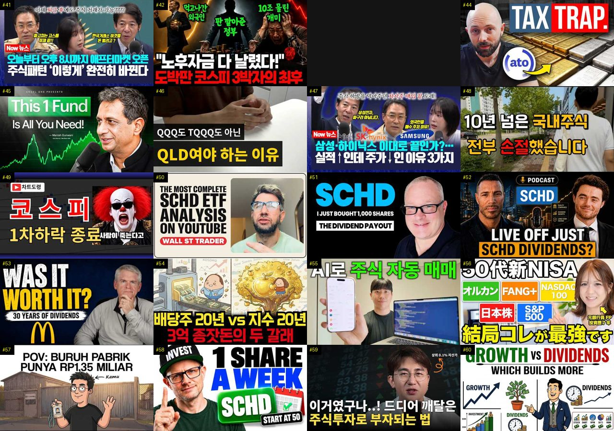
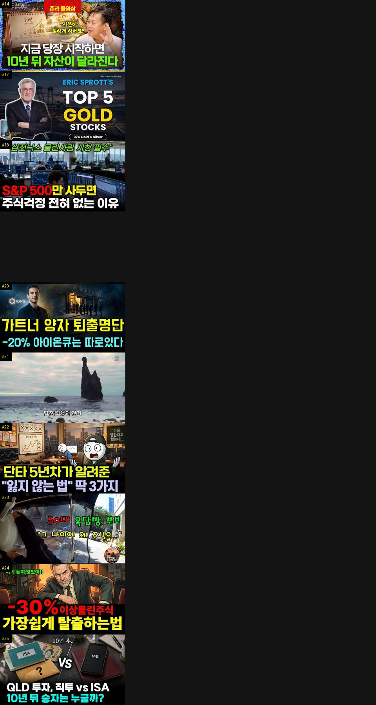
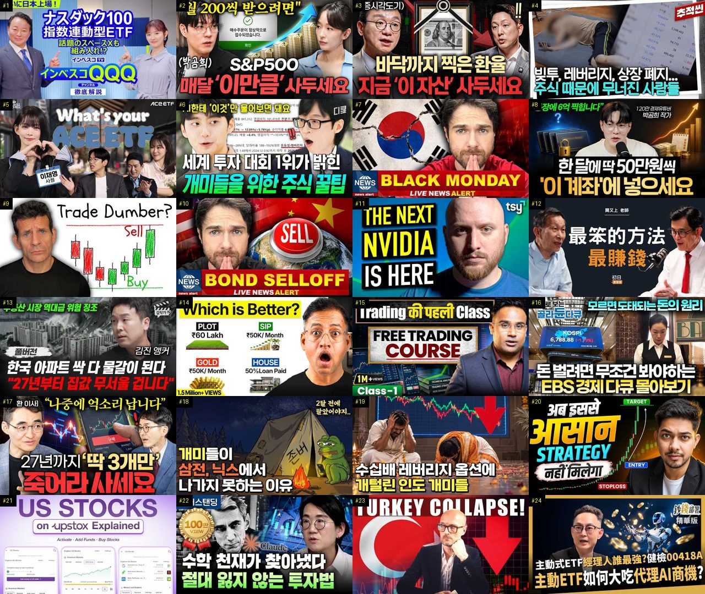

# 주식 — 성공 사례 분석 (지시사항 재료)

자동 생성 — `tools/success_analysis.py` v1.6.1 (2026-11-28 09:49 UTC), 규칙 `stock/analysis_rules.toml` v1.6. **이 문서는 숫자와 원문만 담는다 — 해석·지시사항은 이것을 읽는 AI 가 만든다.** 주별 추세는 `weekly.md`, 승인한 영상 전부는 `approved.md`. ※ 연구·교육용 — 투자 권유가 아님.

## 0. 자료와 한계

| 자료 | 수 |
|---|---|
| 사례 폴더 (설명·자막·댓글·썸네일을 받은 영상) | 753 (웹 승인 753) |
| **성공 사례** — 7~180일·구독자 50,000 이하·**구독자당 하루 조회수 ≥ 0.1** (하루 조회수 ÷ 구독자)·조회수 구독자 0~999 → 10,000회 · 구독자 1,000~9,999 → 50,000회 · 구독자 10,000+ → 100,000회·4분 이상, 채널당 2개 | **51** (기준 통과 98 − 뺀 것 39 − 채널당 제한 8) |
| **하루 조회수 상위** (1-3번 — 성공 사례와 따로) — 검색에서 찾은 주제 관련 4분 이상 영상 3,395개 중 하루 조회수 상위 10% (하루 15,043회 이상), 구독자·올린 날짜 상관없이, 채널당 2개 | **139** (기준 통과 364 − 뺀 것 182 − 채널당 제한 43) · 자료를 받지 않은 후보 166 |
| **조회수 상위** (1-4번 — 올린 날짜·구독자 상관없이) — 검색(기간 없는 검색 포함)에서 찾은 주제 관련 4분 이상 영상 4,578개(가장 오래된 4441일) 중 조회수 상위 10% (557,814회 이상), 채널당 2개 | **68** (기준 통과 152 − 뺀 것 76 − 채널당 제한 8) · 자료를 받지 않은 후보 385 |
| 성공 사례의 글 출처 (자막·음성인식·설명·없음) | 음성인식(앞 5분) 30 · 설명 19 · 없음 1 · 자막 1 |
| 성공 사례 대본 — 전체 · 앞부분만(음성인식 1차) · 없음 | 1 · 30 · 20 |
| 같은 채널 기준선 (채널 평소 영상) | 성공 사례 49/51 · 채널 145곳 (잘된 영상 335 · 평소 영상 413) |
| 성공 사례 댓글 (받은 / 달린) | 13,390 / 13,945 |
| 성공 사례 썸네일 | 47 |
| 비교 집단 — 탐색에서 본 영상 중 구독자 50,000 이하·4분 이상·365일 안·주제 관련, 채널당 최근 5개 | 1216 (성공 63 = 5.2%, 채널당 제한으로 뺀 2634) |
| 자료를 받지 않은 성공 후보 (웹 화면에서 승인하면 들어감 — 채널당 자리가 남은 것만) | 58 (자리가 찬 채널의 62개 뺌) |
| 수요·공급 시장 — 최근 90일 영상 (채널 크기 상관없음) | 2176 · 검색어 131 · 자동완성 말 604 (공급 확인 0) |
| 채널 성장 자료 (개설일이 있는 채널) | 1162 (빨리 크는 작은 채널 25) |

성공 기준은 넘었지만 뺀 영상: 사형수 박정희, 그를 살린 28세 정보국장 백선엽의 … (뺀 주제(숙군)) · 最先端のイノベーションを先取る⁉ インベスコTV 「インベ… (외국 영상) · Dividend Stocks vs. Growth St… (외국 영상) · 배당금 vs 월세 ∣ 3백만 원 월소득, 어느 쪽이 … (뺀 주제(월세)) · I Let AI Invest for Me on Tra… (외국 영상) · S&P500とNASDAQ100は崩れない。プロ投資家か… (외국 영상) · 코스피 다 맞춘 무당이 알려드립니다 ! 달러 환율 &… (뺀 주제(코인)) · 미국 110년 인플레이션 9번, 무엇이 끝냈나 (주제 밖(관련어 없음)) · Egyptian Guidelines المستثمر … (외국 영상) · 아마존 영화 43개국 1위🔥 CIA 국장의 죽음으로 … (뺀 주제(첩보)) · 【資産公開】S&P500に1000万入れて5年間放置した結… (외국 영상) · I've Invested in Dividends fo… (외국 영상)

**한계**

- 대본(자막·음성인식)이 없는 성공 사례 20개 (#6, #7, #8, #13, #15, #22, #34, #35, #37, #39, #41, #42, #43, #44, #45, #47, #48, #49, #50, #51) — 설명란·챕터만 있음. 도입부·구성·말 속도는 대본이 있는 31개로만 셌다 (음성인식이 끝나면 다시 셈)
- 비교 집단 1216개 = 검색(조회수 순 — 잘된 영상 쪽으로 치우침)·추가한 채널·성공 사례 채널의 평소 영상 377개 (치우침 없음) 에서 올린 지 7~365일 영상, 성공 비율 5% — 실제 시장 비율이 아니다. 같은 집단 안의 '있음/없음' 차이로만 보고, '무엇이 먹혔나'는 1-2번(같은 채널 안)을 먼저 보라
- 하루 조회수 상위 묶음(1-3번) 139개는 구독자·올린 날짜 상관없이 골랐다 — 큰 채널(구독자 50,000 넘음) 130개라 채널 힘(구독자·추천)이 섞여 있다. 작은 채널이 따라 할 근거는 1번 성공 사례로 보라. 하루 조회수 = 조회수 ÷ 올린 지 날수라 갓 올린 영상(며칠)은 부풀고 오래된 영상은 낮아진다. 경계는 검색 결과(조회수 순 — 잘된 쪽으로 치우침) 3395개 안의 상위 10%. 자료를 받지 않은 후보 166개 (웹 화면에서 승인하면 들어감)
- 조회수 상위 묶음(1-4번) 68개는 올린 날짜·구독자 상관없이 조회수만으로 골랐다 — 오래 쌓인 조회수·큰 채널 힘이 섞여 있다 (큰 채널 60개 · 1년 넘은 영상 0개). 모집단 4,578개에서 가장 오래된 영상 4441일 — 기간 없는 검색은 할당량이 남을 때만 하므로 다 못 했으면 과거 영상이 적다. 자료를 받지 않은 후보 385개
- 성공 사례 몫(가중) = 성공 사례마다 무게 1 + log2(구독자당 하루 조회수 ÷ 기준)로 센 몫 (사용자 지시 2026-10-28 '최근에 조회수가 높을수록 더 많이 반영' — 점수가 기준의 2배면 무게 2, 4배면 3). 이번 무게 중앙값 3.512 · 가장 큰 7.777 — 사례 수가 적은 묶음은 가중 없는 몫·사례 수와 같이 본다
- 같은 채널 기준선이 있는 성공 사례 49/51개 (채널 영상이 5개 미만이거나 아직 못 받음)
- 수요·공급의 '시장'은 탐색·검색에서 본 최근 90일 영상 2176개 — 검색이 조회수 순이라 조회수 적은 영상이 덜 잡힌다. 주제 묶음 사이의 상대 비교(지수)로만 보라
- 자동완성 말의 '최근 영상 수'는 우리가 본 영상만 셌다 — 실제 공급은 웹 화면 [공급 확인](말 하나에 검색 1번 = 100단위)으로 확인
- 자동완성 말에는 책·방송·사람·채널 이름도 섞인다 (예: '…를 찾아서'·'…지침서') — 영상 주제가 아닌 말은 건너뛰고 읽어라
- '구독자가 많이 모이는가'는 YouTube API 로 영상별 구독 증가를 볼 수 없다 — 대신 채널 성장(7번: 개설 뒤 월 구독자·받을 때마다 남긴 기록), '구독·다음 기대' 댓글, 배수(조회수÷구독자)로 본다
- 댓글 갈래·제목 특징은 낱말 규칙이라 거칠다 (물음표 반문도 '질문', 한 댓글이 여러 갈래). 원문 인용을 함께 보라
- '눈에 띔'은 차이가 크고 표본이 충분하다는 표시일 뿐 원인이 아니다

## 1. 성공 사례 (51개 — 구독자당 하루 조회수 큰 순)

**구독자당 하루 조회수** = 하루 조회수(받은 때 조회수 ÷ 올린 날부터 받은 때까지 날수) ÷ 구독자 — 성공 기준. 배수 = 조회수 ÷ 구독자. **채널 평소 대비** = 조회수 ÷ 그 채널 최근 롱폼 조회수 중앙값 (같은 채널 기준선 — 클수록 그 영상만의 힘). 썸네일은 5번(장마다 20개, 번호 = #), 사례별 자세히는 **`analysis_cases_01.md` …** (9번).

| # | 제목 | 채널 | 구독자 | 조회수 | 구독자당 하루 조회수 | 배수 | 채널 평소 대비 | 하루 조회수 | 길이 | 업로드 | 주제 묶음 | 형식 | 글 출처 | 댓글 받은/달린 |
|---|---|---|---|---|---|---|---|---|---|---|---|---|---|---|
| 1 | [왜 내가 사면 떨어지고 팔면 오를까? 개미가 주식으로 돈 못 버는 4가지 이유](https://www.youtube.com/watch?v=fdlfOCtDBqc) | 오피디의 머니노트 | 2,090 | 779,870 | 10.9658 | 373.1 | ×587.0 | 22,918.6 | 13.6분 | 2026-10-15 | 8. 투자 심리·실패 | 오디오북·낭독 | 음성인식(앞 5분) | 244/328 |
| 2 | [S&P500, 나스닥100 수익률 차이는 갈 수록 더 벌어질겁니다 미국 장기투자 가이드](https://www.youtube.com/watch?v=1L9sM63F6Ng) | 돈사냥꾼-TV | 993 | 19,018 | 6.9554 | 19.1 | ×6.9 | 6,906.7 | 22.4분 | 2026-10-18 | 2. 장기투자·ETF·지수 | 정보·해설 | 음성인식(앞 5분) | 5/5 |
| 3 | [적자인데 300억? 가능한 이유 ∣ 회계사가 말아주는 리센느 소속사 더뮤즈엔터](https://www.youtube.com/watch?v=kJx_AzV9w9c) | 전지적회계사시점 | 867 | 318,562 | 4.8738 | 367.4 | ×174.4 | 4,225.6 | 21.4분 | 2026-09-03 | 6. 종목 고르기·분석 | 브이로그·직접 해본 이야기 | 음성인식(앞 5분) | 219/219 |
| 4 | [이재명 "집 팔아 주식 사라더니…" 코스피 폭락에 국민연금 증발 실태 #이재명 #코스피 #국민연금](https://www.youtube.com/watch?v=c3vq8lj05Yk) | 정치시간 | 37 | 15,587 | 4.807 | 155.9 | ×5.2 | 480.7 | 18.9분 | 2026-10-16 | 5. 국내주식 | 정보·해설 | 음성인식(앞 5분) | 28/44 |
| 5 | [삼성전자 지금 팔아야 하나? 코스피 서킷브레이커 날, 버틸지 팔지 가를 기준 2가지](https://www.youtube.com/watch?v=ICByZXkRrLg) | 경제야! 놀자~ | 3,510 | 101,848 | 4.7754 | 29.0 | ×37.4 | 16,761.8 | 13.5분 | 2026-10-15 | 5. 국내주식 | 정보·해설 | 음성인식(앞 5분) | 296/296 |
| 6 | [이번 하락은 어디에 가까울까 ∣ 공포탐욕지수 39번으로 본 금리와 물가](https://www.youtube.com/watch?v=QG40SUfIML8) | 차트 너머 | 5,100 | 338,667 | 4.741 | 66.4 | – | 24,179.2 | 11.1분 | 2026-11-04 | 2. 장기투자·ETF·지수 | 정보·해설 | 설명 | 209/209 |
| 7 | [S&P500 적립식, 다들 거꾸로 하고 있습니다… 5천만원 갈리는 진짜 이유](https://www.youtube.com/watch?v=h5Cu52-q0oE) | 뒤집는경제 | 1,450 | 235,115 | 4.1566 | 162.2 | ×46.4 | 6,027.0 | 24.9분 | 2026-10-10 | 2. 장기투자·ETF·지수 | 정보·해설 | 설명 | 70/70 |
| 8 | [슈퍼개미 이정윤의 HTS 세팅법 ∣ 이세무사](https://www.youtube.com/watch?v=rqdf0xO4PDo) | 이정윤의 다정한주식 | 4,980 | 87,170 | 4.0811 | 17.5 | – | 20,324.0 | 19.1분 | 2026-11-14 | 8. 투자 심리·실패 | 정보·해설 | 설명 | 198/198 |
| 9 | [[문남중 출연] "코스피 폭락, 자사주 매입 종료 때문..수급공백 끝! 외국인, 삼전닉스로 돌아옵니다" #…](https://www.youtube.com/watch?v=vzGrlaAl0e4) | 경제통마늘 | 16,800 | 124,444 | 3.3696 | 7.4 | ×23.1 | 56,609.4 | 14.2분 | 2026-10-19 | 5. 국내주식 | 오디오북·낭독 | 음성인식(앞 5분) | 192/192 |
| 10 | [[풀영상] 월급 10%로 당장 시작하는 존리의 자산 증식 치트키](https://www.youtube.com/watch?v=q1fYjAwma3s) | 여의돈스트리트 | 1,420 | 233,742 | 2.68 | 164.6 | ×197.1 | 3,805.6 | 36분 | 2026-09-17 | 1. 주식 기초·초보 | 인터뷰·강연·대담 | 음성인식(앞 5분) | 113/121 |
| 11 | [유혈 낭자한 국장..폭락의 시작일까? / 이슈빡 / 뉴스헌터스](https://www.youtube.com/watch?v=enkSdCIojAA) | 뉴스헌터스 | 7,680 | 116,383 | 2.6197 | 15.2 | ×3.1 | 20,119.3 | 17.9분 | 2026-10-15 | 1. 주식 기초·초보 | 인터뷰·강연·대담 | 음성인식(앞 5분) | 303/303 |
| 12 | [S&P500은 최고인데 내 ETF는 마이너스… 지금 환헤지로 갈아타면 늦는 진짜 이유](https://www.youtube.com/watch?v=UcHK1WoTPtY) | 뒤집는경제 | 1,450 | 116,067 | 2.454 | 80.0 | ×22.9 | 3,558.3 | 23.2분 | 2026-10-16 | 2. 장기투자·ETF·지수 | 정보·해설 | 음성인식(앞 5분) | 28/69 |
| 13 | [삼성전자·하이닉스 왜 급락? 코스피 6000 붕괴, 중국 CXMT 공포가 과도한 이유 3가지](https://www.youtube.com/watch?v=amgqXbScFMY) | 경제야! 놀자~ | 3,510 | 63,507 | 2.2287 | 18.1 | ×23.3 | 7,822.8 | 12.9분 | 2026-10-13 | 5. 국내주식 | 정보·해설 | 설명 | 230/230 |
| 14 | [S&P 500에 투자하면 노후 걱정 전혀 없습니다! 주식으로 부자 되는 가장 빠른 방법](https://www.youtube.com/watch?v=_fnvM4hpX44) | 오피디의 머니노트 | 2,090 | 110,474 | 1.6595 | 52.9 | ×83.2 | 3,468.3 | 16.4분 | 2026-10-17 | 2. 장기투자·ETF·지수 | 정보·해설 | 음성인식(앞 5분) | 63/92 |
| 15 | [역사상 최악의 날에만 주식을 산 사람, 41년 뒤 계좌는? (S&P 500 실제 데이터)](https://www.youtube.com/watch?v=DRvywv-HRmM) | 머니언박싱 | 2,780 | 241,296 | 1.6341 | 86.8 | ×143.1 | 4,542.9 | 8분 | 2026-09-26 | 2. 장기투자·ETF·지수 | 정보·해설 | 설명 | 172/172 |
| 16 | [같은 TQQQ에 1억, 한 사람은 2만 원 한 사람은 388억 (실제 데이터)](https://www.youtube.com/watch?v=d2_oRUcx5Uo) | 머니언박싱 | 2,780 | 268,823 | 1.5739 | 96.7 | ×159.4 | 4,375.4 | 8.1분 | 2026-09-27 | 2. 장기투자·ETF·지수 | 정보·해설 | 음성인식(앞 5분) | 144/161 |
| 17 | [나스닥은 버티는데 아이온큐가 일주일 새 20% 빠진 건 망해서가 아닙니다 — 가트너가 말한 퇴출 명단은 따…](https://www.youtube.com/watch?v=IbkLrISwBiU) | 경제전략노트 | 747 | 38,310 | 1.4755 | 51.3 | ×21.0 | 1,102.2 | 14.4분 | 2026-10-14 | 4. 미국·해외주식 | 정보·해설 | 음성인식(앞 5분) | 10/11 |
| 18 | [단타 5년차가 알려준 ＂잃지 않는 법＂ 딱 3가지 ｜ 코스피 9000시대 생존법](https://www.youtube.com/watch?v=WnuVkKRjcuI) | 돈의흐름도 | 1,380 | 153,227 | 1.3904 | 111.0 | ×8,512.6 | 1,918.8 | 13.5분 | 2026-08-09 | 5. 국내주식 | 정보·해설 | 음성인식(앞 5분) | 96/96 |
| 19 | [50대 옥탑방 부부, "그 나이에 왜 주식을..."](https://www.youtube.com/watch?v=FRzyTNO9mNI) | 반백살, 옥탑방 이야기 | 703 | 43,815 | 1.3583 | 62.3 | ×15.0 | 954.9 | 6.3분 | 2026-10-03 | 1. 주식 기초·초보 | 정보·해설 | 음성인식(앞 5분) | 187/187 |
| 20 | [마이너스 주식 계좌 가장 쉽게 탈출하는 방법 물타기? 존버? 고민하지 않아도 되는 물린 종목 최대한 손실을…](https://www.youtube.com/watch?v=v6rUCbULG2A) | 머니스트랩 | 852 | 97,361 | 1.3085 | 114.3 | ×207.2 | 1,114.8 | 30.5분 | 2026-08-23 | 8. 투자 심리·실패 | 정보·해설 | 음성인식(앞 5분) | 38/38 |
| 21 | [나스닥은 최고가, 반도체만 반 토막. 지금과 똑같았던 1995년으로 앞으로의 흐름을 찾아봤습니다.](https://www.youtube.com/watch?v=7hjl_w2aWtA) | 테스프레소 | 2,080 | 69,816 | 0.9537 | 33.6 | ×7.2 | 1,983.6 | 9.9분 | 2026-10-14 | 2. 장기투자·ETF·지수 | 정보·해설 | 음성인식(앞 5분) | 26/36 |
| 22 | ['코스피 하락 전환' 맞춘 전문가 "강세장 종료"…'5천'도 깨지나 #이재만 _261013](https://www.youtube.com/watch?v=v3lby9QzpS0) | 경제통마늘 | 16,800 | 125,809 | 0.9106 | 7.5 | ×23.3 | 15,298.0 | 16.3분 | 2026-10-13 | 5. 국내주식 | 오디오북·낭독 | 설명 | 104/104 |
| 23 | [지난 폭락과는 완전히 다릅니다…코스피가 진짜 위험한 이유 (Feat. 박병창 MP파트너스 대표) [딥플 D…](https://www.youtube.com/watch?v=y_mvodyrXhQ) | 핀플 - Finple | 47,100 | 193,740 | 0.8468 | 4.1 | ×40.7 | 39,883.8 | 60분 | 2026-10-16 | 5. 국내주식 | 인터뷰·강연·대담 | 음성인식(앞 5분) | 360/360 |
| 24 | [코스피 7% 폭락, 외인 30분만에 1조 순매도, 무언가 수상합니다](https://www.youtube.com/watch?v=hjIgX9ppDe4) | 경제한잔 | 7,200 | 180,110 | 0.7598 | 25.0 | ×16.6 | 5,470.5 | 14분 | 2026-10-16 | 5. 국내주식 | 정보·해설 | 음성인식(앞 5분) | 51/70 |
| 25 | [집은 팔았고, 주식은 물렸고](https://www.youtube.com/watch?v=SbEfHnF8DdY) | 로텐션 LOWTENSIO… | 6,730 | 147,243 | 0.6879 | 21.9 | ×13.7 | 4,629.9 | 16.3분 | 2026-10-17 | 11. 투자 일반 | 브이로그·직접 해본 이야기 | 음성인식(앞 5분) | 185/197 |
| 26 | [오늘부터 오후 8시까지 애프터마켓 오픈!! 주식패턴 ‘이렇게’ 완전히 바뀐다](https://www.youtube.com/watch?v=wwrCztntACs) | 잘되라대한민국 | 6,580 | 244,253 | 0.5704 | 37.1 | ×8.9 | 3,753.2 | 8.2분 | 2026-09-14 | 기타 | 정보·해설 | 음성인식(앞 5분) | 253/253 |
| 27 | [레버리지 ETF 상장폐지 논란🔥도박판 코스피 알고도 레버리지 ETF 상폐 못하는 이유🔥위험 알고도 도장 찍…](https://www.youtube.com/watch?v=O4-jY0zyhDo) | 리얼경제 | 1,330 | 93,698 | 0.5257 | 70.5 | ×495.8 | 699.2 | 15분 | 2026-07-17 | 9. 빚투·레버리지 | 정보·해설 | 음성인식(앞 5분) | 648/648 |
| 28 | [삼성·하이닉스 이대로 끝인가?… 지금 시장이 숨기고 있는 진짜 진실](https://www.youtube.com/watch?v=peJD7gf8MVw) | 잘되라대한민국 | 6,580 | 106,557 | 0.4378 | 16.2 | ×3.9 | 2,880.8 | 15.1분 | 2026-10-12 | 기타 | 정보·해설 | 음성인식(앞 5분) | 165/165 |
| 29 | [물린 주식 10년, 결국 전부 팔았습니다 (feat. 복구 심리의 함정)](https://www.youtube.com/watch?v=OKHm1gUNyPA) | 어쩌다마흔 | 1,840 | 87,010 | 0.437 | 47.3 | ×10.9 | 804.0 | 9.9분 | 2026-08-02 | 8. 투자 심리·실패 | 인터뷰·강연·대담 | 음성인식(앞 5분) | 957/963 |
| 30 | [나스닥 투자하기 전에 이 영상 꼭 보세요 ∣ QLD만 모아가는 이유](https://www.youtube.com/watch?v=g10Y6ZA7rng) | 올레버 | 1,600 | 123,587 | 0.4313 | 77.2 | ×167.2 | 690.1 | 5.7분 | 2026-06-02 | 2. 장기투자·ETF·지수 | 정보·해설 | 음성인식(앞 5분) | 347/349 |
| 31 | [AI로 주식 자동 매매하면 어떻게 될까?](https://www.youtube.com/watch?v=9E9OrcoMCjk) | 이영배 | 21,700 | 1,221,530 | 0.373 | 56.3 | ×6.8 | 8,094.0 | 11.3분 | 2026-06-20 | 7. 매매·전략 | 정보·해설 | 음성인식(앞 5분) | 578/604 |
| 32 | [배당주 20년 vs S&P500 20년, 3억 원이 만든 충격적인 자산과 삶의 격차 [ 재테크/미국주식/E…](https://www.youtube.com/watch?v=cqgVNBbMYew) | 박대리와 황과장의 경제이… | 2,020 | 87,613 | 0.3582 | 43.4 | ×37.4 | 723.6 | 20.5분 | 2026-07-30 | 4. 미국·해외주식 | 정보·해설 | 음성인식(앞 5분) | 162/168 |
| 33 | [주식투자 5년간 수익이 없던 내가 드디어 깨달은 '이것'](https://www.youtube.com/watch?v=uqsGXwRgP68) | 리채피 richappy | 10,100 | 179,766 | 0.3464 | 17.8 | ×15.5 | 3,498.8 | 27.8분 | 2026-09-28 | 11. 투자 일반 | 정보·해설 | 음성인식(앞 5분) | 111/124 |
| 34 | [4200억 단타 일본 천재가 초간단 매매법, 죽어라 이것만하세요](https://www.youtube.com/watch?v=UH4UFmdXXo0) | 세력시그널 | 3,950 | 119,628 | 0.3185 | 30.3 | ×61.1 | 1,258.1 | 20.6분 | 2026-08-15 | 7. 매매·전략 | 정보·해설 | 설명 | 216/250 |
| 35 | [복리가 부를 만드는 진짜 시작점｜언제부터 돈이 스스로 일하기 시작할까](https://www.youtube.com/watch?v=JExUQaROk40) | 돈의 통찰 | 3,960 | 137,550 | 0.2919 | 34.7 | ×9.9 | 1,156.0 | 17.8분 | 2026-07-22 | 1. 주식 기초·초보 | 정보·해설 | 설명 | 103/103 |
| 36 | ["원금 안 깎여요" 진화형 커버드콜 ETF 황금 포트폴리오 공개](https://www.youtube.com/watch?v=yGuybuoroRI) | 투자360 | 16,800 | 703,371 | 0.2809 | 41.9 | ×19.5 | 4,719.6 | 22.2분 | 2026-07-02 | 2. 장기투자·ETF·지수 | 브이로그·직접 해본 이야기 | 음성인식(앞 5분) | 577/591 |
| 37 | [단타 천재가 개발한 초간단 매매법(기본 차트 분석법)](https://www.youtube.com/watch?v=knblsnwXsfg) | 차트9단 | 469 | 18,483 | 0.2719 | 39.4 | ×27.1 | 127.5 | 20분 | 2026-06-26 | 6. 종목 고르기·분석 | 인터뷰·강연·대담 | 설명 | 7/7 |
| 38 | ["중장기 투자? 삼전닉스 말고 스페이스X 모으세요” (정의훈 선임연구원)](https://www.youtube.com/watch?v=bMR3jvlYDgo) | 투자360 | 16,800 | 158,205 | 0.2611 | 9.4 | ×5.1 | 4,386.0 | 16분 | 2026-10-13 | 11. 투자 일반 | 정보·해설 | 음성인식(앞 5분) | 62/84 |
| 39 | [라오어 무한매수법, 정말 계속 해도 될까? TQQQ·QLD로 12년 돌려보고 알게 된 의외의 결과](https://www.youtube.com/watch?v=nCBMBYmFjOU) | 여의도 아빠 | 2,570 | 68,884 | 0.2505 | 26.8 | ×10.5 | 643.8 | 7.5분 | 2026-08-13 | 7. 매매·전략 | 정보·해설 | 설명 | 186/215 |
| 40 | [남들이 걱정하는 삶을 선택했습니다 #배당투자 #배당은퇴 #경제적자유 #파이어족 #월배당 #고배당주 #주식투…](https://www.youtube.com/watch?v=SiE0NjI7Fu0) | ttobaedang또배당 | 8,380 | 63,434 | 0.216 | 7.6 | ×4.3 | 1,809.9 | 9.1분 | 2026-10-14 | 11. 투자 일반 | 정보·해설 | 음성인식(앞 5분) | 174/186 |
| 41 | [[차트 강의] 100조 운용역이 신입 펀드매니저에게 가르쳤던 차트 패턴 8가지 (박재훈)](https://www.youtube.com/watch?v=0JHEax_R7DE) | 박재훈의 투자농장 | 22,300 | 221,441 | 0.2147 | 9.9 | ×19.2 | 4,786.7 | 16.5분 | 2026-10-03 | 6. 종목 고르기·분석 | 인터뷰·강연·대담 | 설명 | 76/83 |
| 42 | ["당신이 주식으로 망할 수밖에 없던 이유" 개미 99%의 피를 빨아먹는 잔인한 진짜 구조 ∣ 교수 정선용 …](https://www.youtube.com/watch?v=-5NhPWk2zF0) | 너와 나의 경제학교 | 39,300 | 378,388 | 0.2009 | 9.6 | ×14.1 | 7,893.7 | 117분 | 2026-09-10 | 8. 투자 심리·실패 | 인터뷰·강연·대담 | 설명 | 214/238 |
| 43 | [생활비 한 달 5만원..10년 만에 배당금 월 300만원 받는 이유 (조윤진 1부) #세미파이어 #배당투자](https://www.youtube.com/watch?v=Wc52vsC6q4U) | 자람들 - 자립하는사람들 | 36,100 | 828,737 | 0.1714 | 23.0 | ×33.1 | 6,189.2 | 29.3분 | 2026-07-17 | 3. 배당 | 브이로그·직접 해본 이야기 | 설명 | 613/613 |
| 44 | [주식 거래시간 밤 8시까지?☑️KRX 애프터마켓 꼭 알아야 할 변화](https://www.youtube.com/watch?v=xXBHBu6hnCc) | 주식캐스터 여니 | 42,800 | 475,707 | 0.1684 | 11.1 | ×118.8 | 7,206.7 | 9분 | 2026-09-13 | 기타 | 정보·해설 | 없음 | 361/361 |
| 45 | [내 주변에 주식으로 돈 번 사람이 '진짜' 단 1명도 없는 소름 돋는 이유 ∣ 교수 정선용 (통합본)](https://www.youtube.com/watch?v=SwW4n0ERlS8) | 너와 나의 경제학교 | 39,300 | 620,890 | 0.1646 | 15.8 | ×23.2 | 6,468.0 | 52.7분 | 2026-08-14 | 11. 투자 일반 | 인터뷰·강연·대담 | 설명 | 1,622/1,622 |
| 46 | [더이상 배당주는 사지 않아요/40대 워킹맘](https://www.youtube.com/watch?v=P0j4XK5PaJY) | 마스 심플라이프 MasS… | 41,800 | 257,932 | 0.1609 | 6.2 | ×8.2 | 6,724.3 | 10.8분 | 2026-10-11 | 3. 배당 | 브이로그·직접 해본 이야기 | 자막 | 104/207 |
| 47 | [주식 상위 2%만 아는 10가지 절대 생존 원칙 (돈의 원리)](https://www.youtube.com/watch?v=fFURFeLTdAg) | 준의 경제노트 (jun’… | 12,500 | 308,396 | 0.1538 | 24.7 | ×388.4 | 1,922.2 | 21.6분 | 2026-06-10 | 11. 투자 일반 | 오디오북·낭독 | 설명 | 189/191 |
| 48 | [불기둥 세운 코스피, 코스닥! 폭등한 이유와 향후 전략](https://www.youtube.com/watch?v=Pel5gTXKRkQ) | K파민 | 6,460 | 102,742 | 0.1445 | 15.9 | ×4.9 | 933.5 | 24.8분 | 2026-07-31 | 5. 국내주식 | 정보·해설 | 설명 | 139/139 |
| 49 | [단타 천재가 개발한 하이킨아시 스캘핑 매매법, 죽어라 이것만 하세요.](https://www.youtube.com/watch?v=55hFmXD0lh0) | 알파개미 | 2,780 | 54,854 | 0.1168 | 19.7 | ×80.9 | 324.7 | 19.6분 | 2026-06-02 | 7. 매매·전략 | 인터뷰·강연·대담 | 설명 | 1,049/1,055 |
| 50 | [배당금으로 혼자 사는 미혼남, 3억 파이어 미니멀라이프](https://www.youtube.com/watch?v=iGI_fzwOyoY) | 배당아저씨 | 33,700 | 233,471 | 0.1149 | 6.9 | ×4.5 | 3,872.1 | 8.6분 | 2026-09-19 | 3. 배당 | 정보·해설 | 설명 | 612/624 |
| 51 | ["역대급 저평가라던 코스피" 하루 만에 620조 추락.. 그 뒤에 숨겨진 코스피의 잔혹한 진실](https://www.youtube.com/watch?v=6VAsPNYeTRQ) | 더 리치 - 돈의 흐름을… | 8,020 | 116,610 | 0.1136 | 14.5 | ×41.7 | 911.0 | 21.2분 | 2026-07-13 | 5. 국내주식 | 정보·해설 | 설명 | 294/294 |

### 자료를 받지 않은 성공 후보 (58개 중 배수 큰 40개 — 웹 화면 탐색 목록에서 승인하면 분석에 들어감, 성공 사례가 이미 채널당 2개인 채널은 뺌)

| 제목 | 채널 | 구독자 | 조회수 | 배수 | 길이 | 업로드 | 주제 묶음 |
|---|---|---|---|---|---|---|---|
| [테슬라·스페이스X 4,600조 합병 협상…서학개미에게 벌어질 일](https://www.youtube.com/watch?v=oI4Er3-UwPQ) | 월가인사이트 | 130 | 80,120 | 616.3 | 9.8분 | 2026-11-17 | 8. 투자 심리·실패 |
| [삼성전자 배당금 30조 풀었는데 주당 4601원인 이유 #삼성전자배당금 #SK하이닉스](https://www.youtube.com/watch?v=ldNVHUOHnV4) | 경제 계기판 | 713 | 394,409 | 553.2 | 13.7분 | 2026-10-31 | 3. 배당 |
| [반도체지수 하루 -10.73% 폭락, 월요일 코스피는? #엔비디아 #반도체 #코스피](https://www.youtube.com/watch?v=3wbMHT_WF-0) | 세계 풍향계 | 1,560 | 260,618 | 167.1 | 9.1분 | 2026-11-20 | 5. 국내주식 |
| [사상 초유의 이틀 연속 서킷브레이커! 폭락장에서 투자자가 절대 해서는 안 될 행동 ∣ 존리 대표](https://www.youtube.com/watch?v=un5SAQlJFcY) | 증시직격 | 117 | 19,707 | 168.4 | 23분 | 2026-10-12 | 11. 투자 일반 |
| [같은 돈으로 은퇴한 두 사람, 5년 뒤 왜 갈렸나 행복한 은퇴자 3가지 공통점](https://www.youtube.com/watch?v=0jAj9o4h2tU) | 돈사냥꾼-TV | 993 | 14,772 | 14.9 | 22.5분 | 2026-10-20 | 10. 노후·연금 투자 |
| [KODEX 200타겟위클리커버드콜 지금 사도 될까?｜1억 투자 백테스트·JEPQ·SCHD 세금 비교](https://www.youtube.com/watch?v=mgGzzZkOybI) | 월급졸업반 | 173 | 29,320 | 169.5 | 23.3분 | 2026-11-15 | 11. 투자 일반 |
| [“SOXL 개미 다 털렸다”…6.2조 원 걸린 서학개미, 계산해 보니](https://www.youtube.com/watch?v=Pl2RJoUXP_4) | 월가의 진실 | 3,650 | 351,786 | 96.4 | 10.6분 | 2026-11-21 | 8. 투자 심리·실패 |
| [결국 120만원 깨진 하이닉스..삼전 7만•하닉 20만이 정말 바닥? / 이슈빡 / 뉴스헌터스](https://www.youtube.com/watch?v=LWIQK6aKoYI) | 뉴스헌터스 | 7,680 | 168,565 | 21.9 | 19분 | 2026-10-19 | 5. 국내주식 |
| [코스피 5천선 붕괴에 "개미 살려.." 정부의 긴급 대책은?](https://www.youtube.com/watch?v=UDPq6kqjWhM) | 정치시간 | 37 | 11,837 | 118.4 | 29.5분 | 2026-11-07 | 5. 국내주식 |
| ["부자들이 더 부자되는 시기" ∣ 이번 사이클 끝나면, 부자들만 살아남습니다](https://www.youtube.com/watch?v=fnEVf_5qi4Q) | Muhammad Hafiz | 189 | 16,053 | 84.9 | 45.7분 | 2026-11-09 | 11. 투자 일반 |
| ["지금이라도 하셔야합니다." 무섭게 부자되는 주식 투자법](https://www.youtube.com/watch?v=TpNEHux-4Es) | Muhammad Hafiz | 189 | 12,151 | 64.3 | 22.7분 | 2026-10-13 | 11. 투자 일반 |
| [테슬라·스페이스X 합병되면, 안 팔아도 세금? 22% vs 49.5% 갈리는 '한 줄'](https://www.youtube.com/watch?v=_9okPshQQvU) | 임지강 세무사 | 141 | 34,414 | 244.1 | 8.5분 | 2026-10-26 | 4. 미국·해외주식 |
| [KODEX 200 위클리 타겟 커버드콜, 지금 사도 좋을까? 숫자로 돌려봤습니다](https://www.youtube.com/watch?v=p9xZNeibTtI) | 옵티쩡 | 1,710 | 60,148 | 35.2 | 7.9분 | 2026-11-13 | 기타 |
| [롤드컵 우승 상금 14억, T1의 진짜 수입원은? ∣ 회계사가 뜯어본 롤 구단 재무제표](https://www.youtube.com/watch?v=37BJl0y52xk) | 전지적회계사시점 | 867 | 118,660 | 136.9 | 19.6분 | 2026-10-21 | 6. 종목 고르기·분석 |
| [“SOXL 물타도 탈출 못 한다”…7,800억 원 더 산 서학개미, 계산해 보니](https://www.youtube.com/watch?v=PMsjSTUpOS8) | 월가의 진실 | 3,650 | 226,807 | 62.1 | 10.2분 | 2026-11-14 | 8. 투자 심리·실패 |
| [반도체 폭락 뒤 찾아온 9배 상승, 이번에도 반복될까?](https://www.youtube.com/watch?v=1b-TwEDV4iM) | 테스프레소 | 2,080 | 216,511 | 104.1 | 23.4분 | 2026-10-21 | 기타 |
| [앤트로픽인가 중국인가 ∣ 1년간 침묵하던 트럼프가 케비넷을 꺼낸 이유 ∣ 오픈AI는 왜 젠슨황의 손을 놓았나](https://www.youtube.com/watch?v=io4y7HxqkJs) | Just In Timeㅣ… | 19,800 | 1,091,968 | 55.1 | 20.9분 | 2026-11-13 | 기타 |
| [SOXL -90% 극한의 공포 1조달러 배팅을 꺼냈다 ∣ 반도체 의도된 폭락? 개인은 팔았고 월가는 받았다](https://www.youtube.com/watch?v=pZDTJKVDdxQ) | 뉴욕대디 다니엘 | 15,400 | 336,781 | 21.9 | 21.2분 | 2026-11-21 | 기타 |
| [환율 1300원, 코스피 5000 폭락..!! 한국경제 대위기 터진다..??](https://www.youtube.com/watch?v=uY8bXDJHswg) | 경제읽어주는남자 | 1,590 | 143,680 | 90.4 | 13.8분 | 2026-10-23 | 5. 국내주식 |
| [80만원으로 260억 만든 미국 단타 천재의 가장 쉬운 매매법 (로스 카메론)](https://www.youtube.com/watch?v=cW11yJS6Jik) | 손절봇 ∣ 자동매매 | 2,960 | 77,924 | 26.3 | 16.8분 | 2026-11-07 | 4. 미국·해외주식 |
| [80억 날리고 220억 만든 일본 슈퍼 개미가 물타기를 안 하는 이유 [후지모토 시게루 1:2:6 매매법]](https://www.youtube.com/watch?v=zDdi61_JqUg) | 차트 지니어스 | 6,240 | 892,660 | 143.1 | 12.4분 | 2026-09-16 | 8. 투자 심리·실패 |
| [제 주식 노하우 다 풉니다.](https://www.youtube.com/watch?v=PLYpdzY5U-U) | 육감 김수용 | 7,290 | 343,519 | 47.1 | 16분 | 2026-10-22 | 기타 |
| [친구가 하나둘 사라졌습니다… 결국 제가 인간관계를 정리한 이유](https://www.youtube.com/watch?v=DTTARHT4swk) | 어쩌다마흔 | 1,840 | 77,782 | 42.3 | 10.4분 | 2026-10-25 | 2. 장기투자·ETF·지수 |
| [이거 딱 두 개면 충분하다? 존리 대표의 심플한 투자 공식](https://www.youtube.com/watch?v=9bQncZDMMqE) | 여의돈스트리트 | 1,420 | 157,891 | 111.2 | 22.4분 | 2026-09-08 | 11. 투자 일반 |
| [상상도 못한 금값 전망 떴다 가진 금 전부 '이렇게' 하세요 (유신익 박사 / 통합본 2부)](https://www.youtube.com/watch?v=FnpS27bmW9Y) | 웅달책방_투자 | 3,260 | 118,374 | 36.3 | 29.6분 | 2026-10-04 | 2. 장기투자·ETF·지수 |
| ["AI 대공황을 대비하라" ∣ 피터 틸은 무엇을 원하는가 ∣ '엔비디아 전량매도' 그의 돈이 향하는 곳의 …](https://www.youtube.com/watch?v=owPQYNjhCWk) | Just In Timeㅣ… | 19,800 | 202,528 | 10.2 | 19.2분 | 2026-11-21 | 1. 주식 기초·초보 |
| [환율 떨어지면 달러 사라는 말, 이번엔 정반대인 이유! ∣ 환율전망 ∣ 달러 투자 ∣ 서학개미 ∣ 원달러환율](https://www.youtube.com/watch?v=-Uf61BzgLkA) | 이슈'S | 840 | 99,918 | 119.0 | 18.2분 | 2026-08-30 | 8. 투자 심리·실패 |
| [SOXL 주가 전망, 300달러에서 46달러 ∣ 물타기 해도 될까? 2022년에 한 번 있었던 일](https://www.youtube.com/watch?v=L3Y9BkSDNRM) | 밸류노트 ValueNote | 1,990 | 50,943 | 25.6 | 9.5분 | 2026-11-07 | 8. 투자 심리·실패 |
| [S&P500, 나스닥100 이렇게 샀다간 세금+건보료 폭탄 맞습니다 ∣ 여운봉 교수 ∣ 연금받는형](https://www.youtube.com/watch?v=60zQzH422bk) | 연금 받는 형 | 25,700 | 543,059 | 21.1 | 28.9분 | 2026-11-10 | 2. 장기투자·ETF·지수 |
| ['2억빚' 옥탑방부부 고혈압, 고지혈증, 당뇨 남편과 먹고사는 이야기](https://www.youtube.com/watch?v=wa5zxxVqfk0) | 반백살, 옥탑방 이야기 | 703 | 53,529 | 76.1 | 9분 | 2026-09-05 | 1. 주식 기초·초보 |
| [아이온큐가 7개월 최저로 밀린 건 큰손이 나가서가 아닙니다 — 블랙록이 더 줄인 건 퀀티넘, 다이와는 아이…](https://www.youtube.com/watch?v=1eybJRVO4HI) | 경제전략노트 | 747 | 10,915 | 14.6 | 21.5분 | 2026-11-03 | 4. 미국·해외주식 |
| [하루만에 ‘삼성전자’ HBM 뒤흔든 젠슨황… TSMC ‘3나노’ 돌연 채택 뜻밖의 변수 발생](https://www.youtube.com/watch?v=whybLg0YCWg) | 경제한잔 | 7,200 | 200,563 | 27.9 | 17.2분 | 2026-10-20 | 7. 매매·전략 |
| ["나 지금 떨고 있니?" 중간선거에서 민주당 압승 후 빅테크의 미래는 / 오그랲](https://www.youtube.com/watch?v=ANptqKicxbs) | 오그랲 | 4,700 | 101,702 | 21.6 | 14.4분 | 2026-11-04 | 4. 미국·해외주식 |
| [지금 내주식, 손실중이라면 "물타기, 손절하기, 버티기" 어떻게 해야할까ㅣ슈퍼개미 이정윤](https://www.youtube.com/watch?v=EMA8-Pzpm2s) | 이정윤의 다정한주식 | 4,980 | 66,764 | 13.4 | 22.4분 | 2026-11-03 | 8. 투자 심리·실패 |
| [월배당금 70만원, 시골에서 사는 배당부부!](https://www.youtube.com/watch?v=vJF30ea4r7Q) | 시골사는 배당부부 | 1,490 | 115,872 | 77.8 | 5분 | 2026-08-11 | 3. 배당 |
| [하락장에서 계좌를 지키는 세 가지](https://www.youtube.com/watch?v=AUeEkRnKeM8) | 리채피 richappy | 10,100 | 179,235 | 17.8 | 16.7분 | 2026-10-26 | 11. 투자 일반 |
| [일론 "갈취" vs 저커버그 "컴퓨터 쓸 한계 못 찾았다"…빅테크 7천억 달러, 하이닉스는 승자일까?](https://www.youtube.com/watch?v=098dfQK5QC8) | 월터의 월가노트 | 4,750 | 92,116 | 19.4 | 7.4분 | 2026-11-01 | 4. 미국·해외주식 |
| [현대차 반토막에 숨겨진 진실… 엔비디아 합작 발표 전 무조건 모아야 할 이유 [이권희 대표]](https://www.youtube.com/watch?v=m3ZRHahRGHU) | 경제시그널 | 28,200 | 405,004 | 14.4 | 33분 | 2026-10-06 | 기타 |
| ["외국인이 비웃고 있습니다" 지금 개미들은 모르고 있다 다음주 더 무서울 겁니다 (유신익 박사 / 통합본 …](https://www.youtube.com/watch?v=gGcjHeY9SnQ) | 웅달책방_투자 | 3,260 | 55,435 | 17.0 | 31.9분 | 2026-10-02 | 8. 투자 심리·실패 |
| [주식 투자 공부 ∣ 주식으로 인생 망하는 사람들의 공통점 #주식투자공부 #주식 #투자공부 #빚투 #투자 (…](https://www.youtube.com/watch?v=EqDWhvLTARA) | 방구석 금고지기 | 196 | 14,154 | 72.2 | 9.9분 | 2026-07-15 | 11. 투자 일반 |

## 1-2. 같은 채널 안에서 — 잘된 영상 vs 평소 영상 (채널 크기·구독층을 뺀 비교)

채널 143곳의 최근 롱폼(7~365일)에서, 그 채널 조회수 중앙값의 ×3 넘은 **잘된 영상 335개**와 ×0.5~1.5 인 **평소 영상 413개** (채널당 5개씩). 같은 채널이니 차이는 채널 크기가 아니라 영상(주제·제목·썸네일·길이) 쪽이다.

### 1-2-1. 제목 특징 (잘된 영상 중 비율 vs 평소 영상 중 비율)

| 제목 특징 | 잘된 영상 | 평소 영상 | 차이 | 표시 |
|---|---|---|---|---|
| 숫자가 들어감 | 71% | 59% | +12%p | **눈에 띔** |
| 구분 기호(ㅣ·｜·/)로 나눔 | 14% | 19% | -5%p |  |
| 따옴표·괄호로 강조 | 36% | 31% | +5%p |  |
| 금액(억·만원) | 22% | 18% | +4%p |  |
| 빚투·신용·미수·레버리지·대출 | 4.2% | 1.2% | +3%p |  |
| 물음표 ? | 23% | 26% | -3%p |  |
| S&P500·ETF·지수·나스닥 | 17% | 14% | +2%p |  |
| 이유 | 16% | 18% | -2%p |  |
| 두 금액(반전) | 3.6% | 5.8% | -2%p |  |
| N가지 | 7.5% | 5.3% | +2%p |  |
| 패턴형(공통점·특징·이유·N가지·착각·과정) | 22% | 24% | -2%p |  |
| 25자 미만 | 5.7% | 7.5% | -2%p |  |
| 직접·해보니·N년 기록 | 3.9% | 2.4% | +2%p |  |
| 40자 이상 | 63% | 62% | +2%p |  |
| 과정·벌어진 일·결말·결국 | 3.6% | 2.4% | +1%p |  |
| 코스피·폭락·급락·하락장 | 9.0% | 10% | -1%p |  |
| 사연·오디오북·실화·고백 | 1.5% | 0.7% | +1%p |  |
| 공통점 | 0.3% | 1.0% | -1%p |  |
| 느낌표 ! | 12% | 12% | +1%p |  |
| AI | 4.2% | 4.8% | -1%p |  |
| 말줄임 …·... | 8.1% | 8.7% | -1%p |  |
| 노후·퇴직금·은퇴·50~70대 | 11% | 11% | +0%p |  |
| 손실 낱말(망하·날린·잃은·반토막) | 3.0% | 2.9% | +0%p |  |
| vs 비교 | 9.9% | 9.9% | +0%p |  |

### 1-2-2. 주제 묶음 (잘된 영상 중 비율 vs 평소 영상 중 비율)

| 주제 묶음 | 잘된 영상 | 평소 영상 | 차이 |
|---|---|---|---|
| 3. 배당 | 6.6% | 2.9% | +4%p |
| 9. 빚투·레버리지 | 3.0% | 1.7% | +1%p |
| 7. 매매·전략 | 4.8% | 3.6% | +1%p |
| 10. 노후·연금 투자 | 6.9% | 5.8% | +1%p |
| 1. 주식 기초·초보 | 6.6% | 5.6% | +1%p |
| 6. 종목 고르기·분석 | 8.1% | 7.7% | +0%p |
| 5. 국내주식 | 5.7% | 6.1% | -0%p |
| 8. 투자 심리·실패 | 2.7% | 3.1% | -0%p |
| 기타 | 21% | 22% | -1%p |
| 2. 장기투자·ETF·지수 | 18% | 19% | -1%p |
| 11. 투자 일반 | 13% | 14% | -2%p |
| 4. 미국·해외주식 | 4.8% | 8.7% | -4%p |

### 1-2-3. 제목 낱말 (같은 채널 안 — 잘된 영상에 더 자주 / 덜 나온 말, 합쳐 5번 이상)

| 낱말 | 잘된 영상 | 평소 영상 | 차이 |
|---|---|---|---|
| 주식 | 10% | 7.3% | +3%p |
| 배당 | 3.3% | 1.2% | +2%p |
| ETF | 9.6% | 7.5% | +2%p |
| 단타 | 2.7% | 0.7% | +2%p |
| 매매법 | 3.0% | 1.0% | +2%p |
| 방법 | 4.8% | 2.9% | +2%p |
| 실제 | 2.1% | 0.2% | +2%p |
| S&P500 | 4.2% | 2.4% | +2%p |
| 3년 | 1.8% | 0% | +2%p |
| 삼성 | 3.3% | 1.5% | +2%p |
| 차트 | 2.7% | 1.0% | +2%p |
| ISA | 2.7% | 1.0% | +2%p |
| 미국주식 | 3.3% | 6.1% | -3%p |
| 이유 | 16% | 18% | -2%p |
| 재테크 | 1.8% | 3.9% | -2%p |
| 삼성전자 | 3.6% | 5.6% | -2%p |
| SCHD | 2.1% | 3.9% | -2%p |
| 공개 | 1.2% | 2.7% | -2%p |
| 당장 | 0.3% | 1.7% | -1%p |
| 통합본 | 0.3% | 1.7% | -1%p |

- 길이 중앙값: 잘된 영상 16.3분 · 평소 영상 14.8분
- 제목 글자 수 중앙값: 잘된 영상 43 · 평소 영상 43
- 타임라인(챕터) 있는 영상: 잘된 영상 42% · 평소 영상 38%

### 1-2-4. 성공 사례와 같은 채널의 평소 영상 (제목 짝 — 썸네일 짝은 5번)

| # | 성공 사례 (채널 평소 대비) | 같은 채널 평소 영상 1 | 같은 채널 평소 영상 2 |
|---|---|---|---|
| 1 | 왜 내가 사면 떨어지고 팔면 오를까? 개미가 주식으로 돈 못 버는 4가지 이유 (×587.0) | 주식 초보가 사면 떨어지고 팔면 오르는 이유 ∣ 하이닉스 물린 개미들의 공통점 (1,472회) | 달러 떨어지는데 코스피까지 빠지는 이유, 지금 주식 팔아야 할까? (383회) |
| 2 | S&P500, 나스닥100 수익률 차이는 갈 수록 더 벌어질겁니다 미국 장기투자 가이드 (×6.9) | 연금저축·IRP·ISA 순서 총정리, 뭐부터 얼마씩 넣어야 하나？ (2,808회) | ＂지금 예적금 하지 마세요＂ 현금 안전하게 굴리는 방법 (2,727회) |
| 3 | 적자인데 300억? 가능한 이유 ∣ 회계사가 말아주는 리센느 소속사 더뮤즈엔터 (×174.4) | 위고비·마운자로 열풍, 헬스장 정말 안갈까?? ∣ 회계사가 분석한 비만치료제와 … (1,827회) | 결혼 못 해도 돈은 낸다 ∣ 매출 483억 찍은 ‘결혼해듀오’ (1,237회) |
| 4 | 이재명 "집 팔아 주식 사라더니…" 코스피 폭락에 국민연금 증발 실태 #이재명 #코스피 … (×5.2) | 북한 '미사일 도발'에 특전사는 '모델워킹'으로 자세교육? 안보 충격에 발칵! (2,758회) | 의사가 본 소아응급실 덮친 경찰의 압수수색 논란.. 필수의료 붕괴와 국민연금 위… (4,828회) |
| 5 | 삼성전자 지금 팔아야 하나? 코스피 서킷브레이커 날, 버틸지 팔지 가를 기준 2가지 (×37.4) | 엔비디아 매출 1년 새 2배인데 주가는 뒷걸음, 삼성전자 하이닉스엔 오히려 호재 (3,122회) | 코스피는 왜 못 오를까? 거래소 이사장, 한 명 빼고 전원 관료 출신이었다 (2,318회) |
| 7 | S&P500 적립식, 다들 거꾸로 하고 있습니다… 5천만원 갈리는 진짜 이유 (×46.4) | 돈이 일하기 시작해도 회사는 못 그만둡니다… 10년이면 된다는 말이 반만 맞는 … (5,070회) | S&P500 하루 4% 폭락…적립식 멈추면 290만 원 덜 버는 진짜 이유 (4,908회) |
| 9 | [문남중 출연] "코스피 폭락, 자사주 매입 종료 때문..수급공백 끝! 외국인, 삼전닉스… (×23.1) | [삼전 주주환원] "시총 2배 늘어도 배당수익률 1%도 안돼..자사주를 사던지,… (5,390회) | [엔비디아 실적발표] 젠슨 없는 '컨콜'? 3배 '속슬' 7700억 사들인 서학… (6,479회) |
| 10 | [풀영상] 월급 10%로 당장 시작하는 존리의 자산 증식 치트키 (×197.1) | 아무짝에도 쓸모없는 경제 회의 [돈 안되는 소리 EP.01] (1,186회) | 주식시장 100명중 90명은 무조건 손실 봅니다. 상위 10%만 아는 '진짜' … (1,203회) |
| 11 | 유혈 낭자한 국장..폭락의 시작일까? / 이슈빡 / 뉴스헌터스 (×3.1) | 교육부 "올해는 탐지기 사용 불가"..하지만 수능은 강행 / 이슈빡 / 뉴스헌터스 (37,242회) | 380만 원 해킹 당했는데..“유출은 맞지만 보상은 안 돼요” / 사건Why /… (30,045회) |
| 12 | S&P500은 최고인데 내 ETF는 마이너스… 지금 환헤지로 갈아타면 늦는 진짜 이유 (×22.9) | 돈이 일하기 시작해도 회사는 못 그만둡니다… 10년이면 된다는 말이 반만 맞는 … (5,070회) | S&P500 하루 4% 폭락…적립식 멈추면 290만 원 덜 버는 진짜 이유 (4,908회) |
| 13 | 삼성전자·하이닉스 왜 급락? 코스피 6000 붕괴, 중국 CXMT 공포가 과도한 이유 3… (×23.3) | 엔비디아 매출 1년 새 2배인데 주가는 뒷걸음, 삼성전자 하이닉스엔 오히려 호재 (3,122회) | 코스피는 왜 못 오를까? 거래소 이사장, 한 명 빼고 전원 관료 출신이었다 (2,318회) |
| 14 | S&P 500에 투자하면 노후 걱정 전혀 없습니다! 주식으로 부자 되는 가장 빠른 방법 (×83.2) | 주식 초보가 사면 떨어지고 팔면 오르는 이유 ∣ 하이닉스 물린 개미들의 공통점 (1,472회) | 달러 떨어지는데 코스피까지 빠지는 이유, 지금 주식 팔아야 할까? (383회) |
| 15 | 역사상 최악의 날에만 주식을 산 사람, 41년 뒤 계좌는? (S&P 500 실제 데이터) (×143.1) | 1천만 원 vs 1억 원, 같은 적립식인데 결과가 다른 이유 (1,752회) | 월 50만 원 vs 100만 원, etf로 5억까지 몇 년 차이 날까? (1,620회) |
| 16 | 같은 TQQQ에 1억, 한 사람은 2만 원 한 사람은 388억 (실제 데이터) (×159.4) | 1천만 원 vs 1억 원, 같은 적립식인데 결과가 다른 이유 (1,752회) | 월 50만 원 vs 100만 원, etf로 5억까지 몇 년 차이 날까? (1,620회) |
| 17 | 나스닥은 버티는데 아이온큐가 일주일 새 20% 빠진 건 망해서가 아닙니다 — 가트너가 말… (×21.0) | 이온큐 양자 보안이 미국 정부에 퇴짜 맞은 게 아닙니다 — 같은 날 서명된 두 … (1,918회) | 오클로가 구글 원전 계약에 빠진 건 밀려서가 아닙니다 — 메타는 이미 오클로에 … (1,739회) |
| 18 | 단타 5년차가 알려준 ＂잃지 않는 법＂ 딱 3가지 ｜ 코스피 9000시대 생존법 (×8,512.6) | ＂천만원으로 3억, 매달 50만원이 20년 뒤 만드는 숫자＂ (18회) | ＂50대 노후 3억, 매달 100만원 만드는 법 (연금·복리·종잣돈)＂ (18회) |
| 19 | 50대 옥탑방 부부, "그 나이에 왜 주식을..." (×15.0) | 50대 옥탑방 부부, 전화 한통에 가슴이 뛰었습니다.. (2,950회) | 50대 옥탑방부부... 나이만 먹어버린 아내의 고백 (2,900회) |
| 20 | 마이너스 주식 계좌 가장 쉽게 탈출하는 방법 물타기? 존버? 고민하지 않아도 되는 물린 … (×207.2) | 편의점 사장님은 최저임금도 못 받는다? 계약서 속 숨겨진 진실 (470회) | 매출 3조 빵 시장 1위 SPC 삼립 적자가 심하다는데 어떻게 되는걸까 (456회) |
| 21 | 나스닥은 최고가, 반도체만 반 토막. 지금과 똑같았던 1995년으로 앞으로의 흐름을 찾아… (×7.2) | 삼성,하이닉스, 다시 오를 조건은? 과거 13번의 회복과 현재 진단 (9,728회) | [특이점매수 2편] 하루사이 반등한 TQQQ, 반등이 매수 기회일지 과거 하락을… (9,542회) |
| 22 | '코스피 하락 전환' 맞춘 전문가 "강세장 종료"…'5천'도 깨지나 #이재만 _261013 (×23.3) | [삼전 주주환원] "시총 2배 늘어도 배당수익률 1%도 안돼..자사주를 사던지,… (5,390회) | [엔비디아 실적발표] 젠슨 없는 '컨콜'? 3배 '속슬' 7700억 사들인 서학… (6,479회) |

## 1-3. 하루 조회수 상위 — 구독자·올린 날짜 상관없이 (139개, 하루 조회수 큰 순)

하루 조회수 = 받은 때 조회수 ÷ 올린 날부터 받은 때까지 날수. 경계 = 검색에서 찾은 주제 관련 4분 이상 영상(최근 182일 안 — 최근 트렌드) 3,395개 중 상위 10% (**하루 15,043회 이상**). 자료를 받은 영상 중 넘은 것, 채널당 2개 (V# 번호). **성공 사례(1번)와 따로** — 큰 채널 130개, 성공 사례에도 든 것 8개(‘성공 #’ 칸). 글 출처: 없음 18 · 설명 115 · 음성인식(앞 5분) 6 · 댓글 받은/달린 69,845/71,090.

| V# | 제목 | 채널 | 구독자 | 조회수 | 하루 조회수 | 배수 | 올린 지 | 길이 | 주제 묶음 | 형식 | 글 출처 | 댓글 받은/달린 | 성공 # |
|---|---|---|---|---|---|---|---|---|---|---|---|---|---|
| V1 | [젠슨 황의 사임이 불러온, 반도체 주가 폭락](https://www.youtube.com/watch?v=1NuMdHW8lio) | 슈카월드 | 3,740,000 | 805,092 | 805,092.0 | 0.2 | 11.0일 | 40분 | 11. 투자 일반 | 정보·해설 | 없음 | 463/463 |  |
| V2 | [하루 최대 수익 600만 원. 3년간 주식 거래액만 100억 원인 주부｜아내가 도박처럼 단타 주식을 사고팔…](https://www.youtube.com/watch?v=056mnyfsMWI) | EBSDocumentar… | 5,490,000 | 2,015,308 | 339,183.7 | 0.4 | 16.0일 | 40.8분 | 11. 투자 일반 | 정보·해설 | 설명 | 0/0 |  |
| V3 | [5,000p 마저 무너진 코스피... 제 생각은 이렇습니다](https://www.youtube.com/watch?v=goLNUrtvb9Q) | 재테크읽어주는 파일럿 | 1,280,000 | 255,539 | 236,344.2 | 0.2 | 11.1일 | 11.8분 | 5. 국내주식 | 정보·해설 | 설명 | 387/387 |  |
| V4 | ["이렇게만 따라하세요" 증권사 6년 다니고 알았습니다. 폭락장에 무조건 돈 버는 1가지 방법 (박곰희 작가…](https://www.youtube.com/watch?v=WCQxxQ3-ra0) | 신사임당 | 2,840,000 | 857,056 | 222,113.7 | 0.3 | 13.9일 | 11.8분 | 11. 투자 일반 | 인터뷰·강연·대담 | 설명 | 188/188 |  |
| V5 | [[현장] "삼성전자·하이닉스 2배 레버리지 개미들 양방향으로 다 터집니다!" 변동성 먹고사는 외국인 파생 …](https://www.youtube.com/watch?v=0rjd90XjlXs) | 춘천MBC뉴스 | 268,000 | 1,106,476 | 210,415.2 | 4.1 | 15.3일 | 7.8분 | 9. 빚투·레버리지 | 인터뷰·강연·대담 | 설명 | 4,018/4,019 |  |
| V6 | [코스피 5,000마저 붕괴, 지금 꼭 '이렇게' 대응하세요 (무극선생 이승조 대표)](https://www.youtube.com/watch?v=JYyoOyLbEdY) | 김작가 TV | 2,730,000 | 192,545 | 192,545.0 | 0.1 | 11.0일 | 25.2분 | 5. 국내주식 | 인터뷰·강연·대담 | 설명 | 57/57 |  |
| V7 | [코스피 5,000 붕괴, AI 서사는 무너졌는가](https://www.youtube.com/watch?v=QBSm6BJko4A) | 슈카월드 | 3,740,000 | 1,126,010 | 163,056.1 | 0.3 | 16.9일 | 43.2분 | 5. 국내주식 | 정보·해설 | 없음 | 818/819 |  |
| V8 | [겁먹은 코스피, 이번주 두가지 고비가 옵니다](https://www.youtube.com/watch?v=9MXwHlep8wQ) | 전인구경제연구소 | 1,290,000 | 359,342 | 158,033.7 | 0.3 | 12.3일 | 10분 | 5. 국내주식 | 인터뷰·강연·대담 | 설명 | 467/467 |  |
| V9 | [월요일 아침 코스피 대폭락? 곧 무시무시한 일 터질 겁니다 (차영주 소장 / 1부)](https://www.youtube.com/watch?v=qBYvNiWwwMM) | 신사임당 | 2,840,000 | 600,825 | 153,263.7 | 0.2 | 42.0일 | 23.2분 | 5. 국내주식 | 인터뷰·강연·대담 | 설명 | 289/289 |  |
| V10 | [주식에 동원된 국민연금, 이러다 사달난다 [김진 앵커]](https://www.youtube.com/watch?v=kQ0zhabhUzQ) | 꽉TV | 1,460,000 | 316,274 | 113,992.1 | 0.2 | 40.9일 | 25.2분 | 10. 노후·연금 투자 | 정보·해설 | 없음 | 982/982 |  |
| V11 | [이번주에 또 떨어지거나 or 반등하면 어떻게 해야할까? ∣ 체슬리 학습부장 임 감독 & 박세익 전무 [별주…](https://www.youtube.com/watch?v=Vq8vfS2Eb0c) | 체슬리TV | 225,000 | 284,359 | 100,568.8 | 1.3 | 40.9일 | 6.5분 | 기타 | 정보·해설 | 설명 | 331/331 |  |
| V12 | [폭락의 이유! 언제 반등할까? [코너별 다시보기 - 1015]](https://www.youtube.com/watch?v=hfYA2hMOVp4) | [팟빵] 최욱의 매불쇼 | 2,790,000 | 590,855 | 100,402.7 | 0.2 | 44.0일 | 51.6분 | 5. 국내주식 | 사연·드라마 | 설명 | 860/860 |  |
| V13 | [한국에선 8년 연속 1만 대 팔렸는데… 주가는 87% 폭락? 볼보가 위기에 빠진 이유 ∣ 🌊딥다이브🌊](https://www.youtube.com/watch?v=Vv_p9YST1mk) | 딥다이브 | 51,700 | 561,422 | 92,861.2 | 10.9 | 16.1일 | 8.7분 | 4. 미국·해외주식 | 정보·해설 | 설명 | 567/567 |  |
| V14 | [원금 안 깎이고 건보료 피하는 배당 월급 세팅 황금비율](https://www.youtube.com/watch?v=hV6ExkrohoE) | 하와이 대저택 | 1,060,000 | 139,529 | 92,762.3 | 0.1 | 11.5일 | 19.9분 | 3. 배당 | 정보·해설 | 설명 | 54/54 |  |
| V15 | [K 비만약 ‘에페’ 출격ㅣ룰루레몬 주가 폭락ㅣ좀비 ETF 등 4가지 🥬경제 이슈🥬](https://www.youtube.com/watch?v=P2RgHzSPT_c) | 14F 일사에프 | 2,390,000 | 280,815 | 89,169.5 | 0.1 | 41.2일 | 14.8분 | 2. 장기투자·ETF·지수 | 정보·해설 | 설명 | 55/55 |  |
| V16 | [개인 투자자도 투자하기 좋은 시대⁉️ AI를 활용한 초특급 투자 전략 공개✨ #유퀴즈](https://www.youtube.com/watch?v=jk61l5VCSGM) | 디글 클래식 :Diggl… | 3,440,000 | 2,977,981 | 86,937.0 | 0.9 | 44.3일 | 18.2분 | 7. 매매·전략 | 오디오북·낭독 | 설명 | 369/399 |  |
| V17 | ["코어위브 끝났다는 판에 캐시 우드는 어제도 샀다고?"...점심식사 자리에서 직접 들은 캐시우드의 충격적인…](https://www.youtube.com/watch?v=wRF41ozmszY) | 이효석아카데미 | 845,000 | 282,565 | 85,215.4 | 0.3 | 41.4일 | 24.5분 | 7. 매매·전략 | 정보·해설 | 설명 | 282/282 |  |
| V18 | [(친필 싸인 포토북 증정 이벤트 진행중) [EP.03] '상견례 프리패스상' 등극? 프로미스나인 이채영과 …](https://www.youtube.com/watch?v=WfEK5IRkpE4) | ACE ETF | 153,000 | 3,980,692 | 84,651.5 | 26.0 | 57.1일 | 24.6분 | 2. 장기투자·ETF·지수 | 정보·해설 | 설명 | 355/432 |  |
| V19 | [[지식뉴스] "결국 AI 빚폭탄 터지나? 신용 불안 최고조"...당신은 어디에 베팅하시겠습니까, 이제부터 …](https://www.youtube.com/watch?v=skkKlZ3LrIg) | 교양이를 부탁해 | 522,000 | 347,468 | 80,763.6 | 0.7 | 42.4일 | 23.8분 | 9. 빚투·레버리지 | 인터뷰·강연·대담 | 설명 | 133/133 |  |
| V20 | [국민연금은 하락장에 얼마잃었는지 계산해본 결과](https://www.youtube.com/watch?v=UamsPjo4pL0) | 전인구경제연구소 | 1,290,000 | 255,272 | 78,203.5 | 0.2 | 41.4일 | 13분 | 10. 노후·연금 투자 | 인터뷰·강연·대담 | 설명 | 990/990 |  |
| V21 | [“7만전자·20만닉스 적정”, 침묵을 부른 애널리스트의 발언ㅣ체슬리투자자문 박세익 전무 [워매신박 / 26…](https://www.youtube.com/watch?v=5-5kzb43rFU) | 체슬리TV | 225,000 | 388,441 | 77,433.0 | 1.7 | 43.1일 | 70.2분 | 11. 투자 일반 | 정보·해설 | 설명 | 1,295/1,295 |  |
| V22 | [반도체 급락에 패닉셀, 월가 거물은 이 때를 경고했다.](https://www.youtube.com/watch?v=qjrAdBB7h5U) | 수페TV | 837,000 | 292,888 | 75,113.6 | 0.3 | 42.0일 | 20.2분 | 4. 미국·해외주식 | 정보·해설 | 설명 | 188/188 |  |
| V23 | [외국인은 왜 한국 반도체를 팔아치울까? 증시가 다시 반등하려면 필요한 것ㅣ문홍철 DB증권 자산전략팀장 [주…](https://www.youtube.com/watch?v=Fnlg3uWqLHA) | 삼프로TV 3PROTV | 3,040,000 | 312,328 | 73,785.5 | 0.1 | 42.3일 | 42.5분 | 7. 매매·전략 | 인터뷰·강연·대담 | 설명 | 327/327 |  |
| V24 | [[커피타임] 2028년까지는 주가 어렵다? 신탁이 내려왔다 - 이진우, 박정호, 김현우, 박신유](https://www.youtube.com/watch?v=yruLYmHNXuk) | 손에잡히는경제 | 511,000 | 242,581 | 72,242.9 | 0.5 | 41.5일 | 78.8분 | 기타 | 인터뷰·강연·대담 | 없음 | 188/188 |  |
| V25 | [이찬진 금감원장 충격 자백/ 삼전닉스 ETF 상장 비리 난리났다](https://www.youtube.com/watch?v=Py-N3CXKbss) | 강신업TV | 592,000 | 148,727 | 68,059.3 | 0.2 | 40.3일 | 8.8분 | 2. 장기투자·ETF·지수 | 정보·해설 | 없음 | 587/587 |  |
| V26 | [“AI 부채 폭탄보다 더 무서운 게 터진다?” 헤지펀드 연쇄 청산 공포… 삼성전자·SK하이닉스 급락의 진짜…](https://www.youtube.com/watch?v=_v8rV9CnW5Q) | 815머니톡 | 1,290,000 | 213,466 | 66,895.8 | 0.2 | 41.3일 | 27.4분 | 2. 장기투자·ETF·지수 | 인터뷰·강연·대담 | 설명 | 212/212 |  |
| V27 | [레버리지 ETF 털면 끝난다, 윗선은 두 명 뿐!](https://www.youtube.com/watch?v=CZSZnrkMW84) | 주진우의 이슈해설 | 512,000 | 117,304 | 64,585.7 | 0.2 | 39.9일 | 22.2분 | 9. 빚투·레버리지 | 정보·해설 | 없음 | 618/618 |  |
| V28 | ["다 비쳐요? 살색 속옷 입으세요" 오만함의 대가는 혹독했다⎜핵심만 3분](https://www.youtube.com/watch?v=d4gqZGtuUxo) | 연합뉴스경제TV | 1,100,000 | 1,256,242 | 63,283.4 | 1.1 | 50.9일 | 5.5분 | 2. 장기투자·ETF·지수 | 정보·해설 | 설명 | 541/551 |  |
| V29 | [금리 5.5%가 증시 충격 마지노선? 월가 초고수들의 경고, 대비해야 할까](https://www.youtube.com/watch?v=PrEHp2DoRVU) | 소수몽키 | 1,160,000 | 417,843 | 61,175.3 | 0.4 | 44.9일 | 23.3분 | 기타 | 정보·해설 | 설명 | 124/124 |  |
| V30 | [하루하루 쏟아지는 악재, 진짜 위험한 건 따로 있다 ∣ 존마의 주식 (19)](https://www.youtube.com/watch?v=X2-W3oQc_8c) | 묘하다 | 248,000 | 259,722 | 61,051.0 | 1.1 | 14.3일 | 30.6분 | 1. 주식 기초·초보 | 브이로그·직접 해본 이야기 | 설명 | 194/194 |  |
| V31 | [수상한 매도의 정체! 순식간에 4800까지 밀릴 수 있다...](https://www.youtube.com/watch?v=NFHgiWFq-LE) | 표영호 tv / 경제적 … | 880,000 | 364,873 | 59,671.5 | 0.4 | 44.2일 | 14분 | 7. 매매·전략 | 정보·해설 | 설명 | 1,129/1,129 |  |
| V32 | [지옥 같은 코스피에서 살아남을 단어 '양극단' ∣ 윤지호 경제평론가 [주말인터뷰]](https://www.youtube.com/watch?v=L2GG_DeUDa0) | 삼프로TV 3PROTV | 3,040,000 | 257,317 | 59,048.5 | 0.1 | 42.5일 | 43.7분 | 5. 국내주식 | 인터뷰·강연·대담 | 설명 | 175/175 |  |
| V33 | ["코스피 반토막에 초토화" 대공황 임박 신호 떴다? 폭락 오든말든 현금 싹 다 여기로 옮기세요 ∣ 존리 대…](https://www.youtube.com/watch?v=SancGtAM9-k) | 부티플 - 부의 배수를 … | 1,210,000 | 245,155 | 57,919.0 | 0.2 | 42.3일 | 21.1분 | 5. 국내주식 | 인터뷰·강연·대담 | 설명 | 77/77 |  |
| V34 | [삼성전자 주식 10만원까지 폭락한다는데... 진짜일까?](https://www.youtube.com/watch?v=HxA0VN03VVk) | 재테크읽어주는 파일럿 | 1,280,000 | 282,069 | 57,573.0 | 0.2 | 43.0일 | 13.5분 | 5. 국내주식 | 정보·해설 | 설명 | 391/391 |  |
| V35 | [[문남중 출연] "코스피 폭락, 자사주 매입 종료 때문..수급공백 끝! 외국인, 삼전닉스로 돌아옵니다" #…](https://www.youtube.com/watch?v=vzGrlaAl0e4) | 경제통마늘 | 16,800 | 124,444 | 56,609.4 | 7.4 | 40.3일 | 14.2분 | 5. 국내주식 | 오디오북·낭독 | 음성인식(앞 5분) | 192/192 | #9 |
| V36 | [리스크는 없애는 게 아니라 관리하는 겁니다](https://www.youtube.com/watch?v=85C1Aw5VwTM) | 머니코믹스 Money C… | 1,440,000 | 409,556 | 51,896.3 | 0.3 | 46.0일 | 60.8분 | 5. 국내주식 | 정보·해설 | 설명 | 260/260 |  |
| V37 | [코스피 반등 시작하나?](https://www.youtube.com/watch?v=6Qd_w8GyLp4) | 내일은 투자왕 - 김단테 | 622,000 | 283,538 | 50,801.8 | 0.5 | 43.7일 | 24.8분 | 5. 국내주식 | 정보·해설 | 설명 | 337/337 |  |
| V38 | ["이것만 알면 계좌 지킨다" -50% 계좌 탈출하는 법 ( 김동엽 대표 )](https://www.youtube.com/watch?v=YNz-ogrUOB4) | 경제 원탑 | 557,000 | 68,957 | 49,244.6 | 0.1 | 11.4일 | 17.7분 | 기타 | 정보·해설 | 설명 | 13/13 |  |
| V39 | [매출 20억에 몸값 5조…현대차 로봇 '100조' 시험대 / 한국경제TV뉴스](https://www.youtube.com/watch?v=cks1bqmVWhA) | 한국경제TV뉴스 | 230,000 | 249,387 | 49,114.8 | 1.1 | 43.2일 | 5.4분 | 2. 장기투자·ETF·지수 | 정보·해설 | 설명 | 74/74 |  |
| V40 | [코스피가 무너진 근본적인 이유 (CXMT 아님)](https://www.youtube.com/watch?v=hzomN7wiW_8) | 내일은 투자왕 - 김단테 | 622,000 | 366,026 | 46,926.7 | 0.6 | 45.9일 | 20.2분 | 5. 국내주식 | 정보·해설 | 설명 | 603/603 |  |
| V41 | [코스피 대폭락, 투자는 끝났나 - 김학균 리서치센터장 (신영증권)](https://www.youtube.com/watch?v=HA8ohS4IK1w) | 손에잡히는경제 | 511,000 | 271,596 | 46,367.5 | 0.5 | 44.0일 | 46.6분 | 5. 국내주식 | 인터뷰·강연·대담 | 설명 | 144/144 |  |
| V42 | [[10월 14일 수요일 한국시황] 5거래일동안 총 -13.8% 하락! ∣ 그런데도 아직 안심할 수 없는 이…](https://www.youtube.com/watch?v=doIdYnKboc0) | 증시각도기TV | 507,000 | 315,916 | 45,519.0 | 0.6 | 45.0일 | 24.3분 | 11. 투자 일반 | 정보·해설 | 설명 | 523/523 |  |
| V43 | [[#찐시황] “월요일 증시 어떻게 될까?!” 美 반도체 9연속 하락 / 외국인이 한국 반도체 팔고 사는 것…](https://www.youtube.com/watch?v=N6WiklH0TIs) | 815머니톡 | 1,290,000 | 175,564 | 45,510.4 | 0.1 | 42.0일 | 30.6분 | 5. 국내주식 | 인터뷰·강연·대담 | 설명 | 180/180 |  |
| V44 | ["유일한 희망입니다" 내일 엔비디아 실적발표에서 이게 나와야함](https://www.youtube.com/watch?v=ICV_ANJhQsE) | 기릿의 주식노트 Let'… | 522,000 | 46,564 | 44,978.1 | 0.1 | 11.1일 | 11.4분 | 6. 종목 고르기·분석 | 정보·해설 | 설명 | 37/37 |  |
| V45 | [주식 폭락할 때 팔아야 할까, 더 사야 할까? 30개 계좌를 굴려보고 깨달은 투자 원칙 ∣ 포메뽀꼬 김지훈…](https://www.youtube.com/watch?v=fqgwde8iSXs) | 머니인더트랩 | 134,000 | 148,175 | 44,826.9 | 1.1 | 41.4일 | 62.5분 | 11. 투자 일반 | 정보·해설 | 설명 | 123/123 |  |
| V46 | [코스피 폭락한 진짜 이유](https://www.youtube.com/watch?v=xRn9E3zMPC4) | GROUND C 그라운드씨 | 1,020,000 | 221,842 | 44,359.0 | 0.2 | 43.1일 | 13.5분 | 5. 국내주식 | 인터뷰·강연·대담 | 설명 | 700/700 |  |
| V47 | [한국 증시 또 급락, 언제 반등할까? (박종훈의 지식한방)](https://www.youtube.com/watch?v=hTRG4ehA6NU) | 박종훈의 지식한방 | 1,240,000 | 1,597,536 | 43,293.5 | 1.3 | 46.9일 | 30.3분 | 기타 | 정보·해설 | 없음 | 1,735/1,735 |  |
| V48 | [호구와트 심화과정: 자사주 마법](https://www.youtube.com/watch?v=XDKu7_4cyFA) | 머니코믹스 Money C… | 1,440,000 | 213,305 | 43,170.6 | 0.1 | 43.0일 | 15.3분 | 5. 국내주식 | 정보·해설 | 없음 | 182/182 |  |
| V49 | [[속보] 미국 9월 CPI 물가 3.7% 급등 : 인플레 쇼크와 국채금리 폭등 [즉시분석]](https://www.youtube.com/watch?v=uiQnHMlY0sI) | 경제 읽어주는 남자(김광… | 535,000 | 290,518 | 42,884.2 | 0.5 | 44.9일 | 19.7분 | 4. 미국·해외주식 | 인터뷰·강연·대담 | 설명 | 146/146 |  |
| V50 | [홍춘욱 투자 리밸런싱 대공개.. 하락장, 이렇게 대처하세요 - 홍춘욱 대표 (프리즘투자자문) [성공예감 이…](https://www.youtube.com/watch?v=cigqEa6D788) | KBS 1라디오 | 1,400,000 | 94,425 | 42,278.5 | 0.1 | 40.3일 | 42.8분 | 2. 장기투자·ETF·지수 | 오디오북·낭독 | 설명 | 75/75 |  |
| V51 | [" 내 돈 내놔라" " 정부가 책임져라" 대폭락에 주식게시판 폭발 (2026.10.15)](https://www.youtube.com/watch?v=716PoguhK1g) | 성창경TV | 1,290,000 | 251,167 | 42,081.1 | 0.2 | 44.1일 | 9.4분 | 11. 투자 일반 | 정보·해설 | 없음 | 1,041/1,041 |  |
| V52 | [6천피마저 붕괴됐다! ‘검은 화요일’에 반도체 투톱 폭락](https://www.youtube.com/watch?v=HO4LPq8e7xY) | 장르만 여의도 | 710,000 | 333,291 | 41,915.3 | 0.5 | 46.0일 | 46.9분 | 5. 국내주식 | 정보·해설 | 설명 | 304/304 |  |
| V53 | ["18년만에 나온 대폭락" 시장 폭락 더 나올 수 있다. 단, 지금은 팔면 안 되는 이유. 삼전닉스 손실 …](https://www.youtube.com/watch?v=D6QQel5W-qk) | 경제 원탑 | 557,000 | 129,595 | 41,357.2 | 0.2 | 41.2일 | 51.5분 | 8. 투자 심리·실패 | 인터뷰·강연·대담 | 설명 | 108/108 |  |
| V54 | [[10월 13일 화요일 한국시황] 외인 5조 매도! ∣ 8월 이후 첫 매도 사이드카! ∣ 바닥 확인은 이걸…](https://www.youtube.com/watch?v=nN0LYbCCAWU) | 증시각도기TV | 507,000 | 324,952 | 40,914.0 | 0.6 | 46.0일 | 21분 | 7. 매매·전략 | 정보·해설 | 설명 | 551/551 |  |
| V55 | [사상 최초 코스피 추월, ETF 하루 거래 20조 원대](https://www.youtube.com/watch?v=KigB-wyyngc) | 시동위키 | 361,000 | 80,321 | 40,047.1 | 0.2 | 12.0일 | 25.3분 | 2. 장기투자·ETF·지수 | 정보·해설 | 설명 | 72/72 |  |
| V56 | [더 최악의 시나리오가 아직 남았습니다 (이승조) ∣ 팔로더머니 2026년 10월14일 방송](https://www.youtube.com/watch?v=tSBe7HJLC70) | 연합뉴스경제TV | 1,100,000 | 275,218 | 40,002.0 | 0.2 | 45.0일 | 53.6분 | 2. 장기투자·ETF·지수 | 정보·해설 | 설명 | 140/140 |  |
| V57 | [지난 폭락과는 완전히 다릅니다…코스피가 진짜 위험한 이유 (Feat. 박병창 MP파트너스 대표) [딥플 D…](https://www.youtube.com/watch?v=y_mvodyrXhQ) | 핀플 - Finple | 47,100 | 193,740 | 39,883.8 | 4.1 | 43.0일 | 60분 | 5. 국내주식 | 인터뷰·강연·대담 | 음성인식(앞 5분) | 360/360 | #23 |
| V58 | [“다들 잘못 알고 있다” 코스피 폭락한 진짜 이유. 곧 어마무시한 일 터진다 ∣ 박현상 이사…](https://www.youtube.com/watch?v=b5r605QwdAM) | 달란트투자 | 1,590,000 | 237,442 | 39,828.0 | 0.1 | 44.1일 | 48.2분 | 5. 국내주식 | 정보·해설 | 설명 | 52/52 |  |
| V59 | [코스피 5,000선 붕괴… 더 빠질 수 있는데도 중장기 기회로 보는 이유](https://www.youtube.com/watch?v=lEKyWzya1xw) | 슈퍼개미 이세무사TV | 274,000 | 39,459 | 39,459.0 | 0.1 | 11.0일 | 14.4분 | 5. 국내주식 | 인터뷰·강연·대담 | 설명 | 106/106 |  |
| V60 | [어떤 투자는 '도박'이다? 주식 투자 때문에 인생이 무너진 사람들 ∣ 추적60분 KBS 방송](https://www.youtube.com/watch?v=7FrJ3wuJDaY) | KBS 추적60분 | 810,000 | 4,100,990 | 38,058.5 | 5.1 | 117.8일 | 38.6분 | 11. 투자 일반 | 인터뷰·강연·대담 | 설명 | 9,505/9,667 |  |
| V61 | [삼성전자 폭락한 진짜 이유. 가진 주식 전부 '이렇게' 해라｜염승환 이사 풀버전](https://www.youtube.com/watch?v=1K9unp7MiWU) | 달란트투자 | 1,590,000 | 344,193 | 38,053.5 | 0.2 | 47.1일 | 28.8분 | 2. 장기투자·ETF·지수 | 정보·해설 | 설명 | 92/92 |  |
| V62 | [한국주식 초토화될 법안 또 나왔다. 조만간 상상도 못할 사태 터질 겁니다 "가진 주식 전부 이렇게 하세요"…](https://www.youtube.com/watch?v=9gbVJYT4wCU) | 재테크는 두꺼비 세무사 | 312,000 | 263,362 | 37,944.2 | 0.8 | 45.0일 | 27.6분 | 5. 국내주식 | 인터뷰·강연·대담 | 설명 | 51/51 |  |
| V63 | [사상 최고 찍은 미국 증시, 한국은 왜 먼저 꺾였나? (박종훈의 지식한방)](https://www.youtube.com/watch?v=HguDflS-lkE) | 박종훈의 지식한방 | 1,240,000 | 1,515,722 | 37,934.8 | 1.2 | 50.0일 | 27.4분 | 4. 미국·해외주식 | 정보·해설 | 없음 | 1,343/1,343 |  |
| V64 | [(#이벤트) 또 무너진 공포의 하락장, 반도체 대신 봐야 할 섹터 '3가지' ∣ 금시공 장우진 대표이사 2…](https://www.youtube.com/watch?v=VBCoICt7-L4) | 교보증권 머니텐 Mone… | 124,000 | 220,596 | 36,871.8 | 1.8 | 44.1일 | 23.9분 | 2. 장기투자·ETF·지수 | 정보·해설 | 설명 | 244/244 |  |
| V65 | ["한국경제 충격 전망 떴다" 코스피 세계 최악 평가, 한국 위상도 최하위. 초유의 붕괴 온다 #돈쭐남 #김…](https://www.youtube.com/watch?v=sfpjlV660Bs) | 부티플 - 부의 배수를 … | 1,210,000 | 221,317 | 36,737.1 | 0.2 | 44.1일 | 26.2분 | 5. 국내주식 | 정보·해설 | 설명 | 226/226 |  |
| V66 | [내일부터 미국주식도 큰일났다네요](https://www.youtube.com/watch?v=-oBp3K7NvII) | 서대리TV | 244,000 | 100,889 | 36,358.5 | 0.4 | 40.9일 | 14.4분 | 4. 미국·해외주식 | 브이로그·직접 해본 이야기 | 설명 | 106/106 |  |
| V67 | [코스피 역대급 급락에 물타기 고민? 계좌 지키고 대반격 시작될 '반등 타이밍' 공개! I 김장열 I 이혁진…](https://www.youtube.com/watch?v=2s5kkYzTa7M) | ETF 아는 형 | 159,000 | 104,709 | 35,606.7 | 0.7 | 41.0일 | 26.9분 | 2. 장기투자·ETF·지수 | 정보·해설 | 설명 | 63/63 |  |
| V68 | [국채 금리 5% 시대에 현명하게 미국주식 하는 법](https://www.youtube.com/watch?v=V4mCCBmoCdc) | PLUS TV (플러스 … | 175,000 | 1,565,106 | 35,510.6 | 8.9 | 44.1일 | 33.2분 | 4. 미국·해외주식 | 인터뷰·강연·대담 | 설명 | 2,571/2,663 |  |
| V69 | [[손석희의 12시] 10월의 검은 목요일, 위기의 코스피 _김효진 신영증권 박사 ∣ 한 걸음 더 들어가겠습…](https://www.youtube.com/watch?v=FlYcVSQbaBk) | 손석희의 12시 | 156,000 | 168,957 | 33,767.8 | 1.1 | 43.1일 | 19.1분 | 5. 국내주식 | 인터뷰·강연·대담 | 설명 | 76/76 |  |
| V70 | [[속보효] 최근 주가 급락의 범인을 찾았습니다. AI 시장이 지금 의심하는 건 따로 있습니다](https://www.youtube.com/watch?v=SC6jvx4Nkd8) | 이효석아카데미 | 845,000 | 211,120 | 33,515.2 | 0.2 | 44.4일 | 10.8분 | 4. 미국·해외주식 | 정보·해설 | 설명 | 230/230 |  |
| V71 | ["저도 1억이 증발했네요..." 이재명이 망쳐버린 코스피, 과연 어떻게 해야할까...?](https://www.youtube.com/watch?v=tKycBE8VwQM) | 윤석종 | 118,000 | 99,330 | 32,998.3 | 0.8 | 41.1일 | 17.2분 | 5. 국내주식 | 정보·해설 | 없음 | 237/237 |  |
| V72 | [다음주 월요일 진짜 폭탄 터지나 삼전닉스 물린 개미들 잠 다 잤다 (주식 특집 / 유창희 대표, 이정윤 세…](https://www.youtube.com/watch?v=RpkOC81LFgo) | 웅달 책방 | 1,040,000 | 103,315 | 31,958.9 | 0.1 | 41.3일 | 35.4분 | 8. 투자 심리·실패 | 인터뷰·강연·대담 | 설명 | 66/66 |  |
| V73 | [주저앉은 코스피, 넉 달 새 3560p 날아갔다 / 채널A / 김진의 돌직구쇼](https://www.youtube.com/watch?v=7HU00W1aP1o) | 채널A 김진의 돌직구쇼 | 975,000 | 165,835 | 31,601.7 | 0.2 | 43.3일 | 17.2분 | 5. 국내주식 | 인터뷰·강연·대담 | 설명 | 475/475 |  |
| V74 | [한 달 새 국민연금 181조 ‘증발’, 섣부른 주가 정책에 대한 경고... "국민 노후자금으로 불장난" […](https://www.youtube.com/watch?v=mE1KV5LZr54) | 뉴스TVCHOSUN | 3,160,000 | 248,119 | 31,430.6 | 0.1 | 46.0일 | 23.6분 | 10. 노후·연금 투자 | 정보·해설 | 설명 | 566/566 |  |
| V75 | [국내증시 급락, 지금 어떻게 해야할까? (박두환)](https://www.youtube.com/watch?v=x7fUOesUXKU) | 박두환의 실전투자교실 | 269,000 | 184,791 | 31,361.7 | 0.7 | 44.0일 | 17.8분 | 8. 투자 심리·실패 | 정보·해설 | 설명 | 184/184 |  |
| V76 | [삼전닉스 물린 투자자들 '이익의 저점'을 봐야합니다 - 곽상준 대표 (매트릭스투자자문) [성공예감 이대호입…](https://www.youtube.com/watch?v=TERduRgYsGo) | KBS 1라디오 | 1,400,000 | 286,755 | 31,077.5 | 0.2 | 47.3일 | 43.1분 | 11. 투자 일반 | 오디오북·낭독 | 설명 | 225/225 |  |
| V77 | [⚠️ 극단적인 공포구간 진입. 2018년 or 2022년 재림하나?](https://www.youtube.com/watch?v=h3ris9G-ZGA) | 웅덩이매매법 디벨롭몽 -… | 170,000 | 94,334 | 30,696.5 | 0.6 | 41.2일 | 11.5분 | 2. 장기투자·ETF·지수 | 정보·해설 | 설명 | 218/218 |  |
| V78 | ['보기만 해도 피가되고 살이된다' EBS 레전드 명작 주식의 시대, 돈의 얼굴, 자본주의 핵심 몰아보기｜다…](https://www.youtube.com/watch?v=VEq_V5USmRg) | EBSDocumentar… | 5,490,000 | 2,294,274 | 30,605.6 | 0.4 | 85.0일 | 102.7분 | 11. 투자 일반 | 정보·해설 | 설명 | 294/307 |  |
| V79 | [코스피 급락에 "세계 최악"..폭락 원인은? / 친절한 경제 / SBS 모닝와이드 2부](https://www.youtube.com/watch?v=Uuw517jwuRQ) | SBS 뉴스 | 5,310,000 | 1,454,466 | 30,102.2 | 0.3 | 58.3일 | 5.9분 | 5. 국내주식 | 정보·해설 | 설명 | 1,929/1,939 |  |
| V80 | [국가부도에 베팅했다가 대폭망한 레이 달리오ㄷㄷ](https://www.youtube.com/watch?v=OtSo-oEcYjU) | 너굴경제 | 293,000 | 127,398 | 30,100.6 | 0.4 | 42.3일 | 23.3분 | 2. 장기투자·ETF·지수 | 정보·해설 | 설명 | 175/175 |  |
| V81 | [주식 진짜](https://www.youtube.com/watch?v=gJgfDQIK35o) | 창원개미TV | 404,000 | 178,511 | 29,448.7 | 0.4 | 44.2일 | 10.6분 | 기타 | 정보·해설 | 없음 | 547/547 |  |
| V82 | [국민연금 182조가 녹았다… 코스피 폭락에 대규모 손실 발생 [뉴스플레이리스트] / 채널A](https://www.youtube.com/watch?v=xQ8IpN0iQnU) | 채널A News | 3,560,000 | 900,038 | 28,814.2 | 0.2 | 41.3일 | 22.8분 | 5. 국내주식 | 정보·해설 | 설명 | 3,134/3,134 |  |
| V83 | ["삼성전자 주가가 곤두박질 치고 있습니다" 김재원이 밝힌 그 이유는? / 국민의힘 최고위원회의](https://www.youtube.com/watch?v=R2mt-JsrF8I) | KBC 뉴스 | 547,000 | 451,818 | 27,983.7 | 0.8 | 47.2일 | 7.8분 | 기타 | 정보·해설 | 설명 | 695/695 |  |
| V84 | [주식은 하락장에 구매해야 하는 이유](https://www.youtube.com/watch?v=-RE4CcDxPBg) | 경제사냥꾼 | 646,000 | 49,725 | 27,381.2 | 0.1 | 39.9일 | 19.5분 | 기타 | 정보·해설 | 없음 | 96/97 |  |
| V85 | [코스피 5,000선 깨질까? 지금을 ‘공포를 살 구간’으로 보는 이유](https://www.youtube.com/watch?v=wqiCKjWJq_g) | 슈퍼개미 이세무사TV | 274,000 | 53,620 | 27,349.7 | 0.2 | 12.0일 | 18.3분 | 5. 국내주식 | 인터뷰·강연·대담 | 설명 | 224/224 |  |
| V86 | [“왜 단타는 돈을 못 벌까?” 존 리가 말하는 주식 투자 실패 원인｜클래스e｜알고e즘](https://www.youtube.com/watch?v=I2yZxMSl1Gw) | EBSCulture (E… | 3,100,000 | 102,385 | 27,128.0 | 0.0 | 41.9일 | 24.6분 | 7. 매매·전략 | 정보·해설 | 설명 | 64/64 |  |
| V87 | ["올해 안에 담으세요. 저도 담고 있습니다" 내년부터 14%씩 배당 퍼준다. 원금까지 불어나는 무적 배당 …](https://www.youtube.com/watch?v=oHx-Eq1bal0) | 재테크는 두꺼비 세무사 | 312,000 | 1,165,877 | 27,092.7 | 3.7 | 43.0일 | 19.4분 | 2. 장기투자·ETF·지수 | 인터뷰·강연·대담 | 설명 | 146/194 |  |
| V88 | [“반토막 됐다”…코스피 폭락에 개미들 망연자실 [뉴스플레이리스트] / 채널A](https://www.youtube.com/watch?v=9ZTTPyP2lHQ) | 채널A News | 3,560,000 | 143,674 | 27,083.2 | 0.0 | 43.4일 | 5.6분 | 5. 국내주식 | 정보·해설 | 설명 | 421/421 |  |
| V89 | [‘검은 목요일’ 주식 대폭락 난리났다 전문가 의견 들어보니 (2026.10.15)](https://www.youtube.com/watch?v=M-zx5TYFO5c) | 성창경TV | 1,290,000 | 166,734 | 26,812.9 | 0.1 | 44.3일 | 8.4분 | 기타 | 정보·해설 | 없음 | 441/441 |  |
| V90 | [[긴급 증시 진단] 삼성전자 -6.5%, SK하이닉스 -8.4% 폭락, 지금 반드시 '이렇게' 하세요 (슈…](https://www.youtube.com/watch?v=DpiMClEU_Jk) | 김작가 TV | 2,730,000 | 211,607 | 26,752.4 | 0.1 | 46.0일 | 17.7분 | 8. 투자 심리·실패 | 정보·해설 | 설명 | 64/64 |  |
| V91 | [월요일 아침 코스피 대폭락? 11월부터 한국증시 완전히 뒤집힐 겁니다, 글로벌 AI주식 폭락한 숨겨진 이유…](https://www.youtube.com/watch?v=tnTZnTqhc3g) | 주식장인 | 336,000 | 78,490 | 26,689.0 | 0.2 | 41.0일 | 27.9분 | 5. 국내주식 | 정보·해설 | 설명 | 105/105 |  |
| V92 | ["살려주세요" 6천피 깨지고 10% 폭락하고...반도체 고수들은 지금 [야식잡썰 EP.282] / 이대호 …](https://www.youtube.com/watch?v=LIL6iepoiYw) | 와이스트릿 - 지식과 자… | 1,010,000 | 210,443 | 26,617.2 | 0.2 | 46.0일 | 31.2분 | 9. 빚투·레버리지 | 정보·해설 | 설명 | 156/156 |  |
| V93 | [주식시장 폭락, 지금 팔아야 할까? 존리가 말하는 하락장 대응 원칙 ∣ 존리 존리의부자학교 대표 [얘기좀합…](https://www.youtube.com/watch?v=GNyTjCfCA1s) | 머니인더트랩 | 134,000 | 905,464 | 26,571.1 | 6.8 | 44.1일 | 35.3분 | 11. 투자 일반 | 정보·해설 | 설명 | 629/635 |  |
| V94 | [코스피 5000 또 깨졌네...](https://www.youtube.com/watch?v=3NuOE4aVEbU) | 기릿의 주식노트 Let'… | 522,000 | 28,527 | 26,491.5 | 0.1 | 11.1일 | 4.5분 | 5. 국내주식 | 정보·해설 | 설명 | 22/22 |  |
| V95 | ["존버 할까요?" 주식 고점에 제대로 물린 아이가 하소연한다면?](https://www.youtube.com/watch?v=YPbZfQ-XMGY) | 키즐 kizzle | 1,470,000 | 152,898 | 26,103.1 | 0.1 | 44.0일 | 4.3분 | 기타 | 정보·해설 | 설명 | 120/120 |  |
| V96 | [코스피 주가 더 빠진다? 앞으로 '이렇게' 흘러갑니다 (이창환 iM증권 서울금융센터 이사, 황유현 신한투자…](https://www.youtube.com/watch?v=yWrGDJ30LgU) | 한국경제TV | 1,410,000 | 214,029 | 26,063.4 | 0.1 | 46.3일 | 33.8분 | 5. 국내주식 | 정보·해설 | 설명 | 160/160 |  |
| V97 | [스페이스X의 반격 시작? 머스크의 호언장담 현실 될까](https://www.youtube.com/watch?v=_LOD9GYd1Qk) | 소수몽키 | 1,160,000 | 200,988 | 25,604.7 | 0.2 | 45.9일 | 16.1분 | 1. 주식 기초·초보 | 정보·해설 | 설명 | 49/49 |  |
| V98 | [코스피 7% 빠지던 '순간', 대통령 모두 발언 들어보니](https://www.youtube.com/watch?v=Ol1yDI6F17o) | MBC충북NEWS | 175,000 | 151,919 | 25,022.9 | 0.9 | 44.2일 | 8.3분 | 5. 국내주식 | 인터뷰·강연·대담 | 설명 | 411/411 |  |
| V99 | [[속보] "엔비디아 새 CEO, 얼어붙은 사슴 같았다" 젠슨황 퇴진이 반도체 미치는 파장 I 홍장원의 불앤…](https://www.youtube.com/watch?v=VJgkA_L5Tnk) | 매경 라이브 | 333,000 | 374,934 | 24,762.8 | 1.1 | 15.1일 | 8분 | 기타 | 정보·해설 | 설명 | 450/450 |  |
| V100 | [이젠 최태원 회장도 물린자로…외국인 줄줄이 탈출, 더 큰 폭락 오나? [몇층이세요] / YTN](https://www.youtube.com/watch?v=aVZWYANh7PE) | YTN | 5,440,000 | 149,658 | 24,531.5 | 0.0 | 44.2일 | 25.1분 | 기타 | 정보·해설 | 없음 | 201/201 |  |
| V101 | [간 보다 싹 철회? 농지전수조사, 단일종목 etf, 비거주 1주택, 기초연금, 탈모보험, isa계좌 ∣ 서…](https://www.youtube.com/watch?v=Ygkbz0YcXhA) | 서정욱TV | 757,000 | 205,736 | 24,375.7 | 0.3 | 46.5일 | 11.5분 | 2. 장기투자·ETF·지수 | 정보·해설 | 설명 | 421/421 |  |
| V102 | [이번 하락은 어디에 가까울까 ∣ 공포탐욕지수 39번으로 본 금리와 물가](https://www.youtube.com/watch?v=QG40SUfIML8) | 차트 너머 | 5,100 | 338,667 | 24,179.2 | 66.4 | 23.9일 | 11.1분 | 2. 장기투자·ETF·지수 | 정보·해설 | 설명 | 209/209 | #6 |
| V103 | [💰나의 순자산, 미래가치, 노후를 계산해보자! (feat. 경제적 자유 계산기 버전 3 대공개)](https://www.youtube.com/watch?v=4uwYUJUpkQc) | 미키피디아 | 380,000 | 576,951 | 23,852.0 | 1.5 | 55.3일 | 20.3분 | 10. 노후·연금 투자 | 인터뷰·강연·대담 | 설명 | 148/155 |  |
| V104 | ["금리는 치솟는데 S&P500은 사상 최고" 고금리 시대 돈 버는 법ㅣ돈크라테스 EP.35](https://www.youtube.com/watch?v=YJrMm-npb6U) | 지식한상 | 1,480,000 | 100,727 | 23,566.3 | 0.1 | 42.4일 | 33.5분 | 2. 장기투자·ETF·지수 | 정보·해설 | 설명 | 15/15 |  |
| V105 | ["반 토막 됐다"…8거래일 만에 숨통 트인 코스피 [세상만사] #코스피 #코스닥 #반대매매 #반도체 #주가…](https://www.youtube.com/watch?v=QCwDgbd4LY8) | YTN dmb | 204,000 | 119,637 | 23,456.8 | 0.6 | 43.2일 | 12.8분 | 9. 빚투·레버리지 | 정보·해설 | 설명 | 119/119 |  |
| V106 | [‘검은 목요일’‥ 코스피·코스닥 7%대 동반 폭락 - [풀영상] MBC 뉴스데스크 2026년 10월 15일](https://www.youtube.com/watch?v=jTwNxKInV-U) | MBCNEWS | 6,220,000 | 133,985 | 23,452.6 | 0.0 | 43.8일 | 58.6분 | 5. 국내주식 | 인터뷰·강연·대담 | 설명 | 57/57 |  |
| V107 | [뱅가드가 알려준 가성비 최고의 주식투자 방법](https://www.youtube.com/watch?v=tVFWnHL_sM8) | 서대리TV | 244,000 | 96,505 | 22,974.3 | 0.4 | 14.2일 | 11.4분 | 11. 투자 일반 | 정보·해설 | 설명 | 53/53 |  |
| V108 | [왜 내가 사면 떨어지고 팔면 오를까? 개미가 주식으로 돈 못 버는 4가지 이유](https://www.youtube.com/watch?v=fdlfOCtDBqc) | 오피디의 머니노트 | 2,090 | 779,870 | 22,918.6 | 373.1 | 44.1일 | 13.6분 | 8. 투자 심리·실패 | 오디오북·낭독 | 음성인식(앞 5분) | 244/328 | #1 |
| V109 | [(시황분석) 지금하락의 원인은 신용인데 신용이 해결되어야만 장이간다.](https://www.youtube.com/watch?v=kEncCsE1sEA) | 올랜도 킴 미국주식 | 153,000 | 98,735 | 22,139.4 | 0.7 | 42.6일 | 32.9분 | 6. 종목 고르기·분석 | 정보·해설 | 설명 | 196/196 |  |
| V110 | [지금 안 사놓으면 후회할까? 삼성전자·SK하이닉스 대반등 신호](https://www.youtube.com/watch?v=tlqRs2ZQfOs) | 미국 주식 채널 - 에디… | 275,000 | 110,598 | 22,062.2 | 0.4 | 43.1일 | 22.6분 | 8. 투자 심리·실패 | 정보·해설 | 없음 | 639/641 |  |
| V111 | [[홍장원의 불앤베어] 미국 금리가 흔든 세계...프랑스부터 무너지나.](https://www.youtube.com/watch?v=8kVUHmsE3qA) | 매경 라이브 | 333,000 | 532,156 | 21,978.9 | 1.6 | 55.3일 | 9.2분 | 4. 미국·해외주식 | 정보·해설 | 설명 | 588/588 |  |
| V112 | [[다음주 투자 핵심 포인트] 금융위기 이후 최악의 한 주, 국장 미장 운명이 수요일에 갈리는 진짜 이유](https://www.youtube.com/watch?v=kqbI7QjvuAk) | 경제명탐정 | 206,000 | 81,813 | 21,574.8 | 0.4 | 41.9일 | 17분 | 4. 미국·해외주식 | 정보·해설 | 설명 | 46/46 |  |
| V113 | [주가 1.62달러까지 무너진 AMD, 바닥에서 내린 결정](https://www.youtube.com/watch?v=l2XsNVbqkm0) | Six Sigma ∣ 식… | 19,800 | 83,120 | 21,546.8 | 4.2 | 42.0일 | 11.3분 | 10. 노후·연금 투자 | 인터뷰·강연·대담 | 음성인식(앞 5분) | 51/51 |  |
| V114 | [[경제쏙] 증시 폭락에 ‘패닉셀’‥실적 좋은데 왜 빠지나? (2026.10.15/뉴스외전/MBC)](https://www.youtube.com/watch?v=0D13eX3sR8w) | MBCNEWS | 6,220,000 | 128,702 | 21,338.6 | 0.0 | 44.1일 | 22.4분 | 6. 종목 고르기·분석 | 인터뷰·강연·대담 | 설명 | 203/205 |  |
| V115 | [미국 금리와 주가의 관계, 다음 주식시장의 흐름을 미리 읽는 법 ∣ 김영익 교수](https://www.youtube.com/watch?v=FOr7t4xnr-s) | 김영익의 경제스쿨 | 350,000 | 106,481 | 21,191.7 | 0.3 | 43.1일 | 20.8분 | 4. 미국·해외주식 | 인터뷰·강연·대담 | 설명 | 44/44 |  |
| V116 | ["27년까지 오른다" 현금 1천만원 있다면 '딱 3개만' 사모으세요 ㅣ Ep. 책과사람 131 (염승환 이…](https://www.youtube.com/watch?v=If0yXj0qivU) | 책과삶 | 1,310,000 | 2,224,363 | 20,531.8 | 1.7 | 118.4일 | 25.9분 | 기타 | 정보·해설 | 설명 | 501/505 |  |
| V117 | [슈퍼개미 이정윤의 HTS 세팅법 ∣ 이세무사](https://www.youtube.com/watch?v=rqdf0xO4PDo) | 이정윤의 다정한주식 | 4,980 | 87,170 | 20,324.0 | 17.5 | 14.3일 | 19.1분 | 8. 투자 심리·실패 | 정보·해설 | 설명 | 198/198 | #8 |
| V118 | [유혈 낭자한 국장..폭락의 시작일까? / 이슈빡 / 뉴스헌터스](https://www.youtube.com/watch?v=enkSdCIojAA) | 뉴스헌터스 | 7,680 | 116,383 | 20,119.3 | 15.2 | 43.9일 | 17.9분 | 1. 주식 기초·초보 | 인터뷰·강연·대담 | 음성인식(앞 5분) | 303/303 | #11 |
| V119 | ["다음주 진짜 폭탄 터질 겁니다" 삼전닉스 물린 개미들 잠 다 잤다 (이승조 무극선생 / 통합본 2부)](https://www.youtube.com/watch?v=fKlA7V2IRLQ) | 신사임당 저장소(투자) | 79,100 | 76,449 | 19,710.5 | 1.0 | 42.0일 | 23.9분 | 8. 투자 심리·실패 | 인터뷰·강연·대담 | 설명 | 57/57 |  |
| V120 | [외인은 반도체 죄다 파는데, 언제까지 기다려야 하나요ㅣ강관우 더프레미어 대표](https://www.youtube.com/watch?v=j1lIF2hOPcg) | 한국경제TV | 1,410,000 | 170,855 | 18,972.9 | 0.1 | 47.1일 | 28.4분 | 3. 배당 | 인터뷰·강연·대담 | 설명 | 229/229 |  |
| V121 | [(#이벤트) AI 성장에 의심이 시작됐다, 이대로 터지는 걸까 ∣ 금시공 장우진 대표이사 1부🎙️ 증시톡터뷰](https://www.youtube.com/watch?v=SrAToCJlGt0) | 교보증권 머니텐 Mone… | 124,000 | 128,664 | 18,426.6 | 1.0 | 45.1일 | 25.4분 | 1. 주식 기초·초보 | 정보·해설 | 설명 | 115/115 |  |
| V122 | [[한눈에 경제] 빚내서 주식 샀는데 '강제 처분'…비명도 안 나오는 개미들 / KBS 2026.10.19.](https://www.youtube.com/watch?v=mC4ic5oiHRE) | KBS News | 3,740,000 | 557,814 | 18,403.9 | 0.1 | 40.3일 | 9분 | 8. 투자 심리·실패 | 정보·해설 | 설명 | 1,280/1,279 |  |
| V123 | [[글로벌증시] 뉴욕증시, 中창신메모리 신기술에 반도체주 '뚝' / 연합뉴스TV (YonhapnewsTV)](https://www.youtube.com/watch?v=MJ8LoNpR_nM) | 연합뉴스TV | 2,320,000 | 154,110 | 18,341.3 | 0.1 | 46.5일 | 5.4분 | 기타 | 정보·해설 | 설명 | 206/206 |  |
| V124 | [주식 대폭락, 숨겨진 이유 [김진 앵커]](https://www.youtube.com/watch?v=EQDU2WiYrmc) | 꽉TV | 1,460,000 | 579,844 | 18,250.4 | 0.4 | 41.8일 | 16.5분 | 기타 | 정보·해설 | 없음 | 1,366/1,371 |  |
| V125 | [투자 1도 몰라도 주식으로 부자되는 방법 ㅣ김현준 대표, 이대호 기자 (몰아보기)](https://www.youtube.com/watch?v=6PWYcQorUlA) | 장사건물주 강호동 | 533,000 | 579,505 | 17,966.7 | 1.1 | 42.3일 | 49.5분 | 11. 투자 일반 | 브이로그·직접 해본 이야기 | 설명 | 170/185 |  |
| V126 | ["현대차 이제는 선택해야 합니다" 반토막 난 현대차, 물렸다면 지금부터 '이렇게' 하세요ㅣ위즈웨이브 이권희…](https://www.youtube.com/watch?v=nbrNAKeS0b4) | 한국증권TV | 208,000 | 444,617 | 17,888.2 | 2.1 | 56.0일 | 9.6분 | 4. 미국·해외주식 | 인터뷰·강연·대담 | 설명 | 389/395 |  |
| V127 | [삼성전자 지금 팔아야 하나? 코스피 서킷브레이커 날, 버틸지 팔지 가를 기준 2가지](https://www.youtube.com/watch?v=ICByZXkRrLg) | 경제야! 놀자~ | 3,510 | 101,848 | 16,761.8 | 29.0 | 44.2일 | 13.5분 | 5. 국내주식 | 정보·해설 | 음성인식(앞 5분) | 296/296 | #5 |
| V128 | [(#이벤트있음) 어떤 걸 좋아하실지 몰라 다 준비했습니다🔮 주식 초보 스윙스 X 주식 고수 장투교에게 내린…](https://www.youtube.com/watch?v=J1dI8O1aKcc) | 강남역 8번 출구 | 96,200 | 704,445 | 16,655.2 | 7.3 | 52.3일 | 30.6분 | 1. 주식 기초·초보 | 정보·해설 | 설명 | 970/1,341 |  |
| V129 | [혹시, 주식 하시나요? 연령별 현실 주식 투자 l 마곡역](https://www.youtube.com/watch?v=w3pSiJJt168) | 주식에 미친 사람들 | 159,000 | 52,931 | 16,483.0 | 0.3 | 13.2일 | 18.8분 | 11. 투자 일반 | 브이로그·직접 해본 이야기 | 설명 | 44/44 |  |
| V130 | ["8조 팔때 고작 2천억 매수"…급락장 안전판 '실종' [마켓딥다이브] / 한국경제TV뉴스](https://www.youtube.com/watch?v=Xsj_BipjvVI) | 한국경제TV뉴스 | 230,000 | 576,963 | 16,424.3 | 2.5 | 45.2일 | 7분 | 7. 매매·전략 | 정보·해설 | 설명 | 828/828 |  |
| V131 | [코스닥 연기금이 들어와야~...알테오젠 손들더니 작심 제안](https://www.youtube.com/watch?v=CIAZqMLmb5Q) | JTV뉴스 | 1,170,000 | 85,563 | 16,195.8 | 0.1 | 15.3일 | 6.1분 | 5. 국내주식 | 정보·해설 | 없음 | 248/248 |  |
| V132 | [코스피·코스닥 양시장 '서킷 브레이커'…20만전자·120만닉스 원인은!?](https://www.youtube.com/watch?v=M5zsRm2vG0Y) | 장르만 여의도 | 710,000 | 549,181 | 16,115.9 | 0.8 | 44.1일 | 43.4분 | 5. 국내주식 | 정보·해설 | 설명 | 839/839 |  |
| V133 | ["배당금 받아서 생활해요" 2억으로 은퇴한 40대](https://www.youtube.com/watch?v=s_WPHwlWIvU) | 장사건물주 강호동 | 533,000 | 570,180 | 15,873.2 | 1.1 | 46.0일 | 17.8분 | 3. 배당 | 브이로그·직접 해본 이야기 | 설명 | 944/1,035 |  |
| V134 | [“개미의 90%는 결국 잃는다” 주식으로 돈 버는 10%의 투자법ㅣ돈크라테스 EP.31](https://www.youtube.com/watch?v=kUhfmmGn3pU) | 지식한상 | 1,480,000 | 988,181 | 15,694.8 | 0.7 | 73.0일 | 31.5분 | 8. 투자 심리·실패 | 정보·해설 | 설명 | 241/321 |  |
| V135 | [회사가 돈을 이렇게 많이 버는데 주식은 왜 떨어지나요?! [주식 기초 특강 2탄]](https://www.youtube.com/watch?v=Z7xsFLBl8NM) | 우정잉 | 933,000 | 512,848 | 15,538.9 | 0.6 | 43.0일 | 38.3분 | 1. 주식 기초·초보 | 인터뷰·강연·대담 | 설명 | 577/577 |  |
| V136 | [[하우머니] K-반도체 역대급 실적에도 주가 박스권…앞으로의 변수는?](https://www.youtube.com/watch?v=Azoffhprpf8) | SBS Biz 뉴스 | 465,000 | 310,864 | 15,397.6 | 0.7 | 51.3일 | 19.8분 | 6. 종목 고르기·분석 | 인터뷰·강연·대담 | 설명 | 3,108/3,209 |  |
| V137 | ['코스피 하락 전환' 맞춘 전문가 "강세장 종료"…'5천'도 깨지나 #이재만 _261013](https://www.youtube.com/watch?v=v3lby9QzpS0) | 경제통마늘 | 16,800 | 125,809 | 15,298.0 | 7.5 | 46.3일 | 16.3분 | 5. 국내주식 | 오디오북·낭독 | 설명 | 104/104 | #22 |
| V138 | [노후 자금 주식에 올인했다간 큰일 납니다, 은퇴자가 무조건 사서 묻어둬야 할 ETF 종목 ∣ 존리 ∣ ET…](https://www.youtube.com/watch?v=e3EY2JJMgDw) | ETF 아는 형 | 159,000 | 1,029,447 | 15,268.9 | 6.5 | 77.5일 | 19.2분 | 2. 장기투자·ETF·지수 | 정보·해설 | 설명 | 165/171 |  |
| V139 | [수학 천재가 찾아냈다 절대 잃지 않는 투자법 ∣ 북언더스탠딩 ∣ 독하게 돈 공부 ∣ 신영증권 박소연 이사](https://www.youtube.com/watch?v=h_sI7zIdZLI) | 언더스탠딩 : 세상의 모… | 1,420,000 | 1,810,548 | 15,105.3 | 1.3 | 129.9일 | 61.1분 | 1. 주식 기초·초보 | 인터뷰·강연·대담 | 설명 | 854/875 |  |

### 1-3-1. 자료를 받지 않은 하루 조회수 상위 후보 (166개 중 하루 조회수 큰 30개 — 승인하면 이 묶음에 들어감)

| 제목 | 채널 | 구독자 | 조회수 | 하루 조회수 | 길이 | 업로드 | 주제 묶음 |
|---|---|---|---|---|---|---|---|
| [지금 가격 평가하고 있는 게 가장 바보같은 이유. 매달 그냥 사모으면 됩니다 S&P500, 나스닥100 ∣…](https://www.youtube.com/watch?v=HaXZoWN0_fA) | 절세미녀 김희연 회계사 | 204,000 | 224,073 | 214,195.9 | 18.6분 | 2026-11-27 | 2. 장기투자·ETF·지수 |
| [코스피 45% 폭락, 이제 주가는 어떻게 되나 (박종훈의 지식한방)](https://www.youtube.com/watch?v=vNeSr5ZRIc8) | 박종훈의 지식한방 | 1,240,000 | 2,155,523 | 196,250.7 | 30.8분 | 2026-11-07 | 5. 국내주식 |
| [코스피 6개월 시나리오, 7,500 회복일까 4,800 추락일까](https://www.youtube.com/watch?v=bdN_cwyc3yo) | PLUS TV (플러스 … | 175,000 | 1,185,689 | 168,274.8 | 43.2분 | 2026-11-11 | 5. 국내주식 |
| [마이클 버리가 상승에 베팅했다! SOXL 15% 폭등하는 진짜 이유](https://www.youtube.com/watch?v=91gnE2Nb228) | 미국 주식 채널 - 에디… | 275,000 | 182,770 | 162,771.6 | 10.2분 | 2026-11-27 | 기타 |
| [중국 스파이와 불륜설에 휘청이는 엔비디아](https://www.youtube.com/watch?v=ZncDID-TP-w) | 슈카월드 | 3,740,000 | 2,506,615 | 132,123.7 | 31.7분 | 2026-11-09 | 11. 투자 일반 |
| [실직이면 차라리 다행?” 노벨상 경제학자가 경고한 AI 시대의 진짜 재앙](https://www.youtube.com/watch?v=sWJuXdeJB4Q) | 원빅월드쇼 ∣ One B… | 891,000 | 1,461,825 | 122,504.8 | 17.4분 | 2026-11-16 | 기타 |
| [금요일 급락 뒤 월가 10명이 본 '진짜 바닥' ∣ “지나고 나서야 안다”](https://www.youtube.com/watch?v=mbgl7_PtOSA) | 월가인사이드 | 17,300 | 777,446 | 120,544.9 | 12.3분 | 2026-11-21 | 기타 |
| [검은월요일이 온다, AI버블이 터지고 있는 이유](https://www.youtube.com/watch?v=he-PbOpm-b8) | 전인구경제연구소 | 1,290,000 | 735,372 | 119,105.8 | 14.5분 | 2026-11-22 | 2. 장기투자·ETF·지수 |
| [🔴"최근 증시 폭락 때, 증안펀드 10원도 안 썼습니다" 피가 거꾸로 솟는 '작심 폭로' ... 경청하던 …](https://www.youtube.com/watch?v=6OZw7PhY25Y) | JTV뉴스 | 1,170,000 | 461,225 | 115,382.8 | 19분 | 2026-11-14 | 기타 |
| [역대 4번째 꺼낸 증안펀드, 검은월요일 막을수 있을까?](https://www.youtube.com/watch?v=BgTV0Hy4y7o) | 전인구경제연구소 | 1,290,000 | 616,843 | 103,723.4 | 8.7분 | 2026-11-22 | 2. 장기투자·ETF·지수 |
| [주식으로 전재산 잃고 악귀 들린 우정잉](https://www.youtube.com/watch?v=kqT7bMW5a5k) | 우정잉 | 933,000 | 589,588 | 98,192.6 | 12.2분 | 2026-11-12 | 5. 국내주식 |
| [젠슨황 불륜사건 의문점, 무언가 숨기고 있습니다](https://www.youtube.com/watch?v=N3yrf27fwRw) | 전인구경제연구소 | 1,290,000 | 673,741 | 95,716.5 | 12.8분 | 2026-11-11 | 2. 장기투자·ETF·지수 |
| [나스닥 뒤흔든 트럼프 관세전쟁은 젠슨황 때문?](https://www.youtube.com/watch?v=zl5hWbAeUBU) | 내일은 투자왕 - 김단테 | 622,000 | 329,629 | 87,652.1 | 12.2분 | 2026-11-24 | 2. 장기투자·ETF·지수 |
| [결국 증시 바닥은 트럼프의 입에서 나온다? 트럼프 1기 평행이론 적중할까](https://www.youtube.com/watch?v=2O2Zf9m0Pw8) | 소수몽키 | 1,160,000 | 321,872 | 80,771.6 | 19.3분 | 2026-11-24 | 기타 |
| [-90% 손실난 레버리지 ETF 만든 공직자들은 미안함, 책임감이 1도 없을거다.](https://www.youtube.com/watch?v=vpxlknJJ2NM) | 유튜브가 낳은 의대교수였… | 209,000 | 116,531 | 80,617.9 | 10.5분 | 2026-11-26 | 9. 빚투·레버리지 |
| [[한눈에 경제] "옵션 넣으니 테슬라 값이네" 신형 투싼, 반응 싸늘한 이유 / KBS 2026.10.23.](https://www.youtube.com/watch?v=qjAlSmiD-Cc) | KBS News | 3,740,000 | 2,848,145 | 78,830.0 | 9.1분 | 2026-10-23 | 기타 |
| [앤트로픽인가 중국인가 ∣ 1년간 침묵하던 트럼프가 케비넷을 꺼낸 이유 ∣ 오픈AI는 왜 젠슨황의 손을 놓았나](https://www.youtube.com/watch?v=io4y7HxqkJs) | Just In Timeㅣ… | 19,800 | 1,091,968 | 72,840.6 | 20.9분 | 2026-11-13 | 기타 |
| [뉴욕 월가에서 만난 사람들에게 물었습니다. 지금 어떤 주식에 투자하세요?](https://www.youtube.com/watch?v=UFVPlLVOG9g) | 머니인더트랩 | 134,000 | 1,259,529 | 72,517.3 | 22.7분 | 2026-11-01 | 11. 투자 일반 |
| [월요일 코스피 대공황이 올 수도 있습니다...](https://www.youtube.com/watch?v=KPnFv1Sfz9M) | 재테크읽어주는 파일럿 | 1,280,000 | 516,937 | 71,764.3 | 18.4분 | 2026-11-21 | 5. 국내주식 |
| [젠슨황 복귀 비하인드와 역대급 폭등해버린 나스닥 ㄷㄷㄷ](https://www.youtube.com/watch?v=pWQAGKb4oVE) | 내일은 투자왕 - 김단테 | 622,000 | 332,594 | 71,502.0 | 9.3분 | 2026-11-23 | 2. 장기투자·ETF·지수 |
| [1초 뒤를 아는 자들 [시사기획 창] / KBS 2026.11.03.](https://www.youtube.com/watch?v=6S6qsD0iep0) | KBS News | 3,740,000 | 1,023,745 | 69,326.0 | 48.6분 | 2026-11-03 | 기타 |
| [[존리 대표 출연] 美민주당 압승에 삼전닉스 폭락 "반도체株 팔아야 할까요?" #존리 _261105](https://www.youtube.com/watch?v=Td7NJ7xnuyM) | 경제통마늘 | 16,800 | 889,227 | 66,970.1 | 21.6분 | 2026-11-05 | 2. 장기투자·ETF·지수 |
| [와... 스티븐 스필버그 x 톰 행크스 x 애플의 만남 미쳤다🔥밴드 오브 브라더스, 더 퍼시픽 레전드 시리…](https://www.youtube.com/watch?v=d3ctcEewHeA) | 어바웃타임 (About … | 1,260,000 | 992,121 | 65,996.5 | 30.3분 | 2026-11-13 | 2. 장기투자·ETF·지수 |
| ["외국인 파생상품 장난에, 개미 피눈물 흘렸습니다" 분노 ... 자본시장 꿰뚫는 논리에 대통령 귀 쫑긋](https://www.youtube.com/watch?v=VVoY2-iKpIs) | JTV뉴스 | 1,170,000 | 313,511 | 65,080.7 | 12.5분 | 2026-11-13 | 8. 투자 심리·실패 |
| ['암살자들' 폭망 제작비도 못건졌다 코스닥 상장 무산 이유 (2026.10.18)](https://www.youtube.com/watch?v=Ak44iO8HQUY) | 성창경TV | 1,290,000 | 183,232 | 61,450.7 | 8.8분 | 2026-10-18 | 5. 국내주식 |
| [진짜 따지러 갔습니다 "장투 하라면서요?!" 반토막 난 계좌 들고 직접 물었습니다 / 존리 대표 (1부)](https://www.youtube.com/watch?v=P9qdcBwJ_rU) | 와이스트릿 - 지식과 자… | 1,010,000 | 796,078 | 60,015.9 | 28분 | 2026-11-05 | 11. 투자 일반 |
| [[속보] 美 민주당 승리 점쳐지자, 나스닥 선물·아시아 증시 일제히 급락 [뉴스플레이리스트] / 채널A](https://www.youtube.com/watch?v=pD4zd-lRqtY) | 채널A News | 3,560,000 | 1,449,079 | 59,887.8 | 19.4분 | 2026-11-04 | 2. 장기투자·ETF·지수 |
| [“삼전닉스 계속 버텨도 될까?” 투자자들이 놓치는 결정적 신호ㅣ돈크라테스 EP.37](https://www.youtube.com/watch?v=_QR0dOGFH50) | 지식한상 | 1,480,000 | 1,081,048 | 57,072.4 | 21.4분 | 2026-10-30 | 11. 투자 일반 |
| [닷컴버블 2년 전과 닮은 나스닥, 하락장 끝낼 반등 조건 '3가지'](https://www.youtube.com/watch?v=TIHjg_z9hNk) | 위즈덤투스 | 123,000 | 268,039 | 53,479.9 | 17.5분 | 2026-11-23 | 2. 장기투자·ETF·지수 |
| [💥제대로 정신나간 테슬라.. 현대차 1/6가격에 개인판매 시작!! 모든 자동차 회사를 망하게 해주겠다는 테…](https://www.youtube.com/watch?v=YK_4bdxc4qM) | 인싸 케이k彡 | 452,000 | 764,167 | 53,056.4 | 17분 | 2026-11-14 | 1. 주식 기초·초보 |

### 1-3-2. 이 묶음의 시청자 니즈 (시청자 댓글 69,199개 — 채널 주인 댓글·도배 148개 뺌, 8번과 같은 규칙)

| 갈래 | 댓글 | 비율 | 좋아요 합 |
|---|---|---|---|
| 좋은 점 — 영상 (도움·설명·정리·공감) | 960 | 1.4% | 4,481 |
| 감사·응원 (일반) | 3,496 | 5.1% | 21,379 |
| 더 알고 싶은 것 (질문·요청) | 460 | 0.7% | 2,245 |
| 아쉬운 점 — 영상 (제목·광고·길이·정보 오류·목소리) | 332 | 0.5% | 1,124 |
| 반박·불만 — 의견 다름 (내용) | 969 | 1.4% | 3,858 |
| 정치·사회 (영상과 무관한 의견) | 9,273 | 13% | 79,910 |
| 경험 공유 (내 이야기) | 2,316 | 3.3% | 10,592 |
| 구독·다음 기대 | 117 | 0.2% | 278 |
| **어느 갈래에도 안 듦** | 52,625 | 76% | 315,454 |

요청 — 다뤄 주세요·알려 주세요·궁금해요 (243개 중 좋아요 순 15개, 영상마다 2개까지):

- 👍368 [V27] “국민연금 182조 손실도 이슈화 부탁드립니다. 주진우 의원님 항상 응원합니다 😊”
- 👍325 [V116] “내일일도 모르는데 27년후를 말하다니 책임감 있는 말씀 부탁드려요”
- 👍64 [V136] “다른건 모르겠고 삼전,닉스가 아직도 고의로 감산하고 있다는거 팩트 체크좀 부탁합니다”
- 👍58 [V22] “수페님. 현재 주식시장이 끝났다. 망했다. 매도해야겠다 등등 많은 소음과 노이즈가 있는데 이에 관련되어서 우리 투자자들은 어떻게해야 할 지 만들어 주시면 좋을 것 같습니다. 이럴 때 수페님의 영상이 매우 필요합니다~”
- 👍33 [V75] “무서운마음이 공포스러울때 용기내셔서 방송해주셔서 고맙습니다 건강하시고 자주 방송해주세요”
- 👍31 [V64] “박병창대표님 신나신게 보여요 장우진님이랑 결이 비슷하다는 생각을 한적있었는데 이렇게 대화하시는걸 보니 케미가 너무너무 좋습니다. 대화내용도 진짜 좋았어요 두분 자주 자리만들어주세요”
- 👍20 [V71] “물론 제가 선택한거지만 윤석종씨 따라 미래에셋증권 매수 했는데 마이너스50%가 됐네요. 석종씨도 아직 갖고 계신가요? 앞으로 계획이 궁금해요”
- 👍19 [V27] “주 의원님, 레버리지 ETF 스캔들 꼭 실체를 밝혀 엄벌 해주시길 간절히 부탁드립니다.”
- 👍17 [V32] “이런건 토요일 인터뷰 해서 일요일에 좀 올려주세요”
- 👍15 [V26] “알아 낸 내용을 국민청원으로 올려주시길 부탁드립니다”
- 👍15 [V64] “2편 일찍 올려주셨네요. 어려운 시장에 두 분의 의견을 경청하고 있습니다. 오늘도 심각한 장을 보면서 많은 생각을 갖게 되네요. 항상 건강 잘 챙기시고 힘든 장이 오면 지금처럼 두분이 함께 영상 찍어서 올려주시면 도움이 많이 될것 같아요. 고맙습니다.”
- 👍15 [V125] “촬영일자를 알고싶어요?”
- 👍14 [V115] “지금처럼 불안한 시기에 영상 자주자주 부탁드려요^^ 교수님♡♡”
- 👍14 [V127] “오늘은 뭐라 하는지 궁금해서 들어 와봣더니.. 역시나..ㅠㅠㅠ”
- 👍13 [V32] “하루 하루가 다른데 바로 바로 올려주세요.”

물음표 질문 (반문이 섞임 — 좋아요 순 10개):

- 👍556 [V68] “얼마나 많은 오선팬들이 여기 있나요?”
- 👍39 [V110] “하이닉스 마이너스35퍼중인데 솔리다임상장때문인지 삼성전자3프로오를때 1프로도 못오르는데 지금손절하고 차라리 삼전으로 가는게 더 나을까요?”
- 👍36 [V139] “와 이분 더 자주 초대해주심 안되나요? 진짜 목소리 좋으시고 똑똑하시고 침착하시고 그냥 육각형이신데요? 다 맘에 들어요! ❤”
- 👍22 [V87] “요즘 노후에 대한 고민을 많이하다 우연히 이런정보들이 떠서 보게 됐는데 연저펀 Isa랑 Irp도 함께 하라고 하던데 저는 프리렌서고 나이는 51세입니다. 주식은 아예 모르고 연저펀 시작하려면 아무증권사에 전화하면 될까요?.. Isa는 etf를 제가 선택해야 한다는 것 같은데 들어도 헷갈리고 어렵네요.. 오늘이라도 그만두면 백수가 되는 직업이다보니 제가 일할”
- 👍16 [V96] “중국이 치고 올라오는데..사업성이 떨어지는 전라도 광주에 반도체 공장을 증설하고 주주보다 노조를 챙겨주는 회사 나라에 미래가 있을까요?”
- 👍12 [V48] “다 이해는 못했지만 결국 국내기업이 아무리 잘되더라도 우리한테 환원이 안오고 소수에게만 돌아가게 바꾸는걸 쉽게 할 수 있으니 미장을 하라는 이야기군요. 이해한게 맞나요?”
- 👍8 [V103] “시계가 너무 이쁜데요..혹시 어디껀가요? 얼마정도 하는 시계인가요?”
- 👍8 [V110] “지난2주간 주구장창 롱만 외치다가 대폭락 맞이했는데 조금이라도 단한번의 반등도 안주는 장을 맞이 했습니다 이게 맞나요?”
- 👍7 [V63] “지금 인버스2배 몰빵하면 되나요?”
- 👍6 [V68] “오선님 응원하러 왔다가 아영님까지 계셔서 완전 계 탔네요🤗 눈 호강에 귀 호강까지 아주 제대로 하고 갑니다 두 분 다 목소리랑 딕션이 거의 천상계이시네요와우👍 그나저나 오선님 첫 인터뷰 맞나요? 혹시 가슴속에 아나운서 DNA 숨겨두셨던 건 아닌지... 완죠니 체질이십니다! 👍✨”

## 1-4. 조회수 상위 — 올린 날짜·구독자 상관없이 (68개, 조회수 큰 순 — 최근 트렌드에 비슷한 과거 사례)

경계 = 검색(기간 있는 검색 + 할당량이 남을 때 한 기간 없는 검색)에서 찾은 주제 관련 4분 이상 영상 4,578개 (가장 오래된 4441일 · 1년 넘은 695개) 중 조회수 상위 10% (**557,814회 이상**). 자료를 받은 영상 중 넘은 것, 채널당 2개 (T# 번호). 1년 넘은 영상 0개 · 큰 채널 60개 · 성공 사례에도 든 것 5개 · 1-3번에도 든 것 28개. 글 출처: 설명 59 · 자막 1 · 없음 5 · 음성인식(앞 5분) 3 · 댓글 받은/달린 62,342/63,685.

| T# | 제목 | 채널 | 구독자 | 조회수 | 하루 조회수 | 올린 지 | 길이 | 주제 묶음 | 형식 | 글 출처 | 성공 # | V# |
|---|---|---|---|---|---|---|---|---|---|---|---|---|
| T1 | [어떤 투자는 '도박'이다? 주식 투자 때문에 인생이 무너진 사람들 ∣ 추적60분 KBS 방송](https://www.youtube.com/watch?v=7FrJ3wuJDaY) | KBS 추적60분 | 810,000 | 4,100,990 | 38,058.5 | 117.8일 | 38.6분 | 11. 투자 일반 | 인터뷰·강연·대담 | 설명 |  | V60 |
| T2 | [(친필 싸인 포토북 증정 이벤트 진행중) [EP.03] '상견례 프리패스상' 등극? 프로미스나인 이채영과 …](https://www.youtube.com/watch?v=WfEK5IRkpE4) | ACE ETF | 153,000 | 3,980,692 | 84,651.5 | 57.1일 | 24.6분 | 2. 장기투자·ETF·지수 | 정보·해설 | 설명 |  | V18 |
| T3 | ["지금이 가장 저렴하다" 전쟁 직후 의외로 수혜 볼 국내 주식ㅣ지식인초대석 EP.123 (이선엽 대표 1부)](https://www.youtube.com/watch?v=lm2URqHD1nY) | 지식인사이드 | 4,220,000 | 3,166,867 | 14,775.2 | 224.4일 | 35.7분 | 기타 | 정보·해설 | 설명 |  |  |
| T4 | [개인 투자자도 투자하기 좋은 시대⁉️ AI를 활용한 초특급 투자 전략 공개✨ #유퀴즈](https://www.youtube.com/watch?v=jk61l5VCSGM) | 디글 클래식 :Diggl… | 3,440,000 | 2,977,981 | 86,937.0 | 44.3일 | 18.2분 | 7. 매매·전략 | 오디오북·낭독 | 설명 |  | V16 |
| T5 | ["노후는 완벽하게 해결됩니다" 월급에서 딱 50만 원만 '이 계좌'에 넣으세요 (박곰희 작가 2부)](https://www.youtube.com/watch?v=L_g1h2oVZv0) | 머니인사이드 | 2,180,000 | 2,922,906 | 16,060.3 | 192.0일 | 39.1분 | 10. 노후·연금 투자 | 인터뷰·강연·대담 | 자막 |  |  |
| T6 | ['보기만 해도 피가되고 살이된다' EBS 레전드 명작 주식의 시대, 돈의 얼굴, 자본주의 핵심 몰아보기｜다…](https://www.youtube.com/watch?v=VEq_V5USmRg) | EBSDocumentar… | 5,490,000 | 2,294,274 | 30,605.6 | 85.0일 | 102.7분 | 11. 투자 일반 | 정보·해설 | 설명 |  | V78 |
| T7 | ["27년까지 오른다" 현금 1천만원 있다면 '딱 3개만' 사모으세요 ㅣ Ep. 책과사람 131 (염승환 이…](https://www.youtube.com/watch?v=If0yXj0qivU) | 책과삶 | 1,310,000 | 2,224,363 | 20,531.8 | 118.4일 | 25.9분 | 기타 | 정보·해설 | 설명 |  | V116 |
| T8 | [강제 장기투자로 들어간 K-개미들](https://www.youtube.com/watch?v=4u3VzpSKE1g) | 슈카월드 | 3,740,000 | 2,114,480 | 26,780.4 | 89.0일 | 34.4분 | 2. 장기투자·ETF·지수 | 정보·해설 | 없음 |  |  |
| T9 | [하루 최대 수익 600만 원. 3년간 주식 거래액만 100억 원인 주부｜아내가 도박처럼 단타 주식을 사고팔…](https://www.youtube.com/watch?v=056mnyfsMWI) | EBSDocumentar… | 5,490,000 | 2,015,308 | 339,183.7 | 16.0일 | 40.8분 | 11. 투자 일반 | 정보·해설 | 설명 |  | V2 |
| T10 | [인도 옵션 투자 광풍, 50조 털린 인도 개미들](https://www.youtube.com/watch?v=0K52Ex714NU) | 슈카월드 | 3,740,000 | 1,986,201 | 43,227.8 | 56.0일 | 27.1분 | 8. 투자 심리·실패 | 정보·해설 | 없음 |  |  |
| T11 | [수학 천재가 찾아냈다 절대 잃지 않는 투자법 ∣ 북언더스탠딩 ∣ 독하게 돈 공부 ∣ 신영증권 박소연 이사](https://www.youtube.com/watch?v=h_sI7zIdZLI) | 언더스탠딩 : 세상의 모… | 1,420,000 | 1,810,548 | 15,105.3 | 129.9일 | 61.1분 | 1. 주식 기초·초보 | 인터뷰·강연·대담 | 설명 |  | V139 |
| T12 | [한국 증시 또 급락, 언제 반등할까? (박종훈의 지식한방)](https://www.youtube.com/watch?v=hTRG4ehA6NU) | 박종훈의 지식한방 | 1,240,000 | 1,597,536 | 43,293.5 | 46.9일 | 30.3분 | 기타 | 정보·해설 | 없음 |  | V47 |
| T13 | [국채 금리 5% 시대에 현명하게 미국주식 하는 법](https://www.youtube.com/watch?v=V4mCCBmoCdc) | PLUS TV (플러스 … | 175,000 | 1,565,106 | 35,510.6 | 44.1일 | 33.2분 | 4. 미국·해외주식 | 인터뷰·강연·대담 | 설명 |  | V68 |
| T14 | [[월가아재] 수익률 2% 차이? 40년 뒤에는 140억이 됩니다.](https://www.youtube.com/watch?v=ZYcLMbx2t0Y) | 월가아재의 과학적 투자 | 285,000 | 1,544,164 | 11,527.3 | 144.0일 | 51.6분 | 6. 종목 고르기·분석 | 인터뷰·강연·대담 | 설명 |  |  |
| T15 | [사상 최고 찍은 미국 증시, 한국은 왜 먼저 꺾였나? (박종훈의 지식한방)](https://www.youtube.com/watch?v=HguDflS-lkE) | 박종훈의 지식한방 | 1,240,000 | 1,515,722 | 37,934.8 | 50.0일 | 27.4분 | 4. 미국·해외주식 | 정보·해설 | 없음 |  | V63 |
| T16 | [코스피 급락에 "세계 최악"..폭락 원인은? / 친절한 경제 / SBS 모닝와이드 2부](https://www.youtube.com/watch?v=Uuw517jwuRQ) | SBS 뉴스 | 5,310,000 | 1,454,466 | 30,102.2 | 58.3일 | 5.9분 | 5. 국내주식 | 정보·해설 | 설명 |  | V79 |
| T17 | [남들 다 벌었다는데 나도 주식 한번 해봐..!?](https://www.youtube.com/watch?v=3wDg-1Lso24) | 총몇명 | 4,070,000 | 1,375,307 | 11,754.3 | 127.0일 | 5.7분 | 8. 투자 심리·실패 | 정보·해설 | 설명 |  |  |
| T18 | [초등학생도 이해하는 차트 기초 15분 정리](https://www.youtube.com/watch?v=hO4rb42RPbQ) | 이효석아카데미 | 845,000 | 1,316,957 | 7,074.0 | 196.2일 | 17.8분 | 1. 주식 기초·초보 | 정보·해설 | 설명 |  |  |
| T19 | ["다 비쳐요? 살색 속옷 입으세요" 오만함의 대가는 혹독했다⎜핵심만 3분](https://www.youtube.com/watch?v=d4gqZGtuUxo) | 연합뉴스경제TV | 1,100,000 | 1,256,242 | 63,283.4 | 50.9일 | 5.5분 | 2. 장기투자·ETF·지수 | 정보·해설 | 설명 |  | V28 |
| T20 | [AI로 주식 자동 매매하면 어떻게 될까?](https://www.youtube.com/watch?v=9E9OrcoMCjk) | 이영배 | 21,700 | 1,221,530 | 8,094.0 | 160.9일 | 11.3분 | 7. 매매·전략 | 정보·해설 | 음성인식(앞 5분) | #31 |  |
| T21 | [2030 자산성장, 어떻게 시작해야 할까? 「주식투자는 처음이라 EP.1」 #곽범 #슈카](https://www.youtube.com/watch?v=l4MAizC_l20) | 깨비증권 마블TV [KB… | 695,000 | 1,181,334 | 9,762.7 | 131.0일 | 34.9분 | 11. 투자 일반 | 정보·해설 | 설명 |  |  |
| T22 | [IMF 위기, 부산시민들이 뱅크런 대신 은행 주식을 산 이유 ❘ BNK 금융그룹 다큐멘터리 [1부]](https://www.youtube.com/watch?v=S53CrrMgvss) | 삼프로TV 3PROTV | 3,040,000 | 1,166,819 | 17,306.4 | 77.5일 | 19.9분 | 11. 투자 일반 | 정보·해설 | 설명 |  |  |
| T23 | ["올해 안에 담으세요. 저도 담고 있습니다" 내년부터 14%씩 배당 퍼준다. 원금까지 불어나는 무적 배당 …](https://www.youtube.com/watch?v=oHx-Eq1bal0) | 재테크는 두꺼비 세무사 | 312,000 | 1,165,877 | 27,092.7 | 43.0일 | 19.4분 | 2. 장기투자·ETF·지수 | 인터뷰·강연·대담 | 설명 |  | V87 |
| T24 | [[현장] "삼성전자·하이닉스 2배 레버리지 개미들 양방향으로 다 터집니다!" 변동성 먹고사는 외국인 파생 …](https://www.youtube.com/watch?v=0rjd90XjlXs) | 춘천MBC뉴스 | 268,000 | 1,106,476 | 210,415.2 | 15.3일 | 7.8분 | 9. 빚투·레버리지 | 인터뷰·강연·대담 | 설명 |  | V5 |
| T25 | [본격 실전투자! 주린이 탈출하기 「주식투자는 처음이라 EP.2」 #곽범 #슈카](https://www.youtube.com/watch?v=WYqO4w43Rns) | 깨비증권 마블TV [KB… | 695,000 | 1,071,132 | 9,395.5 | 124.0일 | 33.5분 | 11. 투자 일반 | 정보·해설 | 설명 |  |  |
| T26 | [노후 자금 주식에 올인했다간 큰일 납니다, 은퇴자가 무조건 사서 묻어둬야 할 ETF 종목 ∣ 존리 ∣ ET…](https://www.youtube.com/watch?v=e3EY2JJMgDw) | ETF 아는 형 | 159,000 | 1,029,447 | 15,268.9 | 77.5일 | 19.2분 | 2. 장기투자·ETF·지수 | 정보·해설 | 설명 |  | V138 |
| T27 | [환율이 보내는 경고, 앞으로 돈 벌 자산은 따로 있습니다 (이선엽 대표 통합본)](https://www.youtube.com/watch?v=_zDHJjZ8PgU) | 지식한상 | 1,480,000 | 1,026,244 | 13,003.4 | 89.0일 | 53.5분 | 11. 투자 일반 | 인터뷰·강연·대담 | 설명 |  |  |
| T28 | [배당 위주로 투자해 배달 기사 그만 두고 월 200만원 받는 3년 차 파이어족 [싱글파이어]](https://www.youtube.com/watch?v=oGOz1HXeYQM) | 싱글파이어 | 514,000 | 1,022,980 | 12,034.4 | 95.0일 | 11.5분 | 3. 배당 | 인터뷰·강연·대담 | 설명 |  |  |
| T29 | [자사주 매입 끝나는데, 추석연휴 전 삼전닉스를 사야 하는 이유 [염승환 이사]](https://www.youtube.com/watch?v=SiYfqWdJ0uw) | 채널A News | 3,560,000 | 1,020,966 | 17,658.7 | 67.8일 | 29.8분 | 기타 | 인터뷰·강연·대담 | 설명 |  |  |
| T30 | [“개미의 90%는 결국 잃는다” 주식으로 돈 버는 10%의 투자법ㅣ돈크라테스 EP.31](https://www.youtube.com/watch?v=kUhfmmGn3pU) | 지식한상 | 1,480,000 | 988,181 | 15,694.8 | 73.0일 | 31.5분 | 8. 투자 심리·실패 | 정보·해설 | 설명 |  | V134 |
| T31 | [주식시장 폭락, 지금 팔아야 할까? 존리가 말하는 하락장 대응 원칙 ∣ 존리 존리의부자학교 대표 [얘기좀합…](https://www.youtube.com/watch?v=GNyTjCfCA1s) | 머니인더트랩 | 134,000 | 905,464 | 26,571.1 | 44.1일 | 35.3분 | 11. 투자 일반 | 정보·해설 | 설명 |  | V93 |
| T32 | [국민연금 182조가 녹았다… 코스피 폭락에 대규모 손실 발생 [뉴스플레이리스트] / 채널A](https://www.youtube.com/watch?v=xQ8IpN0iQnU) | 채널A News | 3,560,000 | 900,038 | 28,814.2 | 41.3일 | 22.8분 | 5. 국내주식 | 정보·해설 | 설명 |  | V82 |
| T33 | ["이렇게만 따라하세요" 증권사 6년 다니고 알았습니다. 폭락장에 무조건 돈 버는 1가지 방법 (박곰희 작가…](https://www.youtube.com/watch?v=WCQxxQ3-ra0) | 신사임당 | 2,840,000 | 857,056 | 222,113.7 | 13.9일 | 11.8분 | 11. 투자 일반 | 인터뷰·강연·대담 | 설명 |  | V4 |
| T34 | [코스피 7% 폭락, 외인 30분만에 1조 순매도, 무언가 수상합니다](https://www.youtube.com/watch?v=hGApFhkLSDw) | 전인구경제연구소 | 1,290,000 | 851,449 | 24,797.5 | 44.4일 | 7분 | 5. 국내주식 | 인터뷰·강연·대담 | 설명 |  |  |
| T35 | [주식도 어려운데 금리까지 봐야하는 이유](https://www.youtube.com/watch?v=z5CHIX15evM) | 머니코믹스 Money C… | 1,440,000 | 838,313 | 10,223.1 | 92.0일 | 15.7분 | 5. 국내주식 | 정보·해설 | 설명 |  |  |
| T36 | [케빈 워시 180도 바꿨습니다 ㄷㄷ (2026 잭슨홀 연설)](https://www.youtube.com/watch?v=pp670kkW6rU) | 내일은 투자왕 - 김단테 | 622,000 | 831,225 | 13,707.6 | 91.7일 | 12.5분 | 4. 미국·해외주식 | 정보·해설 | 설명 |  |  |
| T37 | [생활비 한 달 5만원..10년 만에 배당금 월 300만원 받는 이유 (조윤진 1부) #세미파이어 #배당투자](https://www.youtube.com/watch?v=Wc52vsC6q4U) | 자람들 - 자립하는사람들 | 36,100 | 828,737 | 6,189.2 | 133.9일 | 29.3분 | 3. 배당 | 브이로그·직접 해본 이야기 | 설명 | #43 |  |
| T38 | ["이 원칙만 제발 지키세요" 내가 사면 떨어지고 팔면 올라가는 진짜 이유](https://www.youtube.com/watch?v=voZNeHkvkaI) | 정영진의 나쁜질문 | 182,000 | 816,461 | 10,898.1 | 84.9일 | 43분 | 기타 | 인터뷰·강연·대담 | 설명 |  |  |
| T39 | ["나스닥100은 매년 상위 100개 종목을 자동으로 갈아 끼웁니다"...제가 나스닥만 고집하는 이유"](https://www.youtube.com/watch?v=IahaFGIdxhE) | 이효석아카데미 | 845,000 | 812,011 | 9,620.1 | 84.4일 | 17.3분 | 2. 장기투자·ETF·지수 | 정보·해설 | 설명 |  |  |
| T40 | [왜 내가 사면 떨어지고 팔면 오를까? 개미가 주식으로 돈 못 버는 4가지 이유](https://www.youtube.com/watch?v=fdlfOCtDBqc) | 오피디의 머니노트 | 2,090 | 779,870 | 22,918.6 | 44.1일 | 13.6분 | 8. 투자 심리·실패 | 오디오북·낭독 | 음성인식(앞 5분) | #1 | V108 |
| T41 | [나스닥 최악의 달 9월, “그런데… 또 놀라서 파실거예요?”](https://www.youtube.com/watch?v=8IH_hQaWyQ8) | PLUS TV (플러스 … | 175,000 | 762,746 | 8,759.7 | 87.1일 | 26분 | 2. 장기투자·ETF·지수 | 정보·해설 | 설명 |  |  |
| T42 | [월배당 ETF 10억 투자하면 정말 배당금 얼마? ∣ 종합소득세·건강보험료 계산법 (은퇴 현금흐름 설계)](https://www.youtube.com/watch?v=yRDpbgaZahc) | 은퇴머니 - 은퇴 현금흐… | 30,000 | 762,625 | 4,224.3 | 180.5일 | 11.4분 | 2. 장기투자·ETF·지수 | 정보·해설 | 설명 |  |  |
| T43 | [매일 아침 7시, 내 포트폴리오를 관리해주는 AI 주식 비서를 만들어봤습니다](https://www.youtube.com/watch?v=ITzgH6CeZns) | 스티브의 파도타기 ∣ A… | 29,600 | 761,400 | 4,381.6 | 183.8일 | 14.8분 | 2. 장기투자·ETF·지수 | 정보·해설 | 설명 |  |  |
| T44 | ["반도체 폭락해도 안 팔아" 25년 주식 해보니 이것만 해도 돈 벌어요(부자들의 은밀한 술토크 ㅣ김민수 트…](https://www.youtube.com/watch?v=7yn-dgbaS9c) | 장사건물주 강호동 | 533,000 | 750,111 | 9,046.4 | 92.9일 | 18분 | 11. 투자 일반 | 브이로그·직접 해본 이야기 | 설명 |  |  |
| T45 | ["어차피 손절도 못 하면서..." 주식 투자로 매번 망하는 사람들의 치명적 착각 1가지 ∣ 존리 ∣ ETF…](https://www.youtube.com/watch?v=yzFcWRov45c) | ETF 아는 형 | 159,000 | 746,107 | 13,462.6 | 65.5일 | 95.7분 | 2. 장기투자·ETF·지수 | 오디오북·낭독 | 설명 |  |  |
| T46 | [슈카가 떠먹여주는 진짜 쉬운 경제 용어 특강](https://www.youtube.com/watch?v=oUDSWlsaRiU) | 강지영의 동그라미 | 166,000 | 743,890 | 14,882.8 | 60.0일 | 26.3분 | 기타 | 인터뷰·강연·대담 | 설명 |  |  |
| T47 | ["레버리지 ETF 누가 결정했나?" 기자의 '송곳' 질문에 이재명 대통령의 답변이 / KNN](https://www.youtube.com/watch?v=xQhT_VL5Xnc) | KNN NEWS | 1,420,000 | 724,783 | 10,172.9 | 71.2일 | 5분 | 9. 빚투·레버리지 | 정보·해설 | 설명 |  |  |
| T48 | [현금 5천만원 '이 주식' 사라, 하늘이 내린 기회 왔습니다 (안유화 교수)](https://www.youtube.com/watch?v=uq_rbVjdX2w) | 김작가 TV | 2,730,000 | 717,271 | 10,253.7 | 80.0일 | 28.7분 | 기타 | 인터뷰·강연·대담 | 설명 |  |  |
| T49 | [(#이벤트있음) 어떤 걸 좋아하실지 몰라 다 준비했습니다🔮 주식 초보 스윙스 X 주식 고수 장투교에게 내린…](https://www.youtube.com/watch?v=J1dI8O1aKcc) | 강남역 8번 출구 | 96,200 | 704,445 | 16,655.2 | 52.3일 | 30.6분 | 1. 주식 기초·초보 | 정보·해설 | 설명 |  | V128 |
| T50 | ["원금 안 깎여요" 진화형 커버드콜 ETF 황금 포트폴리오 공개](https://www.youtube.com/watch?v=yGuybuoroRI) | 투자360 | 16,800 | 703,371 | 4,719.6 | 149.0일 | 22.2분 | 2. 장기투자·ETF·지수 | 브이로그·직접 해본 이야기 | 음성인식(앞 5분) | #36 |  |
| T51 | ["1억에서 10억 너무 쉽다" 적금부터 싹 다 끊으세요. 가진 돈 전부 이 ETF로 사세요. 집 한 채만 …](https://www.youtube.com/watch?v=LjOC7j8-Na0) | 부티플 - 부의 배수를 … | 1,210,000 | 691,177 | 20,928.9 | 43.1일 | 30.9분 | 2. 장기투자·ETF·지수 | 인터뷰·강연·대담 | 설명 |  |  |
| T52 | [현금 있다면 미국주식 이렇게 사세요, 앞으로 어마어마하게 오를 겁니다 [테크피드]](https://www.youtube.com/watch?v=TU6md1rvon4) | 부읽남TV_내집마련부터건… | 1,860,000 | 685,858 | 8,459.6 | 81.1일 | 55.5분 | 4. 미국·해외주식 | 정보·해설 | 설명 |  |  |
| T53 | [“1000주면 460만 원?”…삼성전자 배당, 28일까지 사야 받는다 [잇슈 머니] / KBS 2026.0…](https://www.youtube.com/watch?v=AhiCGDiRB0w) | KBS News | 3,740,000 | 680,749 | 12,070.0 | 66.4일 | 4.1분 | 3. 배당 | 정보·해설 | 설명 |  |  |
| T54 | [“머리카락 나자 주가 500% 급등”…미국서 ‘먹는 탈모약’ 나올까? [잇슈 머니] / KBS 2026.0…](https://www.youtube.com/watch?v=Hr25OgC10W0) | KBS News | 3,740,000 | 639,960 | 8,493.4 | 85.4일 | 4.1분 | 4. 미국·해외주식 | 정보·해설 | 설명 |  |  |
| T55 | [미국주식 너무 올랐다고요? 10년 전에도 고점이었습니다 ∣ 포메뽀꼬 김지훈 작가 [얘기좀합시다]](https://www.youtube.com/watch?v=Cx2KhmXJI7k) | 머니인더트랩 | 134,000 | 637,087 | 13,163.7 | 48.4일 | 33.6분 | 4. 미국·해외주식 | 정보·해설 | 설명 |  |  |
| T56 | [ETF는 언제 팔아야 할까? 존리가 ETF를 추천하는 이유 ∣ 존리의 머니스쿨](https://www.youtube.com/watch?v=Oe4WizYWqNw) | 존리의 부자학교 | 589,000 | 631,009 | 9,279.2 | 78.0일 | 14.5분 | 2. 장기투자·ETF·지수 | 정보·해설 | 설명 |  |  |
| T57 | [나이제한X, 소득제한X "5060 무조건 신청해라" 정부가 19.5% 수익 확정적으로 준다. 매달 75만원…](https://www.youtube.com/watch?v=b9qhU1Y8zT4) | 재테크는 두꺼비 세무사 | 312,000 | 625,308 | 16,372.8 | 48.2일 | 59.2분 | 2. 장기투자·ETF·지수 | 인터뷰·강연·대담 | 설명 |  |  |
| T58 | [내 주변에 주식으로 돈 번 사람이 '진짜' 단 1명도 없는 소름 돋는 이유 ∣ 교수 정선용 (통합본)](https://www.youtube.com/watch?v=SwW4n0ERlS8) | 너와 나의 경제학교 | 39,300 | 620,890 | 6,468.0 | 106.0일 | 52.7분 | 11. 투자 일반 | 인터뷰·강연·대담 | 설명 | #45 |  |
| T59 | [국민연금 빈칸 메우는 한국 ETF 3개 — 월 200만 원 평생 월급 만들기](https://www.youtube.com/watch?v=7rtO_hfLvF8) | 술술 경제학 | 17,500 | 609,414 | 3,002.7 | 213.0일 | 16.8분 | 2. 장기투자·ETF·지수 | 정보·해설 | 설명 |  |  |
| T60 | [월요일 아침 코스피 대폭락? 곧 무시무시한 일 터질 겁니다 (차영주 소장 / 1부)](https://www.youtube.com/watch?v=qBYvNiWwwMM) | 신사임당 | 2,840,000 | 600,825 | 153,263.7 | 42.0일 | 23.2분 | 5. 국내주식 | 인터뷰·강연·대담 | 설명 |  | V9 |
| T61 | [폭락의 이유! 언제 반등할까? [코너별 다시보기 - 1015]](https://www.youtube.com/watch?v=hfYA2hMOVp4) | [팟빵] 최욱의 매불쇼 | 2,790,000 | 590,855 | 100,402.7 | 44.0일 | 51.6분 | 5. 국내주식 | 사연·드라마 | 설명 |  | V12 |
| T62 | [부자가 되려면 빨리 시작하세요](https://www.youtube.com/watch?v=8Ma_UyExF6c) | 머니코믹스 Money C… | 1,440,000 | 584,426 | 12,433.5 | 57.0일 | 16.1분 | 1. 주식 기초·초보 | 오디오북·낭독 | 설명 |  |  |
| T63 | [주식 대폭락, 숨겨진 이유 [김진 앵커]](https://www.youtube.com/watch?v=EQDU2WiYrmc) | 꽉TV | 1,460,000 | 579,844 | 18,250.4 | 41.8일 | 16.5분 | 기타 | 정보·해설 | 없음 |  | V124 |
| T64 | [투자 1도 몰라도 주식으로 부자되는 방법 ㅣ김현준 대표, 이대호 기자 (몰아보기)](https://www.youtube.com/watch?v=6PWYcQorUlA) | 장사건물주 강호동 | 533,000 | 579,505 | 17,966.7 | 42.3일 | 49.5분 | 11. 투자 일반 | 브이로그·직접 해본 이야기 | 설명 |  | V125 |
| T65 | ["8조 팔때 고작 2천억 매수"…급락장 안전판 '실종' [마켓딥다이브] / 한국경제TV뉴스](https://www.youtube.com/watch?v=Xsj_BipjvVI) | 한국경제TV뉴스 | 230,000 | 576,963 | 16,424.3 | 45.2일 | 7분 | 7. 매매·전략 | 정보·해설 | 설명 |  | V130 |
| T66 | [💰나의 순자산, 미래가치, 노후를 계산해보자! (feat. 경제적 자유 계산기 버전 3 대공개)](https://www.youtube.com/watch?v=4uwYUJUpkQc) | 미키피디아 | 380,000 | 576,951 | 23,852.0 | 55.3일 | 20.3분 | 10. 노후·연금 투자 | 인터뷰·강연·대담 | 설명 |  | V103 |
| T67 | [악착같이 6억 모아서 배당주 투자로 갑니다 - 조윤진 작가 [성공예감 이대호입니다]｜KBS 260916 방송](https://www.youtube.com/watch?v=pTDvC51fEoY) | KBS 1라디오 | 1,400,000 | 562,476 | 7,670.6 | 73.3일 | 38.4분 | 3. 배당 | 오디오북·낭독 | 설명 |  |  |
| T68 | [한국에선 8년 연속 1만 대 팔렸는데… 주가는 87% 폭락? 볼보가 위기에 빠진 이유 ∣ 🌊딥다이브🌊](https://www.youtube.com/watch?v=Vv_p9YST1mk) | 딥다이브 | 51,700 | 561,422 | 92,861.2 | 16.1일 | 8.7분 | 4. 미국·해외주식 | 정보·해설 | 설명 |  | V13 |

### 1-4-1. 자료를 받지 않은 조회수 상위 후보 (385개 중 조회수 큰 30개 — 승인하면 이 묶음에 들어감)

| 제목 | 채널 | 구독자 | 조회수 | 하루 조회수 | 길이 | 업로드 | 주제 묶음 |
|---|---|---|---|---|---|---|---|
| [밥을 먹을 때도 주식 창만 보고 있는 개미들의 하루 관찰 카메라│위기가 곧 기회라고 믿는 사람들│주린이 주…](https://www.youtube.com/watch?v=VhGF4dmh2kA) | EBSDocumentar… | 5,490,000 | 8,093,542 | 7,011.4 | 26.4분 | 2023-09-21 | 1. 주식 기초·초보 |
| [[최진기의 주식투자 무조건 따라 하기] - 차트분석 1](https://www.youtube.com/watch?v=I6_BwoX2MY0) | 오마이스쿨 | 482,000 | 6,954,406 | 1,815.1 | 43.5분 | 2016-05-23 | 11. 투자 일반 |
| [[주식] 드디어 배운 '재무제표' 읽는법(홍진경,슈카)](https://www.youtube.com/watch?v=bE1iSUYA0KI) | 공부왕찐천재 홍진경 | 1,770,000 | 5,550,757 | 3,227.2 | 18.1분 | 2022-03-04 | 6. 종목 고르기·분석 |
| [5년동안 차트도 안보고 단타로 20억 버는 비결[트레이더 만쥬 1부]](https://www.youtube.com/watch?v=AF37XxPtoz4) | TV러셀 | 574,000 | 5,084,569 | 5,837.5 | 27.8분 | 2024-07-10 | 6. 종목 고르기·분석 |
| [🌕추석특집 겸공 몰아보기🌕 "그 때 살걸..." 많은 주아가들의 요청이 있었던 '주식아가방' 몰아보기!](https://www.youtube.com/watch?v=TxhzCea3un4) | 김어준의 겸손은힘들다 뉴… | 2,280,000 | 4,762,132 | 11,601.8 | 225.3분 | 2025-10-03 | 기타 |
| [돈 공부 27년만에 알게된 절대 돈 잃지 않는 투자 방법ㅣ지식인초대석 EP.101 (이광수 대표 1부)](https://www.youtube.com/watch?v=NAr0bkacgN8) | 지식인사이드 | 4,220,000 | 3,957,926 | 14,271.2 | 23.9분 | 2026-02-14 | 1. 주식 기초·초보 |
| [가장 기본적인 투자방법](https://www.youtube.com/watch?v=5lHHAxyXI_g) | 머니코믹스 Money C… | 1,440,000 | 3,955,452 | 3,774.7 | 19.3분 | 2024-01-05 | 11. 투자 일반 |
| [적은 돈 불리고 싶다면 꼭 알아야 할 '포트폴리오 공식'ㅣ지식인초대석 EP.75 (오건영 단장 2부)](https://www.youtube.com/watch?v=dT2EcTLw0Nc) | 지식인사이드 | 4,220,000 | 3,724,257 | 9,766.3 | 28.5분 | 2025-11-02 | 2. 장기투자·ETF·지수 |
| [와이프가 생활비만이라도 제대로 갖다주라네요. 회사 그만두고 매일 매매방으로 출근하는 사람들, 투자인가 투기…](https://www.youtube.com/watch?v=GiYiN6qdObY) | EBSDocumentar… | 5,490,000 | 3,700,568 | 4,967.2 | 43분 | 2024-11-03 | 7. 매매·전략 |
| [큰돈 버는 ‘주식 프로세스’ 총정리해드립니다.ㅣ지식인초대석 (이광수 대표 풀버전)](https://www.youtube.com/watch?v=2291FQ20494) | 지식인사이드 | 4,220,000 | 3,360,982 | 13,083.9 | 48분 | 2026-03-06 | 11. 투자 일반 |
| [주린이를 위한 기초 차트 보는 법(놀면뭐하니 주식공부하자)](https://www.youtube.com/watch?v=s-iXhlDLQdw) | 전인구경제연구소 | 1,290,000 | 3,223,251 | 1,531.7 | 23분 | 2021-02-13 | 1. 주식 기초·초보 |
| [주식을 하려면 꼭 알고 있어야 할 기본 지식 ∣ 주식초보 입문서](https://www.youtube.com/watch?v=LzXzHoXO5ZE) | 14F 일사에프 | 2,390,000 | 3,218,077 | 1,332.5 | 7.4분 | 2020-04-08 | 1. 주식 기초·초보 |
| ['진정한 복리의 힘' 15억원으로 QQQ, SCHD, S&P500 미국 지수 투자하는 직장인의 실제 계좌 …](https://www.youtube.com/watch?v=KrF3cYdcT1A) | 싱글파이어 | 514,000 | 3,164,258 | 4,694.5 | 16.6분 | 2025-01-23 | 2. 장기투자·ETF·지수 |
| ["이 시간에 사지 마세요." 주식 고수들의 투자 철칙ㅣ지식인초대석 EP.114 (이광수 대표 2부)](https://www.youtube.com/watch?v=FRT5DqFpy1U) | 지식인사이드 | 4,220,000 | 3,077,578 | 12,464.6 | 23.8분 | 2026-03-26 | 11. 투자 일반 |
| ['장기투자의 힘' 주식으로 4000만원에서 55억원 만든 직장인의 실제 계좌 공개 [싱글파이어]](https://www.youtube.com/watch?v=T22mXDQYnT0) | 싱글파이어 | 514,000 | 3,053,076 | 6,143.0 | 12.6분 | 2025-07-09 | 2. 장기투자·ETF·지수 |
| ["이런 주식 고르세요." 수익률 극대화하는 최적의 투자 전략ㅣ지식인초대석 EP.102 (이광수 대표 2부)](https://www.youtube.com/watch?v=Wwpe7cCu2Lc) | 지식인사이드 | 4,220,000 | 2,973,077 | 10,758.9 | 25.7분 | 2026-02-15 | 7. 매매·전략 |
| [“S&P500 ETF 이만큼 사두세요” 연 10% 수익률 ETF로 1억 만드는 법 (적금식 투자로 노후준비…](https://www.youtube.com/watch?v=t6qV5XaCy2o) | 김짠부 | 1,150,000 | 2,865,660 | 6,681.6 | 13.1분 | 2025-09-25 | 2. 장기투자·ETF·지수 |
| [재테크, 지금도 안늦었다.](https://www.youtube.com/watch?v=7VDvW1zCZ8c) | 머니코믹스 Money C… | 1,440,000 | 2,855,845 | 2,941.7 | 17.4분 | 2024-03-22 | 11. 투자 일반 |
| [[한눈에 경제] "옵션 넣으니 테슬라 값이네" 신형 투싼, 반응 싸늘한 이유 / KBS 2026.10.23.](https://www.youtube.com/watch?v=qjAlSmiD-Cc) | KBS News | 3,740,000 | 2,848,145 | 78,830.0 | 9.1분 | 2026-10-23 | 기타 |
| [해외 주식 양도소득세 폭탄을 피하는 방법 : 저처럼 주식하지 마세요](https://www.youtube.com/watch?v=l-6nebhNsq4) | 시나쓰 유튜브SHINASU | 64,400 | 2,716,680 | 1,500.3 | 5.5분 | 2021-12-13 | 4. 미국·해외주식 |
| [주식초보 주린이를 위한 1 Tier 추천 도서 완벽 정리, 한권으로 주식투자 공부 끝! 코스톨라니의달걀, …](https://www.youtube.com/watch?v=-7PNSj9m1XA) | 부자회사원 | 409,000 | 2,678,206 | 1,430.5 | 60분 | 2021-10-03 | 11. 투자 일반 |
| [월 1억 버는 전업투자자의 주식투자 매수 타이밍 (김정수 풀버전)](https://www.youtube.com/watch?v=AqncKjGmfe8) | 김작가 TV | 2,730,000 | 2,667,832 | 1,520.9 | 117.6분 | 2022-01-29 | 11. 투자 일반 |
| [재미로 보는 주식 기술적 분석 이야기](https://www.youtube.com/watch?v=25DFabOflJY) | 슈카월드 | 3,740,000 | 2,662,899 | 1,437.1 | 42.6분 | 2021-10-22 | 6. 종목 고르기·분석 |
| [갑질 할 땐 좋았지? 참교육 시작된 애플 근황⎜핵심만 3분](https://www.youtube.com/watch?v=NIQaZS8PSVg) | 연합뉴스경제TV | 1,100,000 | 2,588,567 | 42,394.4 | 5.1분 | 2026-09-28 | 1. 주식 기초·초보 |
| [EBS가 영혼을 갈아 만든 2026 주식 다큐멘터리 1시간 핵심 요약본｜코스피 6,000시대 우량주와 ET…](https://www.youtube.com/watch?v=H7_oH-Ujqak) | EBSDocumentar… | 5,490,000 | 2,546,062 | 9,713.0 | 60.2분 | 2026-03-01 | 2. 장기투자·ETF·지수 |
| [주식이라 쓰고 땡슬라 찾기라고 읽는다](https://www.youtube.com/watch?v=T3v4vjTCJc0) | 스브스 예능맛집 | 2,780,000 | 2,537,569 | 1,558.7 | 22.7분 | 2022-06-14 | 4. 미국·해외주식 |
| [중국 스파이와 불륜설에 휘청이는 엔비디아](https://www.youtube.com/watch?v=ZncDID-TP-w) | 슈카월드 | 3,740,000 | 2,506,615 | 132,123.7 | 31.7분 | 2026-11-09 | 11. 투자 일반 |
| [전체 계좌 중 95% 배당주 투자, 0원에서 연 배당금 4000만원 만든 배당 주식 투자 비결 [값진 갑진…](https://www.youtube.com/watch?v=YR1KqBs7zkU) | 싱글파이어 | 514,000 | 2,451,157 | 2,382.1 | 15.1분 | 2024-01-24 | 3. 배당 |
| [테슬라가 현대·기아차 꺾고 '국내 1위' 한 이유 ∣ 인사이트30](https://www.youtube.com/watch?v=tE_qZvDYJtE) | 연합뉴스경제TV | 1,100,000 | 2,445,193 | 19,337.3 | 20.3분 | 2026-07-24 | 2. 장기투자·ETF·지수 |
| [“ISA로 S&P500 이렇게 사면 됩니다” 초등학생도 이해할 수 있는 ISA로 ETF 사는법 총정리 (3…](https://www.youtube.com/watch?v=1n_3x3W4pNo) | 김짠부 | 1,150,000 | 2,352,705 | 7,894.1 | 16.3분 | 2026-02-03 | 2. 장기투자·ETF·지수 |

### 1-4-2. 이 묶음의 시청자 니즈 (시청자 댓글 61,498개 — 채널 주인 댓글·도배 98개 뺌, 8번과 같은 규칙)

| 갈래 | 댓글 | 비율 | 좋아요 합 |
|---|---|---|---|
| 좋은 점 — 영상 (도움·설명·정리·공감) | 3,028 | 4.9% | 9,171 |
| 감사·응원 (일반) | 3,404 | 5.5% | 19,928 |
| 더 알고 싶은 것 (질문·요청) | 808 | 1.3% | 2,379 |
| 아쉬운 점 — 영상 (제목·광고·길이·정보 오류·목소리) | 488 | 0.8% | 2,446 |
| 반박·불만 — 의견 다름 (내용) | 791 | 1.3% | 5,041 |
| 정치·사회 (영상과 무관한 의견) | 6,327 | 10% | 57,572 |
| 경험 공유 (내 이야기) | 2,808 | 4.6% | 18,451 |
| 구독·다음 기대 | 464 | 0.8% | 615 |
| **어느 갈래에도 안 듦** | 46,103 | 75% | 320,231 |

요청 — 다뤄 주세요·알려 주세요·궁금해요 (486개 중 좋아요 순 15개, 영상마다 2개까지):

- 👍325 [T7] “내일일도 모르는데 27년후를 말하다니 책임감 있는 말씀 부탁드려요”
- 👍72 [T3] “제목에 촬영일자 좀 같이 올려주세요”
- 👍55 [T43] “주식 투자를 하는 사람으로서 정말 감사합니다. 혹시 텔레그램에 팔로우하는 채널들에 수많은 주식 정보가 있는데 그걸 요약해서 브리핑하는 것도 가능할까요? 검토 부탁드립니다.”
- 👍41 [T38] “빈센트님이 마음 다시 잡고 개미들을 위해 알려주세요 그 명성 다시 올려야 됩니다”
- 👍32 [T18] “정말 좋은 내용입니다. 가능하다면, 다음시간에는 다양한 보조 지표를 보는 방법이 궁금해요!! 효석님이 보시는 보조 지표도 궁금합니다”
- 👍25 [T39] “미국배당다우존스도 강의해 주세요.”
- 👍23 [T5] “50대초반 연금부자되기 부탁드립니다. 60세 정년입니다”
- 👍22 [T38] “빈센트 2부 궁금하다~ 바로 올려줘요~~~~”
- 👍15 [T18] “기본적인 차트 설명을 다루어주는 컨텐츠가 없었는데 너무 좋습니다!! 추후에 실제 기업 차트를 보면서 지금 내용들을 설명해주시면서 예를 들어주시면 더 많은 도움이 될 것 같습니다 :) 잘보고 있어요! 감사합니다!!”
- 👍15 [T64] “촬영일자를 알고싶어요?”
- 👍14 [T56] “대표님 감사합니다! 최근들어 많은 시람들이 절세계좌(연금펀드, ISA)를 통해 노후자금을 생각하기도 하며 투자하는게 느껴져서 너무 좋습니다. 약 5,6년 전에는 주식을 하는 사람도 일반계좌로 단타치는게 90%넘었는데(물론 지금도 상단하지만...) 한편으로 좋으면서 아깝다 생각이 드는게 회사 퇴직연금(DC형)인데 그것을 알면서도 투자 않하는게 너무 아까웠습니”
- 👍14 [T59] “어디서 어텋게 가입하는지도 가르쳐주셔요”
- 👍14 [T59] “제발 대표님 저에게도 꼭 좀 알려 주세요 손주한명 대리고 살기가 넘 힘들어요 부탁드립니다 .”
- 👍10 [T15] “항상감사합니다. 장단기금리역전차에 대한 내용으로 항상위기가 왔었는데 온다온다하다가 해소되었습니다. 이것에 대한 코멘트 부탁드립니다.”
- 👍9 [T3] “이 대표님 안녕하세요? 오랜만 입니다 건강하시고 많은 조언 부탁드려요 항상 겸손하시고요”

## 2. 주제 — 주제 묶음별 성공 비율 (비교 집단)

주제 묶음 = `tag_rules.toml` TAG_THEMES (제목에서 맞는 글자가 가장 긴 묶음, 없으면 태그). 비교 집단 성공 비율 5.2% 과 견주어 본다. 영상 15개 미만은 '표본 적음'.

| 주제 묶음 | 영상 | 성공 | 성공 비율 | 성공 사례 몫 | 배수 중앙값 | 조회수 중앙값 | 성공 사례 # |
|---|---|---|---|---|---|---|---|
| 8. 투자 심리·실패 | 36 | 11 | 31% | 9.8% · 가중 12% | 3.4 | 23,964.0 | 1, 8, 20, 29, 42 |
| 기타 | 88 | 8 | 9.1% | 5.9% · 가중 4.3% | 1.1 | 7,152.0 | 26, 28, 44 |
| 5. 국내주식 | 121 | 10 | 8.3% | 20% · 가중 23% | 0.8 | 5,840 | 4, 5, 9, 13, 18, 22, 23, 24, 48, 51 |
| 7. 매매·전략 | 60 | 4 | 6.7% | 7.8% · 가중 4.6% | 0.3 | 2,284.0 | 31, 34, 39, 49 |
| 11. 투자 일반 | 146 | 9 | 6.2% | 12% · 가중 7.3% | 0.6 | 3,746.5 | 25, 33, 38, 40, 45, 47 |
| 4. 미국·해외주식 | 120 | 6 | 5.0% | 3.9% | 0.7 | 1,731.0 | 17, 32 |
| 6. 종목 고르기·분석 | 90 | 3 | 3.3% | 5.9% · 가중 5.7% | 0.6 | 2,103.0 | 3, 37, 41 |
| 2. 장기투자·ETF·지수 | 258 | 7 | 2.7% | 20% · 가중 26% | 0.5 | 2,009.0 | 2, 6, 7, 12, 14, 15, 16, 21, 30, 36 |
| 3. 배당 | 75 | 2 | 2.7% | 5.9% · 가중 2.4% | 1.1 | 8,353 | 43, 46, 50 |
| 1. 주식 기초·초보 | 167 | 3 | 1.8% | 7.8% · 가중 9.5% | 0.3 | 1,350 | 10, 11, 19, 35 |
| 9. 빚투·레버리지 | 19 | 0 | 0% | 2.0% · 가중 1.7% | 0.4 | 2,595 | 27 |
| 10. 노후·연금 투자 | 36 | 0 | 0% | 0% | 0.3 | 4,441.0 | - |

## 2-2. 형식(포맷) — 어떤 모양의 영상인가 (제목·채널 이름·태그 낱말로 나눔)

형식 규칙 = `analysis_rules.toml` [format] (위에서부터 먼저 맞는 것 하나, 낱말 규칙이라 거칠다). **성공 사례 몫**은 성공 사례 중 그 형식 비율, **시장 지수**는 3번과 같은 수요 몫 ÷ 공급 몫 (1보다 크면 영상 하나가 평균보다 많이 봄), **같은 채널**은 1-2번의 잘된 영상 중 비율 vs 평소 영상 중 비율. 원인이 아니라 묶음이다.

| 형식 | 비교 집단 영상 (성공 비율) | 배수 중앙값 | 성공 사례 몫 (#) | 시장 영상 · 지수 | 같은 채널 잘된 vs 평소 |
|---|---|---|---|---|---|
| 사연·드라마 | 15 (6.7%) | 0.5 | 0% (-) | 29 · 1.2 | 2.4% vs 2.4% |
| 오디오북·낭독 (명언·인생조언) | 62 (1.6%) | 0.2 | 7.8% · 가중 10% (1, 9, 22, 47) | 74 · 0.8 | 3.9% vs 4.1% |
| 인터뷰·강연·대담 | 216 (6.5%) | 0.6 | 18% · 가중 14% (10, 11, 23, 29, 37, 41, 42, 45, 49) | 489 · 1.2 | 12% vs 11% |
| 브이로그·직접 해본 이야기 | 64 (4.7%) | 1.8 | 9.8% · 가중 8.3% (3, 25, 36, 43, 46) | 69 · 0.7 | 10% vs 9.0% |
| 정보·해설 (그 밖) | 859 (5.1%) | 0.6 | 65% · 가중 67% (2, 4, 5, 6, 7, 8, 12, 13, 14, 15, 16, 17 …) | 1515 · 0.9 | 72% vs 74% |

## 3. 수요와 공급 — 찾는 사람에 비해 영상이 적은 곳

### 3-1. 주제 묶음별 (최근 90일 영상 2176개 — 채널 크기 상관없음)

수요 몫 = 그 묶음 영상들의 하루 조회수 합 ÷ 전체, 공급 몫 = 영상 수 ÷ 전체. **지수 = 수요 몫 ÷ 공급 몫** — 1 보다 크면 영상 하나가 평균보다 많이 보임(공급이 모자라 보임), 작으면 영상이 넘침. 작은 채널 성공 비율 = 2번 표. 시청자 질문 = 사례 댓글 중 그 묶음 낱말이 든 질문·요청.

| 주제 묶음 | 영상(공급) | 채널 | 수요 몫 | 공급 몫 | 지수 | 영상당 하루 조회수 중앙값 | 작은 채널 성공 비율 | 시청자 질문 |
|---|---|---|---|---|---|---|---|---|
| 기타 | 164 | 98 | 13% | 7.5% | **1.7** | 6,296.2 | 9.1% | 0 |
| 11. 투자 일반 | 210 | 123 | 15% | 9.7% | **1.6** | 1,790.5 | 6.2% | 188 |
| 9. 빚투·레버리지 | 40 | 38 | 2.9% | 1.8% | **1.6** | 2,834.4 | 0% | 77 |
| 5. 국내주식 | 325 | 171 | 23% | 15% | **1.6** | 4,294.2 | 8.3% | 63 |
| 8. 투자 심리·실패 | 71 | 40 | 5.0% | 3.3% | **1.5** | 7,352.3 | 31% | 52 |
| 10. 노후·연금 투자 | 26 | 21 | 1.7% | 1.2% | **1.5** | 2,545.8 | 0% | 178 |
| 2. 장기투자·ETF·지수 | 514 | 248 | 19% | 24% | **0.8** | 2,286.6 | 2.7% | 291 |
| 7. 매매·전략 | 99 | 66 | 3.5% | 4.5% | **0.8** | 1,254.8 | 6.7% | 85 |
| 4. 미국·해외주식 | 276 | 144 | 7.7% | 13% | **0.6** | 1,116.2 | 5.0% | 68 |
| 3. 배당 | 111 | 84 | 2.3% | 5.1% | **0.5** | 1,692.2 | 2.7% | 109 |
| 6. 종목 고르기·분석 | 131 | 81 | 2.4% | 6.0% | **0.4** | 916.5 | 3.3% | 89 |
| 1. 주식 기초·초보 | 209 | 124 | 3.6% | 9.6% | **0.4** | 345.5 | 1.8% | 207 |

### 3-2. 검색어별 (탐색·검색 캐시 — 검색어마다 조회수 순 상위 결과)

결과 수 = YouTube 가 알려 준 그 기간 영상 수 추정(공급). 영상당 하루 조회수 = 상위 결과 하루 조회수 합 ÷ 결과 수 (클수록 영상에 비해 찾는 사람이 많음). 큰 채널 비율 = 상위 결과 중 구독자 5만 넘는 채널 (클수록 들어가기 어려움). **작은 채널이 뚫은 비율** = 상위 결과 중 작은 채널(5만 이하)의 성공 영상(×3·1만) 비율 — 클수록 새 채널도 상위에 들 수 있음. 지금 검색어(keywords.txt)가 먼저, 예전 검색어는 '(예전)'.

| 검색어 | 기간(일) | 본 영상 | 결과 수(공급) | 최근 30일 | 조회수 중앙값 | 하루 조회수 중앙값 | 영상당 하루 조회수 | 큰 채널 비율 | 작은 채널이 뚫은 비율 |
|---|---|---|---|---|---|---|---|---|---|
| 서학개미 | 182 | 100 | 164,802 | 33 | 29,017 | 1,645.2 | 2.0 | 49% | 25% (14개) |
| SOXL | 182 | 100 | 568,899 | 24 | 42,792 | 1,620.8 | 1.0 | 79% | 19% (9개) |
| S&P500 | 7 | 99 | 245,082 | 0 | 33,304 | 5,855.0 | 0.4 | 73% | 13% (2개) |
| 엔비디아 | 182 | 100 | 2,000,000 | 6 | 586,387 | 36,868.1 | 0.2 | 89% | 11% (1개) |
| TQQQ | 182 | 100 | 406,938 | 14 | 36,538 | 566.4 | 0.4 | 55% | 10% (5개) |
| 애플 | 182 | 100 | 2,000,000 | 2 | 802,242.5 | 7,555.1 | 0.1 | 92% | 8.3% (1개) |
| 커버드콜ETF | 182 | 116 | 268,190 | 4 | 102,741.5 | 1,060.2 | 1.0 | 82% | 6.4% (7개) |
| 나스닥100 | 7 | 100 | 33,473 | 0 | 10,075.5 | 1,021.9 | 3.8 | 38% | 5.8% (3개) |
| JEPQ | 182 | 100 | 110,944 | 11 | 33,559.0 | 498.1 | 0.6 | 45% | 5.3% (2개) |
| 미국배당ETF | 182 | 100 | 1,017,989 | 5 | 133,064.0 | 1,446.2 | 0.3 | 85% | 5.2% (5개) |
| 팔란티어 | 182 | 100 | 615,691 | 6 | 56,557.0 | 587.5 | 0.2 | 90% | 5.0% (2개) |
| 나스닥 | 182 | 131 | 3,572,895 | 14 | 221,902 | 1,947.4 | 0.2 | 95% | 4.9% (3개) |
| 월배당ETF | 182 | 126 | 2,271,168 | 8 | 140,390.5 | 1,314.5 | 0.2 | 91% | 4.2% (5개) |
| 레버리지ETF | 182 | 100 | 1,382,894 | 2 | 121,728 | 913.4 | 0.2 | 94% | 3.9% (3개) |
| 빅테크 | 182 | 100 | 1,722,921 | 9 | 127,204.0 | 1,071.2 | 0.2 | 94% | 3.7% (2개) |
| 나스닥 | 7 | 99 | 148,895 | 0 | 27,733.0 | 4,190.9 | 3.4 | 70% | 3.6% (2개) |
| 미국배당다우존스 | 182 | 81 | 125,701 | 11 | 39,146 | 615.4 | 0.9 | 70% | 2.6% (2개) |
| QQQ | 182 | 100 | 1,532,335 | 5 | 57,842.5 | 527.6 | 0.1 | 68% | 2.3% (1개) |
| 나스닥100 | 182 | 155 | 3,074,024 | 14 | 160,987.5 | 1,683.5 | 0.2 | 94% | 2.1% (2개) |
| 미국주식 | 7 | 100 | 318,768 | 0 | 105,681.5 | 8,653.4 | 2.4 | 98% | 1.9% (1개) |
| 미국ETF | 182 | 110 | 3,561,028 | 5 | 265,566 | 2,286.0 | 0.1 | 92% | 1.9% (2개) |
| 미국ETF | 7 | 70 | 106,155 | 0 | 14,825.5 | 2,336.2 | 2.2 | 54% | 1.8% (1개) |
| 미국증시 | 7 | 100 | 170,779 | 0 | 96,298 | 8,415.1 | 4.5 | 95% | 1.7% (1개) |
| 미국증시 | 182 | 119 | 3,932,464 | 23 | 258,220 | 7,013.6 | 0.3 | 98% | 1.7% (1개) |
| 미국주식 | 182 | 144 | 4,000,000 | 29 | 279,702 | 7,092.6 | 0.3 | 98% | 1.5% (1개) |
| 해외주식양도소득세 | 182 | 78 | 38,600 | 21 | 1,528 | 30.0 | 1.7 | 27% | 1.3% (1개) |
| 테슬라 | 182 | 100 | 2,000,000 | 1 | 801,241 | 16,340.8 | 0.1 | 100% | 0% (0개) |
| S&P500 | 182 | 120 | 3,992,991 | 0 | 349,549.5 | 2,550.8 | 0.0 | 94% | 0% (0개) |
| VOO | 182 | 100 | 2,000,000 | 1 | 169,308.0 | 2,459.1 | 0.0 | 100% | 0% (0개) |
| SCHD | 182 | 100 | 390,673 | 6 | 103,084 | 2,115.3 | 0.3 | 97% | 0% (0개) |
| 월배당ETF | 7 | 81 | 11,362 | 0 | 8,352 | 993.1 | 15.3 | 35% | 0% (0개) |
| 해외주식 | 182 | 100 | 1,966,757 | 11 | 56,764 | 808.7 | 0.1 | 91% | 0% (0개) |
| 미국직투 | 182 | 80 | 233,735 | 10 | 62,715.0 | 699.4 | 0.5 | 71% | 0% (0개) |
| 커버드콜ETF | 7 | 64 | 585 | 0 | 4,997 | 662.3 | 229.4 | 35% | 0% (0개) |
| 미장 | 182 | 116 | 846,400 | 14 | 32,081 | 580.1 | 0.1 | 81% | 0% (0개) |
| JEPI | 182 | 100 | 241,632 | 8 | 18,743 | 242.9 | 0.1 | 32% | 0% (0개) |
| 미장 | 7 | 100 | 3,723 | 0 | 543.5 | 191.0 | 18.8 | 35% | 0% (0개) |
| S&P500ETF | 182 | 52 | 106,731 | 0 | 5,690.5 | 32.5 | 0.0 | 20% | 0% (0개) |
| SPY | 182 | 100 | 2,000,000 | 0 | – | – | 0.0 | – | – (0개) |
| best dividend stocks (예전) | 182 | 100 | 334,054 | 0 | 257,932 | 6,724.3 | 0.0 | 0% | 100% (1개) |
| … 나머지 91개는 analysis.json |  |  |  |  |  |  |  |  |  |

### 3-3. 사람들이 찾는 말 (YouTube 자동완성) 중 최근 영상이 적은 말

수요 점수 = 검색어를 넣었을 때 자동완성에 앞쪽에 나올수록·여러 검색어에서 나올수록 큼. 최근 영상 = 우리가 본 최근 영상 중 제목에 그 말의 낱말이 다 든 수. 틈 = 수요 점수 ÷ (1 + 최근 영상). **공급 확인** = 웹 화면 [공급 확인]으로 그 말을 직접 검색한 결과 (최근 90일 결과 수·상위 영상).

| 말 | 수요 점수 | 나온 검색어 | 최근 영상(우리가 본) | 틈 | 공급 확인: 결과 수 | 영상당 하루 조회수 | 작은 채널 비율 | 최근 30일 |
|---|---|---|---|---|---|---|---|---|
| stocks to buy now | 1.9 | stocks to buy, stocks | 0 | 1.9 | 확인 전 |  |  |  |
| etf네버슬립 | 1.0 | ETFs | 0 | 1.0 | 확인 전 |  |  |  |
| dividend stocks monthly | 1.0 | dividend stocks | 0 | 1.0 | 확인 전 |  |  |  |
| dividend portfolio etf | 1.0 | dividend portfolio | 0 | 1.0 | 확인 전 |  |  |  |
| best dividend stocks 2025 | 1.0 | best dividend stocks | 0 | 1.0 | 확인 전 |  |  |  |
| stock market live | 1.0 | stock market | 0 | 1.0 | 확인 전 |  |  |  |
| spyair | 1.0 | SPY | 0 | 1.0 | 확인 전 |  |  |  |
| 해외주식양도소득세 신고방법 | 1.0 | 해외주식양도소득세 | 0 | 1.0 | 확인 전 |  |  |  |
| s&p500 모멘텀 | 0.9 | S&P500 | 0 | 0.9 | 확인 전 |  |  |  |
| etf추천종목 | 0.9 | ETF추천 | 0 | 0.9 | 확인 전 |  |  |  |
| 미국etf 종목 추천 | 0.9 | 미국ETF | 0 | 0.9 | 확인 전 |  |  |  |
| 나스닥100 etf 추천 | 0.9 | 나스닥100 | 0 | 0.9 | 확인 전 |  |  |  |
| 배당투자의 함정 | 0.9 | 배당투자 | 0 | 0.9 | 확인 전 |  |  |  |
| 국내주식 세금 | 0.9 | 국내주식 | 0 | 0.9 | 확인 전 |  |  |  |
| 주식강의 기초 | 0.9 | 주식강의 | 0 | 0.9 | 확인 전 |  |  |  |
| 주식하는법 왕초보 | 0.9 | 주식하는법 | 0 | 0.9 | 확인 전 |  |  |  |
| how to invest in stocks for b… | 0.9 | how to invest in stocks | 0 | 0.9 | 확인 전 |  |  |  |
| etf investing strategies | 0.9 | etf investing | 0 | 0.9 | 확인 전 |  |  |  |
| index funds for beginners | 0.9 | index funds | 0 | 0.9 | 확인 전 |  |  |  |
| etf내부자 | 0.9 | ETFs | 0 | 0.9 | 확인 전 |  |  |  |
| dividend investing fire | 0.9 | dividend investing | 0 | 0.9 | 확인 전 |  |  |  |
| dividend stocks 2026 | 0.9 | dividend stocks | 0 | 0.9 | 확인 전 |  |  |  |
| dividend income in itr 3 | 0.9 | dividend income | 0 | 0.9 | 확인 전 |  |  |  |
| dividends dwllrs | 0.9 | dividends | 0 | 0.9 | 확인 전 |  |  |  |
| stock market crash | 0.9 | stock market | 0 | 0.9 | 확인 전 |  |  |  |
| stock market investing for be… | 0.9 | stock market investing | 0 | 0.9 | 확인 전 |  |  |  |
| stock market for beginners co… | 0.9 | stock market for beginners | 0 | 0.9 | 확인 전 |  |  |  |
| 해외주식 양도소득세 신고방법 | 0.9 | 해외주식 | 0 | 0.9 | 확인 전 |  |  |  |
| voodoo kingdom | 0.9 | VOO | 0 | 0.9 | 확인 전 |  |  |  |
| spym | 0.9 | SPY | 0 | 0.9 | 확인 전 |  |  |  |

### 3-4. 주제 묶음별 시청자 질문 (사례 댓글 — 좋아요 순)

- **2. 장기투자·ETF·지수** (291개): 👍31 “ISA계좌 개설후 ETF 투자하면 3년뒤 해지할때 ETF도 모두 매도하고 끝내야 되나요?” / 👍25 “오늘 나스닥폭락하면 사과영상한번 꼭올려주세요” / 👍22 “나스닥100의 역사도 알려주세요!!”
- **1. 주식 기초·초보** (207개): 👍124 “아직도 제주변은 대한민국이 잘되어간다고 합니다. 대화자체가 안되니 막막합니다. 공부를 많이 해도 현실을 못보는 것이 안타깝습니다. 이 나라는 희망이 있을까요?” / 👍29 “벌었다고 얘기하는 순간 털리기 시작한다고 봐야죠. 개미들은 절대 돈을 못번다고 생각합니다. 세력들이 가만히 보고만 있을까요? ㅎ” / 👍26 “초보 질문 하나 드려도 될까요?? 첫번째로 수익률이 7%, 10%라고 말씀을 하시는데 그 수익률이 주가 상승을 말하는걸까요? 주가상승+배당금?? 근데 주가상승이면 팔지않으면 일단 수익은 아니지 않…”
- **11. 투자 일반** (188개): 👍64 “진짜 본업천재 네명의 진지한 투자싸움 ㅋㅋㅋㅋ 마지막까지 4천원에도 진심을 다하는 모습들이 왜 본업천재인지도 알거같고 ㅋㅋㅋ 진짜 너무 재밌는 민간 연준의 대결이었습니다 ㅋㅋ 자주자주 즐거운 방송…” / 👍55 “주식 투자를 하는 사람으로서 정말 감사합니다. 혹시 텔레그램에 팔로우하는 채널들에 수많은 주식 정보가 있는데 그걸 요약해서 브리핑하는 것도 가능할까요? 검토 부탁드립니다.” / 👍26 “박근형 앵커님 늘 좋은 의견 감사드립니다. 우리 시장이 정상적인 시장이 되길 기대합니다. 국민들이 편안하게 투자할 수 있도록 많은 지도편달 부탁드립니다~”
- **10. 노후·연금 투자** (178개): 👍70 “자식 대학교 보내고 결혼시키고 나이들어 여기저기 신체가 고장나면 취업도 일도 못하고 정말 남는 돈이 없어요~제나이 60대 중반이 넘고 사기 두번이상 맞고 돈 못받고 잘해주고 뒤통수 쳐 맞고 착하게…” / 👍40 “ISA 계좌에 a 주식을 계속 모으고 있었는데 배당이 나와도 ISA에서는 못 빼쓰자나요? ISA 계좌를 그냥 일반 계좌로 만들수 있나요? 아니면 그냥 계속 3년 마다(혹은 절세구간까지만) 털고 새…” / 👍32 “국회의원 여려분 국민의 노후자금을 국민의 눈물로 만든 국민연금을 주식펑핌으로 악용한 이재명, 정은경을 국정조사 해주세요~ 제발 부탁드립니다.”
- **3. 배당** (109개): 👍25 “미국배당다우존스도 강의해 주세요.” / 👍24 “퇴직하고 지역보험가입자로서의 배당금 관리 궁금해요. 건보료나 종합 소득세에 대한 내용도 말해주셨음 좋겠어요.” / 👍15 “배당이 꾀 나오시는데 금융종합과세랑 건보료 어떤지 알고싶습니다”
- **6. 종목 고르기·분석** (89개): 👍820 “안녕하세요 한석준입니다. 이선엽 대표님께 또 많은 어려운 이야기를 쉽게 배웠습니다. 대표님의 말씀을 듣다보면 세상엔 참 투자할 종목이 많다는 생각이 듭니다. 여러분은 어디에 투자 중이신가요?” / 👍196 “안녕하세요. 한석준입니다. 이선엽 대표님과의 대화에서 산업 전반에 대한 생각을 허게 됐습니다. 단순히 하나의 종목을 보는 게 아니라 지금 이 시점에서 필요한 산업은 무엇인지, 그 산업에 필요한 제…” / 👍23 “한국전력도 분석해주세요”
- **7. 매매·전략** (85개): 👍58 “수페님. 현재 주식시장이 끝났다. 망했다. 매도해야겠다 등등 많은 소음과 노이즈가 있는데 이에 관련되어서 우리 투자자들은 어떻게해야 할 지 만들어 주시면 좋을 것 같습니다. 이럴 때 수페님의 영상…” / 👍41 “문전문가님이 몇 개월전부터 연말까지는 들고 가라고 한 것을 잘 알고 있습니다. 저도 매도 안 하고 쭉 가지고 가는 중인데 혹시나 환경의 변화로 뷰가 바뀐다면 언제든지 바뀐 의견도 시청자들을 위하여…” / 👍38 “1400만 개미투자자를 기만하는 ‘무늬만’ 주주 보호법인 ‘의무공개매수제도’, ‘주가 누르기 방지법’의 전면 재검토 및 수정 입법 요청에 관한 청원 국회전자청원 참여 부탁드려요.”
- **9. 빚투·레버리지** (77개): 👍55 “맨 처음 영상 단장님 나오시는 거부터 김대식교수님과 합방까지 정말 저에게는 큰 인사이트가 되었었습니다. 레버리지로 시작한 저의 섣부른 투자 첫 단추를 단장님 영상을 보고 분산투자를 하며 안정적인 …” / 👍19 “주 의원님, 레버리지 ETF 스캔들 꼭 실체를 밝혀 엄벌 해주시길 간절히 부탁드립니다.” / 👍9 “박종훈 대표님, 저는 대표님의 방송을 자주 봅니다. 해박하시고, 분석적이셔서 많은 도움을 받고 있습니다. 다만, 오늘 분석에 있어서 몇가지 문제점을 적어봅니다. 1) 비교 대상을 Sysco, IT…”
- **4. 미국·해외주식** (68개): 👍144 “국민연금이 어느정도 주가 상승에 기여한 바가 있으리라 여겨집니다. 그런데, 반도체 주가가 우리나라만 상승했다면 모를까, 전세계적으로 다 상승했는데 과연 이것이 국민연금만의 힘으로 이루어진 것일까요…” / 👍17 “부지런쟁이 재파님! 이렇개 큰정보를 주시다니 미국. 국체금리가오른거. 배드민턴선수들 후원해주시는거 비행기조종사로 유트버로 어찌이리 바쁘신지 일인다역 참나 잠은주무시고 사시는지궁금합니다.재가요 언젠…” / 👍14 “지난 2달간 외인의 한국증시 흔들기~ 그 목적은 무엇이었을까요? 간단하게 요약하면, AI 생태계의 핵심 산업을 싼 값에 자기 것으로 만드는 과정이라 봅니다. 외환위기 당시 IMF의 2가지 핵심 요…”
- **5. 국내주식** (63개): 👍20 “이대표님 ~~ 좋아요^^ 이분이 무슨죄? 누가 국장을 예측할 수 있을까요?” / 👍20 “하닉처럼 꼼수로 법을 회피하겠다는걸 노골적으로 하는 기업이 2등 기업인 시장에서 대한민국 시장에서 코리아 디스카운트가 사라진다는건 말도 안되는듯.. 적어도 내부감사이사 만이라도 재대로 뽑으라고 3…” / 👍13 “임마는 코스피 작년말12웧에 투자방법 알려준다고 뭐 한다고 나타나더만 어떻게 되고있나요???”
- **8. 투자 심리·실패** (52개): 👍368 “국민연금 182조 손실도 이슈화 부탁드립니다. 주진우 의원님 항상 응원합니다 😊” / 👍41 “빈센트님이 마음 다시 잡고 개미들을 위해 알려주세요 그 명성 다시 올려야 됩니다” / 👍39 “하이닉스 마이너스35퍼중인데 솔리다임상장때문인지 삼성전자3프로오를때 1프로도 못오르는데 지금손절하고 차라리 삼전으로 가는게 더 나을까요?”

## 4. 제목

### 4-1. 제목 특징별 성공 비율 (비교 집단: 있음 vs 없음)

'눈에 띔' = 차이 10%p 이상 · 양쪽 15개 이상 (원인이 아니라 표시). 마지막 열 = 성공 사례 중 그 특징이 있는 비율.

| 제목 특징 | 있음 (성공 비율) | 없음 (성공 비율) | 차이 | 표시 | 성공 사례 중 |
|---|---|---|---|---|---|
| 과정·벌어진 일·결말·결국 | 19 (26%) | 1197 (4.8%) | +22%p | **눈에 띔** | 2.0% · 가중 1.6% |
| 공통점 | 9 (22%) | 1207 (5.1%) | +17%p | 표본 적음 | 0% |
| AI | 43 (12%) | 1173 (4.9%) | +7%p |  | 2.0% · 가중 1.5% |
| 말줄임 …·... | 87 (10%) | 1129 (4.8%) | +6%p |  | 14% · 가중 18% |
| 사연·오디오북·실화·고백 | 7 (0%) | 1209 (5.2%) | -5%p | 표본 적음 | 0% |
| N가지 | 56 (1.8%) | 1160 (5.3%) | -4%p |  | 12% · 가중 14% |
| S&P500·ETF·지수·나스닥 | 208 (2.4%) | 1008 (5.8%) | -3%p |  | 24% · 가중 29% |
| 느낌표 ! | 205 (2.4%) | 1011 (5.7%) | -3%p |  | 7.8% · 가중 8.2% |
| 구분 기호(ㅣ·｜·/)로 나눔 | 308 (7.5%) | 908 (4.4%) | +3%p |  | 22% · 가중 22% |
| 손실 낱말(망하·날린·잃은·반토막) | 25 (8.0%) | 1191 (5.1%) | +3%p |  | 2.0% · 가중 1.7% |
| 노후·퇴직금·은퇴·50~70대 | 69 (2.9%) | 1147 (5.3%) | -2%p |  | 9.8% · 가중 9.2% |
| 25자 미만 | 82 (7.3%) | 1134 (5.0%) | +2%p |  | 7.8% · 가중 7.5% |
| 두 금액(반전) | 58 (6.9%) | 1158 (5.1%) | +2%p |  | 3.9% · 가중 3.4% |
| 따옴표·괄호로 강조 | 375 (6.4%) | 841 (4.6%) | +2%p |  | 29% · 가중 27% |
| 금액(억·만원) | 196 (6.6%) | 1020 (4.9%) | +2%p |  | 14% · 가중 14% |
| 40자 이상 | 758 (5.8%) | 458 (4.1%) | +2%p |  | 59% · 가중 65% |
| 빚투·신용·미수·레버리지·대출 | 24 (4.2%) | 1192 (5.2%) | -1%p |  | 2.0% · 가중 1.7% |
| 직접·해보니·N년 기록 | 23 (4.3%) | 1193 (5.2%) | -1%p |  | 2.0% · 가중 2.4% |
| 물음표 ? | 333 (5.7%) | 883 (5.0%) | +1%p |  | 24% · 가중 28% |
| 코스피·폭락·급락·하락장 | 193 (5.7%) | 1023 (5.1%) | +1%p |  | 24% · 가중 27% |
| 숫자가 들어감 | 777 (5.0%) | 439 (5.5%) | -0%p |  | 67% · 가중 70% |
| 패턴형(공통점·특징·이유·N가지·착각·과정) | 228 (5.3%) | 988 (5.2%) | +0%p |  | 33% · 가중 35% |
| 이유 | 153 (5.2%) | 1063 (5.2%) | +0%p |  | 24% · 가중 25% |
| vs 비교 | 97 (5.2%) | 1119 (5.2%) | +0%p |  | 9.8% · 가중 8.0% |

### 4-2. 제목 낱말 (비교 집단 제목에 자주 나온 낱말 — 조사를 거칠게 뗌)

| 낱말 | 있음 (성공 비율) | 없음 (성공 비율) | 차이 | 표시 |
|---|---|---|---|---|
| 폭락 | 44 (11%) | 1172 (4.9%) | +6%p |  |
| 반도체 | 45 (8.9%) | 1171 (5.0%) | +4%p |  |
| 코스피 | 87 (8.0%) | 1129 (5.0%) | +3%p |  |
| 삼성전자 | 52 (5.8%) | 1164 (5.2%) | +1%p |  |
| 이유 | 150 (5.3%) | 1066 (5.2%) | +0%p |  |
| 계좌 | 40 (0%) | 1176 (5.4%) | -5%p |  |
| 배당 | 41 (0%) | 1175 (5.4%) | -5%p |  |
| 미국주식 | 37 (0%) | 1179 (5.3%) | -5%p |  |
| QLD | 38 (0%) | 1178 (5.3%) | -5%p |  |
| ETF | 115 (1.7%) | 1101 (5.5%) | -4%p |  |
| 주식 | 240 (2.1%) | 976 (5.9%) | -4%p |  |
| 방법 | 39 (2.6%) | 1177 (5.3%) | -3%p |  |
| S&P500 | 39 (2.6%) | 1177 (5.3%) | -3%p |  |
| 주식투자 | 37 (2.7%) | 1179 (5.3%) | -3%p |  |
| 미국 | 46 (4.3%) | 1170 (5.2%) | -1%p |  |

### 4-3. 제목 길이

| 길이 | 영상 (성공 비율) |
|---|---|
| 0~24자 | 82 (7.3%) |
| 25~34자 | 205 (2.4%) |
| 35~44자 | 337 (5.3%) |
| 45자 이상 | 592 (5.7%) |

성공 사례 제목 전부는 1번 표 (#순).

## 5. 썸네일

글자·얼굴·색·구도는 자동으로 뽑지 않는다 — **이미지를 직접 보고** 판단한다 (번호 = 1번 표의 #).

성공 사례 #1–#20:

성공 사례 #21–#40:

성공 사례 #41–#51:

같은 채널 짝 — 줄마다 [성공 사례 #n · 같은 채널 평소 영상 #n-a · #n-b] (1 … #12-b):

같은 채널 짝 — 줄마다 [성공 사례 #n · 같은 채널 평소 영상 #n-a · #n-b] (13 … #22-b):

비교 — 자료를 받았지만 성공 기준 밖 (조회수 큰 순, 번호는 `analysis.json` 의 others 순서):

## 6. 길이·내용 구성

### 6-1. 길이별 성공 비율 (비교 집단)

| 길이 | 영상 (성공 비율) | 성공 사례 |
|---|---|---|
| 4~8분 | 217 (2.3%) | 3 |
| 8~15분 | 438 (5.0%) | 18 |
| 15~25분 | 370 (7.6%) | 23 |
| 25~40분 | 142 (4.2%) | 4 |
| 40분 이상 | 49 (4.1%) | 3 |

### 6-2. 채널 크기별 성공 비율 (참고 — 구독자가 적을수록 배수가 커지기 쉬움)

| 구독자 | 영상 (성공 비율) |
|---|---|
| 0~999명 | 327 (4.3%) |
| 1,000~4,999명 | 280 (5.7%) |
| 5,000~19,999명 | 309 (6.8%) |
| 20,000~50,000명 | 300 (4.0%) |

### 6-3. 성공 사례의 구성

- 길이 중앙값: 성공 사례 16.3분 · 비교 집단의 나머지 14.0분
- 타임라인(챕터) 있는 성공 사례: 45% (챕터 수 중앙값 11)
- 대본이 있는 성공 사례: 31개 — 말 속도 중앙값 5.2 음절/초, 첫 1분 음절 중앙값 336
- 도입부(첫 20초 첫 문장) 유형: 질문으로 시작 9 · 숫자로 시작 16 · 그 밖 11 · 내 이야기·사연 5 · 시청자 부르기 2
- 사례마다의 챕터·도입부(첫 20초)·첫 1분·90초마다 흐름은 9번.

### 6-4. 참여율 (비교 집단, 중앙값)

| | 영상 | 조회수 1,000회당 좋아요 | 조회수 1,000회당 댓글 |
|---|---|---|---|
| 성공 | 63 | 7.1 | 0.9 |
| 나머지 | 1153 | 14.1 | 1.3 |

## 7. 구독자 — 빨리 크는 작은 채널

YouTube API 는 영상별 구독 증가를 주지 않는다 → 채널 단위로 본다. 개설 24개월 안·구독자 1,000 이상 채널을 **월 구독자 증가(구독자 ÷ 개설 뒤 달 수)** 순으로. 최근 하루 증가 = 받을 때마다 남긴 구독자 기록 (3일 넘게 벌어져야 나옴). 주로 다룬 주제 = 우리가 본 그 채널 영상의 주제 묶음. **기관·브랜드?** = 채널 이름에 운용사 ETF 상표·증권·은행·공식·방송 같은 말 (`analysis_rules.toml` [growth] BRAND_HINT) — 광고비로 큰 채널일 수 있어 개인 채널과 따로 보라.

| 채널 | 기관·브랜드? | 개설 | 구독자 | 월 구독자 증가 | 최근 하루 증가 | 영상 수 | 월 업로드 | 길이 중앙값 | 주로 다룬 주제 | 대표 영상 (하루 조회수 큰 것) |
|---|---|---|---|---|---|---|---|---|---|---|
| 알상무 |  | 2026-06-28 | 179,000 | 35,613 | 372.1 | 408 | 81.2 | 64.5분 | 4. 미국·해외주식, 5. 국내주식 | [코스피는 못 올라 [지표추적자 1005]](https://www.youtube.com/watch?v=gboCCahkeLM) 54,797회 |
| PLUS TV (플러스 TV) | 예(PLUS) | 2026-04-23 | 175,000 | 24,324 | 279.1 | 402 | 55.9 | 37.5분 | 6. 종목 고르기·분석, 4. 미국·해외주식 | [코스피 6개월 시나리오, 7,500 회복일까 4,800 추락일까](https://www.youtube.com/watch?v=bdN_cwyc3yo) 1,185,689회 |
| 강지영의 동그라미 |  | 2026-03-02 | 166,000 | 18,646 | 636.4 | 100 | 11.2 | 24.1분 | 2. 장기투자·ETF·지수, 11. 투자 … | [20대에 돈 가장 빨리 모으는 현실적인 방법 (ISA, ETF 활용법)](https://www.youtube.com/watch?v=1AFnKX2-rt0) 1,113,635회 |
| 경제해적단 |  | 2026-03-18 | 126,000 | 15,041 | 116.3 | 82 | 9.8 | 22.1분 | 2. 장기투자·ETF·지수, 11. 투자 … | [아직도 주식에만 올인하시나요? 완벽한 노후 포트폴리오 공개](https://www.youtube.com/watch?v=gA4FS4OwUJU) 62,699회 |
| 손석희의 12시 |  | 2026-01-14 | 156,000 | 14,933 | 552.6 | 1,366 | 130.8 | 17.6분 | 9. 빚투·레버리지, 8. 투자 심리·실패 | [[손석희의 12시] 10월의 검은 목요일, 위기의 코스피 _김효진 신영…](https://www.youtube.com/watch?v=FlYcVSQbaBk) 168,957회 |
| 집구석 경제학 |  | 2025-11-21 | 132,000 | 10,801 | -23.3 | 429 | 35.1 | 28.0분 | 2. 장기투자·ETF·지수, 11. 투자 … | [초등학생도 이해하기 쉽게 설명하는 ETF의 모든 것 투자기초 ETF 투…](https://www.youtube.com/watch?v=DiWSJwnN_DM) 746,053회 |
| PINKZAKU |  | 2026-08-28 | 30,700 | 10,269 | 48.8 | 476 | 159.2 | 8.7분 | 4. 미국·해외주식 | [[미장응원송] 나만 화성 못갔쪄 — 성야·잔광 (CINEMATIC PO…](https://www.youtube.com/watch?v=gkCHBKhWA74) 25,449회 |
| ETF 아는 형 |  | 2025-07-01 | 159,000 | 9,398 | 46.5 | 1,021 | 60.3 | 25.9분 | 2. 장기투자·ETF·지수, 5. 국내주식 | [코스피 역대급 급락에 물타기 고민? 계좌 지키고 대반격 시작될 '반등 …](https://www.youtube.com/watch?v=2s5kkYzTa7M) 104,709회 |
| 머니인더트랩 |  | 2025-09-09 | 134,000 | 9,166 | 558.1 | 1,207 | 82.6 | 33.6분 | 11. 투자 일반, 기타 | [뉴욕 월가에서 만난 사람들에게 물었습니다. 지금 어떤 주식에 투자하세요?](https://www.youtube.com/watch?v=UFVPlLVOG9g) 1,259,529회 |
| 송팀장 |  | 2026-01-06 | 95,400 | 8,935 | 51.2 | 155 | 14.5 | 27.4분 | 2. 장기투자·ETF·지수, 11. 투자 … | [코스피 −40%, 빚은 그대로… 「살려주세요」 찾아온 후배에게 한 대답](https://www.youtube.com/watch?v=tz1PyGACPAo) 54,076회 |
| 뉴욕대디 다니엘 |  | 2026-10-05 | 15,400 | 8,845 | – | 22 | 12.6 | 19.1분 | 기타 | [SOXL -90% 극한의 공포 1조달러 배팅을 꺼냈다 ∣ 반도체 의도된…](https://www.youtube.com/watch?v=pZDTJKVDdxQ) 336,781회 |
| 디에스경제TOP |  | 2025-02-24 | 169,000 | 8,013 | – | 520 | 24.7 | 18.9분 | 6. 종목 고르기·분석 | [[상한가 주식추천] 내일 상한가 급등할 "이 주식" 바로! 공개 무섭게…](https://www.youtube.com/watch?v=3OFddZa5C48) 6,398회 |
| 자산제곱 |  | 2026-03-10 | 68,600 | 7,940 | 7.0 | 31 | 3.6 | 21.0분 | 7. 매매·전략, 4. 미국·해외주식 | [순자산 6단계 투자 전략, 3천만원부터 20억 이상까지](https://www.youtube.com/watch?v=8KYN-lrLumc) 129,644회 |
| ACE ETF | 예(ACE) | 2025-04-17 | 153,000 | 7,894 | 116.3 | 183 | 9.4 | 31.1분 | 11. 투자 일반, 2. 장기투자·ETF·… | [(친필 싸인 포토북 증정 이벤트 진행중) [EP.03] '상견례 프리패…](https://www.youtube.com/watch?v=WfEK5IRkpE4) 3,980,692회 |
| 머니스토리랩 |  | 2025-11-29 | 90,300 | 7,572 | 4.7 | 187 | 15.7 | 15.8분 | 2. 장기투자·ETF·지수, 4. 미국·해… | [1억으로 평생 월100만원 받는 'ETF 3개…](https://www.youtube.com/watch?v=7k40jQD-avw) 365,641회 |
| 김대호박사TV |  | 2024-12-08 | 162,000 | 6,859 | 279.1 | 1,343 | 56.9 | 15.8분 | 8. 투자 심리·실패, 5. 국내주식 | [[김대호경제교실] 반도체 주가 뒤흔드는 10가지 암초... 삼전-닉스의…](https://www.youtube.com/watch?v=LyuDvOXuPxo) 35,768회 |
| Six Sigma ∣ 식스시… |  | 2026-08-31 | 19,800 | 6,849 | 368.2 | 156 | 54.0 | 10.1분 | 기타, 2. 장기투자·ETF·지수 | [주가 1.62달러까지 무너진 AMD, 바닥에서 내린 결정](https://www.youtube.com/watch?v=l2XsNVbqkm0) 83,120회 |
| 똑똑하게 돈 벌기 |  | 2025-12-09 | 78,800 | 6,776 | 18.6 | 289 | 24.9 | 23.6분 | 1. 주식 기초·초보, 7. 매매·전략 | [개인투자자가 엄청나게 매수하는데 주가는 왜 오르지 못할까? (aka. …](https://www.youtube.com/watch?v=4B0Hxwwv2WQ) 631,862회 |
| 주식 재벌 - 주먹남 리드남… |  | 2025-08-18 | 82,500 | 5,378 | -21.2 | 262 | 17.1 | 33.6분 | 5. 국내주식, 6. 종목 고르기·분석 | [[주식] 폭락장에도 오를겁니다. 천만원 있다면 '이 종목' 사라! 로봇…](https://www.youtube.com/watch?v=8haV41p_h9c) 91,650회 |
| 디에스경제인사이드 |  | 2025-01-29 | 117,000 | 5,332 | – | 817 | 37.2 | 17.0분 | 6. 종목 고르기·분석, 11. 투자 일반 | [코스피 V자 반등은 없을 것 하지만 전부 잘 될 겁니다. 이대로만 하세…](https://www.youtube.com/watch?v=o8znrpt2AA8) 6,106회 |
| 룩백lkbk |  | 2025-12-10 | 57,000 | 4,915 | 306.2 | 115 | 9.9 | 0.7분 | 기타, 7. 매매·전략 | [JYP 주식 저점매수 해야하는 이유](https://www.youtube.com/watch?v=tlDBxIAW5jM) 40,493회 |
| 이정윤의 다정한주식 |  | 2026-10-28 | 4,980 | 4,890 | – | 4 | 3.9 | 19.1분 | 8. 투자 심리·실패, 11. 투자 일반 | [슈퍼개미 이정윤의 HTS 세팅법 ∣ 이세무사](https://www.youtube.com/watch?v=rqdf0xO4PDo) 87,170회 |
| TQQQ미친놈 |  | 2025-05-17 | 88,900 | 4,841 | 76.7 | 1,592 | 86.7 | 5.2분 | 4. 미국·해외주식, 2. 장기투자·ETF… | [SOXL에 투자해서 마이너스 80%를 경험ᄒ…](https://www.youtube.com/watch?v=A2VF7K6yvvU) 64,813회 |
| 부자아빠의 경제학 |  | 2025-12-12 | 54,500 | 4,726 | -9.5 | 111 | 9.6 | 20.3분 | 2. 장기투자·ETF·지수 | [일론 머스크의 충격적인 향후3년 예측과 그에 따른 나스닥 100 S&P…](https://www.youtube.com/watch?v=W4HPToC3uAo) 673,418회 |
| 핀플 - Finple |  | 2026-01-26 | 47,100 | 4,685 | 109.1 | 851 | 84.7 | 14.8분 | 5. 국내주식, 기타 | [중국 경제 최악인데… 오히려 무서운 이유 (Feat. 김효진 신영증권 …](https://www.youtube.com/watch?v=gAt0rGwBIZg) 1,010,495회 |

## 8. 시청자 니즈 (성공 사례 51개의 시청자 댓글 11,318개 — 채널 주인 댓글·도배 댓글 14개 뺌)

갈래는 낱말 규칙 (한 댓글이 여러 갈래). '더 알고 싶은 것'은 ① **요청**(다뤄 주세요·알려 주세요·궁금해요 — 다음 영상 주제 후보, 아래 8-1) 과 ② 물음표 질문(반문이 섞임, 8-2) 으로 나눠 인용한다. **어느 갈래에도 안 듦** 줄을 같이 볼 것 — 갈래 비율은 낱말 규칙에 걸린 몫이다. 모든 댓글(승인 영상 전부)에 유형 하나를 붙인 분포는 `comment_types.md` (사람이 분류한 표본 1,100개 + 규칙 — 2번이 가장 믿을 숫자).

| 갈래 | 댓글 | 비율 | 좋아요 합 |
|---|---|---|---|
| 좋은 점 — 영상 (도움·설명·정리·공감) | 289 | 2.6% | 2,400 |
| 감사·응원 (일반) | 770 | 6.8% | 4,364 |
| 더 알고 싶은 것 (질문·요청) | 278 | 2.5% | 427 |
| 아쉬운 점 — 영상 (제목·광고·길이·정보 오류·목소리) | 80 | 0.7% | 228 |
| 반박·불만 — 의견 다름 (내용) | 215 | 1.9% | 1,375 |
| 정치·사회 (영상과 무관한 의견) | 634 | 5.6% | 3,065 |
| 경험 공유 (내 이야기) | 735 | 6.5% | 3,865 |
| 구독·다음 기대 | 105 | 0.9% | 221 |
| **어느 갈래에도 안 듦** | 8,576 | 76% | 40,631 |

### 좋은 점 — 영상 (도움·설명·정리·공감) — 좋아요 많은 댓글

- 👍755 [#43] “돈 모으려면 거지소리 들어가면서 미친듯이 모아도 될까 말까입니다. 그렇게까지 해야하냐는 말하는 사람들하고는 인간관계를 끊는게 내 인생발전에 훨씬 도움이 됩니다.”
- 👍332 [#45] “이분이 최고의 주식 전문가 입니다 인정합니다 허황된 꿈을 부추기지 않고 현실적인 필요하고 도움되는 얘기만 하시네요”
- 👍196 [#45] “구구절절 맞는말입니다 사람 좋아 보이는거랑 그들의 속마음은 다르다는걸 알았습니다”
- 👍32 [#43] “이 영상 첨 보는 데 정말 가슴에 와닿는 이야기네요 보통 사람들이 공감하고 같이 느낄 수 있는 이야기네요 유익한 영상 잘 보았습니다”
- 👍31 [#44] “정리해 주셔서 감사합니다. 그냥 더 피곤해지는 느낌이 드네요..ㅎ”
- 👍30 [#42] “교수님 수고 많으세요 항상 맞는말씀만 해주셔서 감사합니다”
- 👍27 [#23] “박병창님의 강의 넘 유익했습니다. 3프로에서 믿을맨중 하나죠”
- 👍21 [#48] “진짜 맞는 말씀 두 MC. 배워라”

### 감사·응원 (일반) — 좋아요 많은 댓글

- 👍416 [#43] “안녕하세요 인터뷰했던 '6억으로 시작한 세미파이어' 저자 배당으로 부자되기입니다. 비 오는데 진행 잘 이끌어주셔서 즐겁게 촬영했습니다. 이런 다큐 인터뷰 기회 주셔서 감사합니다. 하필 요즘 코스피가 더 내려서 장이 롤러코스터이긴 한데 끝까지 살아남는 배당투자로 노후를 대비하는 분들이 많아지시면 좋겠습니다!”
- 👍344 [#3] “대중은 중소를 응원하지만 중소티가 나면 고개를 돌리는것 같습니다. 적자상황에서도 의상과 곡퀄리티를 유지한게 단순 응원하는 사람에서 팬덤으로 바뀌게 된 핵심이유같네요.”
- 👍242 [#45] “귀한말씀 너무 늦게 들어서 안타까울 따름입니다 삼전 65만 하닉 400간다고 하면서 정작 자신들은 팔고 있었다는것을 나중에 알게됐습니다. 그렇게 보고서를 낸 증권사나 그걸 유튜브에서 전파한 사람들은 앞으로 다신 보지않을것입니다 귀한말씀 다시한번 감사드립니다”
- 👍221 [#45] “안그래도 느꼈어요 요즘은 증권방송 보기도 싷더라구요 소위 주식 전문가들 증권사 직원들 에널리스트들 전부 자기밥그릇 챙기느라 혈안ᆢ 한통속 이예요 ᆢ 그들의 만행을 속시원히 알려주니 감사하네요 ᆢ”
- 👍141 [#50] “자기가 만족하는 삶 자체가 행복이죠.항상 응원합니다 배당아저씨🙏🏻”
- 👍115 [#50] “집에만 있어 처량하다고 하시는분들은 아직 크나큰 괴로움이 없었다고(?) 볼수도 있습니다. 행복은 하고싶은걸 할때보다 하기싫은걸 하지않을때 훨씬 크다고 생각합니다. 배당아저씨 응원합니다.”
- 👍70 [#29] “많은 고민이 묻어 나옵니다. 고생하셨습니다. 저도 심각히 고민중입니다. 국장은 절대 개미가 도전할 시장은 아니라는 생각입니다. 말씀 새겨서 결정에 참고하겠습니다. 감사드립니다.”
- 👍50 [#42] “개미들에게 진심언린 조언 정말 감사합니다ᆢ주식이라는 마귀에홀려서 악어늑대들이 득실거리는 정글에들어간게 후회스럽네요ᆢ돈잃고 건강잃고 집안 잣되고 선생님을 진즉 만나지 못한것이 아쉽네요ᆢ날마다눈물로보내고이슴니다ᆢ마음의 위로가 됩니다ᆢ”

### 더 알고 싶은 것 (질문·요청) — 좋아요 많은 댓글

- 👍32 [#26] “아니 예수금은 다음날 언제 받는건가요? 대체 거래소 에프터장은 이리쉽게 뚝딱 처리하연서~~~”
- 👍22 [#25] “악~~! 이렇게 금방 올라오다니 선물같고 너무 좋네요. 로텐션 영상 너무 제 취향입니다. 오늘도 여러편 또 보고.. 앞으로도 빠른 업데이트 많은 영상 부탁드립니다~😊”
- 👍15 [#21] “중국산은 시제품 성능이 검증된 게 없잖아요. 그리고 장기 계약분과 향후 로봇에 대한 D램 수요는 아직 잡히지도 않았다고 하는데 과연 어떻게 돌아갈지 궁금하네요.”
- 👍14 [#5] “오늘은 뭐라 하는지 궁금해서 들어 와봣더니.. 역시나..ㅠㅠㅠ”
- 👍13 [#39] “더 좋은 방법을 알려주세요”
- 👍10 [#43] “배당주하다가 귀가앏아 삼성 sk 물렸네요 ㅠ내 자신이 한탄스럽네요 ㅠ50대인데 앞이 깜깜해요~~미국배당다우존스는 sol tiger ace중 어느게 나을까요?공부해도 ㅠ”
- 👍8 [#15] “진짜 처음봤는데 영상 딱 눈에 잘들어오고 이해하기 쉽게 만들어서 도움 많이 됐습니다! 구독할게요 자주 영상 만들어주세요😊”
- 👍8 [#30] “도움 많이 되었네요! 근데 4:44초에 저런 비교 데이터는 어디에서 볼 수 있을까요?!”

### 아쉬운 점 — 영상 (제목·광고·길이·정보 오류·목소리) — 좋아요 많은 댓글

- 👍50 [#42] “개미들에게 진심언린 조언 정말 감사합니다ᆢ주식이라는 마귀에홀려서 악어늑대들이 득실거리는 정글에들어간게 후회스럽네요ᆢ돈잃고 건강잃고 집안 잣되고 선생님을 진즉 만나지 못한것이 아쉽네요ᆢ날마다눈물로보내고이슴니다ᆢ마음의 위로가 됩니다ᆢ”
- 👍27 [#43] “내용은 상당히 좋은데요 촬영을 할 때, 카메라를 고정시켜놓고 찍으셔야겠어요. 화면이 흔들거려요. 이건 아주 기본적인 것인데 많이 아쉽네요.”
- 👍22 [#47] “나는 뻔한 예가 나오면 흐름이 끊겨서 거기까지만 듣고 나갑니다.”
- 👍13 [#29] “주식은 자기가 좋아하는 기업 응원하는 마음으로 사서 고수익은 아니더라도 은행금리만큼정도는 이득 아니면 손해일거라 생각했는데, 결국은 큰손들의 도박장인게 너무 실망스럽니다.”
- 👍8 [#22] “다른건 몰라도 그래도 ytn 경제 코너가 제목 이딴식으로 달아도 됩니까 썸네일하고 제목 자극적으로 달아서 조회수 올리는 유튜버랑 다른게 뭔가요 이런말 듣기는 합니까 아니면 애초에 원조 유튜버라 그래요?”
- 👍8 [#25] “60대고 2천~3천 정도로 주식하는데 사팔사팔 하면서 하루를 보내니 지루하지 않네요. 마이너스도 있지만 기다리면 오겠죠. 이러고 세월 보냅니다.”
- 👍8 [#31] “영상 잘 봤습니다. 우연히 알고리즘 추천에 떠서 봤습니다. 편집이나 말씀 하시는 것도 되게 깔끔하고 보기 좋았습니다.”
- 👍6 [#45] “어머니 돈을 불려 주겠다고 600만원을 받아서 투자를 하는데 많이 버는것 보다 잃으면 절대 안되겠다 생각이 먼저 들었습니다. 종목을 결정하는데 얼마나 벌지 모르지만 안 잃을거 같은 종목만 매수 해서 시장의 관심을 받으면 매도하고 다시 반복해서 현재 연복리65% 수익에 원금은 10배가 넘었습니다. 버핏의 1.2원칙이 얼마나 강력한지 저는 경험중에 있습니다.”

### 반박·불만 — 의견 다름 (내용) — 좋아요 많은 댓글

- 👍377 [#23] “반도체 업계 종사자입니다 중국 반도체 신기술(특히 창신메모리 CXMT의 차세대 D램 '4F²' 연내 출시 발표 등) 정치적·시장적 과장(선동에 가까운 쇼맨십)이 99%, 무시 못 할 기술적 우회 시도가 0.1%' 정도로 보시는 것이 가장 냉정한 팩트입니다. 단순히 '거짓말'이라기보다는, 실험실 수준의 시제품이나 수율을 무시한 무리한 공정을 마치 완벽한 상용”
- 👍200 [#31] “재밌어요. 구독자 68명 퀄이아닌데요 머지”
- 👍87 [#22] “아이고 주식에 전문가가 어디 있어요? 그냥 20년 짬밥으로 전문용어 써가며 전문가인 듯 보이는 억양과 말투를 쓰는 거죠. 주식에 전문가는 없어요. 지난 7월 대폭락때 다들 봤잖아요. 오른다오른다 분위기만 방방띄우고.... 했던 놈들.... 어자피 책임질것도 아닌데...”
- 👍63 [#29] “하루에 지수가 10프로 등락하는 국장은 정상이 아니죠”
- 👍41 [#30] “QLD 6년차, 만5년 매도 없이 모아가는 중입니다. 여러분, 레버리지는 하락장 횡보장에 다 녹는 다는 말에 너무 매몰 되지 마세요. 하락후 반드시 찾아오게 되는 긴 상승장에서의 양의 복리는 퍼포먼스가 두배가 아닙니다. 속된말로 존나 오릅니다. 횡보, 하락장에서 추종 지수 보다 녹은 원금을 보상 해주고도 남습니다. 우리가 가져야 할 건 야수의 심장이죠”
- 👍31 [#45] “누구 믿고 투자한다는 인간들은 절대 투자하지 말아야 될 사람이에요. 결국 그 의존성 때문에 손실납니다. 그냥 저축하는 편이 안 망하는 길입니다. 주식은 원금 지키며 쌓는 저축이 아닙니다. 손실 볼 수 있는 투자에요.”
- 👍30 [#39] “무한매수법의 가장 큰 장점은 수익률이 아닙니다. 정해진 규칙을 따라서 상승장, 횡보장, 하락장에도 맨탈이 흔들리지 않으면서 꾸준히 수익을 내는 방법이지. 다양한 시나리오를 가정한 12년치 백테스트는 이 투자방법이 실전에서 쓸수 있는지 확인하는 좋은 방법이긴 하지만 수익률이 가장 좋은지 확인하는 방법은 아닙니다. Hindsight bias 밖에 안되지. 지금”
- 👍28 [#36] “지금 시장이 상승하고 있으니까 원금 보장 된다고 떠드는데 하락장 들어가면 바로 원금 박살나고 원금에서 배당 나간다. 위험없이 연15% 배당 나오는 상품이 있는데 세계적인 투자자들이 멍청해서 투자 안하고 있을거라 생각하는지 정말 웃기는 인생들 많구나...ㅉㅉㅉ”

### 정치·사회 (영상과 무관한 의견) — 좋아요 많은 댓글

- 👍189 [#45] “개미들 돈 누가 다 먹었을까요? 다 외국인 기관들한테 갔습니다 증권사는 수수료로 돈 잔치 했겠죠. 그동안 주식해서 번돈 다시 재투자하면서 이제 원금입니다 ㅠ 그나마 다행이지요. ㅠㅠ 그동안 무료 봉사 했어요 주식에~~~~”
- 👍142 [#51] “국민연금이 제 때 수익실현 안하고 유예한게 가장 큰원인이다. 결국 외국인만 좋은 일 시키고 개인들은 고점에 물린거다 국민연금 특검해야 한다”
- 👍135 [#27] “이상품에 직접투자한 사람들만의 손실이 문제가 아니다ㆍ덕분에 수급쏠림으로 인한 코스닥의 붕괴다ㆍ챠트를보면 전쟁터진 나라보다 더 폭락해버렸다ㆍ그리고 정부는 모르쇠로 일관ㆍ배신감이 분노로 바뀌고 결국 정부의 정체성까지 의심하고있다ㆍ머슴이 주인을 물어뜯고 과연 무사할까?”
- 👍92 [#11] “재매이햄 망했스요 민주당 비상이라 이제 재매이자르기 할거같음”
- 👍88 [#45] “딱 맞아요... 애널리스트 증권회사 삐끼들입니다. 개미들은 털리게 돼 있어요. 주식은 전문가가 없어요. 나스닥 하세요. 코스피는 증권회사 외국인들 땜에 절대 돈 벌기 힘든 구조예요. 어느정도 이익오면 우선 반은 빼고 시작하세요”
- 👍82 [#27] “이정부는 결국 주식으로 국민의 신뢰를 얻다가 주식으로 신뢰를 잃어가고 망해가고있네 참 세상이 아이러니하네”
- 👍63 [#51] “이제 5000 으로 내려가야지 그런데 국민연금은 팔지도 못하고 갖고있는 주식만 떨어졌는데 국민들 노후비용은 어떻게 할려나 국민연금이 주가를 9000으로 올릴때 외국인들이 신나게 팔아치웠으니 국민연금 돈을 외국인들이 합법적으로 훔쳐간거다”
- 👍59 [#11] “좌파대통령이 하라는거 반대로만 하면 부자되는 대한민국...”

### 경험 공유 (내 이야기) — 좋아요 많은 댓글

- 👍314 [#45] “진짜 맞습니다 이번에 처음으로 주식하는 분들 많이 당했을꺼에요 저도 그중 한명이네요 ~~~”
- 👍302 [#45] “피같은 돈 주식으로 다 날리고 몇년째 투잡하고 있습니다... 주식으로 3억잃으니 인생이 골로 가는 듯 합니다 무주식이 상팔자입니다”
- 👍204 [#50] “퇴직했습니다~^^ 저도 3억으로 시작해요~.”
- 👍147 [#31] “저도 직접 자동매매 시스템 만들어서 실제 운용 중인데, 느낀 점이 AI한테 판단을 맡기는 게 아니라 내 철학을 코드로 번역하는 게 핵심이더라고요. 언제 사고 언제 파느냐를 AI가 즉흥으로 결정하게 두면 결국 감정매매랑 다를 게 없어요. 시스템이 일관성을 갖추려면 철학이 먼저고, 코드는 그 다음입니다.”
- 👍137 [#47] “120만원으로 시작해서 7년만에 1억 4천넘게 벌어보고 느낀점 버핏옹의 투자원칙 첫번째 원칙 돈을 지켜라 두번째 원칙 첫번째 원칙을 지켜라 이말은 진리고 내가 주식시장에서 돈을 벌 수 있던 말이다 저말을 뜻을 깨닫는다면 시장에서 돈을 벌수 있다 이걸 설명하기 어려운건 한사람한사람 생각이 다르고 투자 마인드가 ㅈ다르기 때문이다 내가 투자할 회사 특히 오너리스”
- 👍113 [#29] “저도 다 팔고 미장으로 옮겼습니다. 돈이 문제가 아니라 널뛰기 국장에서는 일상생활이 안됩니다.”
- 👍96 [#35] “제가 4년전 2022년 1~2월달 무렵 그당시 요식업 식당 다니고 있을때 어렵게 모은 종잣돈 8천7백만원이 있었어요...그때 이 돈으로 장사해볼까 정말 고민의 고민을 했어요ㅠ실행 직전까지 갔는데 마지막에 내 자신도 컨트롤 못하는데 내가 요식업 차려서 직원을 잘 컨트롤하며 운영할 수 있겠나? ㅠ 장사 마음 접고... 2022년 3월 전재산과도 같던 8천7백만”
- 👍70 [#29] “많은 고민이 묻어 나옵니다. 고생하셨습니다. 저도 심각히 고민중입니다. 국장은 절대 개미가 도전할 시장은 아니라는 생각입니다. 말씀 새겨서 결정에 참고하겠습니다. 감사드립니다.”

### 구독·다음 기대 — 좋아요 많은 댓글

- 👍29 [#45] “매일매일 듣고 보고 있습니다교수님 감사해요”
- 👍18 [#3] “리마인이면 리센느 소속사 더뮤즈 재무관리 영상도 챙겨 봐야한다는 사실😂”
- 👍16 [#31] “영상주기만 빨라지만 훨씬 대형채널이 될거같네요 저점매수 구독하고갑니다”
- 👍15 [#35] “도움되는 영상!구독했어요.기억할께요.복리의 힘.주식시장 떠나지 말고 세월로 돈을 엉덩이로 깔고 않아서 건강만 챙기기.감사합니다.”
- 👍12 [#24] “작금의 사태를 명확하게 분석해 주었습니다. 구독합니다.”
- 👍12 [#25] “부러우면 지는 거라던데, 남이 해준 아침밥 언제 먹어봤는지 기억이 안나네요.😢 저도 백수 5개월차 전업투자 합니다. 종목거래는 수수료가 많아 ETF로 차트 봐가며 스캘핑. 저한테는 그게 딱 맞더라구요, 큰 하락도 피할수 있고. 처음 보는 채널인데 뭔가 공감도 되고 두분 편안한 느낌 들어 구독박고 갑니다. 잘 어울리시네요.😊 남편분이 전생에 나라를 구하셨나?”
- 👍12 [#45] “미국Etf투자 6년째 평균 70프로. 이익중. 노후자금으로 기대됩니다”
- 👍9 [#31] “이야 ㅋㅋㅋㅋ 주제 ㅅㅌㅊ 돈 잃었으니 바아로 구독합니다”

### 8-1. 더 알고 싶은 것 ① 요청 — 다뤄 주세요·알려 주세요·궁금해요 (154개 중 좋아요 순, 영상마다 2개까지)

- 👍22 [#25] “악~~! 이렇게 금방 올라오다니 선물같고 너무 좋네요. 로텐션 영상 너무 제 취향입니다. 오늘도 여러편 또 보고.. 앞으로도 빠른 업데이트 많은 영상 부탁드립니다~😊”
- 👍15 [#21] “중국산은 시제품 성능이 검증된 게 없잖아요. 그리고 장기 계약분과 향후 로봇에 대한 D램 수요는 아직 잡히지도 않았다고 하는데 과연 어떻게 돌아갈지 궁금하네요.”
- 👍14 [#5] “오늘은 뭐라 하는지 궁금해서 들어 와봣더니.. 역시나..ㅠㅠㅠ”
- 👍13 [#39] “더 좋은 방법을 알려주세요”
- 👍8 [#15] “진짜 처음봤는데 영상 딱 눈에 잘들어오고 이해하기 쉽게 만들어서 도움 많이 됐습니다! 구독할게요 자주 영상 만들어주세요😊”
- 👍7 [#30] “구독 눌렀어요 좋은정보 앞으로도 부탁드려요😂”
- 👍7 [#36] “상품을 예시로 설명해주셨으면 좋을거같은데요”
- 👍7 [#50] “댓글이 다양하니재미습니다 궁금해서 다봅니다 시간이 좀 많이 소요되네예^^”
- 👍6 [#30] “혹시 isa계좌로 나스닥 레버리지 이용하시는 지 그냥 해외주식 투자 QLD로 하시는 지 궁금합니다!!”
- 👍6 [#33] “궁금해서 구독했어요 응원합니다”
- 👍5 [#7] “금투자 방법도 정리 부탁드립니다.^^”
- 👍4 [#7] “8년 후 주택구매를 위해 2년째 ISA 계좌를 통해 국내상장 해외etf(나스닥100,s&p500)를 모으고 있고, 향후 3년간 더 매수할 계획입니다(5년간 1억원 매수) 그 후에 5년간 isa 계좌에 그대로 놔두면서 주식 단가 상승에 따른 이익(연 8% 내외)을 실현하다기 주택 구매 시점인 2039년(isa 계좌 개설 후 10년 지난 시점)에 주식 단가를 ”
- 👍4 [#15] “적립만 가능한 설명이네요 거치와 적립도 비교해 주시면 많은 도움이 될 것 같습니다”
- 👍4 [#26] “정부에 항의부탁드립니다 정말 답답하고 화가납니다 왜 주식시장 을 개판으로 만드는 나쁜놈들”
- 👍4 [#36] “한국투신에서 무슨 역할 맡고 계신지 모르겠습니다만 설명 제대로 한 것 맞으실까요? 원금을 지켜준다는 표현 나온거 같은데 기초자산 을 잘못 말씀 하신 거 아닌가요? 이것은 묵과할 수 없는 실수 이신거 같은데요? 커버드콜이 원금을 어떻게 지켜주죠? 진화형 커버드콜도 OTM 도 기초자산 폭락하면 원금 못지켜줘요. 하락폭을 분배금으로 조금 완화 하는 정도죠. 최근”
- 👍4 [#39] “안녕하세요! 질문 3개만 드려도 될까요? 1. isa 계좌에 1000만원이 있어야 qld를 살 수 있는데 1000만원 계속 놀게 돼서 걱정인데 괜찮을까요? 2. qld를 모아가다가 큰 낙폭에 tqqq를 무한매수 하는 것이 아닌 쭉 묻어두는 건 어떤가요? 그렇게 묻어둬서 tqqq가격이 올랐다고 했을 때 몇퍼센트 수익을 먹고 파는 것이 좋을까요? 3. 큰 폭락”
- 👍4 [#40] “진정성이 느껴지고 서민형이라 와닿는 영상이라 보면서 위로를 받게 되네요. 좋은 영상 자주 올려주세요. 😊❤”
- 👍3 [#16] “Soxl도 궁금합니다😮”
- 👍3 [#16] “궁금한 게 있습니다! 적립식이 중요하다는 건 알겠는데 Tqqq를 투자하면 결국 적립식으로 해도 초반은 방어가 되지만 장기투자하고 후반에 금액이 커진 상황에 대폭락이 오면 qqq보다 훨씬 낮아질 확률이 꽤 있지 않나요? TQQQ 관련 내용 책이나 좋은 자료 혹시 있다면 추천해주시면 감사하겠습니다! 유익한 영상 잘 봤습니다!”
- 👍3 [#31] “422번째 구독자입니다 올해안에 10만 가실 듯 앞으로도 재밌는 영상부탁드려요!”
- 👍3 [#40] “안녕하십니까 또배당님! 금일 영상은 원고가 매우 훌륭하고 좋습니다 감동적입니다 자신의선택과 책임을 말씀하는 철학은 울림이 있습니다, 다음에 기회가되면 제가 운영하고 있는 다음카페에 칼럼기고를 부탁드려도 될까요”
- 👍3 [#46] “항상 잘 보고 있어요 채칼 정보 알려주시면 감사하겠습니다😊”
- 👍2 [#5] “이주완 아날리스트의 삼전닉스 비관론에 대해서 합리적인 반론 좀 부탁드려요.”
- 👍2 [#6] “좋은영상 입니다. 앞으로도 계속 부탁드립니다. 구독 좋아요 했습니다.”
- 👍2 [#19] “영상 자주 올려주세요❤ 주식공부도 열심히 하시고 화이팅입니다 ❤”
- 👍2 [#19] “뭐하나 물어볼게요..주식하셔서 얼마나 버셔서 만족 하실가요? 그냥 전 풍차돌리기 예금이나 적금 추천드리고...인생 한방 절대 없습니다. 소수의 행운이 나에게 올 확률이 정말 힘들다는거 다시 한번 이 나이에 잊지 마시길 부탁드립니다.”
- 👍2 [#31] “영상 잘봤습니다. 앞으로 쭉쭉 좋은 영상 만들어주세요! 응원할게요”
- 👍2 [#43] “대단하신 분이네요. 열심히 사시면서 아끼고 모으고 하시면서 5천을 6억으로 만드시고 배당까지 받으시게 되고요. 배당금 말고 다른 노후 준비가 있으실지 궁금하네요. 국민연금, 개인연금 등등, 나중에 은퇴나이 되시면서 더 나올 것들은 어떻게 준비하실까요?”
- 👍2 [#43] “세금이랑 건보료 궁금해요~!!!”
- 👍1 [#13] “광수형의 전공이 뭔지 원래 직업이 뭐였는지 궁금하다. 전문가 포스가 약해 보여서.. 누구나 다 알고 다 하는 얘기만 하는데..”
- 👍1 [#13] “광수 형 또 무슨 헛소리하나 궁금해서와봄 ㅎ”
- 👍1 [#18] “구독, 좋아요,,,알림설정. 알려주세요.”
- 👍1 [#29] “레시피 알려주세요 맛있겠다”
- 👍1 [#41] “선생님 안녕하세요. 잘 보고 있습니다. 장대양봉에 대해서 어느정도 기준을 알고싶습니다. 말 뜻은 이해하고 있지만 얼마만큼의 길이가 장대양봉이고 장대음봉인지.. 구분하고싶습니다. 감사합니다.”
- 👍1 [#44] “SOR이 뭔지 알려주세요. 그동안 NXT이용한다고, 설정해둔것 같은데, KRX거래가 안되네요???”
- 👍1 [#44] “오전장몇시부터시작해요?아신분댓글부탁해요”
- 👍1 [#47] “좋은 강의 감사합니다. 싼 주식의 기준은, 또는 평가는 무엇인지요? 저Per? 실적? 수주액? 부탁합니다.”
- 👍1 [#49] “주린인데 차트보기가 너무 좋아요.. 신청합니다.감사합니다.. 스마트폰에도 가능한지도 궁금합니다”
- 👍1 [#50] “나중에 종소세랑 건보료 얼마씩 매달 나가는지 그것도 영상으로 만들어서 알려주실수있나요?”
- 👍0 [#8] “명성은 오래 들었는데 유툽채널은 이제 여신건가요? 다른 채널에서 보고 너무 좋아 흘러왔습니다. 이름도 좋습니다. 다정. 잘 부탁드립니다. 미국에서 미장만 하는데 3년간 벌어놓은 돈이 다 날라가고, 다음 주는 또 어떤 다이내믹이 휘몰아 칠 지 걱정되는데 회계사님 영상 찾아보며 기본기를 다집니다. 아버님을 떠나보내셨네요. 오래 오래 같이 계신 것이라 오히려 부”

### 8-2. 더 알고 싶은 것 ② 물음표 질문 (반문이 섞임 — 좋아요 순, 최상위 댓글)

- 👍32 [#26] “아니 예수금은 다음날 언제 받는건가요? 대체 거래소 에프터장은 이리쉽게 뚝딱 처리하연서~~~”
- 👍10 [#43] “배당주하다가 귀가앏아 삼성 sk 물렸네요 ㅠ내 자신이 한탄스럽네요 ㅠ50대인데 앞이 깜깜해요~~미국배당다우존스는 sol tiger ace중 어느게 나을까요?공부해도 ㅠ”
- 👍8 [#30] “도움 많이 되었네요! 근데 4:44초에 저런 비교 데이터는 어디에서 볼 수 있을까요?!”
- 👍6 [#36] “커버드콜 상품은 기본적으로 주가가올라도 상승에 제한이 있는상품입니다. 지금은 주가 상승기이니 커버콜 상품이 판을치는듯 합니다. 하락시기에는 어떨까요? 판단은 개인몫 2022년 같은 장기 하락기에도 커버콜 상품 권하는분 있을까요? 약장사들 많습니다. 차라리 S&P500 하세요~~^^”
- 👍5 [#30] “KODEX 미국나스닥100레버리지(합성 H) TIGER 미국나스닥100레버리지(합성) 이걸로 사도 되나요?”
- 👍5 [#39] “무한매수법 저자가 서울대 자퇴, 경력 10년차 소아개원의 치과의사 맞나요? 검색해도 저자의 실명도 없고 최소한 어느 치대를 졸업했는지 최소한의 정보조차 검색이 안되고 모두 비공개라, 늘 마스크 쓰고 다니니 😢 주식관련 멤버십 비용도 월 12만원 받는다는데 저자에 대한 정보가 너무 없네요”
- 👍5 [#42] “주식잘하는사람이 어떤사람인가요? 이론을 잘아는사람? 매매를 잘하는사람이죠”
- 👍4 [#39] “qld모으다가 20~40프로 폭락이 오면 그때 tqqq를 쌔게 들어가라 그건가요? 그렇게 들어간 tqqq를 20년 장기보유하면 되나요? 물론 10년이든 20년이든 장기보유기간동안 또 폭락이 온다면 그때 또 쌔게 들어가면 되겠지만 그걸 가지고 모아가면 되는걸까요?”
- 👍4 [#50] “유튜브 수익은 얼마나 되나요?”
- 👍3 [#32] “18:07 더이상 근로소득을 기대할수 없는 시점인데 어떻게 생활비로 한푼도 안쓰고 배당 재투자를 할수가 잇을까요?”
- 👍3 [#43] “세금. 건보료는 어떻게 하시나요?”
- 👍3 [#45] “어떻게 사셨길래 99%가 잃는 주변인만 뒀나요? 교수님 과장도 적당히 하셔요”
- 👍3 [#45] “때가어느때인데유투버보고피같은돈을투자할까요?”
- 👍3 [#47] “평생마트주차장 관리인 , 경비원, 미련하게 악착같이 주식모아서 결국 어떻게 되었나요? .... 죽었습니다. 끝.”
- 👍2 [#1] “월요일에 하이닉스 120만원대에 올인해도 되나요? 250만원 되면 미련 없이 팔 생각인데...”
- 👍2 [#31] “어떻게 저렇게 만들죠? 신기하네 저두 하고 싶어요”
- 👍1 [#15] “성우 어떤거 쓰신건가요? 부드럽네요”
- 👍1 [#16] “영상 잘봤습니다. 궁금한점 몇가지가 있는데요 레버리지 상품은 말씀하신대로 횡보장(오르고내리고)일 경우 본전이와도 원금은 녹아있는상태인데요 지금 조건은 최고점과 최저점 좋은시기나 나쁜시기에 들어갔을경우의 극단적인 예시를 보여주고있는데 만약에 2010년 TQQQ가 상장한 시점부터 지금까지 아마 TQQQ 매수가능한 날이 4200일(AI의 답변) 인데 1억/420”
- 👍1 [#19] “위 제목 아래에 AI라고 써있는데요 목소리는 ai같지않고 영상도 ai같지않은데..어느것이 Ai 인가요?”
- 👍1 [#29] “얼마 손해 보셨나요?”

### 8-3. 아쉬운 점 — 영상에 대한 비판 (좋아요 순, 답글 포함)

- 👍50 [#42] “개미들에게 진심언린 조언 정말 감사합니다ᆢ주식이라는 마귀에홀려서 악어늑대들이 득실거리는 정글에들어간게 후회스럽네요ᆢ돈잃고 건강잃고 집안 잣되고 선생님을 진즉 만나지 못한것이 아쉽네요ᆢ날마다눈물로보내고이슴니다ᆢ마음의 위로가 됩니다ᆢ”
- 👍27 [#43] “내용은 상당히 좋은데요 촬영을 할 때, 카메라를 고정시켜놓고 찍으셔야겠어요. 화면이 흔들거려요. 이건 아주 기본적인 것인데 많이 아쉽네요.”
- 👍22 [#47] “나는 뻔한 예가 나오면 흐름이 끊겨서 거기까지만 듣고 나갑니다.”
- 👍13 [#29] “주식은 자기가 좋아하는 기업 응원하는 마음으로 사서 고수익은 아니더라도 은행금리만큼정도는 이득 아니면 손해일거라 생각했는데, 결국은 큰손들의 도박장인게 너무 실망스럽니다.”
- 👍11 [#6] (답글) “투자는 지루하고 재미없고 기계식으로 하는 사람들이 돈버는것,”
- 👍11 [#50] (답글) “맞는말씀... 금요일 퇴근해서 월요일 아침 출근할때까지 집밖에 한발자국도 안나가는 날이 많습니다.. 나가봐야 다 돈이고...술자리니 식사 자리니 나가봐야 감정쓰레기통 되기 일쑤 죽는 소리 하소연 실컷 들어주다 오고... 이런일이 반복되다 보니까 아예 약속 자체를 안잡게되네요. 강렬하게 집에만 있고싶습니다...ㅎㅎ”
- 👍8 [#22] “다른건 몰라도 그래도 ytn 경제 코너가 제목 이딴식으로 달아도 됩니까 썸네일하고 제목 자극적으로 달아서 조회수 올리는 유튜버랑 다른게 뭔가요 이런말 듣기는 합니까 아니면 애초에 원조 유튜버라 그래요?”
- 👍8 [#25] “60대고 2천~3천 정도로 주식하는데 사팔사팔 하면서 하루를 보내니 지루하지 않네요. 마이너스도 있지만 기다리면 오겠죠. 이러고 세월 보냅니다.”
- 👍8 [#31] “영상 잘 봤습니다. 우연히 알고리즘 추천에 떠서 봤습니다. 편집이나 말씀 하시는 것도 되게 깔끔하고 보기 좋았습니다.”
- 👍6 [#45] “어머니 돈을 불려 주겠다고 600만원을 받아서 투자를 하는데 많이 버는것 보다 잃으면 절대 안되겠다 생각이 먼저 들었습니다. 종목을 결정하는데 얼마나 벌지 모르지만 안 잃을거 같은 종목만 매수 해서 시장의 관심을 받으면 매도하고 다시 반복해서 현재 연복리65% 수익에 원금은 10배가 넘었습니다. 버핏의 1.2원칙이 얼마나 강력한지 저는 경험중에 있습니다.”
- 👍5 [#42] “같은 말만 끊임없이 반복만 하네요”
- 👍5 [#45] (답글) “정준영님ᆢ급한돈 아니면 하이닉스는 기다리면 될텐데ᆢ 아쉽습니다 3천만원도 큰돈인데 ᆢ 지나갔으니 잊으셔야겠네요 수고 많으셨어요”
- 👍4 [#18] “단타 30년차로 잃지 않는 방법을 알려준다면 당장 주식을 접어라 그게 유일한 방법이다 그래도 주식을 하고 싶다면 종목을 보고 매매 하지말고 시장을 보고 매매해라 시장이 아니라고 하는데 시장을 이길라고 덤비면 백퍼 망한다 종목 차트 백날 선으로 찍찍 그어봐야 시장폭락하면 종목은 손절가까지 무너진다 그리고 꼭 시장보다 강한 수급이 좋은 종목을 매매해라 수급없는”
- 👍4 [#31] “영상편집이나 진행. 딕션까지. 우연히 알고리즘에 떠서 봤는데 잼있네요. 구독하고가요”
- 👍4 [#47] “ai목소리 질려서 안보게되네요 다 똑같은 목소리라 채널구분도 안되구”
- 👍3 [#23] “다시 반복해서 들어봐야겠어요 좋네요”
- 👍3 [#39] “제목으로 어그로 끄는건 여전하네”
- 👍2 [#18] “에이라.. 뻔한 이야기 가지고.. 뭐 특별한 비법이 있는 거 마냥...”
- 👍2 [#29] “아...한달만 빨리 정리했어도 어쩌면 수익이 났을지도 모르는데 아쉽네요.”
- 👍1 [#3] “마이크가 있기는한데 뭔가 목소리 울리는 소리가 많이 들어가는게 조금 아쉽네요😂 재밌는 영상 잘 보고갑니다!”

## 9. 사례별 자세히 (따로 — 40개씩)

사례마다 챕터·설명 앞부분·대본(첫 20초·첫 1분·90초마다 흐름)·같은 채널 평소 영상·댓글 갈래와 인용 (같은 # 번호):

- `analysis_cases_01.md` — #1–#40
- `analysis_cases_02.md` — #41–#51
