# 주식 — 성공 사례 분석: 사례별 자세히 #1–#40

`analysis.md` 의 9번 (같은 # 번호). 자동 생성 — `tools/success_analysis.py` v1.6 (2026-11-18 09:13 UTC). ※ 연구·교육용 — 투자 권유가 아님.

### 1. 왜 내가 사면 떨어지고 팔면 오를까? 개미가 주식으로 돈 못 버는 4가지 이유

- https://www.youtube.com/watch?v=fdlfOCtDBqc · 오피디의 머니노트 · 구독자 2,090 · 조회수 779,870 (×373.1, 하루 22,918.6) · 좋아요 2,429 (0.3%) · 13.6분 · 2026-10-15 · 주제 묶음 8. 투자 심리·실패 · 형식 오디오북·낭독 (명언·인생조언) · 폴더 `W_fdlfOCtDBqc` (웹 승인)
- 썸네일: 
- 챕터: 0:00 하이닉스 꼭대기에서 산 사람들 · 0:43 노벨상 심리학자 대니얼 카너먼의 답 · 1:12 이유 1. 주식을 도박처럼 한다 – 최근 편향 · 2:45 이유 2. 욕심에 몰빵한다 – 레버리지, 신용융자, … · 4:34 이유 3. 잃는 걸 못 견딘다 – 손실 회피, 처분 … · 6:24 이유 4. 남들 따라 들어간다 – 포모(FOMO), … · 7:51 개인투자자가 주식으로 돈 버는 방법 · 8:08 공부 – PER, 사업보고서, 마음 공부 · 9:49 지수 ETF – 코스피200, S&P500 · 10:31 장기 투자 · 11:29 적립식 투자 · 12:37 정리
- 설명 앞부분: 하이닉스 290만 원, 삼성전자 37만 원 꼭대기에서 사신 분들 많으시죠? 왜 개인 투자자는 늘 꼭대기에서 사고 바닥에서 팔까요? 노벨 경제학상을 받은 심리학자 대니얼 카너먼의 연구로, 개미가 주식으로 돈을 못 버는 4가지 이유와 해결 방법을 정리했습니다. 💬 여러분은 이번 하락장에서 어떻게 대응하셨나요? 댓글로 남겨 주세요.
- 같은 채널 평소 대비 ×587.0 (채널 최근 롱폼 중앙값 1,328회) · 평소 영상: 주식 초보가 사면 떨어지고 팔면 오르는 이유 ∣ 하이닉스 물린 개미들의 공통점 (1,472회) / 달러 떨어지는데 코스피까지 빠지는 이유, 지금 주식 팔아야 할까? (383회)
- 대본 (음성인식(앞 5분), 5.9 음절/초) — 앞부분만, 흐름은 그 안까지 첫 20초: “하이닉스, 290만원에 사셨나요? 그럼 지금 계좌 반토막 나 있을 겁니다 5월 말, 하이닉스가 처음으로 2대 만원을 넘던 날 뉴스도, 유튜브도, 회사 단톡방도 온통 반도체 얘기였죠 지금 안 사면 나만 바보된다 주식에 관심 없던 사람들까지 그때 처음 하이닉스랑 삼성전자를 샀습니다 그리고 5달 뒤” — 도입부 유형: 질문으로 시작, 숫자로 시작
- 첫 1분: “하이닉스, 290만원에 사셨나요? 그럼 지금 계좌 반토막 나 있을 겁니다 5월 말, 하이닉스가 처음으로 2대 만원을 넘던 날 뉴스도, 유튜브도, 회사 단톡방도 온통 반도체 얘기였죠 지금 안 사면 나만 바보된다 주식에 관심 없던 사람들까지 그때 처음 하이닉스랑 삼성전자를 샀습니다 그리고 5달 뒤 2대 98만원까지 갔던 하이닉스는 130만원 대로 37만원을 찍었던 삼성전자는 21만원 대로 내려왔습니다 빚까지 내서 선분들은 증권사가 주식을 강제로 팔아버렸고요 근데 이상하지 않나요? 같은 하이닉스를 누구는 연초에 65만원에 사서 몇 배를 벌었고 누구는 꼭대기에서 사서 반토막이 났습니다 회사는 똑같은데 결과는 정반대입니다 보통은 운이 나빴다고 생각하잖아요 그런데 심리학자들은 운이 아니라고 말합니다 노벨 경제학상을 받”
- 흐름 (90초마다 첫 문장): 0:00 하이닉스, 290만원에 사셨나요? → 1:30 그런데 많은 분들이 회사가 뭘 하는지는 잘 모르고 → 3:01 기자들이 쉽게 설명해달라고 하자 이렇게 말했다고 합니다 → 4:30 논문 제목도
- 댓글 244/328: 좋은 점 — 영상 3 · 감사·응원 5 · 더 알고 싶은 것 1 · 아쉬운 점 — 영상 0 · 반박·불만 — 의견 다름 3 · 정치·사회 14 · 경험 공유 9 · 구독·다음 기대 0
  - 좋은 점 — 영상 👍2 “공감합니다😂주식투자는 10년 이상 적립식으로 꾸준이 모아가는 게 제일 무난한 투자방법이라고 믿어요~ ❤”
  - 좋은 점 — 영상 👍0 “좋은영상 감사합니다”
  - 감사·응원 👍1 “고맙습니다 ㅠㅠ”
  - 감사·응원 👍0 “좋은영상 감사합니다”
  - 더 알고 싶은 것 👍2 “월요일에 하이닉스 120만원대에 올인해도 되나요? 250만원 되면 미련 없이 팔 생각인데...”
  - 반박·불만 — 의견 다름 👍3 “웃기는 소리 그만하고 k국장에서 주식하는 넘만 바보지. 절대 회사 믿지 마라 절대 오래 투자 한다고 수익 나지 않는다. 안하는게 정답이다”
  - 반박·불만 — 의견 다름 👍2 “교과서적인 이야기이네요..주식은 교과서대로 되는것이 아닙니다..노력을 하세요...차트공부도 하시고..단타로 가세요..국장은 장기투자 하는것아닙니다”
  - 정치·사회 👍6 “이재명이가 조작하는거지머”
  - 정치·사회 👍1 “제일 중요한 것......... 대한민국 주식장은 도박판이기 때문이고, 그 이유는 회사 CEO가 주주들의 이익보다 자신의 이익만 생각하기 때문. 하이닉스, 삼전이 펀더멘틀이 좋음에도 망하는 이유는 정부가 레버리지 상품을 만들어놨기 때문....... 레버리지만 없었어도…”
  - 경험 공유 👍22 “지금 안사만 나만 바보된다 말나오면 이렇게 해석해야합니다. " 지금 사면 나도 바보된다 !! "”
  - 경험 공유 👍5 “국장은 도박이 맞아..장기간 1%라도 우상향해야지 하루에도 10% 오르다가 내리다가 이게 신뢰가 가서 장투가 가능하겠냐... QQQ에 SPY는 아무리 적어도 10%는 꾸준히 상향하고 매일매일 1%씩 오르락 내리락한다. 장투에 대한 신뢰감도 있고 수급도 크고 조금씩 상…”

### 2. S&P500은 최고인데 내 ETF는 마이너스… 지금 환헤지로 갈아타면 늦는 진짜 이유

- https://www.youtube.com/watch?v=UcHK1WoTPtY · 뒤집는경제 · 구독자 421 · 조회수 116,067 (×275.7, 하루 3,558.3) · 좋아요 428 (0.4%) · 23.2분 · 2026-10-16 · 주제 묶음 2. 장기투자·ETF·지수 · 형식 정보·해설 (그 밖) · 폴더 `W_UcHK1WoTPtY` (웹 승인)
- 썸네일: 
- 챕터: 0:00 S&P500 최고인데 내 ETF는 마이너스 · 1:47 수익을 만드는 두 개의 숫자 · 5:00 1,550원에서 1,331원까지, 넉 달의 반전 · 7:38 7개월 만에 뒤집힌 증권가 전망 · 11:00 환헤지는 공짜가 아니다 · 13:22 환노출형에 달린 공짜 에어백 · 15:20 버틴 사람 vs 갈아탄 사람, 숫자 맞대결 · 18:00 적립식 투자자에게 원화 강세란 · 19:25 흔들리지 않는 세 가지 기준
- 설명 앞부분: S&P500은 사상 최고치를 찍었는데, 증권 앱 속 내 S&P500 ETF는 파란색입니다. 같은 지수를 따라가는 ETF인데 최근 3개월 수익률이 마이너스 7%와 플러스 3%로 10%포인트 넘게 갈렸습니다. 그래서 다들 "지금이라도 환헤지(H)로 갈아탈까?"를 고민하고 계실 겁니다. 범인은 지수가 아니라 환율입니다. 원·달러 환율은 석 달 만에 1,554원에서 1,340원까지 13% 넘게 빠졌습니다. 그런데 7개월 전 증권가는 "환노출이 유리하다"고 했고, 지금은 "환헤지가 대세"라고 말합니다. 뉴스를 따라 갈아타면 늘 한 박자 늦…
- 같은 채널 평소 대비 ×19.0 (채널 최근 롱폼 중앙값 6,108회) · 평소 영상: 월 3% 배당 S&P500 커버드콜, 정말 돈 복사기일까… 10년 뒤 계좌가 덜 남는 진… (6,108회) / 돈이 일하기 시작해도 회사는 못 그만둡니다… 10년이면 된다는 말이 반만 맞는 진짜 이유… (5,070회)
- 대본 (음성인식(앞 5분), 4.4 음절/초) — 앞부분만, 흐름은 그 안까지 첫 20초: “미국 S&P 500에 매달 돈을 넣고 계신 분이라면 요즘 증권 앱을 열 때마다 고개를 갸웃하셨을 겁니다. 뉴스에서는 S&P 500이 사상 최고치를 갈아치웠다고 하는데 내 계좌의 S&P 500 ETF는 파란색이니까요. 실제로 S&P 500은 지난 10월 9일 7,811포인트로 마감하며 사상 최고치를 찍었습니다.” — 도입부 유형: 숫자로 시작
- 첫 1분: “미국 S&P 500에 매달 돈을 넣고 계신 분이라면 요즘 증권 앱을 열 때마다 고개를 갸웃하셨을 겁니다. 뉴스에서는 S&P 500이 사상 최고치를 갈아치웠다고 하는데 내 계좌의 S&P 500 ETF는 파란색이니까요. 실제로 S&P 500은 지난 10월 9일 7,811포인트로 마감하며 사상 최고치를 찍었습니다. 올해만 14% 넘게 올랐습니다. 그런데 같은 S&P 500을 따라가는 국내 상장 ETF 두 개를 나란히 놓고 보면 이사간 일이 벌어집니다. 최근 3개월 동안 타이고 미국 S&P 500은 마이너스 7.04% 이름 뒤에 H가 붙은 화내 지형은 플러스 3.63%입니다. 같은 지수인데 무려 10% 포인트 넘게 갈린 겁니다. 그러니 다들 같은 생각을 하시죠. 환율이 떨어지는 중인이 지금이라도 화내 지형으로 갈아”
- 흐름 (90초마다 첫 문장): 0:00 미국 S&P 500에 매달 돈을 넣고 계신 분이라면 → 1:34 이 영상이 끝날 때쯤이면 → 3:02 차이가 무려 14%포인트가 넘습니다. → 4:33 동시에 벌어지고 있는 일입니다.
- 댓글 28/69: 좋은 점 — 영상 0 · 감사·응원 0 · 더 알고 싶은 것 0 · 아쉬운 점 — 영상 0 · 반박·불만 — 의견 다름 0 · 정치·사회 3 · 경험 공유 0 · 구독·다음 기대 0
  - 정치·사회 👍13 “환율 처올린 이재명의 똥. 이게 다 이재명 때문이다.”
  - 정치·사회 👍1 “미 중간선거 민주당이 압승할 경우 약달러 확정이고 달러가 강하면 미채권 팔려고 할테고 그럼 달러 복사할테고 삼전닉스 달러 내년에는 더 벌어온다고 하고.. 환햇지로 가야할듯한데 에휴”

### 3. Indonesia's Stock Market Crashes 11%: What Went Wrong? ∣ Century Financial

- https://www.youtube.com/watch?v=dFuTChJdF5M · Century Financial · 구독자 9,980 · 조회수 340,757 (×34.1, 하루 71,273.9) · 좋아요 1,110 (0.3%) · 5.2분 · 2026-10-16 · 주제 묶음 기타 · 형식 정보·해설 (그 밖) · 폴더 `W_dFuTChJdF5M` (웹 승인)
- 썸네일: 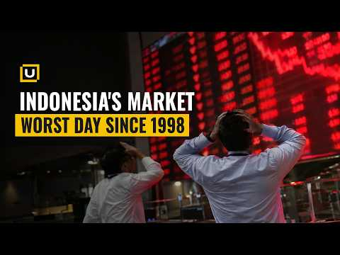
- 설명 앞부분: Indonesia's stock market plunged as much as 11%, putting the Jakarta Composite on track for its worst day since the 1998 Asian financial crisis. But what triggered such a dramatic sell-off? And how could a single announcement from MSCI put billions in foreign investment and Indonesia's emerging-mar…
- 같은 채널 평소 대비 ×93.8 (채널 최근 롱폼 중앙값 3,633회) · 평소 영상: 5 Tonnes of Gold a Year From Mercury? Inside Mode… (3,633회) / BINANCE HACKED! The $6.3 Billion Heist ∣ Century … (4,282회)
- 대본 없음 (설명) — 음성인식이 끝나면 도입부·흐름이 들어감
- 댓글 271/271: 좋은 점 — 영상 0 · 감사·응원 0 · 더 알고 싶은 것 0 · 아쉬운 점 — 영상 0 · 반박·불만 — 의견 다름 0 · 정치·사회 0 · 경험 공유 1 · 구독·다음 기대 0
  - 경험 공유 👍0 “내가보기에는 미국보다는 나은것같은데”

### 4. S&P500, 나스닥100 수익률 차이는 갈 수록 더 벌어질겁니다 미국 장기투자 가이드

- https://www.youtube.com/watch?v=1L9sM63F6Ng · 돈사냥꾼-TV · 구독자 993 · 조회수 19,018 (×19.1, 하루 6,906.7) · 좋아요 182 (1.0%) · 22.4분 · 2026-10-18 · 주제 묶음 2. 장기투자·ETF·지수 · 형식 정보·해설 (그 밖) · 폴더 `W_1L9sM63F6Ng` (웹 승인)
- 썸네일: 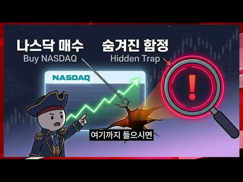
- 설명 앞부분: KBS 기자 KBS 디지털 뉴스 본부장 KBS 울산 방송국 본부장, KBS 해설위원, KBS 교통공무원노조 위원장 등을 역임하며 미디어와 저널리즘 분야에서 풍부한 경험을 쌓아 왔습니다. 이러한 실무 경험을 바탕으로, 현재 미디어 환경에 대한 정확한 정보, 심층 분석, 그리고 솔직한 시각을 제공하기 위해 최선을 다하고 있습니다. 여러분의 지지와 협력은 투명하고 신뢰받는 저널리즘을 향한 저희의 지속적인 노력에 원동력이 됩니다.
- 같은 채널 평소 대비 ×6.9 (채널 최근 롱폼 중앙값 2,768회) · 평소 영상: 연금저축·IRP·ISA 순서 총정리, 뭐부터 얼마씩 넣어야 하나？ (2,808회) / ＂지금 예적금 하지 마세요＂ 현금 안전하게 굴리는 방법 (2,727회)
- 대본 (음성인식(앞 5분), 5.1 음절/초) — 앞부분만, 흐름은 그 안까지 첫 20초: “SNP 500과 나스딱백, 같은 미국, 같은 기간, 같은 달러입니다. 그런데 한쪽은 1억이 13억이 됐고, 다른 한쪽은 6억이 됐습니다. 이 차에 아시고 나면 마음이 좀 복잡해지죠. 그럼 나는 도대체 어디에 투자해야 하는 거지? 그런데 여기 이상한 게 하나 있습니다. 올해 1분기에는 또 성적이 뒤바뀐 겁니다. 그리고 딱 넉 달 만에 다시 2배 가까이 앞질렀어요.” — 도입부 유형: 숫자로 시작
- 첫 1분: “SNP 500과 나스딱백, 같은 미국, 같은 기간, 같은 달러입니다. 그런데 한쪽은 1억이 13억이 됐고, 다른 한쪽은 6억이 됐습니다. 이 차에 아시고 나면 마음이 좀 복잡해지죠. 그럼 나는 도대체 어디에 투자해야 하는 거지? 그런데 여기 이상한 게 하나 있습니다. 올해 1분기에는 또 성적이 뒤바뀐 겁니다. 그리고 딱 넉 달 만에 다시 2배 가까이 앞질렀어요. 정말 혼란스러운 상황입니다. 이게 왜 이러냐면요. 두 지수를 진짜로 가르는 건 우리가 아는 그 이유가 아니기 때문입니다. 사실 이 두 지수 87개 종목이 똑같습니다. 거의 같은 걸 담고 있어요. 그럼 뭐가 다른 걸까요? 그리고 지난주 7월 7일 두 지수의 운명을 갈라놓을 사건이 하나 터졌습니다. 오늘 10분만 투자하시면 여러분이 지금 들고 계신 ET”
- 흐름 (90초마다 첫 문장): 0:00 SNP 500과 나스딱백, 같은 미국, 같은 기간, 같은 달러입니다. → 1:32 기름값이 오르면 물가가 오릅니다. → 3:01 그러니까 작년에 1400원 아래에서 달러를 사서 → 4:30 창고형 마트가 들어있는 지수를
- 댓글 5/5: 좋은 점 — 영상 0 · 감사·응원 0 · 더 알고 싶은 것 0 · 아쉬운 점 — 영상 0 · 반박·불만 — 의견 다름 0 · 정치·사회 0 · 경험 공유 0 · 구독·다음 기대 0

### 5. 적자인데 300억? 가능한 이유 ∣ 회계사가 말아주는 리센느 소속사 더뮤즈엔터

- https://www.youtube.com/watch?v=kJx_AzV9w9c · 전지적회계사시점 · 구독자 867 · 조회수 318,562 (×367.4, 하루 4,225.6) · 좋아요 1,276 (0.4%) · 21.4분 · 2026-09-03 · 주제 묶음 6. 종목 고르기·분석 · 형식 브이로그·직접 해본 이야기 · 폴더 `W_kJx_AzV9w9c` (웹 승인)
- 썸네일: 
- 챕터: 0:00 오프닝 하이라이트 · 0:23 거제 야호로 시작된 리센느 이야기 · 1:13 숫자로 보는 더뮤즈: 8억에서 300억까지 · 2:20 리센느의 인기, 어느 정도일까 · 4:19 더뮤즈엔터테인먼트는 어떤 회사인가 · 6:06 중소 엔터사가 VC 투자를 받는 이유 · 8:11 모태펀드가 만든 중소돌의 기적 · 9:04 투자 히스토리: 5천만 원에서 시리즈A까지 · 11:44 멀티플로 계산해 본 비상장 기업가치 · 14:26 이익배수로 다시 본 300억의 조건 · 16:04 300억이 되려면 매출은 얼마나 필요할까 · 18:00 리센느 정산은 언제부터 가능할까 · 19:40 결론: 300억은 가능한 숫자인가
- 설명 앞부분: "거제야호로 시작된 리센느 열풍. 소속사 더뮤즈엔터의 가치는 얼마일까요?" 지금 대한민국에서 가장 핫한 걸그룹 리센느, 그리고 소속사 더뮤즈엔터테인먼트의 기업가치를 회계사의 시선으로 분석해봤습니다. 설립 밸류 8억에서 5년 만에 300억, 37.5배가 뛴 이 회사의 투자 히스토리를 따라가면서 비상장 기업의 가치평가가 실제로 어떻게 이루어지는지 알기 쉽게 풀어 드립니다. 그리고 25년말 56억 적자에 자본잠식이였던 리센느 소속사가 어떻게 300억의 가치를 인정 받을 수 있었는지, 중소 엔터사가 VC 투자를 받는 이유부터 아이돌 정산…
- 같은 채널 평소 대비 ×113.2 (채널 최근 롱폼 중앙값 2,815회) · 평소 영상: 배그 방플 논란, 베트남은 크래프톤에 얼마나 중요할까? ∣ 회계사가 뜯어본 크래프톤 재무… (3,803회) / 비싸게 팔면 더 많이 남을까? ∣ 회계사가 뜯어본 명품 회사 재무제표 (3,844회)
- 대본 (음성인식(앞 5분), 5.9 음절/초) — 앞부분만, 흐름은 그 안까지 첫 20초: “최근에 리셋는 더뮤즈웨어 엔터테인먼트가 몇백억을 같이 로투자를 받았다 이런 얘기가 많잖아요 그래서 이 회사의 가치가 지금 얼마일까 그리고 얼마까지 갈 수 있을까 작년 매출이 17억 8천만 원인데 영업 손실에 50.2천만 원이거든요 그리고 2025년 말에 자본을 보니까 마이너스 11억 5천만 원 데뷔 8년차에다가 포스닥 상장사가 880만 원이 있는데” — 도입부 유형: 질문으로 시작, 숫자로 시작
- 첫 1분: “최근에 리셋는 더뮤즈웨어 엔터테인먼트가 몇백억을 같이 로투자를 받았다 이런 얘기가 많잖아요 그래서 이 회사의 가치가 지금 얼마일까 그리고 얼마까지 갈 수 있을까 작년 매출이 17억 8천만 원인데 영업 손실에 50.2천만 원이거든요 그리고 2025년 말에 자본을 보니까 마이너스 11억 5천만 원 데뷔 8년차에다가 포스닥 상장사가 880만 원이 있는데 더뮤즈웨어 엔터가 300억 가치를 지냈다 회사님 거제 야구 아세요? 잘 알죠 요새 유튜브에 굉장히 핫하잖아요 저도 거제 야구가 뜨기 시작할 때 그때부터 리셋는 유튜브를 좀 많이 봤는데 굉장히 재밌더라고요 사실 제가 또 TMI긴 하지만 저희 어머니가 좀 외곽아 거제에 있거든요 유튜브에서 거제 영상을 보면서 약간 눈에 익은 그런 화면들이 많이 나오더라고요 유튜브도 알”
- 흐름 (90초마다 첫 문장): 0:00 최근에 리셋는 더뮤즈웨어 엔터테인먼트가 → 1:31 그러니까 이제 8억에서 300억 → 3:02 스탭에게 뭐 1분만 더 달라 → 4:31 그리고 이제 뭐 잘 아시는 것처럼
- 댓글 219/219: 좋은 점 — 영상 2 · 감사·응원 14 · 더 알고 싶은 것 0 · 아쉬운 점 — 영상 2 · 반박·불만 — 의견 다름 4 · 정치·사회 0 · 경험 공유 11 · 구독·다음 기대 2
  - 좋은 점 — 영상 👍10 “더뮤즈에 대해 궁금한 것을 많았는데... 좋은 정보 감사합니다.”
  - 좋은 점 — 영상 👍2 “겉으로 보여지는 아이돌 그룹의 그늘 혹은 화려함에 가리워진 이면에, 냉정한 생존법칙에서, 엔터테인먼트 기획사의 존폐 여부가 어떻게 가시적으로 수치화 돼서 추정되고 결정되는 지 일목요연하게 짚어주는 이런 컨셉 정말 유익합니다. 응원합니다!!!”
  - 감사·응원 👍344 “대중은 중소를 응원하지만 중소티가 나면 고개를 돌리는것 같습니다. 적자상황에서도 의상과 곡퀄리티를 유지한게 단순 응원하는 사람에서 팬덤으로 바뀌게 된 핵심이유같네요.”
  - 감사·응원 👍20 “리센느 팬이라 보고 갑니다 감사합니다”
  - 아쉬운 점 — 영상 👍1 “마이크가 있기는한데 뭔가 목소리 울리는 소리가 많이 들어가는게 조금 아쉽네요😂 재밌는 영상 잘 보고갑니다!”
  - 아쉬운 점 — 영상 👍1 “요약좀....”
  - 반박·불만 — 의견 다름 👍10 “아니 나 진짜 궁금했음; 왜 다들 정산이 힘들거라고 하는건지.. 어떤 분들은 매출이 180억이 나와도 정산이 힘들수있다는데 이해가 너무안감 누적적자 70억은 알겠는데 대형 기획사처럼 컴백할때 진짜 뭐 백몇십억씩 쏟아붓고 마케팅비용 포함해서 활동비로 수십억씩 쓰는 회사…”
  - 경험 공유 👍15 “내가 살다살다 아이돌덕질하다 회사 회계까지 보고있네”
  - 경험 공유 👍6 “올해 리센느가 3년차였네요. 진짜 다행입니다 ^^”
  - 구독·다음 기대 👍18 “리마인이면 리센느 소속사 더뮤즈 재무관리 영상도 챙겨 봐야한다는 사실😂”
  - 구독·다음 기대 👍0 “국내는 현제 말할것도 없고, 전세계적으로도 조금씩 알려지고 있으며 특히 일본에서 근래에 많은 유튜브 영상들이 퍼지고 있으며 팬층도 많이 늘어나고 있던데 조만간 일본 활동에 불씨가 붙으면 롱런 롱흑자 기대됩니다 무엇보다 리센느는 아이돌로서 다음 앨범이 아주 중요하기도 …”

### 6. 이재명 "집 팔아 주식 사라더니…" 코스피 폭락에 국민연금 증발 실태 #이재명 #코스피 #국민연금

- https://www.youtube.com/watch?v=c3vq8lj05Yk · 정치시간 · 구독자 37 · 조회수 15,587 (×155.9, 하루 480.7) · 좋아요 317 (2.0%) · 18.9분 · 2026-10-16 · 주제 묶음 5. 국내주식 · 형식 정보·해설 (그 밖) · 폴더 `W_c3vq8lj05Yk` (웹 승인)
- 썸네일: 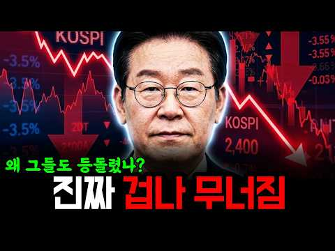
- 설명 앞부분: 최근 코스피 지수가 연이은 하락세를 보이며 증시 변동성이 극대화되고 있습니다. 삼성전자와 SK하이닉스 등 주요 대형주의 실적 발표 및 자사주 소각 이슈에도 불구하고, 외국인 투자자들의 대규모 매도세와 국민연금의 주식 비중 조정 여파로 투자자들의 불안감이 커지고 있습니다.
- 같은 채널 평소 대비 ×3.8 (채널 최근 롱폼 중앙값 4,056회) · 평소 영상: 의사가 본 소아응급실 덮친 경찰의 압수수색 논란.. 필수의료 붕괴와 국민연금 위기 진단 … (4,828회) / 북한 '미사일 도발'에 특전사는 '모델워킹'으로 자세교육? 안보 충격에 발칵! (2,758회)
- 대본 (음성인식(앞 5분), 5.2 음절/초) — 앞부분만, 흐름은 그 안까지 첫 20초: “오늘 코스피가요 대폭락을 또 했습니다. 아니 내가 이재명 말을 듣고 주식을 투자했는데 그 주식 다 까먹고 거기다가 지금 내 국민연금까지 유투력다고 하니까 지금 화가 단단히 난 그런 상황인 것 같아요. 최근 코스피가 연속 하락하며 투자자들의 불안이 커진 상황인데요. 오를 때는 그 난리치더니 왜 떨어질 때는 조용한 걸까요?”
- 첫 1분: “오늘 코스피가요 대폭락을 또 했습니다. 아니 내가 이재명 말을 듣고 주식을 투자했는데 그 주식 다 까먹고 거기다가 지금 내 국민연금까지 유투력다고 하니까 지금 화가 단단히 난 그런 상황인 것 같아요. 최근 코스피가 연속 하락하며 투자자들의 불안이 커진 상황인데요. 오를 때는 그 난리치더니 왜 떨어질 때는 조용한 걸까요? 특히 국민연금의 무리한 투자로 인한 리스크는 정말 심각한 상황입니다. 강성 지지하던 개딸들조차 등돌리는 요즘 사태를 자세히 살펴보시죠. 6,035 장중 한때 6,000선이 무너져 가지고 5,910일 5,900석까지 무너질뻔 했는데 이게 말입니다. 지난 10월 2일 이후에 5 거래일 연속 하락이고요. 계속 떨어졌고 문제가 말입니다. 이게 삼성전자가 얼마 전에 영업이 107조 세 개 최고 규모의”
- 흐름 (90초마다 첫 문장): 0:00 오늘 코스피가요 대폭락을 또 했습니다. → 1:31 그런데 7월에서 9월 그다음에 10월까지 해서 → 3:03 그러니까 SK가 열심히 외국인들이 파는 걸 사줬다는 얘기는 해요. → 4:30 청산이 됩니다.
- 댓글 28/44: 좋은 점 — 영상 0 · 감사·응원 0 · 더 알고 싶은 것 0 · 아쉬운 점 — 영상 0 · 반박·불만 — 의견 다름 0 · 정치·사회 14 · 경험 공유 1 · 구독·다음 기대 0
  - 정치·사회 👍16 “1년사이 개쓰레기나라가 되가고 있다.”
  - 정치·사회 👍8 “믿을인간들 한테 믿어야지 나라가 어느한군데 온전한데가 없내”
  - 경험 공유 👍5 “이대통령 자주하는말...내가 언제 그랬어요?”

### 7. 삼성전자 지금 팔아야 하나? 코스피 서킷브레이커 날, 버틸지 팔지 가를 기준 2가지

- https://www.youtube.com/watch?v=ICByZXkRrLg · 경제야! 놀자~ · 구독자 3,510 · 조회수 101,848 (×29.0, 하루 16,761.8) · 좋아요 583 (0.6%) · 13.5분 · 2026-10-15 · 주제 묶음 5. 국내주식 · 형식 정보·해설 (그 밖) · 폴더 `W_ICByZXkRrLg` (웹 승인)
- 썸네일: 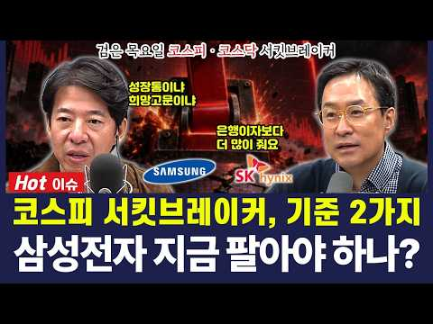
- 챕터: 0:00 하이라이트 — 팔면 안 될 때, 팔아야 할 때 · 0:16 [경제야놀자 해설] 서킷브레이커, 팔아야 하나? · 0:36 사자고 했던 근거 ① 이익 증가 ② 저평가 · 1:45 근거 ③ 배당 30~40% 증가 · 자사주 소각 · 2:19 [경제야놀자 해설] 사자고 했던 근거 3가지 · 2:40 빠지는 이유 ① 금리 · 2:59 ② AI 투자 버블론 ③ 중동 · 물가 · 3:39 "훼손된 게 있나요?" — 아직은 없다 · 4:15 양대 시장 서킷브레이커 · 메모리 사이클 불신 · 5:28 [경제야놀자 해설] 서킷브레이커 · 메모리 사이클 · 5:53 박시동 — "3~4일에 20%씩 빠질 일이냐" · 7:13 성장통이냐, 희망고문이냐 · 8:53 판단 기준 두 갈래 · 비중 줄이기 · 10:05 [경제야놀자 해설] 성장통이냐 희망고문이냐 · 10:26 박시동 — 시가배당률 5%, 은행이자보다 많다 · 11:55 정리 — 지금 새로 사는 건 아니다 · 12:40 [경제야놀자 해설] 오늘의 세 줄 정리
- 설명 앞부분: [10월 15일 · 12시에 만나요] 코스닥에 이어 코스피까지 8% 넘게 빠지며 두 시장 모두 서킷브레이커가 걸린 날, 방송은 "지금 어떻게 해야 하나"를 붙들고 길게 이야기했다. 이광수 대표는 그동안 한국 주식을 사자고 했던 근거 세 가지 — 기업 이익 증가, 이익 대비 저평가, 배당과 자사주 소각으로 바뀌는 시장 — 를 다시 짚고, 아직 훼손된 것은 없다고 봤다. 권다영 앵커는 메모리 반도체가 사이클이라는 오랜 경험 때문에 시장이 "이번엔 다르다"를 믿지 못한다고 해석했다. 이 대표는 지금 하락이 오르는 길의 성장통인지, 저점…
- 대본 (음성인식(앞 5분), 5.1 음절/초) — 앞부분만, 흐름은 그 안까지 첫 20초: “예를 들면 이렇게 하락했다가 오르는 국면에서 이런 구정이면 당연히 팔면 안 되죠. 갖고 있는 겁니다. 그런데 예를 들어서 이제 대한민국 주식장은 빠졌잖아. 이게 중요한 게 아니라 이렇게 흐르면서 움직일 거야 라고 하면 지금이라도 빨리 팔아야죠. 삼성전자 하이닉스 들고 계신 분들 오늘 정말 힘드셨죠.”
- 첫 1분: “예를 들면 이렇게 하락했다가 오르는 국면에서 이런 구정이면 당연히 팔면 안 되죠. 갖고 있는 겁니다. 그런데 예를 들어서 이제 대한민국 주식장은 빠졌잖아. 이게 중요한 게 아니라 이렇게 흐르면서 움직일 거야 라고 하면 지금이라도 빨리 팔아야죠. 삼성전자 하이닉스 들고 계신 분들 오늘 정말 힘드셨죠. 10월 15일 코스피와 코스닥이 함께 8% 넘게 빠지면서 두 시장 모두 서킷 브레이커가 발동됐습니다. 최근 사나을 동안 20% 가까이 빠진 끝에 나온 일입니다. 지금 팔아야 할까요. 버텨야 할까요. 출연진이 내놓은 판단 기준 끝까지 확인해 보세요. 그러면 그 의견의 근거는 뭐였냐. 그렇죠. 그래서 저는 근거를 제가 일단 먼저 한번 말해 볼게요. 첫 번째는 대한민국 기업들이 이익이 증가하고 있다. 그래서 반도체 회”
- 흐름 (90초마다 첫 문장): 0:00 예를 들면 이렇게 하락했다가 오르는 국면에서 이런 구정이면 당연히 팔면… → 1:33 모든 투자자들이 그리고 모든 책에서도 거의 다 얘기하는 거 아니에요. → 3:00 자 이거 하나 하고 두 번째는 뭐냐면 ai 투자가 버블 아니야. → 4:30 오랫동안 시장을 집에 해 왔던 메모리에 대한 시각을 깨는데
- 댓글 296/296: 좋은 점 — 영상 0 · 감사·응원 0 · 더 알고 싶은 것 2 · 아쉬운 점 — 영상 0 · 반박·불만 — 의견 다름 8 · 정치·사회 19 · 경험 공유 8 · 구독·다음 기대 0
  - 더 알고 싶은 것 👍14 “오늘은 뭐라 하는지 궁금해서 들어 와봣더니.. 역시나..ㅠㅠㅠ”
  - 더 알고 싶은 것 👍2 “이주완 아날리스트의 삼전닉스 비관론에 대해서 합리적인 반론 좀 부탁드려요.”
  - 반박·불만 — 의견 다름 👍13 “대 전제가 틀렸다. 주식시장은 애초에 합리적인 분석대로 움직이는 장이 아니다. 이게 내 결론임.”
  - 반박·불만 — 의견 다름 👍11 “영국은 겨우 방직기 하나 개발해놓고 100년을 거품을 몰고 다녔습니다. 왜 한국만 지금 바보짓을 합니까? 좀 이 업계 모르는 분들은 입닫고 조용히 기업들이 하는일 지켜보세요. 기업들 바보 아닙니다. 겨우 중국발 기사 2줄에 검증되지 않은 내용으로 아무나 떠드는것에 신…”
  - 정치·사회 👍27 “정부는 아무 대책 없네~~ 미국이 이정도면 난리 났다 ~~종지가 9퍼가 빠진다는게 현실이냐 삼전이 1주일 만에 -30퍼가 말이 되나교 국민 거지 만들기 프로젝트 가종중이냐? 주식 시장은 아침 8시부터 저녁 8시까지 하라는 이야기냐?”
  - 정치·사회 👍8 “증권당국이 기업죽든말든 개인죽든말든 나라가죽든말든 증권사의무능수치다”
  - 경험 공유 👍15 “저분들 때문에 여러명 죽네 어제가. 바닥이라고 햇던거 같은데 저런 말은 나도 하겠네요”
  - 경험 공유 👍10 “귀에걸면 귀걸이 코에걸면 코걸이 나도하겠다.”

### 8. Don't Stop Buying Dividends in a Crash Until You See This Math

- https://www.youtube.com/watch?v=qCO8HvpAGqc · Tom - Lazy Dividend Investor · 구독자 2,090 · 조회수 49,277 (×23.6, 하루 8,472.3) · 좋아요 399 (0.8%) · 31.6분 · 2026-10-15 · 주제 묶음 기타 · 형식 정보·해설 (그 밖) · 폴더 `W_qCO8HvpAGqc` (웹 승인)
- 썸네일: 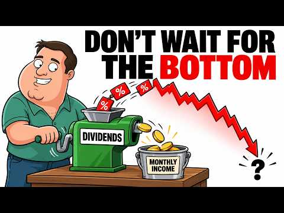
- 설명 앞부분: If dividend stocks fall 20% and the dividend holds, every dollar you invest buys 25% more monthly income than it did before the drop. That is the math behind "keep buying". The problem is that the advice never says where the money comes from, because a crash usually arrives with shorter hours, smal…
- 같은 채널 평소 대비 ×11.4 (채널 최근 롱폼 중앙값 4,333회) · 평소 영상: Sell Now or Stay Invested? — What To Do Before Th… (4,459회) / How Money Really Works: Build Cash Flow That Pays… (4,207회)
- 대본 없음 (설명) — 음성인식이 끝나면 도입부·흐름이 들어감
- 댓글 116/116: 좋은 점 — 영상 0 · 감사·응원 0 · 더 알고 싶은 것 0 · 아쉬운 점 — 영상 0 · 반박·불만 — 의견 다름 0 · 정치·사회 0 · 경험 공유 0 · 구독·다음 기대 0

### 9. 같은 TQQQ에 1억, 한 사람은 2만 원 한 사람은 388억 (실제 데이터)

- https://www.youtube.com/watch?v=d2_oRUcx5Uo · 머니언박싱 · 구독자 2,200 · 조회수 266,959 (×121.3, 하루 8,795.4) · 좋아요 1,175 (0.4%) · 8.1분 · 2026-09-27 · 주제 묶음 2. 장기투자·ETF·지수 · 형식 정보·해설 (그 밖) · 폴더 `W_d2_oRUcx5Uo` (웹 승인)
- 썸네일: 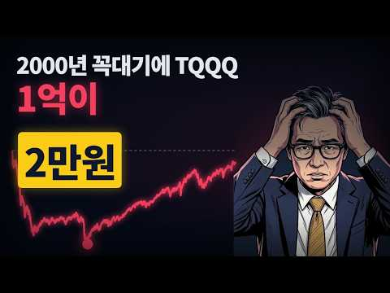
- 챕터: 0:00 두 개의 계좌 · 0:24 3배 레버리지는 어떻게 움직이나 · 0:54 박 부장, 2000년 3월 꼭대기에서 1억 · 1:20 1년 만에 496만 원 · 1:42 2만 원까지 · 2:06 지수는 돌아왔는데 · 2:35 26년 뒤 박 부장 · 2:56 만약 2009년 바닥에서 샀다면 · 3:42 이 대리, TQQQ 상장일에 1억 · 4:00 16년 뒤, 그러나 · 4:25 만약 2021년 11월에 들어갔다면 · 5:05 최 사원, 매달 50만 원 · 5:32 94억에서 20억으로 · 5:56 만약 2022년에 팔았다면 · 6:29 결과 공개 · 6:56 이 결과를 믿기 전에 · 7:24 레버리지를 산다면
- 설명 앞부분: 같은 TQQQ, 같은 1억 원. 한 사람은 계좌가 한때 2만 원이 됐고, 다른 사람은 지금 388억 원입니다. 무엇이 두 사람을 갈랐을까요? 그리고 같은 상품을 매달 조금씩 산 사람은 어떻게 됐을까요? 박 부장: 2000년 3월 27일, 나스닥100 꼭대기에 1억 원을 3배 레버리지로 이 대리: 2010년 2월 11일, TQQQ 상장일에 1억 원 최 사원: 2000년 4월부터 매달 50만 원씩 3배 레버리지 (세 사람은 가상 인물이고, 숫자는 전부 실제 데이터로 계산했습니다) 계산 조건 2010년 2월 이전 3배·2배는 실제 상품…
- 같은 채널 평소 대비 ×141.4 (채널 최근 롱폼 중앙값 1,888회) · 평소 영상: SCHD 배당재투자 vs S&P 500, 자산은 어디가 더 불어날까? (1,888회) / 매달 50만 원 vs 폭락할 때만, 한국 주식 15년의 반전 (1,861회)
- 대본 (음성인식(앞 5분), 4.9 음절/초) — 앞부분만, 흐름은 그 안까지 첫 20초: “여기 두 개의 계좌가 있습니다. 둘 다 1억원으로 시작했고 둘 다 같은 상품을 샀습니다. 나스딱백을 매일 세 배로 따라가는 레버리지 tqq입니다. 그런데 한 계좌는 한때 2만원이 됐고 다른 계좌는 지금 388억원입니다. 무엇이 이 둘을 갈랐을까요? 그리고 같은 상품을 매달 조금씩 산 사람은 어떻게 됐을까요? 오늘은 세 사람의 레버리지 계좌를 실제 데이터로 끝까지 따라가 보겠습니다.”
- 첫 1분: “여기 두 개의 계좌가 있습니다. 둘 다 1억원으로 시작했고 둘 다 같은 상품을 샀습니다. 나스딱백을 매일 세 배로 따라가는 레버리지 tqq입니다. 그런데 한 계좌는 한때 2만원이 됐고 다른 계좌는 지금 388억원입니다. 무엇이 이 둘을 갈랐을까요? 그리고 같은 상품을 매달 조금씩 산 사람은 어떻게 됐을까요? 오늘은 세 사람의 레버리지 계좌를 실제 데이터로 끝까지 따라가 보겠습니다. tqq는 나스딱백 지수가 하루에 1% 오르면 3% 1% 내리면 3% 움직이도록 만든 상품입니다. 중요한 건 매일이라는 말입니다. 1년에 3배가 아니라 매일 3배를 다시 맞춥니다. 그리고 3배를 만들기 위해 빌린 돈의 이자와 운영 보수가 매일 조금씩 빠져나갑니다. tqq는 2010년에 처음 나왔기 때문에 그 이전은 나스딱백의 실제”
- 흐름 (90초마다 첫 문장): 0:00 여기 두 개의 계좌가 있습니다. 둘 다 1억원으로 시작했고 둘 다 같은… → 1:34 2002년 10월 3배 계자에는 84000원이 남아 있었습니다. 1억 … → 3:04 새로 1억 원을 3배 레버리지에 넣었다고 해보겠습니다. 지금 이 계자는… → 4:35 이번에도 실제 기록입니다. 1년 뒤 2022년 12월 계자는 81.7%…
- 댓글 144/162: 좋은 점 — 영상 7 · 감사·응원 7 · 더 알고 싶은 것 8 · 아쉬운 점 — 영상 1 · 반박·불만 — 의견 다름 3 · 정치·사회 0 · 경험 공유 10 · 구독·다음 기대 1
  - 좋은 점 — 영상 👍8 “너무 좋은 영상 감사합니다 보고 먾이 배웠습니다. 사람들은 단순히 세배의 장점만 보는데 박부장의 케이스는 너무 무섭네요 관점을 바꾸는 좋은 계기가 되었습니다 감사합니다!”
  - 좋은 점 — 영상 👍8 “진짜 좋은 영상이네요 👍”
  - 감사·응원 👍8 “너무 좋은 영상 감사합니다 보고 먾이 배웠습니다. 사람들은 단순히 세배의 장점만 보는데 박부장의 케이스는 너무 무섭네요 관점을 바꾸는 좋은 계기가 되었습니다 감사합니다!”
  - 감사·응원 👍3 “궁금한 게 있습니다! 적립식이 중요하다는 건 알겠는데 Tqqq를 투자하면 결국 적립식으로 해도 초반은 방어가 되지만 장기투자하고 후반에 금액이 커진 상황에 대폭락이 오면 qqq보다 훨씬 낮아질 확률이 꽤 있지 않나요? TQQQ 관련 내용 책이나 좋은 자료 혹시 있다면…”
  - 더 알고 싶은 것 👍3 “Soxl도 궁금합니다😮”
  - 더 알고 싶은 것 👍3 “궁금한 게 있습니다! 적립식이 중요하다는 건 알겠는데 Tqqq를 투자하면 결국 적립식으로 해도 초반은 방어가 되지만 장기투자하고 후반에 금액이 커진 상황에 대폭락이 오면 qqq보다 훨씬 낮아질 확률이 꽤 있지 않나요? TQQQ 관련 내용 책이나 좋은 자료 혹시 있다면…”
  - 아쉬운 점 — 영상 👍0 “정말 무서운 건 지난 20년이 나스닥 역사상 가장 전성기였다는 사실. 닷컴버블도 아무리 길게 잡아도 3년. 10년 횡보장이었다면 QQQ 투자자는 우울한 정도지만, 폭락 후 버티는 QLD, TQQQ 투자자는 인생 망하는 케이스. 역사는 반복된다?? 아닙니다. 그 시대를…”
  - 반박·불만 — 의견 다름 👍6 “이미 흐름을 알고있는 과거시기를 극적으로 발취하여,,,,,감동적인효과는 알겠는데,,,, 솔직히 현실적투자환경속 투자자라면 실현가능한 일은 아니죠.의지력을 키우라는 교훈성”
  - 반박·불만 — 의견 다름 👍0 “정말 무서운 건 지난 20년이 나스닥 역사상 가장 전성기였다는 사실. 닷컴버블도 아무리 길게 잡아도 3년. 10년 횡보장이었다면 QQQ 투자자는 우울한 정도지만, 폭락 후 버티는 QLD, TQQQ 투자자는 인생 망하는 케이스. 역사는 반복된다?? 아닙니다. 그 시대를…”
  - 경험 공유 👍8 “매달 초마다 200만원 환전해서 TQQQ 매수합니다. 환율/주가 생각 안하고 삽니다 파는건 일년에 250만원만 하고 있습니다. 이제 1년차이고 앞으로 9년 남았네요 😊”
  - 경험 공유 👍6 “무서워서 그냥 연저펀 타이거 s&p500, isa 코덱스 나스닥100 두가지만 3년차 풀매수중입니다 😊”
  - 구독·다음 기대 👍4 “영상보고 바로 구독했습니다”

### 10. 주가 1.62달러까지 무너진 AMD, 바닥에서 내린 결정

- https://www.youtube.com/watch?v=l2XsNVbqkm0 · Six Sigma | 식스시그마 · 구독자 5,810 · 조회수 83,120 (×14.3, 하루 21,546.8) · 좋아요 258 (0.3%) · 11.3분 · 2026-10-17 · 주제 묶음 10. 노후·연금 투자 · 형식 인터뷰·강연·대담 · 폴더 `W_l2XsNVbqkm0` (웹 승인)
- 썸네일: 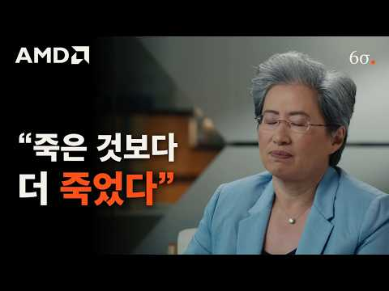
- 챕터: 0:00 "죽은 것보다 더 죽었다" · 0:30 원래 잘나가던 회사 · 0:49 무너진 이유 · 1:19 새 CEO · 2:57 바닥에서 내린 결정 · 6:47 살아난 AMD · 9:21 이제는 엔비디아에 도전
- 설명 앞부분: 한때 인텔을 앞서던 AMD는 2015년 주가 1.62달러까지 무너졌습니다. 2014년 CEO가 된 리사 수가 그 바닥에서 무엇을 버리고 무엇에 걸었는지, 그 베팅이 AMD를 어떻게 다시 엔비디아와 싸우는 회사로 만들었는지 짚었습니다. CNN·블룸버그·스탠퍼드·MIT 인터뷰와 AMD 공식 발표 원음으로 정리했습니다. [원본] (9) 주가 자료: Yahoo Finance 종가(분할 조정) [목차]
- 같은 채널 평소 대비 ×5.8 (채널 최근 롱폼 중앙값 14,388회) · 평소 영상: 가격을 두 번 올려도 수요가 공급의 10배, 매출 168%↑ 올해 전망 전부 상향 ∣ 코… (14,476회) / 3억 달러 콜옵션, 1월까지 못 오르면 0 ∣ 레오폴드 아셴브레너 (14,299회)
- 대본 (음성인식(앞 5분), 2.0 음절/초) — 앞부분만, 흐름은 그 안까지 첫 20초: “AMD가 2달러의 공연을 받았다고 합니다. 한 사람은 더 죽었다고 말했습니다. 2000년, AMD 주가는 47달러였습니다. 2015년에는 1.6이 달러까지 떨어졌습니다. 그리고 2026년 10월, 649달러가 됩니다. 저는 CEO로서 정말 기대되었습니다. 하지만 물론 다른 사람은 새로운 직업을 받지 않습니다.” — 도입부 유형: 숫자로 시작
- 첫 1분: “AMD가 2달러의 공연을 받았다고 합니다. 한 사람은 더 죽었다고 말했습니다. 2000년, AMD 주가는 47달러였습니다. 2015년에는 1.6이 달러까지 떨어졌습니다. 그리고 2026년 10월, 649달러가 됩니다. 저는 CEO로서 정말 기대되었습니다. 하지만 물론 다른 사람은 새로운 직업을 받지 않습니다. 한때 인텔을 이기던 회사가 어떻게 여기까지 떨어졌을까요? 그리고 바닥에서 무엇을 했길래 다시 올라왔을까요? 2000년, AMD는 세계 최초로 1Ghz를 넘는 PC 칩을 내놓습니다. 인텔보다 먼저였습니다. 2003년에는 64비트 칩을 먼저 냈습니다. 지금 PC와 서버가 쓰는 64비트 방식이 이때 AMD가 만든 것입니다. AMD가 이긴 무기는 하나였습니다. 더 빠른 고성능 칩이었습니다. 2006년 7월,”
- 흐름 (90초마다 첫 문장): 0:00 AMD가 2달러의 공연을 받았다고 합니다. → 1:34 그날 주가는 3.28달러였습니다. → 3:14 당시 모두가 스마트폰 칩을 말하던 때였습니다. → 4:44 다이용의 경 intimid을 하죠.
- 댓글 51/51: 좋은 점 — 영상 0 · 감사·응원 0 · 더 알고 싶은 것 0 · 아쉬운 점 — 영상 1 · 반박·불만 — 의견 다름 0 · 정치·사회 0 · 경험 공유 1 · 구독·다음 기대 0
  - 아쉬운 점 — 영상 👍0 “주가 1.62달러까지..뭐?.... 제목으로 낚시질 해서 신고 박고 간다. 똑바로 살아라.”
  - 경험 공유 👍2 “모바일칩 시장이 스마트폰 이전 시절엔 큰 돈이 안되었었고 (프로세서 기술보다 모뎀 기술이 결정적인 경쟁력을 좌우하던 시절) 이후 스마트폰 시대로 접어들어서도 모뎀기술이 프로세서 기술보다 더 중요한 경쟁력으로 작용했음. 모바일칩에 뛰어들지 않은건 당시 AMD가 가진 역…”

### 11. [문남중 출연] "코스피 폭락, 자사주 매입 종료 때문..수급공백 끝! 외국인, 삼전닉스로 돌아옵니다" #문남중 _261019

- https://www.youtube.com/watch?v=vzGrlaAl0e4 · 경제통마늘 · 구독자 15,800 · 조회수 124,444 (×7.9, 하루 56,609.4) · 좋아요 1,146 (0.9%) · 14.2분 · 2026-10-19 · 주제 묶음 5. 국내주식 · 형식 오디오북·낭독 (명언·인생조언) · 폴더 `W_vzGrlaAl0e4` (웹 승인)
- 썸네일: 
- 설명 앞부분: "코스피 '수급공백' 메울 외국인, 다시 돌아오기 시작했다" 유독 Non-US 증시만 어려운 상황..10월초 급락 이유 이해안돼 美증시 10월들어 역사적 사상최고치..코스피 진정될 여지 있어 美 증시는 쉬워갈 구간..지난 금요일 나스닥 -2% "과도한 확대 해석 경계" 이란 외무장관 발언, 이란전쟁 종전MOU 재개 가능성 대두 韓증시 유독 빠진 이유, '수급공백'..자사주 매입 종료 때문 2024-2025년 외국인, 삼전 자사주 매입 종료에도 매수세 경험 자사주 매입 종료 직후, '반도체 업황' 매우 중요 "수급 주체 바뀐다..자…
- 대본 (음성인식(앞 5분), 5.5 음절/초) — 앞부분만, 흐름은 그 안까지 첫 20초: “화이팅 라디오 생생경제 2부로 이어가겠습니다. 악재가 악재를 키우는 그런 상황이 되어버렸죠. 지금의 코스피 상황입니다. 10월 들어서 7거래일 만에 무려 20% 넘게 코스피가 빠졌고요. 5천선으로 내려앉았습니다. 많은 투자자분들이 충격을 받으셨을 것 같은데요. 조식창 보는 것도 두려울 것 같습니다. 그래서 앞으로 시장이 어떻게 움직이게 될지 또 우리의 대응 전략은 어떻게 해야 될지 문남 중 대신 중권 글로벌 전략 수석 연구위원과 함께 이야기 나눠 보도록 하겠습니다.” — 도입부 유형: 숫자로 시작
- 첫 1분: “화이팅 라디오 생생경제 2부로 이어가겠습니다. 악재가 악재를 키우는 그런 상황이 되어버렸죠. 지금의 코스피 상황입니다. 10월 들어서 7거래일 만에 무려 20% 넘게 코스피가 빠졌고요. 5천선으로 내려앉았습니다. 많은 투자자분들이 충격을 받으셨을 것 같은데요. 조식창 보는 것도 두려울 것 같습니다. 그래서 앞으로 시장이 어떻게 움직이게 될지 또 우리의 대응 전략은 어떻게 해야 될지 문남 중 대신 중권 글로벌 전략 수석 연구위원과 함께 이야기 나눠 보도록 하겠습니다. 안녕하세요. 장이 너무 힘을 못 내는데요. 오늘도 장 초반에 한 1.6% 정도 지금 빠지고 있습니다. 상황 어떻게 보세요. 유독 논 us국가에 해당되는 대망과 한국 이런 반도체 국가 증시가 상대적으로 좀 좋지는 않은 것 같아요. 사실 글로벌 증시”
- 흐름 (90초마다 첫 문장): 0:00 화이팅 라디오 생생경제 2부로 이어가겠습니다. 악재가 악재를 키우는 그… → 1:34 방향성을 탐생하는 국면이기 때문에 이런 상황이라고 하면 지금 한국 증시… → 3:05 주말에 또 이란의 애무장관이 갑자기 또 기존에 미국이 제시했던 그 조건… → 4:32 아무래도 그 답은 삼성전자 sg 한익스의 자사주 매입 종료가 이번 달에…
- 댓글 192/192: 좋은 점 — 영상 0 · 감사·응원 7 · 더 알고 싶은 것 0 · 아쉬운 점 — 영상 1 · 반박·불만 — 의견 다름 11 · 정치·사회 35 · 경험 공유 3 · 구독·다음 기대 0
  - 감사·응원 👍14 “위원님 나오셨군요. 기다렸습니다. 과도한 확대해석 자제하고 기다립니다. 감사합니다 ~~”
  - 감사·응원 👍7 “☆ 국민의 소리 소신있게 발언하신 이찬진 금융감독원장님께 찬사의 박수 보냅니다 국회 정무위원회 국정감사에서 금융감독원장이 SK하이닉스의 자회사 솔리다임(Solidigm) 미국 나스닥 상장 추진과 관련해 "중복상장에 저촉된다는 판단을 하고 있다"는 입장을 공식 명시 했…”
  - 아쉬운 점 — 영상 👍0 “ㅋㅋㅋㅋㅋㅋ 아직도 낚시하는 놈들 있네 진짜 대단하다 등골까지 빨아머글라고 낚이면 안됩니다 하닉출신 반도체 전문가분이 1년전 가격으로 간다고 못 박았음 ㅋ”
  - 반박·불만 — 의견 다름 👍5 “점쟁이도 아닌데....어찌 다맞추나요? 본인의계좌는 본인책임~”
  - 반박·불만 — 의견 다름 👍3 “저아저씨 7월달 폭락 딱한번 맞췄어요. 그이후엔 금리며 국채며 주가며 다 틀렸고 작년에도 주구장창. 근데 틀릴순 있는데 문제는 뭐라하면 잘삐져요. 그래서 아나운서가 힘들어해요”
  - 정치·사회 👍11 “외국인이 돌아오긴 뭘 돌아와 하락시 생긴 갭때문에 잠시 산것 뿐인데 그렇게도 공부 안하고 책임없는 말을 하나”
  - 정치·사회 👍8 “1400만 개미투자자를 기만하는 ‘무늬만’ 주주 보호법인 ‘의무공개매수제도’, ‘주가 누르기 방지법’의 전면 재검토 및 수정 입법 요청에 관한 청원 국회전자청원에서 참여 부탁드립니다”
  - 경험 공유 👍39 “기관 사람 말 믿지 말자! 개인은 개인이 선택해야 한다는걸 7월.10월 두번의 폭락을 보며 깨닫습니다. 펀더멘털이니 수급이니 필요없고..익절할 수 있을때 무조건 익절하기. 기관 사람들은 모두 사라사라 하면서 그들과 외인은 팜~ 누군가는 손실을 봐야 누군가는 손익인 곳…”
  - 경험 공유 👍2 “금리 동결될 거라고 했었지 이 양반 아니 외국인이 그렇게 돈을 많이 벌었는데 개미들한테 물리려고 다시 들어오겠냐”

### 12. [풀영상] 월급 10%로 당장 시작하는 존리의 자산 증식 치트키

- https://www.youtube.com/watch?v=q1fYjAwma3s · 여의돈스트리트 · 구독자 1,420 · 조회수 233,742 (×164.6, 하루 3,805.6) · 좋아요 1,457 (0.6%) · 36분 · 2026-09-17 · 주제 묶음 1. 주식 기초·초보 · 형식 인터뷰·강연·대담 · 폴더 `W_q1fYjAwma3s` (웹 승인)
- 썸네일: 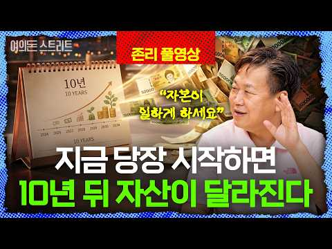
- 챕터: 0:00 인트로 · 0:50 ‘존리의 부자학교’, 어떤 곳인가요? · 1:09 우리나라 금융 수준, 정말 높아졌나요? · 2:39 빨리 부자가 되는 투자, 가능한가요? · 4:53 장기 투자, 어떤 ETF를 사야 할까요? · 6:53 평범한 사람은 어떻게 부자가 되나요? · 8:30 주식 투자에 전문가가 없다? · 10:24 레버리지 투자는 왜 위험한가요? · 11:31 한국주식, 지금도 투자할 만한가요? · 12:16 투자 뉴스는 어디까지 봐야 할까요? · 14:44 부동산 비중이 높으면 위험한가요? · 16:45 주식 투자의 진짜 목적은 무엇인가요? · 17:26 좋은 기업은 어떻게 고르나요? · 20:19 장기 투자 중 기업 상황이 나빠진다면? · 21:09 박스권에 갇힌 현재 증시 진단 · 22:23 AI 버블 우려 속 올바른 매수 시기 · 23:30 안전해 보이는 ‘원금 보장’ 상품의 함정 · 25:01 반도체·대형주 쏠림 계좌, 포트폴리오 개선 조언 · 27:15 시황 뉴스·차트·리포트의 올바른 활용법 · 29:35 직장인 월급 대비 적정 투자 비중 및 방법
- 설명 앞부분: 매일 오르내리는 주가, 금리 인상 뉴스... 언제 사고 언제 팔아야 할지 늘 스트레스받고 계시나요? 혹은 원금 손실이 두려워 아직도 투자를 망설이고 계신가요? 이번 풀영상에서는 '존리의 부자학교' 존리 대표님을 모시고 평범한 사람이 스트레스 없이 진짜 부자가 되는 투자의 본질부터 구체적인 실천 방법까지 모두 담았습니다. 단기간에 부자가 되려는 조급함과 마켓 타이밍을 재는 습관을 버리고, 내 자본이 스스로 일하게 만드는 진짜 투자법을 짚어봅니다. 또한, 인플레이션 시대에 돈을 예적금에만 두는 것이 왜 자산 가치를 갉아먹는 가장 위험…
- 같은 채널 평소 대비 ×197.1 (채널 최근 롱폼 중앙값 1,186회) · 평소 영상: 아무짝에도 쓸모없는 경제 회의 [돈 안되는 소리 EP.01] (1,186회) / 주식시장 100명중 90명은 무조건 손실 봅니다. 상위 10%만 아는 '진짜' 수익 내는… (1,203회)
- 대본 (음성인식(앞 5분), 6.0 음절/초) — 앞부분만, 흐름은 그 안까지 첫 20초: “좀 빠르게 내가 부자가 되고 싶다. 시간이 지날수록 나는 그 위스크로 줄어들고 시작한 지 지날수록 나는 부관들어나거든요. 또는 일을 안 하고 이불 속에서 안 나오는 거예요. 예금. 지금 만약에 1,000만 원이 20년 후에는 1,000만 원 아니라 한 300만 원으로 줄어들어있는 거예요. 90%의 정보는 필요 없는 정보예요. 정보가 하나도 중요하지 않죠.”
- 첫 1분: “좀 빠르게 내가 부자가 되고 싶다. 시간이 지날수록 나는 그 위스크로 줄어들고 시작한 지 지날수록 나는 부관들어나거든요. 또는 일을 안 하고 이불 속에서 안 나오는 거예요. 예금. 지금 만약에 1,000만 원이 20년 후에는 1,000만 원 아니라 한 300만 원으로 줄어들어있는 거예요. 90%의 정보는 필요 없는 정보예요. 정보가 하나도 중요하지 않죠. 충분해요. 두 개만 갖고도. 두 개만 갖고도 충분하다. 반응하는 많이 해라. 어떻게 젊으신 분들은. 안녕하세요. 여의돈스트리트 이광수입니다. 우리는 도대체 어떻게 투자해야 부자가 될 수 있을까요? 스트레스 받지 않고 투자하려면 또 어떻게 해야 될까요? 다녁컨대 이에 대한 해답을 알고 계시는 분. 어렵게 이 자리에 모셨습니다. 졸리의 부자학교의 졸리 대표님”
- 흐름 (90초마다 첫 문장): 0:00 좀 빠르게 내가 부자가 되고 싶다. → 1:31 실제로 대표님께서 현장에서 보시면 → 3:01 그렇게 해서 좀 빠르게 → 4:30 너무 힘듭니다 대표님.
- 댓글 113/121: 좋은 점 — 영상 3 · 감사·응원 14 · 더 알고 싶은 것 2 · 아쉬운 점 — 영상 0 · 반박·불만 — 의견 다름 4 · 정치·사회 1 · 경험 공유 13 · 구독·다음 기대 0
  - 좋은 점 — 영상 👍4 “이분하고 궁합이 잘맞음 참 좋은말씀”
  - 감사·응원 👍25 “존리 선생님 덕분에 3년전부터 노후준비를, 장기투자를 목표로 삼게 되었습니다. 좋은 투자철학을 가르쳐주셔서 감사합니다❤”
  - 감사·응원 👍19 “존리대표님 덕분에 투자를 시작했습니다 감사드립니다”
  - 더 알고 싶은 것 👍0 “에스엔피 500이 미장인지 국장인지 어떤걸해야하나요?”
  - 반박·불만 — 의견 다름 👍4 “이게 말이 쉽지 2002년 닷컴 버블 경험하고 이제 회복되나 싶었더니 2008년 금융위기 오고 투자 14년 차인데 투입원금보다도 계좌에 쌓인 돈이 없고 그러면 진짜 현타옵니다. 복리의 힘이라는게 말이 쉽지 일정금액 이상이 쌓이지 않으면 기별도 안 오고, 녹아내리는 계…”
  - 반박·불만 — 의견 다름 👍0 “개인적으로 무조건적이고 비판없는 의견을 따르실 필요는 없습니다. 모든 투자는 개인의 책임이니 신중하게 생각해보고 투자하시길 바랍니다. 그렇다고 존 리님이 무조건 좋다 나쁘다 이렇게 생각하는 게아니라 본인에게 맞는 투자를 하시라는 말씀 꼭 드리고 싶습니다. 장기투자라고…”
  - 정치·사회 👍0 “박정희 대통령이 나라의 문맹을 퇴지했는데 존리대표님은 금융문맹을 퇴치하러 열일 하신다”
  - 경험 공유 👍24 “연금저축+isa ETF 5년차 적립중인데 희망이 생겨서 든든합니다😊 더 빨리 깨우쳤어야 했는데 ㅠㅠ”
  - 경험 공유 👍4 “이게 말이 쉽지 2002년 닷컴 버블 경험하고 이제 회복되나 싶었더니 2008년 금융위기 오고 투자 14년 차인데 투입원금보다도 계좌에 쌓인 돈이 없고 그러면 진짜 현타옵니다. 복리의 힘이라는게 말이 쉽지 일정금액 이상이 쌓이지 않으면 기별도 안 오고, 녹아내리는 계…”

### 13. 유혈 낭자한 국장..폭락의 시작일까? / 이슈빡 / 뉴스헌터스

- https://www.youtube.com/watch?v=enkSdCIojAA · 뉴스헌터스 · 구독자 7,680 · 조회수 116,383 (×15.2, 하루 20,119.3) · 좋아요 283 (0.2%) · 17.9분 · 2026-10-15 · 주제 묶음 1. 주식 기초·초보 · 형식 인터뷰·강연·대담 · 폴더 `W_enkSdCIojAA` (웹 승인)
- 썸네일: 
- 설명 앞부분: ■ 진행: 김종원, 윤태진 앵커 ■ 대담: 윤진 (블랙퀀트에쿼티 대표), 허준영 (서강대 경제학부 교수) 코스피와 코스닥 지수가 7%대 폭락한 '검은 목요일'이었습니다. 상장기업 시가총액은 오늘 하루에만 400조원 넘게 증발했고 코스피는 지난 6월 기록한 전고점보다 40% 이상 떨어졌습니다. 특히 코스피의 절반 정도를 차지하는 반도체 투톱 '삼전 · 닉스'는 AI 기업들의 자금 조달 비용 상승과 AI 투자 수익성 악화 우려가 커지고 중국 CXMT가 신기술 상용화를 예고하면서 주가가 미끄러지고 있습니다. 이런 상황에서, 손실이 커지…
- 대본 (음성인식(앞 5분), 6.1 음절/초) — 앞부분만, 흐름은 그 안까지 첫 20초: “”
- 첫 1분: “10월 15일 뉴스 사냥을 시작합니다. 첫 순서 이슈 박입니다. 제가 아직도 기억하는데 올 1월에 태진앤커가 주식 앱이 없었어요. 맞아요. 스마트폰에. 그런데 저희가 뉴스 온터스 계속하면서 주식이 너무 올라가니까 저희 둘 다 물려버렸습니다. 맞습니다. 저에게 그때 권장을 해 주셨었잖아요.”
- 흐름 (90초마다 첫 문장): 0:39 10월 15일 뉴스 사냥을 시작합니다. → 1:31 과연 어떻게 돼가고 있는 건지 나아질 수 있는 건지 이분들과 자세히 → 3:02 이뤘던 기록이란 말이죠. → 4:30 이게 완벽하게 터닝되는 데는 보통은 폭락장 나오고 나서부터 한 6개월
- 댓글 303/303: 좋은 점 — 영상 1 · 감사·응원 0 · 더 알고 싶은 것 0 · 아쉬운 점 — 영상 1 · 반박·불만 — 의견 다름 1 · 정치·사회 81 · 경험 공유 6 · 구독·다음 기대 0
  - 좋은 점 — 영상 👍0 “딱 이럴때 연기금이 뒤통수치면 레전드인데 ㅋㅋㅋㅋ”
  - 아쉬운 점 — 영상 👍0 “옛날부터 한국은 외인의 놀이터다. 반복되면 안되지만 계속 반복.”
  - 반박·불만 — 의견 다름 👍1 “아직도? "HBM 전환 때문에 한국 점유율이 줄어들었다?" 말도 안되는 헛소리 "HBM 전환 때문에 점유율이 줄어들었다"는 설명이 왜 완전한 오류인지에 대해 분명하게 재정리해 드립니다. 카운터포인트·노무라 리서치 차트(3Q24 ~ 2Q26)를 직관적으로 분석해보면, …”
  - 정치·사회 👍92 “재매이햄 망했스요 민주당 비상이라 이제 재매이자르기 할거같음”
  - 정치·사회 👍59 “좌파대통령이 하라는거 반대로만 하면 부자되는 대한민국...”
  - 경험 공유 👍0 “부동산팔아주식사라고 내가언제그랬서요. 난모르는 일이고 했다고해도 뭘 어쩌라고요 주식은 원래도박아녀 내말 진짜로 믿었써요 내가언제그랬서요 믿는너가 바보 모지란 죠다지”
  - 경험 공유 👍0 “버거형들이 삼전 하닉 실적좋을때 넘겨야지 그래야 제가격에 매물대 넘기지 뉴스에 팔라는 단순한것도 모르냐 전문가들말은 맨날 결과론적 명분찻기 볼필요도 없다”

### 14. 삼성전자 하이닉스 왜 한국만 두 배 빠지나? 전 국민 계좌에서 700조 날아갔다

- https://www.youtube.com/watch?v=7di-34Ot12o · 경제야! 놀자~ · 구독자 3,510 · 조회수 45,853 (×13.1, 하루 8,797.9) · 좋아요 249 (0.5%) · 12.1분 · 2026-10-16 · 주제 묶음 2. 장기투자·ETF·지수 · 형식 정보·해설 (그 밖) · 폴더 `W_7di-34Ot12o` (웹 승인)
- 썸네일: 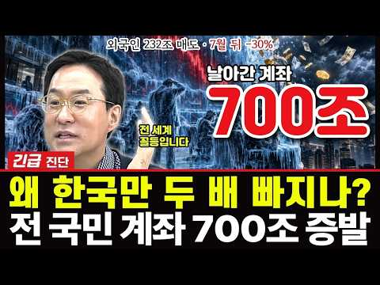
- 챕터: 0:00 하이라이트 — "700조, 800조가 날아갔어요" · 0:15 [경제야놀자 해설] 왜 한국만 두 배 빠지나 · 0:29 경제는 멀쩡, 문제는 수급 · 1:43 외국인 232조 매도 · 아직 차익 구간 · 2:56 [경제야놀자 해설] 외국인 232조 매도 · 3:17 반도체가 최선호에서 밀렸다 · 4:13 삼전닉스 60%의 함정 · 5:49 [경제야놀자 해설] 삼전닉스 60%의 함정 · 6:12 개인은 얼음 — 매물대 130조 · 거래대금 -70% · 7:20 수급의 대꼬임 · 8:39 [경제야놀자 해설] 외국인을 부를 두 가지 · 8:56 외국인은 언제 돌아오나 — 2차 웨이브 · 배당 5% · 10:21 시장의 신뢰를 회복할 비상 대책 · 10:35 전 국민 재산이 주식에 · 10:55 누구를 믿고 · 11:19 [경제야놀자 해설] 오늘의 세 줄 정리
- 설명 앞부분: 일본이 4% 빠진 날, 한국은 왜 두 배 넘게 빠졌을까. 매불쇼에서 박시동 평론가가 내놓은 답은 수급이다. 성장률 3.3%, 수출 최고치, 경제 기초는 멀쩡한데 사려는 사람이 없다는 것. 외국인은 올해 232조원을 팔았다. 작년 4월 2300선에서 산 돈은 아직 남는 장사고, 큰손은 반도체를 최선호에서 내렸다. 코스피의 60%가 삼성전자와 SK하이닉스라, 두 종목을 덜어 내는 동안엔 다른 한국 주식을 살 이유가 없다. 받아 줄 개인은 얼음이다. 매물대 130조원, 거래대금은 5월의 30%, 예탁금은 100조원 아래. 그럼 외국인은…
- 대본 (음성인식(앞 5분), 5.8 음절/초) — 앞부분만, 흐름은 그 안까지 첫 20초: “그러니까 전 국민이 갖고 있는 계좌 중에서 700조 800조가 날라갔어요. 그리고 7월부터 지금까지 주가 수익률을 보면 우리 시장이 마이너 30에 오늘부터 그래서 어떻게 되게요. 전 세계 꼴등입니다. 우리가 전 세계 1등이었잖아요. 전 세계 1등을 했는데 하반기 전 세계 꼴등이에요. 10월 15일 한국 증시는 일본 보다 두 배 넘게 빠졌습니다. 박시동 평론가는 경제는 멀쩡한데 사려는 사람이 없는 수급이 문제라고 했습니다.” — 도입부 유형: 숫자로 시작
- 첫 1분: “그러니까 전 국민이 갖고 있는 계좌 중에서 700조 800조가 날라갔어요. 그리고 7월부터 지금까지 주가 수익률을 보면 우리 시장이 마이너 30에 오늘부터 그래서 어떻게 되게요. 전 세계 꼴등입니다. 우리가 전 세계 1등이었잖아요. 전 세계 1등을 했는데 하반기 전 세계 꼴등이에요. 10월 15일 한국 증시는 일본 보다 두 배 넘게 빠졌습니다. 박시동 평론가는 경제는 멀쩡한데 사려는 사람이 없는 수급이 문제라고 했습니다. 외국인은 왜 계속 팔고 개인은 왜 받지 못할까요. 끝까지 확인해 보세요. 그리고 저는 이제 제일 큰 우리 시장의 요새의 문제를 수급으로 봅니다. 결국에는 두 가지인데요. 하나는 야 돈 잘 벌어. 너 원래 괜찮은 애 맞아. 장사 잘 되라고 하는 게 펀더멘탈이잖아요. 그게 충족이 된 다음부터는”
- 흐름 (90초마다 첫 문장): 0:00 그러니까 전 국민이 갖고 있는 계좌 중에서 700조 800조가 날라갔어… → 1:32 살람을 얼마든지 살 수 있는 시장과 종목들입니다. → 3:01 상반기에는 개인이 그 물량을 다 받아내며 고점까지 올랐습니다. → 4:30 그러면 한국 시장이 특징이 뭐냐.
- 댓글 126/126: 좋은 점 — 영상 0 · 감사·응원 0 · 더 알고 싶은 것 1 · 아쉬운 점 — 영상 0 · 반박·불만 — 의견 다름 1 · 정치·사회 21 · 경험 공유 3 · 구독·다음 기대 0
  - 더 알고 싶은 것 👍1 “반도체전문애널리스트와삼전7만원외치는인간하고마창토론좀추진하면안될까요?어느정도야지 혹시인버스쳤으면수사받아야함.김거희와뭐가다른가?유가,금리로인해부침이있는거는인정근데전세계증권사애널들은바보인가?참어어가없네.부탁드립니다.”
  - 반박·불만 — 의견 다름 👍5 “우와 박시동이...헛소리에 내가 무슨말을 하리요 맛춘적이 없는데...”
  - 정치·사회 👍17 “정부가 나서서 광주에 공장 짓자고 하는 순간부터 모든게 끝난거야......정부에 휘들리는 기업... 누가 투자하냐”
  - 정치·사회 👍15 “왜 빠졌냐? 답은 간단하지요. 특히 삼성전자(우)는 펀더맨탈이 세계제일입니다. 이재명정귄의 정치,경제의 불획실성입니다. 삼전닉스를 정치에 이용하고 멱살잡고 패대기친것을 본 외국투자자들은 싹수없다고 보는것입니다. 투자국이 한국뿐입니까”
  - 경험 공유 👍5 “우와 박시동이...헛소리에 내가 무슨말을 하리요 맛춘적이 없는데...”
  - 경험 공유 👍2 “내가 그랬잖아. 외인 2월 중순부터 계속 매도 중이라고, 그런데 개미들은 지금 주식 안하면 바보된다고 주변인 끌어들였음. 가격이 엄청 올랐는데 외인 파는게 맞지. 좋은 뉴스? 이런 것 다 필요없다. 걍, 급경사로 올려 개미들 끌여들이고 이젠 계속 매도할 타이밍이니까 …”

### 15. Eric Sprott Is Buying These 5 Junior Mining Stocks Right Now

- https://www.youtube.com/watch?v=lZZ0VA9ihF0 · Resource Room · 구독자 985 · 조회수 55,762 (×56.6, 하루 1,646.8) · 좋아요 866 (1.6%) · 9.9분 · 2026-10-15 · 주제 묶음 기타 · 형식 정보·해설 (그 밖) · 폴더 `W_lZZ0VA9ihF0` (웹 승인)
- 썸네일: 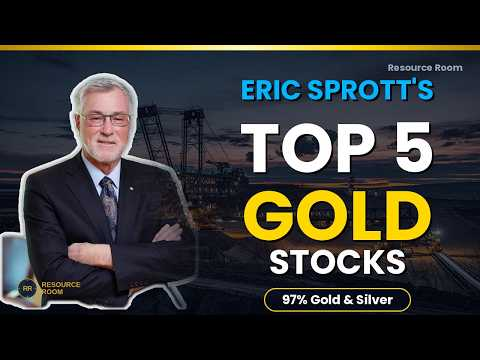
- 설명 앞부분: Eric Sprott has roughly 97% of his assets deployed in gold and silver at all times. He personally leads private placements, files early warning reports, and keeps buying through price increases. When he moves on a junior mining stock, the entire sector pays attention. In this video I tracked down 5…
- 같은 채널 평소 대비 ×4.4 (채널 최근 롱폼 중앙값 12,640회) · 평소 영상: Michael Gentile's Top 5 Gold Stocks Right Now (12,892회) / Top 5 Copper Stocks For 2026 You Don't Want To Mi… (12,388회)
- 대본 없음 (설명) — 음성인식이 끝나면 도입부·흐름이 들어감
- 댓글 75/93: 좋은 점 — 영상 0 · 감사·응원 0 · 더 알고 싶은 것 0 · 아쉬운 점 — 영상 0 · 반박·불만 — 의견 다름 0 · 정치·사회 0 · 경험 공유 0 · 구독·다음 기대 0

### 16. S&P 500에 투자하면 노후 걱정 전혀 없습니다! 주식으로 부자 되는 가장 빠른 방법

- https://www.youtube.com/watch?v=_fnvM4hpX44 · 오피디의 머니노트 · 구독자 2,090 · 조회수 110,474 (×52.9, 하루 3,468.3) · 좋아요 414 (0.4%) · 16.4분 · 2026-10-17 · 주제 묶음 2. 장기투자·ETF·지수 · 형식 정보·해설 (그 밖) · 폴더 `W__fnvM4hpX44` (웹 승인)
- 썸네일: 
- 챕터: 0:00 인트로 · 0:59 버핏의 S&P 500 유언 · 2:13 S&P 500은 무엇인가 · 4:08 S&P 500의 과거 수익률 · 6:02 20년 전 S&P 500에 100만원 투자했다면 · 8:25 버핏은 왜 S&P 500을 골랐을까 · 9:45 지금 반도체에 물려 있다면 · 10:55 거치식 vs 적립식 · 13:41 S&P 500의 단점 · 15:23 마무리
- 설명 앞부분: 워런 버핏은 아내에게 남길 돈의 90%를 S&P 500 인덱스펀드에 넣으라고 했습니다. 20년 전 1,000만 원을 S&P 500에 넣었다면 지금 1억 1,600만 원, 코스피였다면 4,270만 원입니다. S&P 500이 무엇인지, 과거 수익률과 폭락 후 회복, 사상 최고치에서 사도 되는지, 거치식과 적립식 중 어떤 주식투자 방법이 나은지, VOO·SPY·IVV 차이와 환율·세금 같은 단점까지 실제 데이터로 정리했습니다.
- 같은 채널 평소 대비 ×83.2 (채널 최근 롱폼 중앙값 1,328회) · 평소 영상: 주식 초보가 사면 떨어지고 팔면 오르는 이유 ∣ 하이닉스 물린 개미들의 공통점 (1,472회) / 달러 떨어지는데 코스피까지 빠지는 이유, 지금 주식 팔아야 할까? (383회)
- 대본 (음성인식(앞 5분), 5.3 음절/초) — 앞부분만, 흐름은 그 안까지 첫 20초: “하이닉스를 꼭대기에서 사신 분이라면 지금 계좌는 반토막보다 더 빠져있을 겁니다 6월에 291만원까지 갔던 주가가 넉 달 만에 126만원이 됐으니까요 그런데 같은 넉 달 동안 바다 건너 미국 S&P 500은 오히려 조금 올랐어요 지금도 사상 최고치 바로 아래에 있습니다 세계에서 가장 유명한 투자자 워런 버핏은 이런 유언을 남겼습니다” — 도입부 유형: 질문으로 시작, 숫자로 시작
- 첫 1분: “하이닉스를 꼭대기에서 사신 분이라면 지금 계좌는 반토막보다 더 빠져있을 겁니다 6월에 291만원까지 갔던 주가가 넉 달 만에 126만원이 됐으니까요 그런데 같은 넉 달 동안 바다 건너 미국 S&P 500은 오히려 조금 올랐어요 지금도 사상 최고치 바로 아래에 있습니다 세계에서 가장 유명한 투자자 워런 버핏은 이런 유언을 남겼습니다 내가 죽으면 아내에게 남길 돈의 90%는 S&P 500 인덱스 펀드에 넣어라 나머지 10%는 단기 국채에 넣어라 평생 직접 종목을 골라서 수십 조원을 본 사람이 정작 가족한테는 종목이 아니라 S&P 500을 남긴 겁니다 숫자로 보면 이유가 보입니다 20년 전에 1,000만원을 코스피에 넣었다면 지금 4,270만원이 됐습니다 같은 돈을 S&P 500에 넣고 배당까지 다시 넣었다면 1”
- 흐름 (90초마다 첫 문장): 0:00 하이닉스를 꼭대기에서 사신 분이라면 → 1:32 펀드 매니저에게 돈을 맡기는 대부분의 투자자보다 결과가 좋을 거라고요 → 3:02 몇 만 원만 있어도 → 4:33 오른 해가 30번
- 댓글 63/92: 좋은 점 — 영상 0 · 감사·응원 2 · 더 알고 싶은 것 0 · 아쉬운 점 — 영상 0 · 반박·불만 — 의견 다름 1 · 정치·사회 0 · 경험 공유 9 · 구독·다음 기대 0
  - 감사·응원 👍7 “저는 한국주식도 좋지만 KODEX 미국S&P500에 매수할 예정입니다. ❤ 감사합니다.”
  - 경험 공유 👍13 “결론 = s&p500은 노후준비용으로 젊었을때부터 해라 은퇴시기에 들어갔다가 그게 고점이면 내가 죽을때쯤 복구될수도 있다”
  - 경험 공유 👍8 “올해까지 3년차 연금저축펀드 타이거 s&p500 풀매수 했습니다 😊진짜 너무 만족합니다 아닥 s&p500 ㅋㅋㅋㅋㅋㅋㅋ”

### 17. 나스닥은 버티는데 아이온큐가 일주일 새 20% 빠진 건 망해서가 아닙니다 — 가트너가 말한 퇴출 명단은 따로 있습니다 #미국주식 #아이온큐 #리게티 #경제노트

- https://www.youtube.com/watch?v=IbkLrISwBiU · 경제전략노트 · 구독자 747 · 조회수 38,310 (×51.3, 하루 1,102.2) · 좋아요 206 (0.5%) · 14.4분 · 2026-10-14 · 주제 묶음 4. 미국·해외주식 · 형식 정보·해설 (그 밖) · 폴더 `W_IbkLrISwBiU` (웹 승인)
- 썸네일: 
- 설명 앞부분: 10월 6일부터 13일까지 5거래일 동안 아이온큐(IONQ)는 19.8% 빠졌고, 나스닥 100은 2.1% 내리는 데 그쳤습니다. 가트너는 올해 전 세계 양자컴퓨팅 매출을 8억 6,990만 달러, 내년을 약 11억 달러로 전망했습니다. 보도에 따르면 가트너는 매출이 모자란 양자 스타트업 절반 이상이 2030년까지 문을 닫을 것으로 봤습니다. 아이온큐의 올해 매출 전망 2억 8천만~2억 9천만 달러는 그 시장의 약 3분의 1입니다(집계 기준 차이 가능). 리게티(RGTI)는 2분기 매출 510만 달러, 빚 없이 현금 5억 4,130…
- 같은 채널 평소 대비 ×24.4 (채널 최근 롱폼 중앙값 1,568회) · 평소 영상: AI 반등 명단에 아이온큐가 없던 건 버림받아서가 아닙니다 — 첫날 돈은 이익률 55%인… (1,568회) / 나테라와 템퍼스AI 두 거물의 승부는? 드러켄밀러 1위 종목은 암 재발을 피로 찾는 나테… (1,493회)
- 대본 (음성인식(앞 5분), 4.8 음절/초) — 앞부분만, 흐름은 그 안까지 첫 20초: “지난 10월 6일부터 13일까지 딱 5거레일이었습니다. 그 사이 아이온큐는 43.29달러에서 34.73달러로 19.8% 빠졌어요. 같은 기간 나스닥 백지수는 2.1% 내리는 데 그쳤고요. 퀀티넘과 리게티, 디웨이브도 같이 빠지면서 모두 6개월 최적가로 내려왔습니다.” — 도입부 유형: 질문으로 시작, 숫자로 시작
- 첫 1분: “지난 10월 6일부터 13일까지 딱 5거레일이었습니다. 그 사이 아이온큐는 43.29달러에서 34.73달러로 19.8% 빠졌어요. 같은 기간 나스닥 백지수는 2.1% 내리는 데 그쳤고요. 퀀티넘과 리게티, 디웨이브도 같이 빠지면서 모두 6개월 최적가로 내려왔습니다. 지수는 버티는데 양자주만 따로 무너진 일주일이었던 거죠. 그래서 이런 말이 나옵니다. 세계적인 시장조사회사 같은어가 양자회사 절반이 망한다고 했다는 거예요. 그러니 아이온큐도 결국 그 절반에 들어간다는 거죠. 실제로 같은 어는 10월 8일 양자컴퓨팅 시장 전망을 내놨습니다. 그리고 12일에는 아이온큐가 보안 회사를 주식으로 사들인다는 발표까지 겹쳤어요. 여러분도 이 일주일을 보시면서 불안하셨을 거예요. 혹시 이게 끝의 시작은 아닌지 말이죠? 그런”
- 흐름 (90초마다 첫 문장): 0:00 지난 10월 6일부터 13일까지 딱 5거레일이었습니다. → 1:32 그리고 셋째, 리게티와 아이온큐 두 회사를 끝까지 파보겠습니다. → 3:01 이거 어디서 보지 않았나요? → 4:33 리게티의 2분기 매출은 510만 달러였어요.
- 댓글 10/11: 좋은 점 — 영상 0 · 감사·응원 1 · 더 알고 싶은 것 0 · 아쉬운 점 — 영상 0 · 반박·불만 — 의견 다름 0 · 정치·사회 0 · 경험 공유 0 · 구독·다음 기대 0
  - 감사·응원 👍0 “빠른정보 감사합니다”

### 18. 70배당할머니 배당금으로 자동차 샀어요

- https://www.youtube.com/watch?v=yUIcS9aKUzg · 이수남 · 구독자 1,300 · 조회수 13,155 (×10.1, 하루 1,901.4) · 좋아요 111 (0.8%) · 17.6분 · 2026-10-14 · 주제 묶음 3. 배당 · 형식 정보·해설 (그 밖) · 폴더 `W_yUIcS9aKUzg` (웹 승인)
- 썸네일: 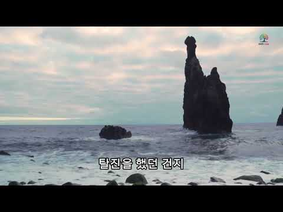
- 대본 (음성인식(앞 5분), 3.1 음절/초) — 앞부분만, 흐름은 그 안까지 첫 20초: “네 오늘 오전에 새 자동차 코나가 집 앞에 왔습니다. 뭐 그렇게 비싸고 좋은 차는 아니지만 정말 아주 오랜만에 새 차를 구입했습니다.”
- 첫 1분: “네 오늘 오전에 새 자동차 코나가 집 앞에 왔습니다. 뭐 그렇게 비싸고 좋은 차는 아니지만 정말 아주 오랜만에 새 차를 구입했습니다. 시골은 차가 없으면 무척 불편합니다. 그동안 타오던 아반대도 제가 좋아하는 차 모델이라 새 차도 아반대로 하고 싶었지만 새로 나오는 아반대가 너무 많이 기다려야 한다고 해서 친구의 권유도 있고 해서 코나를 사게 되었습니다. 저는 32살에 처음 프라이드를 탔습니다. 남편은 기아 프라이드 빨강색을 아주 생색을 내면서 사주면서 신우이들과 공동으로 쓰라고 했습니다.”
- 흐름 (90초마다 첫 문장): 0:00 네 오늘 오전에 새 자동차 코나가 집 앞에 왔습니다. → 1:35 뭐 올라갈 수도 없고 내려갈 수도 없고 그대로 섰다가 → 3:03 지금 기억으로는 대우 르망 같은 에요. → 4:37 너무 추워서 뭐 마이너스 27도 영화 27도 가면 막 트럭이 가다가 수…
- 댓글 27/27: 좋은 점 — 영상 0 · 감사·응원 1 · 더 알고 싶은 것 1 · 아쉬운 점 — 영상 0 · 반박·불만 — 의견 다름 0 · 정치·사회 0 · 경험 공유 3 · 구독·다음 기대 0
  - 감사·응원 👍2 “진솔한 목소리로 삶의 여정을 들려주셔서 감사합니다. 왠지 살아갈 날들이 무섭지 않네요~~”
  - 더 알고 싶은 것 👍2 “리이즈코리아벨리어커버드코드번호알려주세요”
  - 경험 공유 👍3 “저도 57세에 운전을 시작했어요~^^ 더 나이 먹음 못할거 같고, 정년 이후 여행 하려면 운전은 필수 인거 같아요 ㅎ 요즘 동생이랑 각자 자차로 운전해서 여행 다니는데 너무 좋아요😅😊”
  - 경험 공유 👍2 “자동차 일대기 너무 재미 있어요^^ 노동수입은 한계가 있어요. 몸둥이는 한개인데.. 금융수입이 답이라는 결론을 내리고 저도 배당주올인 입니다^^”

### 19. 단타 5년차가 알려준 ＂잃지 않는 법＂ 딱 3가지 ｜ 코스피 9000시대 생존법

- https://www.youtube.com/watch?v=WnuVkKRjcuI · 돈의흐름도 · 구독자 1,380 · 조회수 153,227 (×111.0, 하루 1,918.8) · 좋아요 2,650 (1.7%) · 13.5분 · 2026-08-09 · 주제 묶음 5. 국내주식 · 형식 정보·해설 (그 밖) · 폴더 `W_WnuVkKRjcuI` (웹 승인)
- 썸네일: 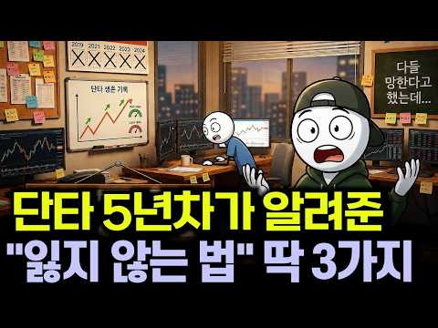
- 설명 앞부분: 단타 5년차가 알려준 ＂잃지 않는 법＂ 딱 3가지 ｜ 코스피 9000시대 생존법 경제를 제대로, 그리고 쉽게. 🏴‍☠ 이 채널에서 다루는 것들 주식·ETF·배당주 투자 분석 환율·금리·인플레이션 경제 해설 미국·한국 증시 및 글로벌 시장 동향 부동산·원자재·달러 등 자산 시장 분석 재테크 초보를 위한 경제 상식 어렵고 딱딱하게만 느껴지던 경제 뉴스, 경제해적단과 함께라면 달라집니다. 복잡한 시장의 흐름을 단순하고 명확하게 짚어드립니다. 월급쟁이도, 사회초년생도, 재테크를 막 시작한 분도 경제해적단과 함께라면 경제가 보이기 시작합니…
- 같은 채널 평소 대비 ×8,512.6 (채널 최근 롱폼 중앙값 18회) · 평소 영상: ＂천만원으로 3억, 매달 50만원이 20년 뒤 만드는 숫자＂ (18회) / ＂50대 노후 3억, 매달 100만원 만드는 법 (연금·복리·종잣돈)＂ (18회)
- 대본 (음성인식(앞 5분), 5.5 음절/초) — 앞부분만, 흐름은 그 안까지 첫 20초: “제가 아는 동생 중에 단타로 5년째 먹고 사는 친구가 있어요 전업으로요? 처음엔 저도 안 믿었어요 다들 망한다는 단타로 어떻게 5년을 버티냐고요 근데 옆에서 매매하는 걸 보고 깜짝 놀랐어요 종목을 신들린 듯 고를 줄 알았는데 의외로 사곱하는 건 되게 단순하더라고요 대신 딱 하나 남들이 절대 안 지키는 걸 기계처럼 지키고 있었어요” — 도입부 유형: 질문으로 시작, 숫자로 시작, 내 이야기·사연
- 첫 1분: “제가 아는 동생 중에 단타로 5년째 먹고 사는 친구가 있어요 전업으로요? 처음엔 저도 안 믿었어요 다들 망한다는 단타로 어떻게 5년을 버티냐고요 근데 옆에서 매매하는 걸 보고 깜짝 놀랐어요 종목을 신들린 듯 고를 줄 알았는데 의외로 사곱하는 건 되게 단순하더라고요 대신 딱 하나 남들이 절대 안 지키는 걸 기계처럼 지키고 있었어요 그게 뭐냐고 물어봤죠 그 친구가 한 말이 잊지 않아요 형 단타는 잘 사는 기술이 아니라 잘 버티는 기술이에요 차트 공부 100날 해봐야 소용 없다는 거예요 오늘 그 동생이 5년 동안 지켜온 그 한 가지를 여러분한테 그대로 풀어드릴게요 그리고 100만 원으로 그걸 어떻게 몸에 익히는지까지요 이거 하나만 가져가셔도 오늘 영상 값은 하실 거예요 끝까지 보세요 좋아요, 구독, 알림 설정 꼭”
- 흐름 (90초마다 첫 문장): 0:00 제가 아는 동생 중에 단타로 5년째 먹고 사는 친구가 있어요 → 1:31 이런 장을 보면 무슨 생각이 들까요? → 3:02 수익률은 오히려 더 낮았어요 → 4:31 근데 손실이 난 종목은 22%만 팔아요
- 댓글 96/96: 좋은 점 — 영상 3 · 감사·응원 2 · 더 알고 싶은 것 3 · 아쉬운 점 — 영상 4 · 반박·불만 — 의견 다름 3 · 정치·사회 0 · 경험 공유 7 · 구독·다음 기대 1
  - 좋은 점 — 영상 👍6 “너무 꼭 맞는 말씀입니다. 100원만 수익을 본다하더라도 100만원 1000만원 욕심을 버리기까지...다겪어봐야 조금 느끼게 되더라구요..”
  - 좋은 점 — 영상 👍2 “도움이 많이 됐습니다.참고하도록할께요.잠시 잊고 단타를 해서 손절 많이 했는데 이영상보고 뜨끔했네요.좋은영상 감사합니다”
  - 감사·응원 👍2 “도움이 많이 됐습니다.참고하도록할께요.잠시 잊고 단타를 해서 손절 많이 했는데 이영상보고 뜨끔했네요.좋은영상 감사합니다”
  - 더 알고 싶은 것 👍1 “구독, 좋아요,,,알림설정. 알려주세요.”
  - 아쉬운 점 — 영상 👍4 “단타 30년차로 잃지 않는 방법을 알려준다면 당장 주식을 접어라 그게 유일한 방법이다 그래도 주식을 하고 싶다면 종목을 보고 매매 하지말고 시장을 보고 매매해라 시장이 아니라고 하는데 시장을 이길라고 덤비면 백퍼 망한다 종목 차트 백날 선으로 찍찍 그어봐야 시장폭락하…”
  - 아쉬운 점 — 영상 👍2 “에이라.. 뻔한 이야기 가지고.. 뭐 특별한 비법이 있는 거 마냥...”
  - 반박·불만 — 의견 다름 👍5 “챠트 보는 법도 아니라 하고, 보조지표 보는 것도 아니라 하고, 종목 찍는 법도 아니라하는 건 제대로 공부를 안 했거나, 남들 말과 책에 쓰인 대로 맹신하며 투자하기 때문임. 제대로 알면 확률은 엄청난데 어설피 배우고 익힌 실력으로 하다가 매번 실패하는 경우가 많게 …”
  - 반박·불만 — 의견 다름 👍0 “영상 좋아요. 그런데 영상 후반부에 내가 이런 걸 지킬 자신이 있는가라고 자문해보라고 하시는데, 이런건 머리로 상상으로 자문한다고 알 수 있는 건 아니죠. 결국 몸으로 경험해봐야 내가 될놈인지 안될놈인지 체득할 수 있죠.”
  - 경험 공유 👍17 “많은 시련을 겪고 나서야만이 이 영상의 의미가 얾마나 중요한지를 깨닫게 되지요.”
  - 경험 공유 👍14 “단타는 잃지 않는게 중요.. 내가 정한 매도 포인트에서 기계적으로 매도해야함. 욕심내는 순간 지옥으로 떨어짐.”
  - 구독·다음 기대 👍1 “구독, 좋아요,,,알림설정. 알려주세요.”

### 20. 50대 옥탑방 부부, "그 나이에 왜 주식을..."

- https://www.youtube.com/watch?v=FRzyTNO9mNI · 반백살, 옥탑방 이야기 · 구독자 703 · 조회수 43,815 (×62.3, 하루 954.9) · 좋아요 427 (1.0%) · 6.3분 · 2026-10-03 · 주제 묶음 1. 주식 기초·초보 · 형식 정보·해설 (그 밖) · 폴더 `W_FRzyTNO9mNI` (웹 승인)
- 썸네일: 
- 설명 앞부분: 지난 영상 이후, 50대 옥탑방 부부인 저희의 주식 도전에 많은 분들이 걱정과 조언을 남겨주셨습니다. 진심으로 감사드립니다. "그 나이에 왜 위험하게 주식을 하느냐"는 물음에 오늘 제 진솔한 속마음을 전합니다. 사기와 빚을 겪으며 깨달은 금융 무지의 서러움, 그리고 평생 일할 수 없다는 현실 앞에 저희에게 파이어족은 노후를 위한 '마지막 생존 전략"입니다. 지치지 않고 끝까지 걸어갈 수 있도록 많은 응원과 격려 부탁드립니다. 오늘도 시청해 주셔서 감사합니다.
- 같은 채널 평소 대비 ×13.3 (채널 최근 롱폼 중앙값 3,301회) · 평소 영상: "여보 제발 나가지 마!" 돈 없는데 비 온다고 일 안 못나가는 이유 (3,652회) / 8월 폭염 속, 침침해진 눈으로 배달을 나섭니다. (3,655회)
- 대본 (음성인식(앞 5분), 4.2 음절/초) — 앞부분만, 흐름은 그 안까지 첫 20초: “안녕하세요 구독자 여러분 50대 옥탑방 아내입니다. 어느 덧 바람 끝이 제법 선선해진 가을이 왔네요. 하늘도 높아지고 날씨가 참 좋습니다. 우리 구독자분들도 오늘 하루 기분 좋게 잘 보내고 계신가요? 옥탑방에서 바라보는 하늘은 계절이 바뀔 때마다 괜히 마음을 몽글몽글하게 만드는 것 같아요.” — 도입부 유형: 숫자로 시작, 시청자 부르기
- 첫 1분: “안녕하세요 구독자 여러분 50대 옥탑방 아내입니다. 어느 덧 바람 끝이 제법 선선해진 가을이 왔네요. 하늘도 높아지고 날씨가 참 좋습니다. 우리 구독자분들도 오늘 하루 기분 좋게 잘 보내고 계신가요? 옥탑방에서 바라보는 하늘은 계절이 바뀔 때마다 괜히 마음을 몽글몽글하게 만드는 것 같아요. 오늘 이렇게 영상을 제작하는 것은 지난 영상 이후에 정말 많은 분들이 남겨주신 댓글에 마음 깊이 감사하다는 말씀을 전하고 싶어서 입니다. 제가 주식공부에 보겠다고 말씀드린 이후로 걱정 어린 마음으로 따뜻한 조언과 충고를 남겨주신 분들이 정말 많았어요. 주식은 위험하다 잘못하면 큰일 난다 하며 자기 일처럼 걱정해주시는 마음 하나하나 읽으면서 얼마나 감사했는지 모릅니다.”
- 흐름 (90초마다 첫 문장): 0:00 안녕하세요 구독자 여러분 50대 옥탑방 아내입니다. → 1:36 나이가 한 살 한 살 들수록 느끼는 게 있어요. → 3:06 그 분야에 제대로 뛰어들려면 정말 피나는 공부와 노력이 필요하다는 것을… → 4:36 지금은 남편과 제가 노동소득으로 벌고 있지만 저라도 자본소득을 공부하고…
- 댓글 187/187: 좋은 점 — 영상 6 · 감사·응원 27 · 더 알고 싶은 것 3 · 아쉬운 점 — 영상 1 · 반박·불만 — 의견 다름 3 · 정치·사회 2 · 경험 공유 20 · 구독·다음 기대 0
  - 좋은 점 — 영상 👍10 “목소리가 좋으시네요 편안하고 듣기에 좋아요 비슷한 나이인데 주식을 해 보고 있어요 손절하여서 손해도 보았지만 그러면서 배우고 있어요 같은 생각으로 하며 접근하고 있어요 성투하시길 바래요🎉”
  - 좋은 점 — 영상 👍4 “목소리가 차분하고 편안해서 듣기 좋습니다~~ 힘내시고 파이팅 하세요~~”
  - 감사·응원 👍17 “목소리 좋으시네요 아무것도 안하면 아무것도 될 수 없을 껍니다 화이팅 하시길요”
  - 감사·응원 👍16 “저도 주식하면 패가 망신한다는 부모님 말씀을 금과옥조로 여기며 살다가, 50세가 넘은 나이에, 금기의 영역으로 생각했던 주식을 시작했어요. 개별주는 하나도 안하고, 미국지수, 국내지수만 투자하는데...진작 시작할걸 싶네요. 3년전부터 했는데 5년전, 10년전 시작할걸…”
  - 더 알고 싶은 것 👍2 “영상 자주 올려주세요❤ 주식공부도 열심히 하시고 화이팅입니다 ❤”
  - 더 알고 싶은 것 👍2 “뭐하나 물어볼게요..주식하셔서 얼마나 버셔서 만족 하실가요? 그냥 전 풍차돌리기 예금이나 적금 추천드리고...인생 한방 절대 없습니다. 소수의 행운이 나에게 올 확률이 정말 힘들다는거 다시 한번 이 나이에 잊지 마시길 부탁드립니다.”
  - 아쉬운 점 — 영상 👍1 “위 제목 아래에 AI라고 써있는데요 목소리는 ai같지않고 영상도 ai같지않은데..어느것이 Ai 인가요?”
  - 반박·불만 — 의견 다름 👍2 “하지마시고 한국 미국 반반 지수 장기투자하세요. 몇달한다고 되는게 아닙니다.”
  - 반박·불만 — 의견 다름 👍0 “안녕하세요 52인데요^^ 너무 공감합니다. ISA계좌 연금저축계좌 먼저만드세여 ISA계좌는 한해2천만원해서5년1억가능합니다.연금계좌는 1800까지가능합니다. 우리가족모두 만들어서 하고있네여. 종목추천은아닙니다 제가하는겁니다. ISA계좌에서 하시면 배당세금없이 재투자 …”
  - 정치·사회 👍1 “대통령이 하라해서 ㅡㅡㅡㅡ. 돈번것들은 재용 태원이ㅡㅡㅡㅡ”
  - 정치·사회 👍0 “제 경험을 말씀드려 볼게요. 현재 54살 노총각입니다. 24년 하반기부터 10년 이상 다니던 직장이 경기가 안좋아지면서 해고 위기가 느껴졌습니다. 당시까지 모아둔 돈이라곤 현금 3억 조금 넘게 가지고 있었고 집은 월세 45만원 오피스텔에 살고 있었죠. 당장 짤리면 4…”
  - 경험 공유 👍26 “목소리가 참 좋으시네요😊 저도 50대 중반이고 주식으로 노후자금 준비를 하고있어요 이제는 근로소득만 가지고 자산을 늘리는 시대는 끝났다고 봅니다 부동산은 목돈이 들어가니 서민들은 주식이 접근하기 쉽죠 저도 처음에 주식.금융공부 많이 하고 시작했는데요, 결국 공부보다 …”
  - 경험 공유 👍16 “저도 주식하면 패가 망신한다는 부모님 말씀을 금과옥조로 여기며 살다가, 50세가 넘은 나이에, 금기의 영역으로 생각했던 주식을 시작했어요. 개별주는 하나도 안하고, 미국지수, 국내지수만 투자하는데...진작 시작할걸 싶네요. 3년전부터 했는데 5년전, 10년전 시작할걸…”

### 21. 마이너스 주식 계좌 가장 쉽게 탈출하는 방법 물타기? 존버? 고민하지 않아도 되는 물린 종목 최대한 손실을 줄이며 정리하는 현명한 방법

- https://www.youtube.com/watch?v=v6rUCbULG2A · 머니스트랩 · 구독자 852 · 조회수 97,361 (×114.3, 하루 1,114.8) · 좋아요 1,124 (1.1%) · 30.5분 · 2026-08-23 · 주제 묶음 8. 투자 심리·실패 · 형식 정보·해설 (그 밖) · 폴더 `W_v6rUCbULG2A` (웹 승인)
- 썸네일: 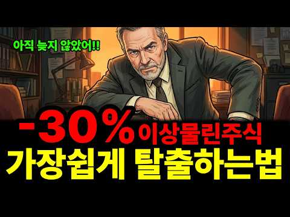
- 설명 앞부분: 지수는 사상 최고를 찍었는데 왜 내 계좌만 파란색일까요. 개인 투자자 240만 명의 계좌를 열어본 자료에서 출발해, 물린 종목을 손실을 줄이며 정리하고 제대로 된 자리로 옮기는 순서를 정리했습니다. 이 영상에서 다루는 내용
- 같은 채널 평소 대비 ×181.0 (채널 최근 롱폼 중앙값 538회) · 평소 영상: "1억 모으는데 12년 4개월" 실수령 200만원이 1억 모으는 시간을 5년 당기는 5가… (577회) / 연봉 일억 현실 "연봉 1억이면 여유롭겠지?" 진짜 억대 연봉자들은 지금 어떻게 살고 있… (499회)
- 대본 (음성인식(앞 5분), 4.9 음절/초) — 앞부분만, 흐름은 그 안까지 첫 20초: “물려 있다는 사실을 잊고 계셨다면 그나마 나은 쪽입니다. 진짜 문제는 매일 확인하면서도 아무것도 못하는 경우입니다. 아마 셋 중 하나일 겁니다. 계좌에 있는 줄도 모르고 몇 년을 지나친 종목. 매일 열어보지만 몇 년째 빠져나오지 못한 종목. 그리고 지금 팔면 정말 끝이라 참아 손을 못 떼는 종목.”
- 첫 1분: “물려 있다는 사실을 잊고 계셨다면 그나마 나은 쪽입니다. 진짜 문제는 매일 확인하면서도 아무것도 못하는 경우입니다. 아마 셋 중 하나일 겁니다. 계좌에 있는 줄도 모르고 몇 년을 지나친 종목. 매일 열어보지만 몇 년째 빠져나오지 못한 종목. 그리고 지금 팔면 정말 끝이라 참아 손을 못 떼는 종목. 마지막에 해당하신다면 오늘은 끝까지 보셔야 합니다. 그 결정을 미루는 동안 여러분 계좌에서 무엇이 사라지고 있는지 숫자로 보여드리겠습니다. 2025년 10월 31이었습니다. 그날 아침 뉴스의 첫 곡지는 코스피가 사상 최고치를 갈아치웠다는 소식이었죠. 빨간 숫자로 가득 찬 전광판 화면이 하루 종일 흘러 나왔고 증권 방송에서는 축포 같은 표현들이 오갔습니다. 바로 그날 한 대형증권사가 자사 고객의 계좌를 통째로 들여다”
- 흐름 (90초마다 첫 문장): 0:00 물려 있다는 사실을 잊고 계셨다면 그나마 나은 쪽입니다. → 1:35 물론 모두가 같은 크기로 물려 있는 건 아닙니다. → 3:00 우리는 보통 이 둘을 하나로 놓고 생각합니다. → 4:31 16번 통째로 갈아옵는다는 뜻이죠.
- 댓글 38/38: 좋은 점 — 영상 2 · 감사·응원 4 · 더 알고 싶은 것 1 · 아쉬운 점 — 영상 0 · 반박·불만 — 의견 다름 0 · 정치·사회 2 · 경험 공유 1 · 구독·다음 기대 0
  - 좋은 점 — 영상 👍16 “많은 도움이 됬습니다 로봇주애 _47% 물려있는데 하락장애서 매도 찬스를 놓쳐서 ㅠㅠ 처음엔 물타기 하다가 그때마다 하락해서 더 나락.ㅠㅠ 지근은 포기하고 분할매도 하고 반 남았는데 나머지도 분할매도 할 예정입니다”
  - 좋은 점 — 영상 👍1 “좋은 강의입니다.👍👍👍”
  - 감사·응원 👍8 “감사합니다..........”
  - 감사·응원 👍6 “카카오 안산다 ㅋ 감사 합니다”
  - 더 알고 싶은 것 👍0 “그럼 오른건 언제파나요?”
  - 정치·사회 👍5 “이재명 대통령님 응원합니다.”
  - 정치·사회 👍0 “웃기지마라 개미들 구십프로가 아작이났는데 뭐가 오십 팔프로라고 개소리 그만해 이번주식시장은 정부가 외국펀드투자판을 깔아준것인데 무슨 개소리 개미가 아무리 잘한다해도 거대한 자본으로 죠지는데 무슨 뾰쪽한수가 있나 솔직히 말해서 지금은 개미들 돈이 없어서 주식시장에 가고…”
  - 경험 공유 👍3 “내가 ㅅㅂ 이걸 28분을 들었어 아 진짜 내시간 금같은 내시간 이 목소리 절대듣지말자 늘 그랬건만 ㅅㅂ 아ㅅㅂ 진짜 내시간”

### 22. QLD 직투 vs ISA, 잘못 선택했다가는 10년 뒤 수 천만 원 날립니다

- https://www.youtube.com/watch?v=PEOHCf2930w · 투자각성 · 구독자 382 · 조회수 15,789 (×41.3, 하루 454.9) · 좋아요 138 (0.9%) · 8.9분 · 2026-10-14 · 주제 묶음 10. 노후·연금 투자 · 형식 정보·해설 (그 밖) · 폴더 `W_PEOHCf2930w` (웹 승인)
- 썸네일: 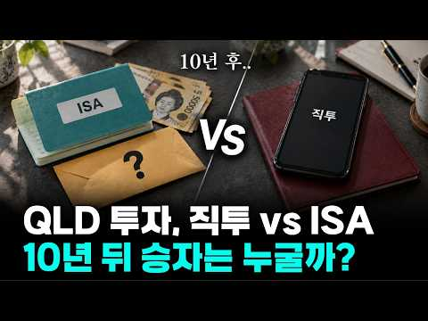
- 챕터: 0:00 ISA 가입자 1,000만 명, 나는 어디에 담을까 · 1:51 1억 넣으면 세금 1,400만 원 차이 · 6:01 ISA 나스닥 2배, 환율도 2배라고? · 8:01 그래서, 어디에 얼마를 넣을까 · 9:11 10년 전 천만 원, 지금 얼마일까 · 10:45 2배가 3배를 이긴 이유 · 12:48 2008년 같은 폭락이 오면? · 13:59 정리, 그리고 1만 달러 새 계좌
- 설명 앞부분: 나스닥 2배, ISA로 살까 미국 직투로 살까? 1년에 천만 원씩 10년이면 세금만 1,400만 원 가까이 갈립니다. 어느 통장에 얼마를 넣을지, 그리고 왜 장기로는 QLD인지 레버리지 7년 차의 시각으로 정리했습니다.
- 같은 채널 평소 대비 ×15.6 (채널 최근 롱폼 중앙값 1,011회) · 평소 영상: 주식투자에 실패 하는 공통적인 이유. 이렇게 해결하세요! (1,011회) / SOXL 15억 거래하고 내린 결론(ft.앙드레 코스톨라니 공식) (819회)
- 대본 (음성인식(앞 5분), 5.3 음절/초) — 앞부분만, 흐름은 그 안까지 첫 20초: “투자를 하다보면 한 번은 꼭 이 고민을 하게 됩니다 미국 주식을 그냥 직접 살까? 아니면 ISA로 세금 혜택까지 챙길까? 특히 나스닥 2배 같은 레버리지 상품은요 수익이 나면 크게 나기 때문에 어느 통장에 담느냐가 훨씬 중요해집니다 1년에 1,000만 원씩 10년을 모으면 통장 하나 차이로 세금만 1,400만 원 가까이 달라지거든요” — 도입부 유형: 질문으로 시작
- 첫 1분: “투자를 하다보면 한 번은 꼭 이 고민을 하게 됩니다 미국 주식을 그냥 직접 살까? 아니면 ISA로 세금 혜택까지 챙길까? 특히 나스닥 2배 같은 레버리지 상품은요 수익이 나면 크게 나기 때문에 어느 통장에 담느냐가 훨씬 중요해집니다 1년에 1,000만 원씩 10년을 모으면 통장 하나 차이로 세금만 1,400만 원 가까이 달라지거든요 ISA 가입자가 얼마 전 1,000만 명을 넘었습니다 노후준비 통장의 대표인 연금저축 가입자가 840만 명일 때 ISA 가입자가 그보다 더 많아진 겁니다 그만큼 많은 사람이 세금 아끼는 통장부터 챙기고 있다는 뜻이죠 그런데 둘 다 하라는 말은 많아도 그래서 내 돈은 어디에, 얼마를 넣어라는 건지 딱 잘나 말해주는 곳은 찾기가 쉽지 않죠 오늘은 내 상황에서 어느 쪽이 유리한지 7년”
- 흐름 (90초마다 첫 문장): 0:00 투자를 하다보면 한 번은 꼭 이 고민을 하게 됩니다 → 1:30 ISA 총 한두랑 같죠 → 3:00 수익은 건강보험료 계산에도 들어가지 않기 때문에 → 4:33 그러니까 한 달에 167만 원 이하로 투자하시는 분은
- 댓글 31/57: 좋은 점 — 영상 2 · 감사·응원 5 · 더 알고 싶은 것 2 · 아쉬운 점 — 영상 0 · 반박·불만 — 의견 다름 0 · 정치·사회 0 · 경험 공유 0 · 구독·다음 기대 1
  - 좋은 점 — 영상 👍2 “유익한 영상입니다 감사합니다🎉🎉”
  - 감사·응원 👍2 “유익한 영상입니다 감사합니다🎉🎉”
  - 감사·응원 👍1 “영상 감사합니다^^ 요즘 isa에서 한국폰 qld를 사려면 1000만원이 있어야 해서 고민입니다..1000만원을 일시로 넣고 적립식매수해도 가능한건가요?”
  - 더 알고 싶은 것 👍2 “영상 잘 보았습니다~!^^그럼 isa 계좌에서 3년 납입후 연장하고 부동산이나 큰돈 들어갈때 해지 하고 싶으면 4년후에는 해지해도 세금 해택 받을 수 있는걸까요?그리고 환헷지가 가능한 h가 붙은 상품으로이 나을지 고견 부탁드립니다~🙏이제 막 계좌 개설해서 시작 하려는…”

### 23. I Just Bought 1,600 Shares Of SCHD: Here's my Dividend payment

- https://www.youtube.com/watch?v=d23iMmo2w4o · Bald Man Finance  · 구독자 392 · 조회수 14,642 (×37.4, 하루 463.7) · 좋아요 37 (0.2%) · 19.3분 · 2026-10-17 · 주제 묶음 기타 · 형식 정보·해설 (그 밖) · 폴더 `W_d23iMmo2w4o` (웹 승인)
- 썸네일: 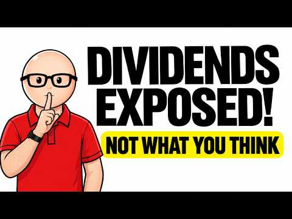
- 설명 앞부분: I Just Bought 1,600 Shares Of SCHD: Here's my Dividend payment
- 같은 채널 평소 대비 ×38.9 (채널 최근 롱폼 중앙값 376회) · 평소 영상: The 7 Levels of Wealth Where Compounding Suddenly… (376회) / The Exact Moment $10k in SCHD Become An Income Ma… (386회)
- 대본 없음 (설명) — 음성인식이 끝나면 도입부·흐름이 들어감
- 댓글 15/15: 좋은 점 — 영상 0 · 감사·응원 0 · 더 알고 싶은 것 0 · 아쉬운 점 — 영상 0 · 반박·불만 — 의견 다름 0 · 정치·사회 0 · 경험 공유 0 · 구독·다음 기대 0

### 24. Corporate Slave to Financially Free: The Passive Income 🐐

- https://www.youtube.com/watch?v=knkqhQrQS60 · The Retail Rundown · 구독자 1,580 · 조회수 89,808 (×56.8, 하루 1,584.5) · 좋아요 867 (1.0%) · 80분 · 2026-09-22 · 주제 묶음 2. 장기투자·ETF·지수 · 형식 정보·해설 (그 밖) · 폴더 `W_knkqhQrQS60` (웹 승인)
- 썸네일: 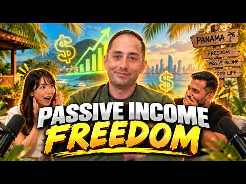
- 챕터: 0:00 Intro · 2:05 Adriano's start in trading · 4:53 Discovering dividends & cover… · 9:00 Selling the condo & hitting f… · 14:26 Quitting their jobs · 16:04 Moving to Panama tax-free · 19:37 Becoming a Canadian non-resid… · 26:51 Cost of living & healthcare i… · 44:05 Income investing & the 25% le… · 58:35 Why covered call ETFs get so … · 70:49 Portfolio reveal: $50K/month …
- 설명 앞부분: That journey led them to quit their jobs in their mid-30s, sell everything, and move to Panama full-time, where a territorial tax system means they pay almost nothing on their income. Adriano breaks down how he built his portfolio from a messy 120-holding starter fund into a focused covered call st…
- 같은 채널 평소 대비 ×12.3 (채널 최근 롱폼 중앙값 7,296회) · 평소 영상: Veteran Portfolio Manager on AI Bubble, Market Cr… (7,410회) / Turning $15 into $4000: The Most UNHINGED Side Hu… (7,181회)
- 대본 (자막, 0.0 음절/초) 첫 20초: “My wife and I were focusing on paying down the mortgage as a priority. So, we paid off our 20-year mortgage in seven years. Now, I would call my banker and say, "Increase the mortgage, increase the mortgage, increase the mortgage." >> Cuz I know Panama is very great for taxes. >> A couple of our fri”
- 첫 1분: “My wife and I were focusing on paying down the mortgage as a priority. So, we paid off our 20-year mortgage in seven years. Now, I would call my banker and say, "Increase the mortgage, increase the mortgage, increase the mortgage." >> Cuz I know Panama is very great for taxes. >> A couple of our friends are moved there, including you. I think you kind of started the whole trend. >> Yeah. I mean, w”
- 흐름 (90초마다 첫 문장): 0:00 My wife and I were focusing on paying → 1:31 call ETFs retirement is never the word → 3:00 um I started well I didn't really know → 4:30 long time ago. We were basically focused → 6:01 worry, I got you. Um, I really like the → 7:31 you were you still paying off your → 9:01 you're not going to get rich off → 10:31 month in Montreal like very comfortably → 12:00 >> Wait, so I want to backtrack a little → 13:30 every single second there's revenue → 15:01 >> She quit first. I continued on still → 16:32 >> So, we started looking into places a… → 18:01 within → 19:31 >> I I still have a Canadian bank accou… → 21:00 >> the day what we left or the day we → 22:31 secondary, a business. Secondary ties → 24:00 cash account. So how it works, you know, → 25:30 don't refund is Canadian eligible → 27:00 become a non-resident. You lose all the → 28:30 would say is
- 댓글 134/176: 좋은 점 — 영상 0 · 감사·응원 0 · 더 알고 싶은 것 0 · 아쉬운 점 — 영상 0 · 반박·불만 — 의견 다름 0 · 정치·사회 0 · 경험 공유 0 · 구독·다음 기대 0

### 25. '코스피 하락 전환' 맞춘 전문가 "강세장 종료"…'5천'도 깨지나 #이재만 _261013

- https://www.youtube.com/watch?v=v3lby9QzpS0 · 경제통마늘 · 구독자 15,800 · 조회수 125,809 (×8.0, 하루 15,298.0) · 좋아요 354 (0.3%) · 16.3분 · 2026-10-13 · 주제 묶음 5. 국내주식 · 형식 오디오북·낭독 (명언·인생조언) · 폴더 `W_v3lby9QzpS0` (웹 승인)
- 썸네일: 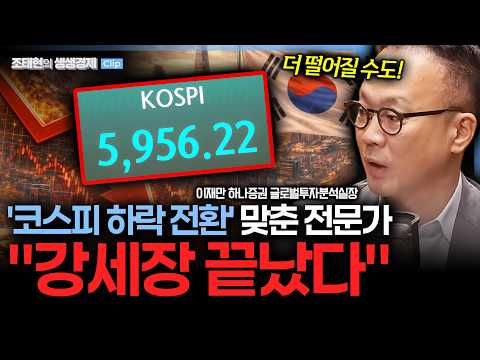
- 설명 앞부분: '코스피 하락 전환' 맞춘 전문가 "강세장 종료"…'5천'도 깨지나 4%대 하락, 예상 넘어선 급락이지만 강세장은 사실상 종료 단기 반등 가능성은 있어, PBR 등 밸류에이션 지표가 단기 저점 부근 한국 증시가 미국·대만보다 부진한 이유 "반도체 쏠림과 이익 증가율 둔화" 반도체 이익 증가율, 올해가 정점…내년에도 높은 증가율은 유지할 것 다만, 내년 삼전닉스 이익증가율 둔화 나타나면?…한국 반도체주 하락 폭, 다른 국가보다 더 클 수 있어 SK하이닉스는 업황 악화 때 적자 기록…TSMC는 업황 나빠도 영업이익률 30~40%대, …
- 대본 없음 (설명) — 음성인식이 끝나면 도입부·흐름이 들어감
- 댓글 104/104: 좋은 점 — 영상 0 · 감사·응원 1 · 더 알고 싶은 것 0 · 아쉬운 점 — 영상 3 · 반박·불만 — 의견 다름 3 · 정치·사회 3 · 경험 공유 5 · 구독·다음 기대 0
  - 감사·응원 👍0 “감사합니다. 😀”
  - 아쉬운 점 — 영상 👍8 “다른건 몰라도 그래도 ytn 경제 코너가 제목 이딴식으로 달아도 됩니까 썸네일하고 제목 자극적으로 달아서 조회수 올리는 유튜버랑 다른게 뭔가요 이런말 듣기는 합니까 아니면 애초에 원조 유튜버라 그래요?”
  - 아쉬운 점 — 영상 👍0 “오른다 오른다 내린다 내린다 반복만 하다보면 언젠간 맞음 그럼 전문가 인척 내말 맞지? 하면 됨”
  - 반박·불만 — 의견 다름 👍87 “아이고 주식에 전문가가 어디 있어요? 그냥 20년 짬밥으로 전문용어 써가며 전문가인 듯 보이는 억양과 말투를 쓰는 거죠. 주식에 전문가는 없어요. 지난 7월 대폭락때 다들 봤잖아요. 오른다오른다 분위기만 방방띄우고.... 했던 놈들.... 어자피 책임질것도 아닌데...”
  - 반박·불만 — 의견 다름 👍7 “헛소리.ai혁명의 위력을 전혀 모르고 과거시장에 얽매여 사장을 호도하네”
  - 정치·사회 👍1 “민주당이 주식가지고놀고 쇼했었네 국민연금하고 복지부장관하고”
  - 정치·사회 👍1 “(삼성전자 전세계 영업이익 1등을 달성하며) 이재명은 합니다 코스피 5000 ! ??”
  - 경험 공유 👍11 “나는 상승장이 오리라 예언한다! 언제일지는 나도 몰라~~~ㅋㅋ 오르면 내리고, 내리면 오르는 것을 예언한 것이 대단한 일임??”
  - 경험 공유 👍2 “오르면 앞으로 전망 좋다고해 떨아지면 이제 상승장은 끝났다고 해 야 그런 분석이라면 나도 하겠다 암튼 기상청이랑 주식 전문가라는 사람들이랑 예측 못하는건 똑같음”

### 26. The Story Behind India's Biggest Stock Market Scam ∣ Scam 1992 Explain ∣ 2D Animation

- https://www.youtube.com/watch?v=zay8CuiBUQ8 · DOKio · 구독자 8,360 · 조회수 1,093,663 (×130.8, 하루 8,055.9) · 좋아요 8,282 (0.8%) · 27분 · 2026-07-05 · 주제 묶음 기타 · 형식 정보·해설 (그 밖) · 폴더 `W_zay8CuiBUQ8` (웹 승인)
- 썸네일: 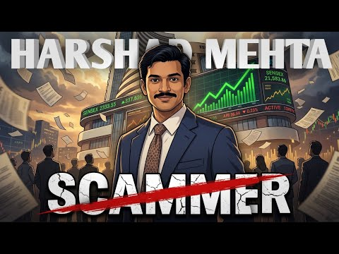
- 설명 앞부분: ₹4,000 Crore ka Scam... Stock Market me record tod tezi... aur phir ek aisa khulasa jisne poore India ki Financial System ko hila diya! 😱 Kya sirf shares ki prices badhakar koi insaan hazaron crore rupaye ka game khel sakta hai? Kaise ek aam Stock Broker "The Big Bull" bana aur phir India ke sabse …
- 같은 채널 평소 대비 ×57.7 (채널 최근 롱폼 중앙값 18,939회) · 평소 영상: How DMart Became One of India’s Biggest Retailers… (21,180회) / How Nirav Modi Stole PNB ₹14,000 Crore ∣ Nirav Mo… (16,698회)
- 대본 없음 (설명) — 음성인식이 끝나면 도입부·흐름이 들어감
- 댓글 194/236: 좋은 점 — 영상 0 · 감사·응원 0 · 더 알고 싶은 것 0 · 아쉬운 점 — 영상 0 · 반박·불만 — 의견 다름 0 · 정치·사회 0 · 경험 공유 0 · 구독·다음 기대 0

### 27. 나스닥은 최고가, 반도체만 반 토막. 지금과 똑같았던 1995년으로 앞으로의 흐름을 찾아봤습니다.

- https://www.youtube.com/watch?v=7hjl_w2aWtA · 테스프레소 · 구독자 2,080 · 조회수 69,816 (×33.6, 하루 1,983.6) · 좋아요 513 (0.7%) · 9.9분 · 2026-10-14 · 주제 묶음 2. 장기투자·ETF·지수 · 형식 정보·해설 (그 밖) · 폴더 `W_7hjl_w2aWtA` (웹 승인)
- 썸네일: 
- 설명 앞부분: 나스닥100은 10월 6일 사상 최고치를 찍었는데 SOXL,삼성전자,하이닉스는 6월 고점에서 57% 내려와 있습니다. 30년 전인 1995년에도 나스닥은 최고가를 쓰는데 반도체만 반 토막이 났었고 지금과 똑같은 사건의 순서대로 주가가 반응했습니다. 그때 무슨 일이 있었고 반도체가 언제 반등했는지, 지금과 무엇이 같고 무엇이 다른지 정리했습니다.
- 같은 채널 평소 대비 ×7.2 (채널 최근 롱폼 중앙값 9,635회) · 평소 영상: 삼성,하이닉스, 다시 오를 조건은? 과거 13번의 회복과 현재 진단 (9,728회) / [특이점매수 2편] 하루사이 반등한 TQQQ, 반등이 매수 기회일지 과거 하락을 진단합니… (9,542회)
- 대본 (음성인식(앞 5분), 4.8 음절/초) — 앞부분만, 흐름은 그 안까지 첫 20초: “보고 계신 화면에 30년 전인 1995년과 2026년의 반도체 지수를 고점 날짜에 맞춰 겹쳐놨습니다. 고점에서 78거래 일제인 지금까지 두 선이 내려오는 모양이 소름돋게 닮아있습니다. 95년엔 어떤 일이 있었길래 지금과 똑같은 그래프를 그렸을까요? 95년은 인터넷이라는 새로운 기술이 탄생했고” — 도입부 유형: 숫자로 시작, 내 이야기·사연
- 첫 1분: “보고 계신 화면에 30년 전인 1995년과 2026년의 반도체 지수를 고점 날짜에 맞춰 겹쳐놨습니다. 고점에서 78거래 일제인 지금까지 두 선이 내려오는 모양이 소름돋게 닮아있습니다. 95년엔 어떤 일이 있었길래 지금과 똑같은 그래프를 그렸을까요? 95년은 인터넷이라는 새로운 기술이 탄생했고 일본 메모리 회사들은 사상 최대 이익을 내고 있었습니다. 한국과 대만은 일본을 주격하고 있었고요. 지금의 선도인 미국과 한국, 대만, 취격자인 중국의 그림과 유사하죠. 지난주 화요일인 10월 6일에 나스닥 100은 사상 최고치를 찍었습니다. 그런데 소스는 올해 6월 9.300달러에서 57%가 빠진 128달러에 머물러 있습니다. 어제 10월 13일에는 SK하이닉스가 하루에 10% 넘게 빠졌고 고스피는 장중에 6000선이”
- 흐름 (90초마다 첫 문장): 0:00 보고 계신 화면에 30년 전인 1995년과 → 1:32 세계 12개 회사가 경쟁하듯 공장을 지었고 → 3:00 올해 작년 6월부터 1년 동안 약 2.7배가 됐죠. → 4:32 6칸이 4칸이 되니 면적은 3분의 1이 줄어듭니다.
- 댓글 26/36: 좋은 점 — 영상 0 · 감사·응원 0 · 더 알고 싶은 것 2 · 아쉬운 점 — 영상 0 · 반박·불만 — 의견 다름 0 · 정치·사회 0 · 경험 공유 0 · 구독·다음 기대 0
  - 더 알고 싶은 것 👍15 “중국산은 시제품 성능이 검증된 게 없잖아요. 그리고 장기 계약분과 향후 로봇에 대한 D램 수요는 아직 잡히지도 않았다고 하는데 과연 어떻게 돌아갈지 궁금하네요.”
  - 더 알고 싶은 것 👍0 “내용 좋은데? 그래서 과거 대로라면 지금 완전히 꺽인 반도체 주가가 언제 다시 살아나서 얼마 즘 뒤에 다시 꺽이나요???”

### 28. 코스피, 5,030P까지 큰 거 한방(삼전닉스 타점)

- https://www.youtube.com/watch?v=qSnNyX7IfqY · 차트도령 · 구독자 3,890 · 조회수 25,071 (×6.4, 하루 3,592.0) · 좋아요 126 (0.5%) · 13.6분 · 2026-10-14 · 주제 묶음 5. 국내주식 · 형식 정보·해설 (그 밖) · 폴더 `W_qSnNyX7IfqY` (웹 승인)
- 썸네일: 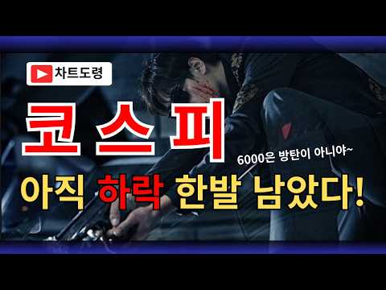
- 챕터: 0:00 코스피 · 6:52 코스닥 · 8:49 삼성전자 · 10:01 SK하이닉스
- 설명 앞부분: 안녕하세요 차트도령입니다. 10월14일 코스피, 코스닥, 삼성전자, sk하이닉스 차트분석 및 시황공유입니다. 오늘도 강한 반등에는 실패한 모습입니다. 현재 아슬아슬하게 6,000포인트를 지키고 있기 때문에 추가적인 급락이 발생할 수 있습니다. 본 채널에서 영상을 통해 소개해드리는 종목은 '정보 공유' 차원일 뿐 '종목 추천'이 아닙니다.
- 같은 채널 평소 대비 ×2.2 (채널 최근 롱폼 중앙값 11,260회) · 평소 영상: 현대차, 물타기 잘못하면 목 돌아갑니다 (11,260회) / 코스피, 가짜반등 속임수에 넘어가지 마세요(삼전닉스) (11,279회)
- 대본 (음성인식(앞 5분), 5.8 음절/초) — 앞부분만, 흐름은 그 안까지 첫 20초: “반갑습니다. 차트 도영입니다. 자 어찌쩌 영상에서 오늘은 반등할 것이다 라고 말씀을 드렸습니다. 하지만 그 뒤에 뭐라고 말씀을 드렸습니까? 5,030 포인트를 볼 것이라고 제목에 적어 드렸습니다. 그리고 영상 내용에서도 일단 1차적인 하락은 나왔기 때문에 여기에서는 일부 반등은 가능해 보인다. 하지만 이 반등이 강하지는 않을 것이다. 그리고 삼성전자와 하이닉스 절대 보지 마셔라 라고까지 말씀을 드렸습니다.”
- 첫 1분: “반갑습니다. 차트 도영입니다. 자 어찌쩌 영상에서 오늘은 반등할 것이다 라고 말씀을 드렸습니다. 하지만 그 뒤에 뭐라고 말씀을 드렸습니까? 5,030 포인트를 볼 것이라고 제목에 적어 드렸습니다. 그리고 영상 내용에서도 일단 1차적인 하락은 나왔기 때문에 여기에서는 일부 반등은 가능해 보인다. 하지만 이 반등이 강하지는 않을 것이다. 그리고 삼성전자와 하이닉스 절대 보지 마셔라 라고까지 말씀을 드렸습니다. 대형주 좀 피하라고 말씀을 드렸죠. 오늘 흐름을 보게 되시면 삼성전자는 0.86% 상생하면서 244,000원에 위치하고 있습니다. 오늘의 고가를 보게 되시면 241,000원까지 갔다 왔고요. 24만원부터 244,000원 자리가 기존의 지지 구간이라고 말씀을 드렸습니다. 그러면 어떻게 되겠습니까? 지금으로써”
- 흐름 (90초마다 첫 문장): 0:00 반갑습니다. 차트 도영입니다. → 1:30 그만큼 지금 당장 볼 이유가 없고 → 3:00 요구간 지지해주면서 → 4:32 주봉상에서 이렇게 젖점들을 이어주고
- 댓글 55/55: 좋은 점 — 영상 1 · 감사·응원 7 · 더 알고 싶은 것 2 · 아쉬운 점 — 영상 0 · 반박·불만 — 의견 다름 0 · 정치·사회 0 · 경험 공유 1 · 구독·다음 기대 0
  - 좋은 점 — 영상 👍1 “차도님 감사합니당 회식하고 왔더니 내 미장 나락 가있네욤.. 미장 잠깐 보고😢 다른분들 댓글도 쭈욱 읽고 하루 마무리합니다 낼도 성투성투~!! 방향을 정하는데 많은 도움이 됩니다.감사합니다.”
  - 감사·응원 👍32 “매일 올려줘서 고맙긴한데. 7천일때 박스권이다가 정답이엇다면 그땐 너무 높은자리까지 열어둿엇고.. 이번에는 하락뷰로 바꾼건 좋은데 또 5천까지 열어놓으니.. 태세전환이 너무 과하다는 생각은 들어요. 저처럼 몸사린 사람은 괜찮겟지만.. 높은뷰 보고 많이 들어간사람이 갑…”
  - 감사·응원 👍2 “깊이 깊이 공감 가는 분석.. 매우 매우 감사드립니다. 우려하던일이 현실로...”
  - 더 알고 싶은 것 👍1 “멤버쉽 문의 일주일 넘게 지났는데 아직 연락이 안오네요..ㅜㅜ 그리고 제주반도체 차트도 부탁드려도 될까요??”
  - 더 알고 싶은 것 👍0 “솔직히 5000초반은 오바라고 생각해서 그동안 답글 안달았는데 cpi보고 생각에 잠겨 글 드립니다 주식 창이 차트대로 되지 않을거라 생각하고 5200을 저점으로 황보 추세로 돌아갈 것 같은데 어떻게 보시나요? 마냥 차트만 따라가는게 사실 주식장에 맞지 않지만 현재 국…”

### 29. 지난 폭락과는 완전히 다릅니다…코스피가 진짜 위험한 이유 (Feat. 박병창 MP파트너스 대표) [딥플 Deep-ple]

- https://www.youtube.com/watch?v=y_mvodyrXhQ · 핀플 - Finple · 구독자 47,100 · 조회수 193,740 (×4.1, 하루 39,883.8) · 좋아요 2,910 (1.5%) · 60분 · 2026-10-16 · 주제 묶음 5. 국내주식 · 형식 인터뷰·강연·대담 · 폴더 `W_y_mvodyrXhQ` (웹 승인)
- 썸네일: 
- 설명 앞부분: 딥플 클릭 보기 순서 1Q 코스닥150채권혼합50액티브 ETF (0186S0) 1️⃣ “코스닥 활성화 정책 기대감” 2025.12.19, 금융위원회 ‘코스닥 신뢰+혁신 제고 방안’ 발표 2️⃣ “주식 비중을 높인 2세대 채권혼합형” ‘코스닥150 지수’ 약 50% + ‘단기국공채 지수’ 약 50% 2023.11.16, 퇴직연금감독규정에 따라 주식 편입한도 40% 이내 → 50% 미만으로 상향 성장성과 안정성 둘 다 잡은 ETF 투자도 하나(Hana)면 됩니다. 1Q K반도체TOP2 시리즈 ETF 1Q K반도체TOP2+ ETF (0…
- 같은 채널 평소 대비 ×41.0 (채널 최근 롱폼 중앙값 4,730회) · 평소 영상: 일본·대만은 급반등하는데 한국만 왜? 외국인이 국장을 계속 파는 이유 [더 파이널 콜 핵… (4,766회) / 코스피 2.5%·코스닥 5% 급등! 그런데 찐반 아니라는 전문가들…지금 주목할 종목은? … (4,695회)
- 대본 (음성인식(앞 5분), 5.3 음절/초) — 앞부분만, 흐름은 그 안까지 첫 20초: “그 오늘도 지금 호시피가 막 7, 8% 이렇게 급락을 하락에 대한 이유를 여러 가지를 이야기하지만 다 꼬집어서 100% 이거다라고 말씀하시는 분들이 잘 없잖아요 떨어지는 이유를 지금 콕 찝을 수가 있는 상황입니까? 그럼요 이유는 명확하게 있어요” — 도입부 유형: 질문으로 시작, 숫자로 시작
- 첫 1분: “그 오늘도 지금 호시피가 막 7, 8% 이렇게 급락을 하락에 대한 이유를 여러 가지를 이야기하지만 다 꼬집어서 100% 이거다라고 말씀하시는 분들이 잘 없잖아요 떨어지는 이유를 지금 콕 찝을 수가 있는 상황입니까? 그럼요 이유는 명확하게 있어요 내년도에도 엄청 저는 좀 위험하다고 저는 사실 생각을 하거든요 그래서 만약에 더욱 강하게 공속하고 전쟁을 벌이면 어떻게 돼요? 그렇게 현상이 있을 것 같지 않으세요? 우리 지금 얘기하는 동안에 썩게브레이크 걸려서 거래가 정지됐어요 명확한 이유가 이때니까요 지금 이게 해결되려면 네 핀플 가족분들 안녕하십니까 오늘 촬영일이 10월 15일 목요일 점심시간이 좀 지나가고 있는데요 호시피가 8% 가까이 떨어지고 있습니다 5,535 정도 이렇게 지나가고 있는데요 여기 보시다시피”
- 흐름 (90초마다 첫 문장): 0:00 그 오늘도 지금 호시피가 막 7, 8% 이렇게 급락을 하락에 대한 이유… → 1:30 그런 시간을 좀 마련했습니다 → 3:02 가져가야 된다고 생각하거든요 → 4:30 제가 그 설명을 드려보면요
- 댓글 360/360: 좋은 점 — 영상 16 · 감사·응원 26 · 더 알고 싶은 것 1 · 아쉬운 점 — 영상 2 · 반박·불만 — 의견 다름 7 · 정치·사회 28 · 경험 공유 21 · 구독·다음 기대 1
  - 좋은 점 — 영상 👍27 “박병창님의 강의 넘 유익했습니다. 3프로에서 믿을맨중 하나죠”
  - 좋은 점 — 영상 👍20 “와~박병찬 대표님! 제가 가려웠던 부분을 잘 알려주셔서 감사해요~~ 민준님도 핵심을 잘 짚어 질문해주시네요😊”
  - 감사·응원 👍20 “와~박병찬 대표님! 제가 가려웠던 부분을 잘 알려주셔서 감사해요~~ 민준님도 핵심을 잘 짚어 질문해주시네요😊”
  - 감사·응원 👍19 “작년방송에서 올해전망 예측하신대로 흘러감에 경외감을 느낍니다. 상반기 좋고, 하반기 위험, 금리5 돌파시 도망. 경험자의 안목에 큰 도움받았고 감사를 전하고싶습니다.”
  - 더 알고 싶은 것 👍0 “직전에 잘나간주식 장비 두산테스나나 이차전지원통형 신흥 이런거 사면 되나요?”
  - 아쉬운 점 — 영상 👍3 “다시 반복해서 들어봐야겠어요 좋네요”
  - 아쉬운 점 — 영상 👍0 “그러니까 요약좀 해줘요 ㅋ”
  - 반박·불만 — 의견 다름 👍377 “반도체 업계 종사자입니다 중국 반도체 신기술(특히 창신메모리 CXMT의 차세대 D램 '4F²' 연내 출시 발표 등) 정치적·시장적 과장(선동에 가까운 쇼맨십)이 99%, 무시 못 할 기술적 우회 시도가 0.1%' 정도로 보시는 것이 가장 냉정한 팩트입니다. 단순히 '…”
  - 반박·불만 — 의견 다름 👍4 “헛소리를 겁나게 길게하네 말 맨날 바뀌면서ㅋㅋㅋㅋㅋ”
  - 정치·사회 👍16 “내년의 실적을 의심하는 것이 아니라 질적에 관계없이 난 팔겠다는 외국인이 무서운거지 수급”
  - 정치·사회 👍13 “확실히 이번 하락은 좀 다른듯 월요일 쌍바닥도 깨질거같은데 전쟁끝나거나 선거끝날떄까지 관망해야하는 장세인듯”
  - 경험 공유 👍20 “와~박병찬 대표님! 제가 가려웠던 부분을 잘 알려주셔서 감사해요~~ 민준님도 핵심을 잘 짚어 질문해주시네요😊”
  - 경험 공유 👍14 “아저씨 갑자기 이러니까. 세상에 해안이 있는 것처럼 떠들지 마 당신도 언젠가 평탄한 길이 있었을 때 이럴 땐 매수해야 된다고 말했던 사람이잖아. 정답은 없지. 그러나 지금 정답이 있는 것처럼 내가 마치 예언가인 것처럼. 이야기하는 건 너무 창피하지 않아?”
  - 구독·다음 기대 👍0 “이런 채널이 있는줄 물랐는데 박대표님 들으러 들어왔습니다. 일단 구독했습니다.”

### 30. 【2chお金スレ】定年後も収入が途切れない人は何をしてる？今からできる備えを挙げてけ

- https://www.youtube.com/watch?v=2tSGWp3yGek · 2chお金シニアチャンネル · 구독자 2,150 · 조회수 14,237 (×6.6, 하루 1,792.8) · 좋아요 38 (0.3%) · 21분 · 2026-10-13 · 주제 묶음 10. 노후·연금 투자 · 형식 정보·해설 (그 밖) · 폴더 `W_2tSGWp3yGek` (웹 승인)
- 썸네일: 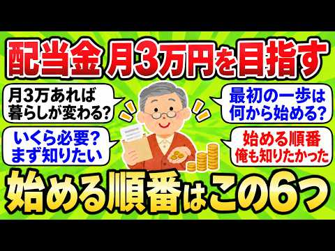
- 챕터: 0:00 はじめに · 0:24 64歳、配当が月3万 · 2:27 きっかけは元上司の一言 · 4:54 順番その1 足りない額を知る · 6:46 順番その2 現金を先に置く · 8:16 順番その3 口座とNISA · 10:38 順番その4 利回りで選ばない · 12:42 順番その5 一度に買わない · 14:38 順番その6 使い始める日 · 17:01 月3万で暮らしは変わるか · 18:45 今からでも間に合うか
- 대본 없음 (없음) — 음성인식이 끝나면 도입부·흐름이 들어감
- 댓글 0/0: 좋은 점 — 영상 0 · 감사·응원 0 · 더 알고 싶은 것 0 · 아쉬운 점 — 영상 0 · 반박·불만 — 의견 다름 0 · 정치·사회 0 · 경험 공유 0 · 구독·다음 기대 0

### 31. Don't Swap Your Dividends for 5% Treasuries Until You See This Math

- https://www.youtube.com/watch?v=34RoU8F6CFM · Tom - Lazy Dividend Investor · 구독자 2,090 · 조회수 10,865 (×5.2, 하루 1,720.2) · 좋아요 107 (1.0%) · 33분 · 2026-10-15 · 주제 묶음 기타 · 형식 정보·해설 (그 밖) · 폴더 `W_34RoU8F6CFM` (웹 승인)
- 썸네일: 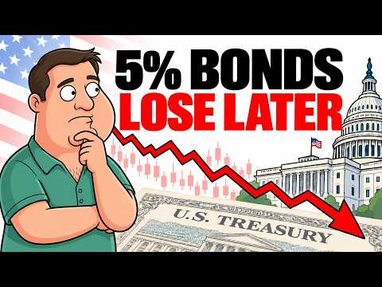
- 챕터: 0:00 Two checks from the same $500… · 4:49 Line 2: what the check buys i… · 9:37 Line 3: what is left of your … · 14:21 The morning the note matures · 18:54 Taxes, accounts and payment t… · 23:40 The matched plan and four str… · 28:28 When each option makes sense
- 설명 앞부분: $500,000 in 10-year Treasury notes pays about $2,192 a month right now. The same $500,000 in a quality dividend fund like SCHD pays about $1,337. That is an $854 monthly gap in favor of the option that sounds safer. So should you sell your dividends and lock in 5%? In this video we score both machi…
- 같은 채널 평소 대비 ×2.5 (채널 최근 롱폼 중앙값 4,333회) · 평소 영상: Sell Now or Stay Invested? — What To Do Before Th… (4,459회) / How Money Really Works: Build Cash Flow That Pays… (4,207회)
- 대본 없음 (설명) — 음성인식이 끝나면 도입부·흐름이 들어감
- 댓글 5/5: 좋은 점 — 영상 0 · 감사·응원 0 · 더 알고 싶은 것 0 · 아쉬운 점 — 영상 0 · 반박·불만 — 의견 다름 0 · 정치·사회 0 · 경험 공유 0 · 구독·다음 기대 0

### 32. I Own 300 Shares of SCHD - Here's My Dividend Payout

- https://www.youtube.com/watch?v=Z_-PJGzUdD4 · Cade Invests · 구독자 1,840 · 조회수 163,969 (×89.1, 하루 1,481.3) · 좋아요 2,053 (1.2%) · 10.5분 · 2026-07-30 · 주제 묶음 2. 장기투자·ETF·지수 · 형식 정보·해설 (그 밖) · 폴더 `W_Z_-PJGzUdD4` (웹 승인)
- 썸네일: 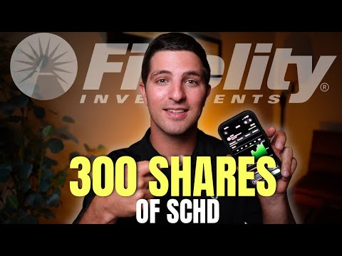
- 챕터: 0:00 Intro · 0:37 SCHD ETF Overview · 2:05 SCHD Holdings · 3:00 My SCHD Position · 4:15 SCHD Dividend Income · 6:38 SCHD vs VOO vs QQQ · 9:10 My SCHD Plan
- 설명 앞부분: I have over $10,000 invested in the dividend ETF SCHD. In today's video I'm breaking down my SCHD dividend payouts from every year and if I plan to continue investing in SCHD in the future. FREE PDF Download: SCHD is one of the most popular dividend ETFs out there today. That is for good reason as …
- 같은 채널 평소 대비 ×413.0 (채널 최근 롱폼 중앙값 397회) · 평소 영상: 10 Years of Brutally Honest Money Advice for Your… (397회) / Graham Stephan Paid Off His Mortgage Early - Here… (353회)
- 대본 없음 (설명) — 음성인식이 끝나면 도입부·흐름이 들어감
- 댓글 338/343: 좋은 점 — 영상 0 · 감사·응원 0 · 더 알고 싶은 것 0 · 아쉬운 점 — 영상 0 · 반박·불만 — 의견 다름 0 · 정치·사회 0 · 경험 공유 0 · 구독·다음 기대 0

### 33. 코스피 7% 폭락, 외인 30분만에 1조 순매도, 무언가 수상합니다

- https://www.youtube.com/watch?v=hjIgX9ppDe4 · 경제한잔 · 구독자 7,200 · 조회수 180,110 (×25.0, 하루 5,470.5) · 좋아요 882 (0.5%) · 14분 · 2026-10-16 · 주제 묶음 5. 국내주식 · 형식 정보·해설 (그 밖) · 폴더 `W_hjIgX9ppDe4` (웹 승인)
- 썸네일: 
- 챕터: 0:00 코스피 폭락 7퍼센트, 외국인 순매도 30분 1조의 … · 0:49 외국인 순매도 하루치를 30분에 쏟아낸 비정상 신호 · 1:20 삼성전자 하이닉스 과매도가 코스피 지수를 꺾은 이유 · 2:11 이 물량 누가 왜 던졌나 진짜 질문의 시작 · 2:19 실적은 범인이 아니다 반도체주 사상 최고 실적 · 2:55 코스피 폭락 설명할 결정타 뉴스가 없다 · 3:21 글로벌 동반 하락만으로 설명 안 되는 괴리 · 3:56 쉬운 답 세 개가 전부 지워진 수상한 지점 · 4:11 프로그램 매매 선물 공매도 다섯 용의자 공개 · 4:48 전부 사람 손이 아니다 기계적 매도의 공통점 · 5:17 선물 현물 베이시스로 보는 30분 1조 메커니즘 · 6:03 반대매매 눈사태 하락이 하락을 부르는 구조 · 6:36 왜 기업 가치보다 더 깊게 과매도됐나 · 7:15 기계가 던졌는데 왜 하필 한국인가 · 7:26 위험자산 회피 달러 강세 매크로 흐름 · 7:56 외국인에게 한국 증시는 현금인출기 ATM · 8:34 반도체 사이클 선반영 외국인 순매도 습관 · 9:13 공포가 아니라 계산된 포지션 조정일 가능성 · 9:28 현물 팔고 선물 사는 움직임이 말해주는 것 · 10:10 가격이 가치에서 떨어져 나간 과매도의 본질
- 설명 앞부분: 📉 오늘 코스피가 7% 넘게 폭락했습니다. 삼성전자 7%, SK하이닉스 9% 급락, 그리고 외국인이 단 30분 만에 1조 원을 순매도했죠. 화면이 온통 파란색으로 물들면, 누구나 똑같은 생각을 합니다. "외국인이 다 던지고 도망간다, 한국 증시 끝난 거 아니야?" 🥵 혹시 오늘 계좌를 보면서 가슴이 철렁 내려앉았다면, 이 영상을 끝까지 꼭 봐주세요. 오늘의 폭락은 단순한 공포가 아니라, 그 안에 아주 수상한 구조가 숨어 있습니다. 🔍 이 영상에서 다루는 핵심 요약 외국인이 하루 종일 파는 금액은 보통 많아야 몇천억, 세게 던져도 …
- 같은 채널 평소 대비 ×16.6 (채널 최근 롱폼 중앙값 10,876회) · 평소 영상: 삼성전자 9%, 하이닉스는 0.3%…주도주 상승폭 갈라진 이유는? (11,656회) / 잘 생각해보면 남의 일이 아닌 프랑스 혼란(시위, 금리, 정치) (10,096회)
- 대본 (음성인식(앞 5분), 4.6 음절/초) — 앞부분만, 흐름은 그 안까지 첫 20초: “오늘 코스피가 7% 넘게 폭락했습니다. 하이맥스는 9% 삼성전자도 7% 넘게 빠졌죠. 그런데 진짜 이상한 건 따로 있습니다. 외국인이 단 30분만에 1조 원을 순매도 했거든요. 솔직히 이건 그 누구도 받아낼 수 없는 물량입니다. 단순히 겁먹고 도망치는 걸까요?” — 도입부 유형: 숫자로 시작
- 첫 1분: “오늘 코스피가 7% 넘게 폭락했습니다. 하이맥스는 9% 삼성전자도 7% 넘게 빠졌죠. 그런데 진짜 이상한 건 따로 있습니다. 외국인이 단 30분만에 1조 원을 순매도 했거든요. 솔직히 이건 그 누구도 받아낼 수 없는 물량입니다. 단순히 겁먹고 도망치는 걸까요? 아니면 하방에 돈을 걸어둔 걸까요? 공매도일까요? 아니면 선물로 파생을 노리는 걸까요? 지금 기업들이 돈벌는 능력에는 아무 문제가 없습니다. 시장을 무너뜨릴 결정탄 유수도 없고요. 그런데도 주가는 기업 가치보다 훨씬 더 깊게 빠졌습니다. 그래서 오늘만큼은 그냥 유동성이 말랐다고 넘기기엔 뭔가 수상한 구석이 있습니다. 그래서 오늘은 이 30분의 1조라는 숫자부터 제대로 뜯어보려고 합니다. 이게 왜 비정상이냐면요. 평소에 외국인이 우리 시장에서 하루 종일”
- 흐름 (90초마다 첫 문장): 0:00 오늘 코스피가 7% 넘게 폭락했습니다. → 1:32 거의 절반에 가깝습니다. → 3:02 코스피를 7% 통째로 무너뜨릴 만한 단일 악재가 없어요. → 4:35 3번 옵션이나 변동성에 걸려 있던 포지션이 한꺼번에 청산되는 경우
- 댓글 51/70: 좋은 점 — 영상 2 · 감사·응원 5 · 더 알고 싶은 것 0 · 아쉬운 점 — 영상 1 · 반박·불만 — 의견 다름 0 · 정치·사회 11 · 경험 공유 0 · 구독·다음 기대 5
  - 좋은 점 — 영상 👍2 “구독했어요!!!너무 유익해요!!감사합니다”
  - 좋은 점 — 영상 👍2 “이해하기쉽게 화면을 구성하셨네요 구독했습니다”
  - 감사·응원 👍5 “영상 감사합니다!”
  - 감사·응원 👍4 “감사합니다 버터야 됩니다”
  - 아쉬운 점 — 영상 👍0 “ㅋ 광고하는 주식과 정치와 관련된 주식은 사는게 아니다.. 그리고 실적을 보고 기대치가 높아져있어서 그런거고 실적치로만 주가가 올라가면 얼마나 좋겠냐..실적에 비해 기대치까지 주가가 오르지 못하니 하락하는거.. 반대로 반도체쪽 말고 기대도 안하는 2차전지는 실적치가 …”
  - 정치·사회 👍16 “최고의 명강의였습니다. 멍청한 이재명 정부의 관료들때문에 개인투자자들은 피눈물을 흘리네요.”
  - 정치·사회 👍12 “한국주식은. 투명유리. 외국인만 조은일 시키는 어리석은 정부”
  - 구독·다음 기대 👍12 “작금의 사태를 명확하게 분석해 주었습니다. 구독합니다.”
  - 구독·다음 기대 👍7 “난 주식설명 다욕하는데 이채널은 논리적이고 최근 선물가격 때매 현물이 안올라가는 현상을 본 것까지 맞음 그래서 우선 구독박고감”

### 34. Dividend Stocks vs. Growth Stocks: The Math Most Investors Ignore

- https://www.youtube.com/watch?v=4bg3bjvjCjE · Finance Simplified · 구독자 3,800 · 조회수 206,065 (×54.2, 하루 2,615.9) · 좋아요 1,201 (0.6%) · 20.2분 · 2026-08-31 · 주제 묶음 기타 · 형식 정보·해설 (그 밖) · 폴더 `W_4bg3bjvjCjE` (웹 승인)
- 썸네일: 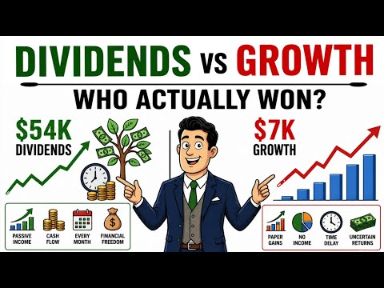
- 챕터: 0:00 The $54,000 Question · 0:13 Yield vs. Appreciation vs. To… · 2:30 Where Every $1 of Profit Actu… · 5:00 The $32,000 Head-to-Head Test · 8:00 The Dividend Reinvestment Eff… · 10:30 The Tax Drag Most Comparisons… · 13:00 The High-Yield Trap · 15:00 The Growth-Stock Trap · 17:00 The Fair Test: Total Return v… · 18:30 Who Each Approach Actually Su… · 19:30 Final Verdict
- 설명 앞부분: Dividend Stocks vs. Growth Stocks: The Math Most Investors Ignore Dividend stocks vs. growth stocks — but compared correctly this time. Most investors argue "4% yield" against "12% growth," and those aren't even the same kind of number. In this breakdown we run both strategies through identical mat…
- 같은 채널 평소 대비 ×138.2 (채널 최근 롱폼 중앙값 1,491회) · 평소 영상: $10,000 in Crypto vs. $10,000 in Dividend Stocks:… (1,522회) / The Portfolio Is About to Happen to Your Portfolio (1,460회)
- 대본 없음 (설명) — 음성인식이 끝나면 도입부·흐름이 들어감
- 댓글 321/321: 좋은 점 — 영상 0 · 감사·응원 0 · 더 알고 싶은 것 0 · 아쉬운 점 — 영상 0 · 반박·불만 — 의견 다름 0 · 정치·사회 0 · 경험 공유 0 · 구독·다음 기대 0

### 35. 집은 팔았고, 주식은 물렸고

- https://www.youtube.com/watch?v=SbEfHnF8DdY · 로텐션 LOWTENSIONS · 구독자 6,730 · 조회수 147,243 (×21.9, 하루 4,629.9) · 좋아요 941 (0.6%) · 16.3분 · 2026-10-17 · 주제 묶음 11. 투자 일반 · 형식 브이로그·직접 해본 이야기 · 폴더 `W_SbEfHnF8DdY` (웹 승인)
- 썸네일: 
- 설명 앞부분: 집을 팔고 이사까지 마치니 이제 조금은 마음 편히 지낼 수 있을 줄 알았는데, 인생은 늘 예상과 다르게 흘러가네요. 집을 팔고 주식을 샀습니다. 집은 잘 팔았는데, 주식은 잘못 산 걸까요. 그래도 일상은 계속됩니다. 출근도 하고, 밥도 먹고, 이번 영상에는 그렇게 흘러가는 저희 부부의 평범한 일상을 담았습니다. 오늘도 함께해 주셔서 감사합니다. 제이 & 윤 [Video Source Support] Youtube channel "freeticon" : / freeticon
- 같은 채널 평소 대비 ×13.7 (채널 최근 롱폼 중앙값 10,770회) · 평소 영상: 대만 타이중 현지인 줄서는 맛집만 갔습니다 대만 타이중 먹방 여행 (11,815회) / 집밥 해 먹는 이유 40대 부부 현실적인 한 달 식비 정산 외식 배달 이대로 괜찮은가? … (9,724회)
- 대본 (음성인식(앞 5분), 4.1 음절/초) — 앞부분만, 흐름은 그 안까지 첫 20초: “굉장히 밑에로 없습니다. 위기에 난다. 코리아 서키트를 앤엑스트에서 설해 보고 흔들었더니 역시 줄때 먹어야 된다. 주식도 밥도 줄때 먹어야 된다. 느닷없이 집이 팔려 후다닥 이사한 지도 어느덧 한 달이 넘었다. 이제는 제법 익숙해진 새 집에서”
- 첫 1분: “굉장히 밑에로 없습니다. 위기에 난다. 코리아 서키트를 앤엑스트에서 설해 보고 흔들었더니 역시 줄때 먹어야 된다. 주식도 밥도 줄때 먹어야 된다. 느닷없이 집이 팔려 후다닥 이사한 지도 어느덧 한 달이 넘었다. 이제는 제법 익숙해진 새 집에서 밥도 해 먹고 집 팔고 남은 돈으로 주식도 사며 평범한 일상을 이어가는 중이다. 숱을 갈아입고 나와면 안경을 벗고 안경 벗고 가야지. 아니, 안경을 벗는 게 거의... 에이프지. 이건 너무 안경. 제인의 안경을 웃으면 큰일 났지. 안경을 껴야 됐어. 괜찮아. 죄송합니다. 남편 제인의 뽀로로와 유재성만큼 안경이 필수다. 안경 껴야 돼. 항상 껴와. 시라소니 같애는 시라소니. 그냥 못 껄 껄 본 것 같아. 어디서 이렇게 진정하면 안 돼? 아카수너.”
- 흐름 (90초마다 첫 문장): 0:00 굉장히 밑에로 없습니다. 위기에 난다. → 1:30 이게 아이콘 XS인가? → 3:00 훨씬 더 이쁘다는 생각이 드는 거야. → 4:33 우리에겐 우리 집이 최고의 커피 맛집이다.
- 댓글 185/197: 좋은 점 — 영상 1 · 감사·응원 14 · 더 알고 싶은 것 2 · 아쉬운 점 — 영상 1 · 반박·불만 — 의견 다름 2 · 정치·사회 8 · 경험 공유 19 · 구독·다음 기대 3
  - 좋은 점 — 영상 👍11 “주식을 오래하고 꾸준한 수익을 원한다면 외부의 귀을 닫고 나만의 방법이 필요한데 화려하지도 않고 큰 기술이 필요하지도 않습니다. 단순합니다. 욕심부리지 않고 돈을 차갑고 신중히 한번 더 생각하고 다루어라!! 고점에서 떨어지는 종목은 쳐다 보지도 말아라 미련을 버려라 …”
  - 감사·응원 👍22 “저도 주식 너무 팔고 싶네요😂 상승장 언능타고 제이님 입맛 돌아오시길 바랄께요! 우리 모두 화이팅해요!”
  - 감사·응원 👍13 “어떤 인내심보다 주식을 하면서 진짜 인내심을 배우고 있습니다. ㅎㅎ 제 이야기 하시는줄 알았어요. 오늘도 소중한 영상 고맙습니다. ^^ 항상 건강 및 행복하세요!! 응원해요!!”
  - 더 알고 싶은 것 👍22 “악~~! 이렇게 금방 올라오다니 선물같고 너무 좋네요. 로텐션 영상 너무 제 취향입니다. 오늘도 여러편 또 보고.. 앞으로도 빠른 업데이트 많은 영상 부탁드립니다~😊”
  - 더 알고 싶은 것 👍0 “얼마정도를 하시나요?? 힘내세요”
  - 아쉬운 점 — 영상 👍8 “60대고 2천~3천 정도로 주식하는데 사팔사팔 하면서 하루를 보내니 지루하지 않네요. 마이너스도 있지만 기다리면 오겠죠. 이러고 세월 보냅니다.”
  - 반박·불만 — 의견 다름 👍3 “그렇게 사팔사팔하는건 투기지 투자가 아닙니다. 투자는 펀더멘탈 좋은 코스피 우량주 사서 가다리는거여ㅣ요. 부동산도 하루하루 보는게아니듯 주식도 그래요. 그리고 그때그때 뷰가 바뀌면 방향도 수정해야해요. 단기간 승부를 보려는건 위험해요. 되도록 코스닥으 하지말고 시총이…”
  - 정치·사회 👍11 “이재명이 해냈구나 집팔아 주식하라 니덜 인생 조진거 같다”
  - 정치·사회 👍8 “어머나, 이리 빨리 영상이 올라오면 구독자는 너무 좋잖아요❤ 하얀색 바탕에 때가 타면 정말 참을 수 없는데😂 어서 빨리 매직블럭 찾으셨으면 좋겠어요! 제이님이 타 주시는 커피엔 비할 수 없겠지만, 커피 내리기 귀찮으실 땐 루카스나인 카페라떼도 추천드려요☕️ 주식은 정…”
  - 경험 공유 👍22 “저도 주식 너무 팔고 싶네요😂 상승장 언능타고 제이님 입맛 돌아오시길 바랄께요! 우리 모두 화이팅해요!”
  - 경험 공유 👍12 “부러우면 지는 거라던데, 남이 해준 아침밥 언제 먹어봤는지 기억이 안나네요.😢 저도 백수 5개월차 전업투자 합니다. 종목거래는 수수료가 많아 ETF로 차트 봐가며 스캘핑. 저한테는 그게 딱 맞더라구요, 큰 하락도 피할수 있고. 처음 보는 채널인데 뭔가 공감도 되고 두…”
  - 구독·다음 기대 👍12 “부러우면 지는 거라던데, 남이 해준 아침밥 언제 먹어봤는지 기억이 안나네요.😢 저도 백수 5개월차 전업투자 합니다. 종목거래는 수수료가 많아 ETF로 차트 봐가며 스캘핑. 저한테는 그게 딱 맞더라구요, 큰 하락도 피할수 있고. 처음 보는 채널인데 뭔가 공감도 되고 두…”
  - 구독·다음 기대 👍6 “오늘 처음 알고리즘타서 잼나게 보고 구독합니다~^^ 50대 후반이데 1억 5천 정도를 한계좌에 물을 타지 않고 물리면 다른 계좌 터서 사기를 10여개가 넘는다는..ㅋ 계좌마다 시체들이 그득 그득하지만 삼성전자니까 하고 물린계좌 끌어안고 기다립니다ㅋ 일상적이지만 우리들…”

### 36. 【資産公開】S&P500に1000万入れて5年間放置した結果（めちゃ増えた）｜31歳会社員・新NISA

- https://www.youtube.com/watch?v=Lb9ht5PE0vU · ぼんじり【平凡会社員のずぼら投資術】 · 구독자 4,530 · 조회수 363,174 (×80.2, 하루 2,953.2) · 좋아요 2,166 (0.6%) · 13.9분 · 2026-07-18 · 주제 묶음 2. 장기투자·ETF·지수 · 형식 정보·해설 (그 밖) · 폴더 `W_Lb9ht5PE0vU` (웹 승인)
- 썸네일: 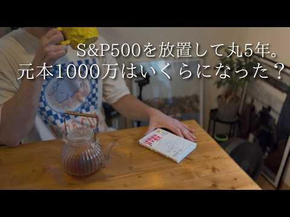
- 챕터: 0:00 今日のテーマ · 1:04 結論:5年でこれだけ増えました · 1:47 5年間の全記録（2021~2026） · 7:23 そもそも最初の元手をどうやって作った？ · 8:33 5年の運用で理解したインデックス投資の3つの本質 · 11:00 S&P500への積立を辞めた理由 · 12:56 まとめ
- 설명 앞부분: ③【新NISA】米国株信者だった僕がS＆P500から日経平均に乗り換えた8つの理由
- 같은 채널 평소 대비 ×36.9 (채널 최근 롱폼 중앙값 9,842회) · 평소 영상: 資産3000万を超えたら1億円は射程圏内ってほんと？1万通り計算してみた結果を公開します。 (9,842회) / 【実録】資産3000万円まで最短で達成させるためにやって良かった7つのこと・後悔している3つのこと… (9,473회)
- 대본 없음 (설명) — 음성인식이 끝나면 도입부·흐름이 들어감
- 댓글 141/141: 좋은 점 — 영상 0 · 감사·응원 0 · 더 알고 싶은 것 0 · 아쉬운 점 — 영상 0 · 반박·불만 — 의견 다름 0 · 정치·사회 0 · 경험 공유 0 · 구독·다음 기대 0

### 37. S&P500とNASDAQ100は崩れない。プロ投資家が あの日 まで買わない理由【米国株最新】

- https://www.youtube.com/watch?v=9zV78pvlDJ4 · まなみんの米国株の学校【投資初心者でも10分で学べる】 · 구독자 5,680 · 조회수 118,072 (×20.8, 하루 3,574.9) · 좋아요 649 (0.5%) · 10.3분 · 2026-10-16 · 주제 묶음 2. 장기투자·ETF·지수 · 형식 정보·해설 (그 밖) · 폴더 `W_9zV78pvlDJ4` (웹 승인)
- 썸네일: 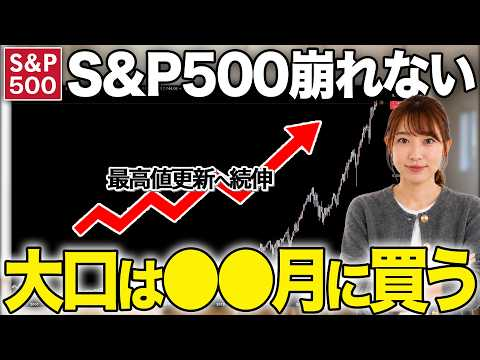
- 설명 앞부분: 私は10月28日のFRBの会議まで、売らず買わずに待ちます🍀 S&P500・NASDAQ100などの米国株と、 ※映像や資料の制作にはAIを活用していますが、相場の分析と「私はこう見る」の見解は、すべて実在する運営者自身のものです🤍
- 같은 채널 평소 대비 ×11.6 (채널 최근 롱폼 중앙값 10,206회) · 평소 영상: S&P500が最高値圏にいる今、これマネするだけで大きな資産が形成できます！【米国株 N… (10,282회) / NASDAQ100最高値更新。でも、一度に買うな！3回に分けて買え！【米国株最新】 (10,131회)
- 대본 없음 (설명) — 음성인식이 끝나면 도입부·흐름이 들어감
- 댓글 36/40: 좋은 점 — 영상 0 · 감사·응원 0 · 더 알고 싶은 것 0 · 아쉬운 점 — 영상 0 · 반박·불만 — 의견 다름 0 · 정치·사회 0 · 경험 공유 0 · 구독·다음 기대 0

### 38. 오늘부터 오후 8시까지 애프터마켓 오픈!! 주식패턴 ‘이렇게’ 완전히 바뀐다

- https://www.youtube.com/watch?v=wwrCztntACs · 잘되라대한민국 · 구독자 6,580 · 조회수 244,253 (×37.1, 하루 3,753.2) · 좋아요 964 (0.4%) · 8.2분 · 2026-09-14 · 주제 묶음 기타 · 형식 정보·해설 (그 밖) · 폴더 `W_wwrCztntACs` (웹 승인)
- 썸네일: 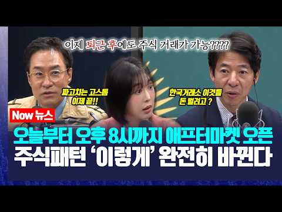
- 챕터: 0:00 오늘부터 열리는 주식 애프터마켓 전격 도입 배경 · 1:00 거래소 애프터마켓 이용 방법 및 주요 거래 규칙 · 2:21 정규장과 애프터마켓의 결정적 차이 (시장가 주문 불가… · 3:00 넥스트레이드와 KRX 애프터마켓의 관계 · 4:47 한국거래소가 애프터마켓을 도입한 진짜 이유와 우려스러… · 6:25 개인 투자자가 꼭 알아야 할 애프터마켓 투자 체크포인트
- 설명 앞부분: [겸공_12시에만나요 260914] 오늘부터 본격적으로 시작된 한국거래소(KRX) 애프터마켓 개시 소식과 투자자 체크포인트를 완벽하게 분석해 드립니다. 오후 4시부터 저녁 8시까지 연장된 거래 시간, 시장가 주문 불가와 자동 승계 미지원 등 기존 정규장과 달라지는 핵심 규칙들을 낱낱이 파헤쳐 봅니다. 새로운 제도 도입에 따른 숨겨진 변동성 위험과 투자 전략을 지금 바로 확인해 보세요! 타임라인
- 같은 채널 평소 대비 ×8.7 (채널 최근 롱폼 중앙값 28,233회) · 평소 영상: 삼전 67만 하닉 470만 ‘유지’ JP모건, 코스피 15000은 ‘삭제’ (28,233회) / 삼성전자 어닝콜, 소각은 우선주만? 증여세 깎으려 하나··· 역대급 실망 (27,219회)
- 대본 (음성인식(앞 5분), 5.4 음절/초) — 앞부분만, 흐름은 그 안까지 첫 20초: “그러면 이제 전혀 새로운 패턴이 또 나올 수 있다는 걸 좀 염두에 두셔야 될 것 같아요. 왜냐하면 4시 넘어서 그동안 거래 안 되는 종목이 거래되는 600개고 이제 새로 열리면 한 1500개 이상 이제 새로 될 텐데 그러면 이제 8시까지 거의 본장 이어지는 셈이나 마찬가지거든요. 그럼 우리 본장에서 미국 선물을 그대로 보면서 할 수 있는 상황이 되는 거니까”
- 첫 1분: “그러면 이제 전혀 새로운 패턴이 또 나올 수 있다는 걸 좀 염두에 두셔야 될 것 같아요. 왜냐하면 4시 넘어서 그동안 거래 안 되는 종목이 거래되는 600개고 이제 새로 열리면 한 1500개 이상 이제 새로 될 텐데 그러면 이제 8시까지 거의 본장 이어지는 셈이나 마찬가지거든요. 그럼 우리 본장에서 미국 선물을 그대로 보면서 할 수 있는 상황이 되는 거니까 오늘부터 저녁 8시까지 주식 거래가 가능해진다는 사실 알고 계셨나요? 본장에서 미국 선물을 보면서 투자할 수 있게 되는데요. 이렇게 되면 앞으로는 주식시장의 전혀 새로운 패턴이 시작될 예정입니다. 과연 우리에게 독이 될지 아니면 새로운 기회가 될지 그 숨겨진 이야기가 지금 바로 공개됩니다. 그래서 왜 오늘부터 애프터마켓이 오픈되는 겁니다? 저녁 8시까지”
- 흐름 (90초마다 첫 문장): 0:00 그러면 이제 전혀 새로운 패턴이 또 나올 수 있다는 걸 좀 염두에 두셔… → 1:33 그래서 별도입니다. → 3:00 그래서 얘네들이 아침에 8시에 프리로 한 번 열고 또 저녁에 3시 40분 → 4:33 박시동 대표님 말씀처럼 한국 거래소가 단순히 돈 벌려고 자기네들이
- 댓글 253/253: 좋은 점 — 영상 0 · 감사·응원 0 · 더 알고 싶은 것 4 · 아쉬운 점 — 영상 0 · 반박·불만 — 의견 다름 2 · 정치·사회 45 · 경험 공유 3 · 구독·다음 기대 0
  - 더 알고 싶은 것 👍32 “아니 예수금은 다음날 언제 받는건가요? 대체 거래소 에프터장은 이리쉽게 뚝딱 처리하연서~~~”
  - 더 알고 싶은 것 👍4 “정부에 항의부탁드립니다 정말 답답하고 화가납니다 왜 주식시장 을 개판으로 만드는 나쁜놈들”
  - 반박·불만 — 의견 다름 👍0 “잣됐다 대한민국. 선동질하지마라.”
  - 정치·사회 👍35 “이걸 정책으로 시행하라고 허가를 해준 정부가 문제죠? 국민들 의견은 들어보지 않고, 결국 국민들이 주식판 보는 시간만 늘어나서 일을 못하게 합니다. 진짜 이건 누구 생각인지 그리고 또 누가 허가를 했는지 조사해야 합니다.”
  - 정치·사회 👍24 “이재명은 지지율이 왜그렇게빠지는지 진정 모르나??? 개인자산을 건드려서인걸 모르네”
  - 경험 공유 👍1 “난 얘들보면 선대인하고 밧데리아저씨가 오버렙이 되더라고... 과거에 선대인이 원랜 부동산 전문가 코스프레를 하면서 지금 이광수가 했던 소리와 판박이같은 소릴하면서 폭락 기우제를 지냈는데 그때도 그 소리 믿고 쪽박찬 인간들 엄청나게 양산했어. 그러다니 어느날 갑자기 대…”
  - 경험 공유 👍0 “난 이잼 정부 지지자이고 문조털래유최 까지 계속 까던 사람이다 . 그리고 국장만 2009년 부터 해왔고 근데 이게 먼 개 ㅈㄹ 이냐 이걸 승인한 놈들이나 이잼도 이번에 생각좀 해줬으면 한다 . 1주라도 주식 매수 매도 한 사람들 투표 하던지 이건 뭐 주식투자자들과 아…”

### 39. 레버리지 ETF 상장폐지 논란🔥도박판 코스피 알고도 레버리지 ETF 상폐 못하는 이유🔥위험 알고도 도장 찍은 사람🔥금리인상 악제🔥역대급 반도체 실적 국민돈증발🔥…

- https://www.youtube.com/watch?v=O4-jY0zyhDo · 리얼경제 · 구독자 1,340 · 조회수 93,682 (×69.9, 하루 755.6) · 좋아요 2,368 (2.5%) · 15분 · 2026-07-17 · 주제 묶음 9. 빚투·레버리지 · 형식 정보·해설 (그 밖) · 폴더 `W_O4-jY0zyhDo` (웹 승인)
- 썸네일: 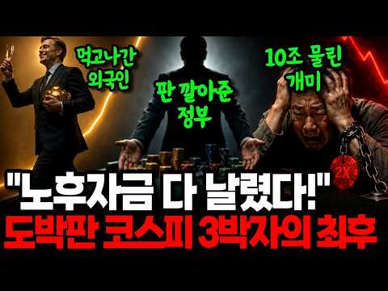
- 챕터: 0:00 인트로 — 89조 잔치인데 국민 돈은 증발 · 0:44 검은 월요일 — 올해만 서킷브레이커 7번 · 2:01 범인의 등장 — 5월 27일 상장된 그 '상품' · 3:35 세 개의 함정 — 왜 도박판이 됐나 · 7:07 대(大)아이러니 — 실적 최대인데 주가 최대 폭락, … · 9:44 앞으로 어떻게 되나 — 상폐 못 하는 이유와 정부의 … · 13:31 착지 — 호황의 나라에서 국민이 죽는다
- 설명 앞부분: 🔎 삼성전자가 2분기 영업이익 89조 4천억 원으로 3분기 연속 최대를 기록하고, 7월 반도체 수출은 193% 폭증해 사상 최대를 찍었습니다. 나라는 반도체로 호황입니다. 그런데 바로 그 삼성전자와 SK하이닉스를 '미끼'로 만든 단일종목 레버리지 ETF에 국민 돈 10조 원이 넘게 묶인 채 녹아내리고, 올해에만 서킷브레이커가 일곱 번 울렸습니다. 실적은 최대인데 주가는 최대 폭락하는 기막힌 아이러니. 세계 1등 실적을 낸 나라에서 어쩌다 국민이 도박판에 앉게 됐는지, 레버리지 ETF의 세 가지 함정(복리손실·지수 착시·리밸런싱 증…
- 같은 채널 평소 대비 ×495.7 (채널 최근 롱폼 중앙값 189회) · 평소 영상: 삼성노조가 800조 호남 반도체 메가프로젝트 막아선 진짜 이유...부메랑 노란봉투법 삼성… (189회) / 엔비디아 손잡은 네이버 집중분석🔎아시아 AI 인프라회사로?🔥14조 유치🔥GPU 6만장🔥1… (147회)
- 대본 (음성인식(앞 5분), 5.5 음절/초) — 앞부분만, 흐름은 그 안까지 첫 20초: “여러분 지금 우리나라는 반도체로 잔치집입니다. 삼성전자가 한분기에 89조를 벌었어요. 3분기 연속, 역대 최대입니다. 그야말로 세계가 우리 반도체 앞에 앞다터 줄을 선 거예요. 그런데 말입니다. 바로 그 삼성을 믿기로 만든 어떤 상품에 지금 국민 돈 10조가 도박판처럼 놓고 있습니다. 올해에만 주식거래를 통째로 멈춰세우는 비상벨이 7번 울렸어요.” — 도입부 유형: 시청자 부르기
- 첫 1분: “여러분 지금 우리나라는 반도체로 잔치집입니다. 삼성전자가 한분기에 89조를 벌었어요. 3분기 연속, 역대 최대입니다. 그야말로 세계가 우리 반도체 앞에 앞다터 줄을 선 거예요. 그런데 말입니다. 바로 그 삼성을 믿기로 만든 어떤 상품에 지금 국민 돈 10조가 도박판처럼 놓고 있습니다. 올해에만 주식거래를 통째로 멈춰세우는 비상벨이 7번 울렸어요. 모두가 외칩니다. 그 상품, 없애버리라고. 그런데 당국은 답합니다. 뾰족한 수가 없다, 두 손을 든 겁니다. 세계 1등 실적을 낸 나라에서 왜 국민만 도박판에 앉았을까요? 그리고 이 판, 앞으로 대체 어떻게 되는 걸까요? 오늘 그 이야기 처음부터 끝까지 아주 속시원이 다 풀어드리겠습니다. 지금 바로 시작합니다. 2026년 7월 13일 사람들이 검은 월요일이라 부르는”
- 흐름 (90초마다 첫 문장): 0:00 여러분 지금 우리나라는 반도체로 잔치집입니다. → 1:31 20분 동안 모든 거래를 강제로 멈춰 세우는 → 3:00 도박의 판 돈이 붙은 셈이죠. → 4:30 그 출렁임 자체가 비용이 돼서
- 댓글 648/648: 좋은 점 — 영상 2 · 감사·응원 10 · 더 알고 싶은 것 1 · 아쉬운 점 — 영상 1 · 반박·불만 — 의견 다름 5 · 정치·사회 150 · 경험 공유 17 · 구독·다음 기대 0
  - 좋은 점 — 영상 👍1 “유익한 정보 감사합니다 ㅎㅎ”
  - 좋은 점 — 영상 👍1 “좋은 설명이네.”
  - 감사·응원 👍4 “자세한 설명 감사합니다 아무리 실적 좋아도 레버리지 2배 때문에 주식시장을 쑥대밭을 만드네요 매일 서커브레이크 카지노 도박판 실적분석 필요없어요 코스닥 돈빼 레버리지 산다고합니다 아휴 답답 한숨 정부지도자들 자기들은 강건너 불구경 힘드네요”
  - 감사·응원 👍1 “감사합니다.”
  - 아쉬운 점 — 영상 👍1 “왜? 이렇게 Ai목소리가 듣기싫지 직접방송하라”
  - 반박·불만 — 의견 다름 👍1 “헛소리 그만하고 오늘 일단 3일 연속 써킷 갑니다.”
  - 반박·불만 — 의견 다름 👍1 “외국주식시장은 레버리지 2배이상짜리도 많은데 어떻게 돌아가냐 미국주식시장 같으면 벌써 망했어야 정상아니냐~ 선전선동질 그만해라 그놈의 남탓 ㅋㅋㅋㅋ”
  - 정치·사회 👍135 “이상품에 직접투자한 사람들만의 손실이 문제가 아니다ㆍ덕분에 수급쏠림으로 인한 코스닥의 붕괴다ㆍ챠트를보면 전쟁터진 나라보다 더 폭락해버렸다ㆍ그리고 정부는 모르쇠로 일관ㆍ배신감이 분노로 바뀌고 결국 정부의 정체성까지 의심하고있다ㆍ머슴이 주인을 물어뜯고 과연 무사할까?”
  - 정치·사회 👍82 “이정부는 결국 주식으로 국민의 신뢰를 얻다가 주식으로 신뢰를 잃어가고 망해가고있네 참 세상이 아이러니하네”
  - 경험 공유 👍19 “도박 좋아하는 놈들이 정책을 해서. 나라 전체를 강원랜드로 만들고 .저평가 가치주까지 다른 종목 다 반토막. 미장은 이렇게 안 망가졌다. 내가 하면 투자.니가 하면 투기”
  - 경험 공유 👍10 “이래서.. 내가 국내주식을 안하는 이유다 미국우량주식만 장기매수하는 거 그 게 그나마 맘편하다”

### 40. Gold and Silver Investors Are Getting Caught Out by the ATO

- https://www.youtube.com/watch?v=sY77wNqqiLA · Navexa · 구독자 7,610 · 조회수 126,209 (×16.6, 하루 3,666.3) · 좋아요 1,095 (0.9%) · 10.2분 · 2026-10-14 · 주제 묶음 기타 · 형식 정보·해설 (그 밖) · 폴더 `W_sY77wNqqiLA` (웹 승인)
- 썸네일: 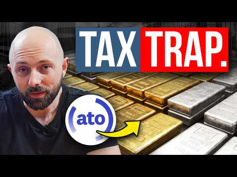
- 설명 앞부분: Gold and silver get taxed the moment you dispose of them, whether you sell, swap, gift or move them into a trust or SMSF, and that's true whether or not the ATO is watching. The bigger risk is substantiation. Without records you can't prove your cost base, your holding period, the premium you paid …
- 같은 채널 평소 대비 ×19.9 (채널 최근 롱폼 중앙값 6,336회) · 평소 영상: One Hack That Dramatically Lowers Tax on Your ETFs (6,336회) / The Dollar-Cost Averaging Mistake Costing Austral… (6,985회)
- 대본 없음 (설명) — 음성인식이 끝나면 도입부·흐름이 들어감
- 댓글 486/577: 좋은 점 — 영상 0 · 감사·응원 0 · 더 알고 싶은 것 0 · 아쉬운 점 — 영상 0 · 반박·불만 — 의견 다름 0 · 정치·사회 0 · 경험 공유 0 · 구독·다음 기대 0

